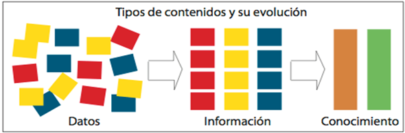
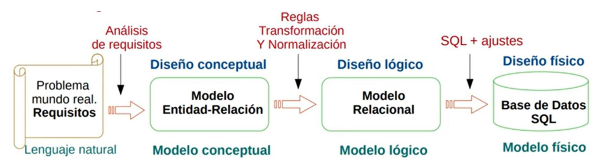

# Introducción a las bases de datos

## Propuesta didáctica

En esta unidad vamos a trabajar el RA1: **Reconoce los elementos de las bases de datos analizando sus funciones y valorando la utilidad de los sistemas gestores**.

??? abstract "Criterios de evaluación"

    - **CE1a**: Se han analizado los sistemas lógicos de almacenamiento y sus características.
    - **CE1b**: Se han identificado los distintos tipos de bases de datos según el modelo de datos utilizado.
    - **CE1c**: Se han identificado los distintos tipos de bases de datos en función de la ubicación de la información.
    - **CE1d**: Se ha evaluado la utilidad de un sistema gestor de bases de datos.
    - **CE1e**: Se ha reconocido la función de cada uno de los elementos de un sistema gestor de bases de datos.
    - **CE1f**: Se han clasificado los sistemas gestores de bases de datos.
    - **CE1i**: Se ha identificado la legislación vigente sobre protección de datos.

### Contenidos de referencia

Almacenamiento de la información:

- Ficheros (planos, indexados, acceso directo, entre otros).
- Bases de datos. Conceptos, usos y tipos según el modelo de datos, la ubicación de la información.
- Sistemas gestores de base de datos: Funciones, componentes y tipos.
- Legislación sobre protección de datos.

<!-- ??? abstract "Programación de Aula (9h)"

    Esta unidad es la primera, con lo que se imparte en la primera evaluación, con una duración estimada de 9 sesiones lectivas, entre la segunda y tercera semana de septiembre:

    | Sesión | Contenidos | Actividades | Criterios trabajados |
    | --- | --- | --- | --- |
    | 1 | Presentación de la asignatura. Sistemas de almacenamiento |  |  |
    | 2 | Ficheros |  |  |
    | 3 | Supuesto ficheros | [AC101](https://aitor-medrano.github.io/bd/01intro.html#AC101) | CE1a |
    | 4 | Bases de datos | [AC102](https://aitor-medrano.github.io/bd/01intro.html#AC102) | CE1b, CE1c |
    | 5 | MS Listas | [AC103](https://aitor-medrano.github.io/bd/01intro.html#AC103) | CE1d |
    | 6 | Sistemas gestores de bases de datos |  |  |
    | 7 | Investigación SGBD | [AC104](https://aitor-medrano.github.io/bd/01intro.html#AC104) | CE1e, CE1f |
    | 8 | Arquitecturas de bases de datos |  |  |
    | 9 | Legislación sobre protección de datos | [AC105](https://aitor-medrano.github.io/bd/01intro.html#AC105) | CE1i | -->

## Introducción

Seguro que has escuchado la frase "_Los datos son el petróleo del siglo XXI_". A día de hoy se generan datos de manera desorbitada, y estos son muy importantes para las empresas porque se puede extraer mucha información.

Pero, ¿sabemos qué diferencia hay entre un dato e información? ¿Cuál es más importante?

Un **dato** es un hecho, un evento, una transacción, que ha sido registrado. En cambio, consideramos **información** a los datos que han sido procesados y comunicados de tal manera que pueden ser entendidos e interpretados.

Por ejemplo, si decimos que hace 22ºC ¿Es un dato o es información? Y si decimos que hace 22ªC en Sevilla el 15 de Julio, ¿tenemos información?

Los datos necesitan de un contexto para poder obtener información. Muchas veces, dicho contexto, son más datos que nos permiten relacionar unos con otros. Una vez que se asimila la información, se transforma en conocimiento

<figure markdown="span">
  
  <figcaption>Evolución de los datos - https://cursos.clavijero.edu.mx</figcaption>
</figure>

Así pues, lo importante es la información, pero necesitamos de datos para obtenerla.

**Estamos rodeados de datos**

En la sociedad actual existe una demanda cada vez mayor de datos. Esta demanda ha aumentado en los últimos años debido al acceso multitudinario a Internet y a la aparición de pequeños dispositivos (móviles y tabletas). Constantemente hacemos uso de estos datos cuando accedemos al cajero automático, al médico, a la agenda del móvil….

**Inicialmente** para almacenar estos datos se utilizaba archivadores, cajones, carpetas y fichas en las que se registraban los datos. Sin embargo, en la actualidad las empresas gestionan enormes sistemas de información, necesitando a veces varios ordenadores.

Cuando la cantidad de **datos es pequeña** su tratamiento es _sencillo_, sin embargo, a medida que **aumenta** la cantidad de **información**, resulta más **complejo** su tratamiento y aquí es donde intervienen los **sistemas informático**s y concretamente las aplicaciones software que van a ayudar a realizar esta tarea.

Antes de la aparición del ordenador, el tiempo requerido para manipular estos datos era enorme. Sin embargo, el proceso de aprendizaje era relativamente sencillo ya que se usaban elementos que el usuario reconocía perfectamente.

Por esa razón, la informática adaptó sus herramientas para que los elementos que el usuario maneja en el
ordenador se parezcan a los que utilizaba manualmente. Así en informática se sigue hablado de ficheros,
formularios, carpetas, directorios...

## Sistemas de información

Si nos centramos en el mundo empresarial, todas las empresas tienen un **sistema de información**, entendido como un conjunto de elementos destinados al tratamiento y administración de datos e información, organizados y listos para su posterior uso, y generados para cubrir una necesidad (objetivo). Estos sistemas de información pueden (o no) estar informatizados.

> 🤔 Podemos definir un Sistema de Información (SI) como un conjunto de elementos relacionados entre sí, cuyo
objetivo es el tratamiento y administración de los datos.

### 2.1 Elementos

Un Sistema de Información está formado por los siguientes elementos:

- Recursos Físicos: Maquinaria y elementos que se utilizan para almacenar y manejar la información. Carpetas, documentos, equipamiento, archivadores, ...
- Recursos Humanos: Personal que maneja la información.
- Protocolo: Normas que se siguen para manejar la información (formato de la información, modelo para los documentos, …)
- Datos: Información que se maneja.

Un Sistema de Información se diseña a fin de satisfacer las necesidades de información de una organización. Actualmente, en la mayoría de los casos, los Sistemas de Información son sistemas informáticos que hacen uso de ordenadores.

La información en un Sistema Informático se guarda en archivos y/o en bases de datos, almacenados estos en soportes de almacenamiento.

A los **sistemas informáticos** en donde se almacena y recupera la información en **archivos** se les conoce como
**Sistemas de Gestión de Archivos**, de igual forma, los sistemas basados en bases datos se les conoce como
**Sistemas de Gestión de Bases de Datos**.

### 2.2 Objetivos

El objetivo de cualquier Sistema de Información es representar mediante una abstracción del mundo real, toda la información necesaria para el cumplimiento de sus fines (obtener facturas, stocks del almacén, …).

Se entiende por abstracción a una representación simplificada o generalizada de algún aspecto de la realidad, teniendo en cuenta las características más importantes y obviando los detalles innecesarios. Esta abstracción se realiza mediante un modelo de datos que es un conjunto de métodos y reglas que indican como se ha de almacenar la información y como se han de manipular los datos.

<figure>
    
    <figcaption align="center">Del mundo real al mundo físico</figcaption>
</figure>

Existen tres fases de modelo:

- Modelo Conceptual: es la representación de la realidad no comprometida con ningún entorno informático, ni con ningún usuario. Modelo Entidad-Relación de Chen.
- Modelo Lógico: determinan unos criterios de almacenamiento y de operaciones de manipulación de datos dentro de un tipo de entorno informático.
- Modelo Físico: es la implementación física del modelo anterior.
  
Los SGBD se basan en un modelo lógico concreto (Jerárquico, Red, Orientado a Objetos, Relacional, …).

Existen tres fases de modelo:

-   **Modelo Conceptual:** es la representación de la realidad no comprometida con ningún entorno informático, ni con ningún usuario. Modelo Entidad-Relación de Chen.
-   **Modelo Lógico:** determinan unos criterios de almacenamiento y de operaciones de manipulación de datos dentro de un tipo de entorno informático.
-   **Modelo Físico:** es la implementación física del modelo anterior.

Los SGBD se basan en un modelo lógico concreto (Jerárquico, Red, Orientado a Objetos, Relacional, ...).

**Ejemplo Real de fases de modelado de una Base de Datos Relacional:**

Suponemos una clínica veterinaria, los propietarios y sus mascotas.

1.  Del propietario interesa: DNI, apellidos, nombre, dirección, teléfono.
2.  De la mascota interesa: Identificador, nombre, fecha nacimiento, tipo.
3.  Un propietario puede llevar una o varias mascotas.
4.  Una mascota la lleva un solo propietario.

<figure>
   
   <figcaption align="center">Ejemplo fases de modelado</figcaption>
</figure>

2.3. Componentes
----------------

Los componentes de un Sistema Informático son:

-   **Hardware.** Equipamiento físico que se utiliza para gestionar los datos, es decir, cada uno de los dispositivos electrónicos que permiten el funcionamiento del Sistema de Información.
-   **Software.** Aplicaciones informáticas que se encargan de la gestión de los datos.
-   **Recursos humanos.** Personal que maneja el Sistema de Información.
-   **Protocolo o Modelo de datos.** Conjunto de métodos y reglas que indican como se ha de almacenar la información y cómo se ha de manipular.

-   **Datos.** Se trata de la información relevante que almacena y gestiona el Sistema de Información. Ejemplos de datos son: Sánchez, 12764569F, Calle Mayo 5, Azul...

3\. Almacenamiento de la Información
====================================

Al informatizar los sistemas la información debía ser trasladada desde el papel al formato digital y por lo general, era necesario almacenarla para su posterior recuperación, consulta y procesamiento.

<figure>        <figcaption align="center">Fichas manuales</figcaption> </figure>

<figure>        <figcaption align="center">Ficheros de texto</figcaption> </figure>

De este modo, para llevar a cabo un tratamiento eficiente de la información era necesario establecer métodos adecuados para su almacenamiento. El elemento que permitió llevar a cabo el almacenamiento de datos de forma permanente en dispositivos de memoria masiva fue el **fichero o archivo**.

**Fichero o Archivo:** conjunto de información relacionada, tratada como un todo y organizada de forma estructurada para ser almacenada de forma persistente. Es una secuencia de dígitos binarios que organiza información relacionada con un mismo aspecto. Tienen un nombre y una extensión que indican el tipo de información que contienen.

Los ficheros están formados por **Registros Lógicos** que contienen datos relativos a un mismo elemento u objeto (por ejemplo, los datos de usuarios de una plataforma educativa). A su vez, los registros están divididos en **campos** que contienen cada una de las informaciones elementales que forman un registro (por ejemplo, el nombre del usuario o su dirección de correo electrónico).

Los datos están almacenados de tal forma que se puedan añadir, suprimir, actualizar o consultar individualmente en cualquier momento.

3.1. Tipos de Archivos
----------------------

Podemos hacer distintas clasificaciones dependiendo del criterio que tomemos

### Según su Contenido de Forma General

-   **Fichero de Texto:** Suelen llamarse también ficheros planos o ficheros ASCII. Están formados por caracteres que son directamente legibles por el ser humano, no llevan ningún tipo de formato. Dentro de estos tenemos: .c, java, .rtf, .txt, ...

-   **Fichero Binario:** Son todos los que no son de texto:

    -   De imagen:.jpg..gif,.
    -   De vídeo:.mpg,.mov,.avi.
    -   Comprimidos o empaquetados: .zip,.tar,
    -   Ejecutables o compilados:.exe,.com.
    -   Procesadores de textos:.doc,.odt

### Según su Función

-   **Ficheros Permanentes:** Contienen información relevante para una aplicación. Es decir, los datos necesarios para el funcionamiento de ésta. Tienen un periodo de permanencia en el sistema amplio. Estos se pueden subdividir en:

    -   **Ficheros Maestros:** Contiene el estado actual de los datos que pueden modificarse desde la aplicación. Es la parte central de la aplicación, su núcleo. Podría ser un archivo con los datos de los usuarios de una plataforma educativa.

    -   **Ficheros Constantes:** Son aquellos que incluyen datos fijos para la aplicación. No suelen ser modificados y se accede a ellos para realización de consultas. Podría ser un archivo con códigos postales.

-   **Ficheros Temporales:** Se utilizan para almacenar información útil para una parte de la aplicación, no para toda ella. Son generados a partir de datos de ficheros permanentes. Tienen un corto periodo de existencia.

### Según el Soporte de Almacenamiento

Inicialmente se utilizaban tambores de cinta magnética pasando con el tiempo al uso de cintas magnéticas y de discos (magnéticos, ópticos, magneto-ópticos, ssd). Dentro de estos dos tipos de soporte existen en el mercado una gran variedad de modelos.

<figure>        <figcaption align="center">Soportes de Almacenamiento</figcaption> </figure>

El acceso a la información en las cintas era **Secuencial**, como en un casette, siendo necesario pasar por todos los datos desde el inicio hasta la zona donde se encuentra la información que nos interesa.

El avance del hardware y la aparición del disquete y del disco duro permitió el **Acceso Directo** a la información, no siendo necesario en ellos pasar por todos los datos desde el inicio hasta la zona donde se encuentra la información que nos interesa.

Por tanto, se distinguen dos Tipos de Soportes para el almacenamiento de datos:

-   **Soportes de Acceso Directo** (Por ejemplo: discos). Son los más empleados y el acceso a los datos puede hacerse de forma directa, pudiendo colocarnos en la posición que nos interesa y leer a partir de ella.

-   **Soportes de Acceso Secuencial** (Por ejemplo: cintas magnéticas). Se suelen usar en copias de seguridad y si deseamos leer un dato que está en la mitad de la cinta, tendremos que leer todo lo que hay hasta llegar a esa posición.

En el fichero "Evolucion Soportes Almacenamiento.pdf" en Recursos tienes información sobre la evolución de los soportes de almacenamiento.

### Según el Método de Acceso

Determina la forma de organizar un fichero en un soporte y la forma en la que se accede a la información. Pueden ser Secuenciales, Acceso Directo e Indexado.

-   **Secuencial:** En este tipo de ficheros los registros están almacenados de forma contigua, de manera, que la única forma de acceder a él, es leyendo un registro tras otro desde el principio hasta el final. En los ficheros secuenciales suele haber una marca indicativa del fin del fichero, que suele denominarse EOF (End of File).

-   **Acceso Directo:** Se accede a un registro indicando la posición relativa del mismo dentro del archivo o, más comúnmente, a través de una clave que forma parte del registro como un campo más. Deben almacenarse en dispositivos de memoria masiva de acceso directo, como son los discos magnéticos. A través de una transformación específica aplicada a la clave, se obtendrá la dirección física en la que se encuentra el registro.

-   **Ficheros Indexados:** Se basan en la utilización de índices, que permiten el acceso a un registro del fichero de forma directa, sin tener que leer los anteriores (similares a los de los libros para acceder a un capítulo a través de la página). Tienen una zona de registros en la que se encuentran los datos del archivo y una zona de índices (en memoria principal), que contiene una tabla con las claves de los registros y las posiciones de memoria donde se encuentran los mismos. La tabla de índices estará ordenada por el campo clave.

-   **Secuenciales Indexados o Parcialmente Indexados:** La zona de registros de datos se encuentra dividida en segmentos (bloques de registros) ordenados, de forma que se accede directamente al primer registro y a partir de ahí el acceso es secuencial ya que está ordenado.

3.2. Bases de Datos
-------------------

A finales de los 70 los sistemas basados en ficheros separados dieron paso a la utilización de **Sistemas Gestores de Bases de Datos**, que son sistemas software centralizados o distribuidos que ofrecen facilidades para la definición de bases de datos, selección de estructuras de datos y búsqueda de forma interactiva y mediante lenguajes de programación.

**Una Base de Datos es una colección de datos que están lógicamente relacionados entre sí almacenados de forma estructurada en su conjunto sin redundancias perjudiciales.** Ej. Profesor, módulo, alumnos. Ej. Clientes y facturas.

Los datos están estructurados según un **Modelo de Datos** que refleja las relaciones y restricciones que tienen estos datos en el mundo real. Ej. Módulo es impartido por 1 profe, 1 alumno varios módulos, ...Ej. Una factura un solo cliente.

Las operaciones que se realizan con los datos han de conservar la integridad y la seguridad de la Base de Datos:

-   **Integridad:** Son las reglas y restricciones que se han definido para los datos que se almacenaran en la BD. Ej. Cada factura debe tener un cliente y solo uno. Todos los clientes deben tener nombres y apellidos no nulos.

-   **Seguridad:** Podemos distinguir dos niveles:

    -   **Nivel Físico**, donde podemos tener errores de Hardware (como pérdida del disco duro, se recupera con copias de respaldo) y errores de Software (como fallos lógicos del programa, se recupera a partir de ficheros Log).

    -   **Nivel Lógico**, se refiere a la confidencialidad de los datos, se controla: ¿quién? (usuario), accede ¿a qué? información (tabla, columna), y ¿de qué? manera (leer, escribir, borrar).

Una Base de Datos está formada por:

-   **Entidades:** objeto real o abstracto con características diferenciadoras de otros, del que se almacena información en la Base de Datos. Dicho de otra forma, es algo acerca de lo cual se desea almacenar información. En una Base de Datos de una centro escolar posibles entidades podrían ser: alumnos, asignaturas, profesores.

-   **Atributos:** son los datos que se almacenan de la entidad. Cualquier propiedad o característica de una entidad puede ser atributo. De la entidad alumnos, nombre, apellidos, dni, fecha nacimiento, etc...

-   **Registros:** conjunto de atributos de la entidad que define un item del objeto. Ej.: Juan Lopez Garrido 123456789Z 01/01/2001

3.3. Sistemas de Gestión de Archivos vs SGBD
--------------------------------------------

### Sistemas de Gestión de Archivos (Sistemas Orientados a Procesos)

Hasta la aparición de las Bases de Datos las aplicaciones utilizaban datos estructurados en forma de ficheros. En función de su organización y forma de acceso los ficheros se clasifican, como hemos visto, en secuenciales, directos, indexados y secuenciales indexados.

Este tipo de sistema de Gestión de Archivos se les llama **Sistemas Orientados al Proceso**.

Cada una de las aplicaciones disponía de su propio conjunto de ficheros en donde se almacenaban los datos necesarios para dicha aplicación, al mismo tiempo esos ficheros estaban estructurados de acuerdo a la forma que tenía la aplicación de tratarlos.

**Inconvenientes de los Sistemas de Gestión de Archivos**

-   **Redundancia de datos.** Suele ocurrir que muchos datos estén en dos o más ficheros, por ejemplo, la dirección o el teléfono de un cliente se puede encontrar repetidos en varios ficheros de la empresa, por ejemplo, en la aplicación que trabaja con nómina y en la que trabaja con el dpto. comercial.

-   **Inconsistencia de datos.** Como existen datos repetidos, ocurre con demasiada frecuencia que la actualización de un dato no se lleva a cabo en todos los ficheros en que este dato existe. Surge de esta manera la discrepancia de valores de un mismo dato (inconsistencia) no pudiéndose incluso determinar, en algunas ocasiones, cuál de los valores es el correcto. Nos podemos encontrar, por ejemplo, que dos aplicaciones de la misma empresa nos proporcionen distintas direcciones de un mismo cliente ¿a dónde le mandamos la factura?

-   **Datos son dependientes de los tratamientos que se realicen sobre ellos.** Las estructuras de los ficheros están pensadas para determinadas aplicaciones. En cualquier aplicación basada en los sistemas de gestión de archivos, los programadores deben definir su organización, el modo de acceso a los registros, su estructura, etc., lo que implica que los programas sean dependientes de los archivos y viceversa.

-   **Sistemas poco escalables.** Modificación de tratamiento o cambio de requerimientos implica: reestructuración de ficheros, modificación y recompilación de programas que lo usan. Esto provoca que crea poca flexibilidad ante cambios de requerimiento y alto coste en mantenimiento de software, por ejemplo, al añadir un campo a clientes. Si se reestructura los datos hay que cambiar los programas que los usan.

-   **Falta de Integridad.** Es difícil mantener ciertas condiciones en los datos ya que dependerá del programa que acceda a esos datos.

-   **Dificultad para administrar seguridad.** No se puede controlar que ciertos usuarios no accedan a ciertos datos debido a la dispersión que presentan.

### Sistemas de Gestión de Bases de Datos (Sistemas Orientados a Datos)

Los Sistemas de Bases de Datos pretenden dar solución a los problemas de los Sistemas de Gestión de Archivos mediante la integración de toda la información en una única colección de datos no redundantes, generalmente de gran tamaño y accesible por todas las aplicaciones y usuarios autorizados, incluso, simultáneamente.

Ahora bien, para que sea posible la superación de estos inconvenientes es necesario un correcto diseño de la Base de Datos además de establecer los mecanismos de administración, seguridad y control que eviten los posibles accidentes o daños deliberados de la Base de Datos. Un fallo en la Base de Datos de una organización puede acarrear catastróficas consecuencias para ésta.

**Características de los Sistemas de Gestión de Bases de Datos**

-   Los datos se estructuran según un modelo (forma de representar los datos) que refleja las características que tienen en el mundo real, y ese modelo permite que cualquier proceso pueda tratar los datos.

-   Los datos son independientes de los tratamientos que se realicen sobre ellos. (Sistemas de Información Integrados).

-   Descripción centralizada de los datos. La definición de los datos se almacena en la misma Base de Datos, de manera que los tratamientos no tienen que especificar de nuevo la definición de los datos. Además, esto ofrece una mejor y más normalizada documentación de la información.

-   Eficiencia en la restructuración de los datos. Al estar los datos estructurados según un modelo no se producen redundancias de datos. Es decir que un mismo dato no aparece en dos o más ficheros. Esto evita tres problemas:

    -   No se desperdicia espacio en memoria almacenando la misma información varias veces.
    -   Se ahorra tiempo de proceso al no tener que modificar el dato en varios ficheros.
    -   Se evita la corrupción de la Base de Datos ya que al modificar un dato habría que hacerlo en todos los ficheros en que aparece, y si no se modifica en algunos de los ficheros, la información de la Base de Datos sería inconsistente.

-   **Reducción** de espacio de **almacenamiento en disco**. Los sistemas de Base de Datos optimizan el espacio requerido para almacenar los datos en discos, hasta un 50% más que los sistemas de ficheros tradicionales.

-   **Seguridad de los datos y control de autorizaciones**. El DBA (administrador de Base de Datos) decide los accesos (¿quién? ¿a qué? ¿cómo?) concediendo y denegando permisos según las necesidades reales.

- **Auditoría de actividad**. El uso de ficheros auditores permite sobre quien accedió, a qué y de qué manera.
- **Control de accesos simultáneos**. Ej. Reserva de billetes o entradas.
- **Recuperación de datos** dañados ante procesos de actualización incompletos o erróneos. En los sistemas orientados a ficheros se utilizaban copias.
- **Mayor nivel informático* Los sistemas de bases de datos ofrecen herramientas más potentes y más sencillas para la
manipulación de los datos.

Seguridad de los datos y control de autorizaciones.
El DBA (administrador de Base de Datos) decide los accesos (¿quién? ¿a qué? ¿cómo?) concediendo
y denegando permisos según las necesidades reales.
• Auditoría de actividad.
El uso de ficheros auditores permite sobre quien accedió, a qué y de qué manera.
• Control de accesos simultáneos. Ej. Reserva de billetes o entradas.
• Recuperación de datos dañados ante procesos de actualización incompletos o erróneos. En los
sistemas orientados a ficheros se utilizaban copias.
• Mayor nivel informático.
Los sistemas de bases de datos ofrecen herramientas más potentes y más sencillas para la
manipulación de los datos.
Los Sistemas de Bases de Datos está integrados en los entornos de desarrollo de cuarta generación,
mientras que los Sistemas de Ficheros pertenecen a entornos de desarrollo de tercera generación.
Según lo que hemos visto, podemos afirmar que los Sistemas de Gestión de Archivos son sistemas de
información orientados hacia los procesos, existiendo una gran dependencia datos/aplicaciones. Por el
contrario, en los Sistemas de Gestión de Bases de Datos existe total independencia entre los datos y las
aplicaciones que los tratan.