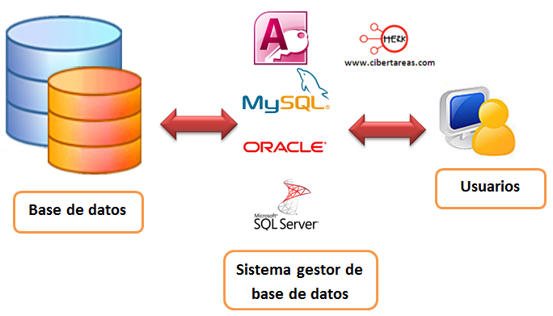
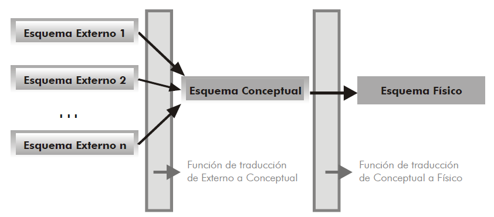

# Introducción a las bases de datos

## Propuesta didáctica

En esta unidad vamos a trabajar el RA1: **Reconoce los elementos de las bases de datos analizando sus funciones y valorando la utilidad de los sistemas gestores**.

??? abstract "Criterios de evaluación"

    - **CE1a**: Se han analizado los sistemas lógicos de almacenamiento y sus características.
    - **CE1b**: Se han identificado los distintos tipos de bases de datos según el modelo de datos utilizado.
    - **CE1c**: Se han identificado los distintos tipos de bases de datos en función de la ubicación de la información.
    - **CE1d**: Se ha evaluado la utilidad de un sistema gestor de bases de datos.
    - **CE1e**: Se ha reconocido la función de cada uno de los elementos de un sistema gestor de bases de datos.
    - **CE1f**: Se han clasificado los sistemas gestores de bases de datos.
    - **CE1i**: Se ha identificado la legislación vigente sobre protección de datos.

### Contenidos de referencia

Almacenamiento de la información:

- Ficheros (planos, indexados, acceso directo, entre otros).
- Bases de datos. Conceptos, usos y tipos según el modelo de datos, la ubicación de la información.
- Sistemas gestores de base de datos: Funciones, componentes y tipos.
- Legislación sobre protección de datos.

??? abstract "Programación de Aula (9h)"

    Esta unidad es la primera, con lo que se imparte en la primera evaluación, con una duración estimada de 9 sesiones lectivas, entre la segunda y tercera semana de septiembre:

    | Sesión | Contenidos | Actividades | Criterios trabajados |
    | --- | --- | --- | --- |
    | 1 | Presentación de la asignatura. Sistemas de almacenamiento |  |  |
    | 2 | Ficheros |  |  |
    | 3 | Supuesto ficheros | [AC101](https://aitor-medrano.github.io/bd/01intro.html#AC101) | CE1a |
    | 4 | Bases de datos | [AC102](https://aitor-medrano.github.io/bd/01intro.html#AC102) | CE1b, CE1c |
    | 5 | MS Listas | [AC103](https://aitor-medrano.github.io/bd/01intro.html#AC103) | CE1d |
    | 6 | Sistemas gestores de bases de datos |  |  |
    | 7 | Investigación SGBD | [AC104](https://aitor-medrano.github.io/bd/01intro.html#AC104) | CE1e, CE1f |
    | 8 | Arquitecturas de bases de datos |  |  |
    | 9 | Legislación sobre protección de datos | [AC105](https://aitor-medrano.github.io/bd/01intro.html#AC105) | CE1i |

## Introducción

Seguro que has escuchado la frase "_Los datos son el petróleo del siglo XXI_". A día de hoy se generan datos de manera desorbitada, y estos son muy importantes para las empresas porque se puede extraer mucha información.

Pero, ¿sabemos qué diferencia hay entre un dato e información? ¿Cuál es más importante?

Un **dato** es un hecho, un evento, una transacción, que ha sido registrado. En cambio, consideramos **información** a los datos que han sido procesados y comunicados de tal manera que pueden ser entendidos e interpretados.

Por ejemplo, si decimos que hace 22ºC ¿Es un dato o es información? Y si decimos que hace 22ªC en Sevilla el 15 de Julio, ¿tenemos información?

Los datos necesitan de un contexto para poder obtener información. Muchas veces, dicho contexto, son más datos que nos permiten relacionar unos con otros. Una vez que se asimila la información, se transforma en conocimiento

<figure markdown="span">
  
  <figcaption>Evolución de los datos - https://cursos.clavijero.edu.mx</figcaption>
</figure>

Así pues, lo importante es la información, pero necesitamos de datos para obtenerla.

Si nos centramos en el mundo empresarial, todas las empresas tienen un **sistema de información**, entendido como un conjunto de elementos destinados al tratamiento y administración de datos e información, organizados y listos para su posterior uso, y generados para cubrir una necesidad (objetivo). Estos sistemas de información pueden (o no) estar informatizados.

¿Y qué tienen que ver el sistema de información con las bases de datos? Pues como toda empresa tiene una forma de trabajar, es necesario que almacene sus datos para poder extraer información, y saber si por ejemplo, deben reponer un producto, hacer algún tipo de oferta, o contratar a un nuevo empleado porque está perdiendo ventas por no poder atender a los clientes.

## Ficheros

En los inicios del desarrollo de las aplicaciones, el almacenamiento de la información que gestiona cualquier aplicación informática era mediante el uso de archivos o ficheros (_files_ en inglés). Esto provocaba que las aplicaciones estuvieran "_acopladas_" a los ficheros (dependencia físico-lógica), y dificultaba compartir datos entre diferentes aplicaciones, así como el acceso concurrente a los mismos.

Respecto a los ficheros, conviene conocer que existen ficheros con diferente estructura y formato, como pueden ser de tipo texto (o plano) o binario y con un determinado formato, como puede ser CSV, JSON, XML, Parquet o Avro. Los ficheros normalmente contienen un nombre y una extensión, la cual indica el formato. Así pues, `clientes.csv` sería un fichero en formato CSV que almacena datos sobre clientes.

!!! question "Autoevaluación"
    Hemos comentado que tenemos archivos de tipo texto y binario, y con su extensión, es fácil que conozcas muchos formatos.

    Por ejemplo:

    - Texto: fichero de texto en formato TXT, fichero de configuración en formato INI, página web en formato HTML, ...
    - Binario: imagen en formato JPG, audio en formato MP3, archivos comprimidos en formato ZIP, ...
    ¿Puedes citar tres más de cada tipo?

Formalmente, podemos definir un **fichero** como una secuencia de números binarios que organiza información relacionada a un mismo aspecto.

Cuando los ficheros almacenan datos, se dice que constan de **registros**, los cuales son una estructura lógica que agrupa los datos de un mismo elemento (u objeto). Por ejemplo en un fichero de estudiantes, cada registro contiene datos de un único estudiante. Si el archivo contiene datos de 10.000 estudiantes, tendrá 10.000 registros. Además, cada uno de los registros se divide en **campos** que contienen cada una de las informaciones elementales que forman un registro (por ejemplo, el nombre del estudiante o su email).

!!! info "Discos sólidos"

    Para que no se pierda la información, los ficheros se persisten en sistemas de almacenamiento, como discos duros mecánicos o sólidos. Es cierto que mediante los discos SSD y NVMe el acceso a disco cada vez es más eficiente y se evita la fragmentación de los datos.

Dependiendo del acceso, tenemos diferentes tipos de ficheros:

 { width=40%, align=right }

- **Secuenciales**: los registros se almacenan uno detrás de otro. Antiguamente se utilizaba cuando los ficheros se persistían mediante cintas magnéticas, y provocaba que para acceder a un registro, era necesario recorrer todos los anteriores.
    
- De **acceso directo** o **aleatorio**: permite el acceso directo al registro que nos interesa, pudiendo saltar de uno a otro sin necesidad de recorrer los anteriores.

Respecto a los ficheros secuenciales destacamos dos tipos:

- **Encadenados**: cada registro, además de sus datos, almacenan un puntero (dirección de memoria) con la dirección del siguiente registro.
- **Indexados**: el fichero se divide en dos zonas, una primera con la información a modo de fichero secuencial con todos los registros uno detrás de otro, y una segunda donde se guardan los índice (a modo de tabla de contenidos o índice de un libro indicando donde se encuentra cada registro), los cuales tienen un campo clave y un campo dirección con la dirección del registro del fichero (estos conceptos los profundizaréis más en el módulo profesional de _Sistemas Informáticos_ y en _Programación_).

!!! tip "Más información"
    Si necesitas más información sobre los diferentes tipos de archivos, se recomienda consultar el recurso [https://jorgesanchez.net/manuales/gbd/sgbd.html#h25](https://jorgesanchez.net/manuales/gbd/sgbd.html#h25).

Respecto a las operaciones que se pueden realizar con ficheros (y que trabajarás con mayor profundidad en el módulo profesional de _Programación_) podemos destacar la apertura o cierre de los archivos, la lectura o escritura, así como el posicionamiento en un determinado lugar (o registro). Otras operaciones asociadas a los ficheros son:

- Fragmentación y compactación: cuando toda la información de un registro no se almacena de forma consecutiva, y mediante punteros se van enlazando las partes, se dice que la información está fragmentada. Para evitarlo, se compactan los ficheros para que toda la información se pueda leer más eficientemente.
- Compresión: la información se codifica mediante algoritmos de compresión que reducen el tamaño de los ficheros.
- Cifrado de datos: la información se encripta para hacer que el contenido sea ilegible.

Una vez presentados los conceptos de los ficheros, conviene saber que actualmente su uso se ha visto reducido a datos específicos de las aplicaciones como archivos de configuración y datos privados, cuando no es necesario que varios usuarios accedan a la información de forma concurrente.

## Bases de datos

Si bien los ficheros fueron una solución factible mientras sólo accedían a los archivos una única aplicación, con la aparición de las redes de ordenadores y la explosión de internet, la gestión de los sistemas de almacenamiento mediante ficheros se vio sustituida por las bases de datos, que sí permiten que diferentes aplicaciones y usuarios accedan de forma simultánea a los datos.

Formalmente, podemos definir una **base de datos** como un conjunto de datos interrelacionados, con características de integridad y redundancia mínima, accesibles por varios usuarios y aplicaciones.

Mediante esta definición estamos introduciendo dos términos que conviene tener muy presente:

- **Integridad**: implica que los datos son correctos y completos.
- **Redundancia mínima**: cada dato sólo existe en un único lugar, evitando duplicidades.

Respecto a las características de las bases de datos:

| Ventajas | Inconvenientes |
| --- | --- |
| Independencia de los datos y los programas y procesos | Instalación costosa |
| Menor redundancia | Personal cualificado |
| Integridad de los datos | Implantación larga y costosa |
| Mayor seguridad | Ausencia de estándares reales |
| Datos más documentados → metadatos |  |
| Acceso más eficiente |  |
| Menor espacio de almacenamiento |  |
| Acceso simultáneo → usuarios concurrentes |  |

Toda base de datos debe permitir insertar, modificar y borrar datos.

Una base de datos está compuesta por datos y metadatos. Los **metadatos** son datos que especifican la estructura de la base de datos, es decir, qué tipo de datos almacenan (texto, numérico,...), qué nombre tiene cada dato, cómo se agrupan, relacionan, etc... Estos metadatos se almacenan en el **diccionario de datos**.

### Tipos de Bases de Datos

Dependiendo de la característica que evaluemos podemos clasificar las bases de datos por:

| Clasificación | Tipos |
| --- | --- |
| Contenido | Información actual, directorios, documentales |
| Uso | Individual, compartida, acceso público, propietarias |
| Variabilidad de la información | Estáticas, dinámicas |
| Localización de los datos | Centralizadas (anfitrión, cliente/servidor), distribuidas |
| Organismo productor | Públicas o de la administración, sin ánimo de lucro, privadas o comerciales, cooperación en red |
| Acceso | Local, CD/DVD, en línea (conexión privada o web) |
| Cobertura temática | Científico-tecnológicas, económico-empresariales, medios de comunicación, político- administrativas y jurídicas, sanitarias |

Conviene pararse en los tipos de bases de datos existentes dependiendo de la ubicación. Aunque volveremos a ellas en las [últimas unidades donde estudiemos los sistemas _NoSQL_](https://aitor-medrano.github.io/bd/12nosql.html), es importante tener claro las diferentes arquitecturas físicas existentes hoy en día. Por un lado, tenemos los sistemas **centralizados** donde se sigue un modelo cliente-servidor. En un servidor de internet, bien sea un VPS o un servicio gestionado por un proveedor _cloud_, la base de datos reside en una única máquina (se conoce como servidor) y las diferentes aplicaciones y servicios que consumen dichos datos son los clientes que acceden a la base de datos mediante conexiones remotas.

Si el sistema crece y la carga de usuario supera la capacidad del servidor, es necesario migrar a un modelo más potente (y normalmente más caro) como son las bases de datos **distribuidas**, donde los datos se reparten entre varias máquinas, particionando los datos o fragmentándolos dependiendo de las necesidades de las aplicaciones, incrementando la complejidad del sistema para dar soporte a la sincronización de los datos y la tolerancia a fallos.

### Modelos de datos

Un modelo simboliza una parte del mundo real, de forma que se simplifique su manipulación. Por ejemplo, un modelo de una ciudad sería un mapa a escala 1:100.

Un **modelo de datos** es un conjunto de herramientas conceptuales para describir los datos, sus relaciones, su semántica y sus restricciones.

Inicialmente, los modelos de datos primitivos se basaban en sistemas de ficheros, tal como hemos visto en el apartado anterior.

Posteriormente, se definieron los modelos clásicos, entre los que destacan los modelos:

- **Jerárquicos** (finales de los 60): almacenan la información en forma de árbol y unidireccional, de arriba hacía abajo. La información se almacena en nodos, y los nodos se relacionan mediante punteros, permitiendo que un nodo padre puede tener muchos nodos hijos (relaciones de uno a muchos).
- **En red** (principios de los 70): a partir de los modelos jerárquicos, los datos se relacionan en forma de red o grafo, permitiendo la relaciones de muchos a muchos, de manera que un nodo hijo puede tener varios nodos padre, y viceversa.
- **Relacionales** (finales de los 70 hasta hoy en día): se basan en la relación entre los datos, mediante el uso de tablas bidimensionales (filas=ocurrencia, columnas=atributo) que contienen campos que se relacionan con campos de otras tablas (este es el modelo más difundido y es que el estudiaremos en profundidad en este curso).

Tras los clásicos, hubo un movimiento por el uso de modelos avanzados que no terminaron de cuajar, como fueron los modelos:

- **Orientados a objetos** (década de los 80): soportan el paradigma de programación orientada a objetos, permitiendo la creación de tipos de datos compuestos y herencia entre los diferentes tipos.

Con la explosión de internet, y la necesidad de trabajar con grandes conjuntos de datos, aparecieron y se establecieron en el mercado los modelos:

- **Multidimensionales** (década de los 90 y explosión en 2010 con el _Big Data_): se utilizan para desarrollar aplicaciones de _Data Warehouse_ de procesamiento analítico en línea (OLAP). Las tablas se estructuran como cubos de información, mediante una tabla de hechos y varias tablas de dimensiones (tiempo, lugar, etc..).
- **Soluciones NoSQL** (década del 2000 hasta hoy en día): como complemento a los modelos relacionales, ofrecen alternativas donde prima el rendimiento y escalabilidad de los datos. Destacan los modelos:
    - Clave-Valor: se almacenan datos a los cuales sólo se puede acceder mediante una clave.
    - Documental: utiliza estructuras de documentos JSON que contiene la información de varias entidades en un mismo documento
    - Grafos: Uso de nodos y vértices para navegar por los datos.
    - Basado en columnas: gira las tablas para almacenar los datos por columnas en vez de hacerlo por filas.
  
Estos cuatro últimos modelos los estudiaremos en profundidad en la unidad [_12 - Sistemas NoSQL_](https://aitor-medrano.github.io/bd/12nosql.html).

## Sistemas Gestores de Bases de Datos

Un sistema gestor de base de datos (SGBD), también conocido como _DataBase Management System_ (DBMS), es la herramienta de software que permite la creación, manipulación y administración de bases de datos. Así pues, tanto [Oracle](https://www.oracle.com/es/), [MySQL](https://www.mysql.com/), [MariaDB](https://mariadb.org/), [OpenOffice/LibreOffice Base](https://es.libreoffice.org/descubre/base/), [Access](https://www.microsoft.com/es-es/microsoft-365/access), [MongoDB](https://www.mongodb.com/) o [PostgreSQL](https://www.postgresql.org/) son sistemas gestores de bases de datos, y no bases de datos en sí.

<figure markdown="span">
  { width=70% }
  <figcaption>Relación entre BD y SGDB - cibertareas.com</figcaption>
</figure>

Formalmente, un sistema gestor de bases de datos es una herramienta de propósito general que permite crear bases de datos de cualquier tamaño y complejidad, con propósitos específicos distintos. Ofrece la interfaz entre el usuario y las bases de datos, mediante herramientas para la manipulación y administración de las mismas.

### Funciones

Las funciones de un SGBD son:

- Asegurar la **independencia** de los datos respecto a las aplicaciones y los usuarios.
- Ofrecer **eficiencia** y **seguridad** a la hora de extraer o almacenar información en una base de datos, protegiendo el acceso a usuarios sin los permisos adecuados.
- Asegurar la **integridad** de los datos en todo momento, detectando las operaciones erróneas que introducen inconsistencia en los datos y permitiendo el uso de **transacciones** en las operaciones.
- Permitir el **acceso concurrente** y recuperación en caso de fallo (tolerancia a fallos).
- Facilitar la **administración** de los datos.

!!! info "ACID"

    Las propiedades ACID sobre un SGBD aseguran la transaccionalidad sobre los datos mediante:

    - **A**tomicidad: las transacciones implican que se realizan todas las operaciones o no se realiza ninguna.
    - **C**onsistencia: la base de datos asegura que los datos pasan de un estado válido o otro también.
    - **I**solation (Aislamiento): Una transacción no afecta a otras transacciones, de manera que la modificación de un registro / documento no es visible por otras lecturas hasta que ha finalizado la transacción. Esto implica que ninguna transacción obtiene una versión intermedia de los datos.
    - **D**urabilidad: La escritura de los datos asegura que una vez finalizada una operación, los datos no se perderán.
  
    Volveremos a estos conceptos cuando trabajemos la transaccionalidad de las operaciones, en la unidad 9.

### Componentes

Un SGBD se compone de:

- **Diccionario de datos**: metadatos con las estructuras de las diferentes bases de datos, relaciones entre los datos, restricciones existentes así como información sobre las cuentas y permisos de los usuarios.
- **Espacio de datos**: zona donde se almacenan los datos en sí. Se pueden organizar de diferentes maneras, dependiente del sistemas gestor. Por ejemplo, _Oracle_ lo realiza mediante el uso de _tablespaces_ y otros gestores con el concepto de base de datos.
- Un conjunto de herramientas, las cuales suele gestionar la persona con el rol de DBA (_Database Administrator_) para:
    - Crear y especificar los datos (mediante el _Data Definition Language_ - DDL), el control de datos (mediante el _Data Control Language_ - DCL) y su manipulación (mediante el _Data Manipulation Language_ - DML)
    - Recuperación (_failover_). Tras una caída del sistema, configurar los posibles mecanismos de recuperación y aceptación o revisión de las operaciones pendientes.
    - Copia de seguridad (_backup_), ya sea copias completas o incrementales.
    - Exportación/importación de datos, tanto en formatos binarios con los datos en sí, como un listado de las operaciones necesarias para su creación desde cero.
    - Distribución de los datos. En el caso de bases de datos distribuidas, decidiendo cómo se particionan o fragmentan los datos.

### Arquitectura de 3 niveles

Antes ya habíamos comentado que un **modelo de datos** es un conjunto de herramientas conceptuales para describir los datos, sus relaciones, su semántica y sus restricciones.

Podemos definir un **esquema** como una descripción específica en términos de un modelo de datos.

El grupo _ANSII/SPARC_, a mediados de los años 70, definió una arquitectura en 3 niveles diferenciando tres esquemas, con el objetivo de separar a las aplicaciones de los datos, permitir que los usuarios tuvieran diferentes vistas, y utilizar un catálogo para almacenar el esquema de la base de datos.

¿Y cómo se consigue? Si queremos independencia entre los datos y las aplicaciones, necesitamos que cada programa que accede a la base de datos manipule sólo ciertos datos y estructura, de manera que cada programa posee una visión de la base de datos, lo que se conoce como **esquema externo**. La unión de todos los datos y sus relaciones forman el llamado **esquema conceptual**. Finalmente, el **esquema físico** representa el almacenamiento de los datos y sus formas de acceso.

<figure markdown="span">
  { width=80% }
  <figcaption>Esquemas en tres niveles</figcaption>
</figure>

Dicho de otro modo, podemos destacar tres niveles principales según el tipo de usuario y acceso a la base de datos:

- _Interno_ o _Físico_ (1): es el nivel más cercano al almacenamiento físico de los datos. Permite escribirlos tal y como están almacenados en el ordenador. En este nivel se diseñan los archivos que contienen la información, la ubicación de los mismos y su organización, es decir se crean los archivos de configuración.
- _Conceptual_ (1): En este nivel se representan los datos de una forma más lógica y comprensible, alejándose del aspecto físico del nivel interno y centrándose en el diseño. En el caso de bases relacionales suele ser una representación en formato de tabla.
- _Externo_ (N): Es el más cercano al usuario y es en realidad la salida de datos, la respuesta a una consulta. Puede tener formato de formulario, de un listado, un informe, etc...

Esta arquitectura aporta:

- **Independencia lógica**: capacidad de modificar el esquema conceptual sin tener que reescribir los esquemas externos ni las aplicaciones. Permite modificar el esquema conceptual para ampliar la BD o para reducirla, por ejemplo, si se elimina una entidad, los esquemas externos que no se refieran a ella no se verán afectados.
- **Independencia física**: capacidad de modificar el esquema interno sin tener que alterar ni el esquema conceptual, ni los externos. Por ejemplo, se pueden reorganizar los archivos físicos con el fin de mejorar el rendimiento de las operaciones de consulta o de actualización, o se pueden añadir nuevos archivos de datos porque los que había se han llenado.

!!! tip "Arquitecturas físicas"
    Si nos centramos en la organización física de la infraestructura necesaria a la hora de desplegar un SGBD (comentados en los [Tipos de Bases de Datos](https://jssdocente.github.io/bd2526d/01intro.html#tipos-de-bases-de-datos)), podemos clasificar las arquitecturas en:

    - Centralizada
        - Monousuario: en un único ordenador, no permitiendo el acceso concurrente (_MS Access_)
        - Cliente-Servidor: Los datos están en un servidor, pero se desacoplan los clientes los cuales se conectan vía red/internet (_MySQL_, _PostgreSQL_, _Oracle_)
    - Distribuida: Existen múltiples servidores, ya sea replicando, particionando o fragmentando los datos, facilitando la robustez del sistema (_Oracle cloud_, _MongoDB_, _Redis_)

### Perfiles

A la hora de emplear un SGBD existen diferentes perfiles o usuarios:

- Usuario final: interactúa con los datos pero a través de alguna aplicación o servicio.
- Analista/Ingeniero de datos: perfiles de alto nivel encargados de diseñar las arquitecturas de datos (tanto a nivel lógico como físico)
- Desarrollador: desarrolla aplicaciones que explotan los datos, creando consultas y operaciones de inserción, borrado o modificación de los datos existentes. Un desarrollador web o multiplataforma interactúa con una o más bases de datos en sus aplicaciones.
- Administrador de la base de datos (_DBA - Database Administrator_): persona o grupo de personas responsables del control del sistema gestor de base de datos. Las principales tareas de un administrador son:
    - Codificación del esquema lógico y físico de la BD.
    - Codificación de las vistas de usuario.
    - Asignación y edición de permisos de todos los usuarios del sistema.
    - Mantenimiento y seguimiento de la seguridad.
    - Mantenimiento general del SGBD.

## Legislación

Las bases de datos y su uso por las empresas y otras instituciones están reguladas por el **Reglamento Europeo de Protección de Datos (RGPD)** 2016/679, el cual establece un marco para la protección de los datos personales y los derechos de los individuos en relación con sus datos personales. Y también con la **Ley Orgánica de Protección de Datos Personales y garantía de los derechos digitales (LOPDGDD)** 3/2018, que adapta y complementa el RGPD.

Los aspectos clave de la [LOPDGDD]("Ley Orgánica de Protección de datos personales y garantía d elos derechos digitales") son:

- Adaptación del GDPR: la LOPDGDD adapta el marco europeo a la realidad española, especificando ciertos aspectos del reglamento europeo.
- Derechos digitales: la LOPDGDD no solo trata sobre la protección de datos personales, sino que también incluye una serie de derechos digitales, como el derecho a la desconexión digital en el ámbito laboral y el derecho al testamento digital.
- Principios del tratamiento de datos: refuerza principios como la transparencia, la lealtad, la minimización de datos, la exactitud, la limitación del plazo de conservación, la integridad y la confidencialidad.
- Consentimiento: especifica las condiciones para obtener el consentimiento válido de los interesados, incluyendo el consentimiento explícito para datos sensibles.
- Autoridad de control: la **Agencia Española de Protección de Datos (AEPD)** es la autoridad encargada de velar por el cumplimiento de la normativa de protección de datos en España, supervisar y sancionar en caso de infracción, representando los intereses de los ciudadanos.

!!! info "Datos sensibles"

    Son aquellos datos personales que revelan información íntima y cuya divulgación o tratamiento indebido podría afectar gravemente a la privacidad y dignidad del individuo.

    La LOPDGDD define como datos sensibles los siguientes:

    - Datos de origen racial o étnico: Información que revele la raza o el origen étnico del individuo.
    - Datos de ideología: Información sobre las creencias o convicciones personales, filosóficas o morales.
    - Datos de afiliación sindical: Información que revele la pertenencia a sindicatos o asociaciones laborales.
    - Datos de religión: Información que revele las creencias religiosas.
    - Datos de orientación sexual: Información sobre la orientación o preferencias sexuales del individuo.
    - Datos de salud: Información relacionada con la salud física o mental, el estado de salud o la historia clínica del individuo.

    Estos datos requieren un tratamiento especial y, generalmente, solo pueden ser tratados con el consentimiento explícito del interesado o bajo circunstancias específicas establecidas por la ley, como en el caso de la protección de intereses vitales del interesado, la realización de tareas en interés público, o para el cumplimiento de obligaciones legales, entre otras excepciones.

### Requerimientos

Como desarrolladores, debemos tratar los datos personales de los usuarios de las aplicaciones. Estamos hablando de clientes, empleados, proveedores, curriculums, imágenes, etc. Toda esta información también debe cumplir con todos los requerimientos establecidos y los puntos a tener en cuenta son:

1. Recogida de datos personales
    
    - Consentimiento: Obtener el consentimiento explícito e informado de los usuarios antes de recoger sus datos personales. El consentimiento debe ser claro, libre, específico e inequívoco.
    - Finalidad: Informar a los usuarios sobre la finalidad de la recogida de datos y asegurarse de que solo se utilizan para los fines especificados.
2. Información y Transparencia
    
    - Política de Privacidad: Desarrollar y mantener una política de privacidad clara y accesible que detalle qué datos se recogen, cómo se utilizan, cómo se protegen y los derechos de los usuarios.
    - Aviso Legal y Términos de Uso: Proporcionar avisos legales y términos de uso que incluyan información sobre el tratamiento de datos personales.
3. Derechos de los usuarios
    
    - Acceso: Facilitar a los usuarios el acceso a sus datos personales y obtener una copia de los mismos.
    - Rectificación y Supresión: Permitir que los usuarios rectifiquen datos inexactos o incompletos y soliciten la supresión de sus datos (derecho al olvido)
    - Portabilidad: Permitir la portabilidad de los datos a otro proveedor si así lo solicitan los usuarios, en un formato estructurado, de uso común y lectura informatizada, y transmitirlos a otro responsable del tratamiento.
    - Oposición y Limitación: Facilitar que los usuarios puedan oponerse al tratamiento de sus datos o solicitar la limitación del mismo en determinadas situaciones.
4. Seguridad de los Datos
    
    - Medidas de Seguridad: Implementar medidas técnicas y organizativas adecuadas para proteger los datos personales contra el acceso no autorizado, pérdida, alteración o destrucción.
    - Cifrado y Anonimización: Utilizar técnicas de cifrado y anonimización para proteger los datos sensibles.
5. Evaluación de Impacto
    
    - Evaluación de Impacto en la Protección de Datos (DPIA): Realizar una DPIA si el tratamiento de datos puede implicar un alto riesgo para los derechos y libertades de los individuos, como en el caso de grandes volúmenes de datos o datos sensibles.
6. Responsabilidad Proactiva
    
    - Registro de Actividades de Tratamiento: Mantener un registro detallado de todas las actividades de tratamiento de datos personales.
    - Designación de un Delegado de Protección de Datos (DPO): Nombrar un DPO (_Data Protection Officer_) si la ley lo requiere, especialmente en organizaciones que tratan grandes volúmenes de datos personales o datos sensibles.
7. Transferencias Internacionales
    
    - Adecuación de las Transferencias: Asegurarse de que las transferencias de datos personales fuera del Espacio Económico Europeo (EEE) se realizan a países con un nivel de protección adecuado o mediante mecanismos como las cláusulas contractuales estándar.
8. Notificación de Brechas de Seguridad
    
    - Notificación a la AEPD: Notificar cualquier brecha de seguridad a la Agencia Española de Protección de Datos (AEPD) dentro de las 72 horas posteriores a su detección.
    - Comunicación a los Afectados: Informar a los individuos afectados si la brecha de seguridad puede suponer un riesgo elevado para sus derechos y libertades.
9. Formación y Concienciación
    
    - Capacitación Continua: Formar y concienciar a todo el personal involucrado en el tratamiento de datos personales sobre las obligaciones y mejores prácticas en protección de datos.
10. Documentación y Auditoría
    
    - Documentación Adecuada: Mantener toda la documentación necesaria para demostrar el cumplimiento con el GDPR y la LOPDGDD.
    - Auditorías Regulares: Realizar auditorías internas periódicas para verificar el cumplimiento de las políticas y procedimientos de protección de datos.

Cumplir con estas obligaciones no solo ayudará a evitar sanciones, sino que también fomentará la confianza de los usuarios en las aplicaciones web y en la empresa que las desarrolla.

### Obligaciones

Así pues, en base a los requerimiento de la LOPDGDD, un responsable de la gestión de una base de datos debe cumplir con las siguientes obligaciones:

- Mantener las bases de datos actualizadas, para reflejar la situación actual del titular de los datos.
- No utilizar los datos de manera que se excedan los fines para los que fueron recabados.
- Obtener el consentimiento previo al tratamiento de los datos. Para esto, se debe informar al usuario de sus derechos, para qué fines serán usados sus datos, quiénes serán los responsables de la gestión, y cuáles serán los plazos en los que serán usados.
- Los datos sensibles no deben ser recogidos a menos que sea estrictamente necesario, por lo que información como la ideología, religión o creencias son datos que no deberían pedirse. Cuando así suceda se debe advertir a la persona de que está en su derecho a no dar ese tipo de datos.
- Si la base de datos es pública, el titular de los datos tiene derecho a oponerse al tratamiento de sus datos.
- El titular debe tener garantizado el acceso, rectificación, cancelación y derecho a la oposición al uso de sus datos para los fines establecidos por la empresa. Para ello, se debe ofrecer un medio de contacto, además de especificar quién está a cargo de esos datos.
- Cuando surge una reclamación por violación de estos derechos, es el responsable del tratamiento (la empresa) quien tiene la carga de la prueba, es decir, quien debe constatar su inocencia mediante la aportación de pruebas, y no es el titular de los datos quien tiene que demostrar que sus derechos han sido violados.
- Las bases de datos están regidas por el secreto profesional, por lo tanto, la información debe ser guardada tanto durante el tiempo en el que el titular autorizó su uso, como posteriormente.
- El secreto profesional afecta a cualquier persona que haga uso de los datos, incluidos terceros a los que se les cedan estos datos para fines determinados.
- El responsable de los datos deberá inscribir los ficheros en la _Agencia Española de Protección de Datos_. Previamente, es necesario notificar de este procedimiento al titular de los datos.

En definitiva, la LOPDGDD obliga a las empresas que gestionan una base de datos a cumplir con todas las obligaciones y adoptar todas las medidas de seguridad que garanticen que los datos de una persona solo se utilicen bajo su conocimiento y para los fines que el individuo autorice.

### Faltas

El incumplimiento de estas obligaciones da origen a faltas, que pueden considerarse leves en algunos casos, pero que en numerosas ocasiones son graves.

Las faltas graves se producirán si los datos que no se han protegido contienen información personal, datos relacionados con antecedentes penales o sobre infracciones administrativas, relativos a la Hacienda Pública, a servicios financieros, a la solvencia patrimonial. También puede generar una falta grave la filtración de datos que, si bien no son sensibles, en su conjunto permitan hacer una evaluación de la personalidad del individuo.

Además, están las faltas muy graves, cuando los datos que no han sido guardados correctamente, incluyen los que la ley define como especialmente protegidos, así como aquellos recabados para fines policiales y que carezcan del consentimiento de los afectados.

!!! info "Sanciones"

    El reglamento RGPD contempla multas significativas a las empresas que lo incumplan. Las empresas podrán enfrentarse a multas de hasta 20 millones de euros o del 4% de su facturación anual del año anterior. Las multas podrán venir acompañadas de cualquier medida correctiva que se estime oportuna (como advertencias o reprimendas).

Como ya hemos comentado, en España el organismo que vela por el cumplimiento de la LOPDGDD es la Agencia de Española de Protección de Datos y es ella también la que establece los grados de infracción y las sanciones.

La información en la que basa sus sentencias son, entre otros: el tiempo que lleva cometiéndose la infracción, el volumen de información tratada de manera fraudulenta, los beneficios obtenidos de las infracciones, el grado de intencionalidad, el daño causado con sus acciones, etc.

??? abstract "Referencias"

    - [Información y Conocimiento](https://cursos.clavijero.edu.mx/cursos/area-basica/005_cia/modulo1/contenidos/index.html), del Consorcio Clavijero de México.
        
    - Materiales sobre el módulo de BD:
        
        - _[Introducció a les bases de dades i als sistemes gestors de bases de dades](https://ioc.xtec.cat/materials/FP/Recursos/fp_dam_m02_/web/fp_dam_m02_htmlindex/WebContent/u1/a1/continguts.html)_ - _Institut Obert de Catalunya_
        - [Sistemas Gestores de Bases de Datos](https://jorgesanchez.net/manuales/gbd/sgbd.html), de _Jorge Sánchez_
        - [Almacenamiento de la información](https://apuntes-daw.javiergutierrez.trade/bases-de-datos/ut1/recopila.html) de _Javier Gutiérrez_
        - [Ficheros y bases de datos](https://alvarogonzalezsotillo.github.io/apuntes-clase/gestion-bd-asir1/apuntes/1/gbd-1-ficheros-y-bases-de-datos.reveal.html) de _Álvaro González_
        - [Elementos de las bases de datos](https://gestionbasesdatos.readthedocs.io/es/latest/Tema1/index.html) de gestionbasesdatos.readthedocs.io