# **2.1. Diseño de Bases de Datos**

Una vez que hemos trabajado conceptos generales asociados a las bases de datos y los sistemas gestores de bases de datos, tenemos claro que existen diferentes modelos de datos que dan lugar a diferentes tipos de soluciones.

Pero antes de entrar en uno de los modelos, conviene saber cual es el proceso de diseño de una base de datos. Es lógico que un buen diseño sobre los datos va a facilitar el posterior desarrollo de las aplicaciones que explotan la base de datos.

!!! abstract "Sistema de información"

    En la _introducción_ de la unidad anterior estudiamos que un sistema de información define cómo funciona una empresa y el uso que hace de los datos. Veamos un ejemplo concreto sobre una empresa.

    Una empresa vende productos a varios clientes. Se necesita conocer los datos personales de los clientes (nombre, apellidos, dni, dirección y fecha de nacimiento). Cada producto tiene un nombre y un código, así como un precio unitario. Un cliente puede comprar varios productos a la empresa, y un mismo producto puede ser comprado por varios clientes.

    Los productos los suministran diferentes proveedores. Se debe tener en cuenta que un producto sólo puede ser suministrado por un proveedor, y que un proveedor puede suministrar diferentes productos. De cada proveedor se desea conocer el NIF, nombre y dirección.

El objetivo general del diseñar bases de datos es ofrecer una base de datos bien estructurada y eficiente que cumpla los requisitos de usuarios y empresas. Además de cumplir estos requisitos, un diseño diseño de bases de datos, generalmente, cumple cinco objetivos comunes (los cuales trabajaremos a lo largo del curso):

1. Coherencia e integridad de los datos.
2. Mantenibilidad y facilidad de uso.
3. Rendimiento y optimización.
4. Seguridad de los datos.
5. Escalabilidad y flexibilidad.

Así pues, antes de comenzar el diseño, el primer paso y más crítico es determinar los requisitos de la base de datos mediante un **sistema de información**, describiendo el problema que la base de datos debe cubrir. Este paso está más asociado a la ingeniería del software y lo estudiarás en detalle en el módulo de _Entornos de Desarrollo_.

Las fases que se realizan a la hora de diseñar una base de datos son tres:

1. **Diseño conceptual**: a partir de los requisitos y entendido el problema (conocido como el mundo real), mediante un modelo conceptual de alto nivel (EER) crearemos el **esquema conceptual**.
2. **Diseño lógico**: transformación de un modelo conceptual a un modelo de datos concreto para poder representar el problema (relacional, jerárquico, ...). En este paso, ya nos tenemos que haber decidido por un modelo de datos, y en algunos casos, incluso por un SGBD concreto. El resultado del diseño lógico es el **esquema lógico/canónico**.
3. **Diseño físico**: sobre el modelo lógico de datos del punto anterior sobre un SGBD concreto, se define la representación física de las estructuras, obteniendo el **esquema físico/interno**.

Estas tres fases se resumen en el siguiente gráfico:

<figure markdown="span">
  
  <figcaption>Del diseño a los modelos</figcaption>
</figure>

En las siguientes unidades vamos a ir pasando de una fase del diseño a la siguiente. En nuestro caso, en el modelo conceptual aprenderemos el modelo Entidad Relación, como modelo lógico veremos el Modelo Relacional, y como modelo físico, usaremos el sublenguaje DDL de SQL, ya centrándonos en un SGBD concreto.

Así pues, en esta unidad comenzamos con el diseño conceptual a través del modelo conceptual más extendido, el modelo Entidad-Relación.

## **El modelo Entidad Relación**

Entendemos como **modelo conceptual** el conjunto de conceptos y reglas que nos permiten aplicar una serie de abstracciones con el propósito de definir y manipular datos de la realidad, almacenándola en una base de datos.

Centrándonos en el **modelo entidad/relación**, cuyo nombre completo es modelo entidad/interrelación (_entity/relationship_ en inglés), es un modelo de datos conceptual de alto nivel, propuesto por _Peter Chen_ en 1976, y vigente a día de hoy por su simplicidad y legibilidad, ya que el resultado del análisis del problema se representa de forma visual mediante diagramas entidad/relación, representado mediante cajas y líneas que las unen. Ha tenido numerosas extensiones y aportaciones de muchos otros autores, teniendo soporte por múltiples herramientas de software de diseño (CASE), lo que ha dado lugar a que no exista un único modelo ER, sino una familia de modelos.

El modelo ER describe el _mundo real_ como un conjunto de **entidades** y sus **atributos**, así como las **relaciones** existentes entre diferentes entidades.

#### Nomenclatura

A la hora de nombrar a los diferentes elementos, en todos los casos, es recomendable no utilizar espacios en blanco ni tildes, para facilitar la futura transformación al modelo físico.

- Las entidades suelen ser sustantivos y se nombran en singular y mayúsculas.
- Los atributos también en singular, pero en minúsculas.
- Las relaciones son verbos en mayúsculas.
- Para las palabras compuestas, utilizaremos la convención [_camelCase_](https://es.wikipedia.org/wiki/Camel_case), que une las palabras poniendo la primera letra en mayúsculas. Ejemplos de atributos serían mediante _camelCase_ serían `nombreCompleto` o `codigoPostal`.

#### Elementos

Una **entidad** es cualquier persona, concepto, suceso o evento (en definitiva, cualquier _cosa_) con existencia independiente sobre la cual se desea almacenar información. La entidad representa un tipo de objeto, el concepto que permite representar a un conjunto de objetos similares. Por ejemplo `Persona`, `Cliente`, `Alumno`, `Asignatura`, etc... serían entidades.

Por otro lado, una entidad define de forma genérica a un conjunto de objetos a través de propiedades (o **atributos**): cualquier información que interesa guardar sobre las entidades. Se obtienen mediante un proceso de abstracción que se conoce como _clasificación_. Ejemplos de atributos serían `nombre`, `dirección`, `fecha de nacimiento`, `saldo`, `teléfono`, etc...

Finalmente, una **relación** es una asociación entre entidades. Un tipo de relación en un modelo de datos permite representar un conjunto de relaciones de características similares. Igual que las entidades, las relaciones también pueden tener atributos, para representar información que no es propia de ninguno de los objetos participantes en la relación. Ejemplos de relaciones serían `Matricular`, `Contratar`, `Reservar`, etc...

El modelo conceptual también define una serie de propiedades sobre los elementos, como son las propiedades:

- **_estáticas_**: restricciones sobre las entidades y relaciones. Por ejemplo, la restricción de integridad estática, limita las extensiones (ocurrencias) válidas (permitidas) para una propiedad. Existen varios tipos:
    
    - Sobre atributos: valores posibles, valor no nulo.
    - Sobre entidades: restricción de identificación.
    - Sobre relaciones: restricciones de cardinalidad.
- **_dinámicas_**: operaciones sobre los objetos o sus relaciones, relaciones entre operaciones (transacciones) y restricciones dinámicas sobre la evolución de los objetos y sus relaciones, como por ejemplo, "_El número de alumnado matriculado en una asignatura debe ser menor o igual a 20_".
    
!!! info "Operación vs Transacción"
    
    Una **operación** es una acción elemental (indivisible) sobre un objeto o una relación. Las operaciones permiten crear, eliminar, modificar y consultar objetos y relaciones.
    
    Una **transacción** es una secuencia de operaciones que se considera atómica en lo que se refiere a su ejecución. Es decir, se ejecutan todas sus operaciones o ninguna de ellas, como por ejemplo, al realizar una transferencia bancaria.
  

## 🌱 Elaborando el modelo I

Una vez conocemos a muy alto nivel los elementos de un modelo ER, nos podemos preguntar ¿Cómo los deducimos? Normalmente, tras diversas entrevistas con el cliente o a partir de la toma de requisitos previos, disponemos de un sistema de información que sirve de base del modelo. El primer paso es identificar las entidades mediante los sustantivos y las relaciones con los verbos. Con esta información, realizaremos un esbozo inicial centrándonos únicamente en las entidades y sus relaciones, sin tener en cuenta los atributos.

Por ejemplo, supongamos el siguiente sistema de información sobre una empresa que se dedica al alquiler de bicicletas. A los usuarios del servicio, como puede ser [BiciElx](https://bicielx.es/) o [BiciMad](https://www.bicimad.com/), se les entrega una tarjeta que contendrá sus datos personales, así como su saldo disponible. Todas las bicicletas tienen un código que las identifica, y se registra su estado actual (ya sea disponible o en uso), y la estación donde se encuentra. Cuando un usuario alquila una bicicleta, también se registra cuándo y dónde la recoge y devuelve.

Analizando el texto, si en una frase aparecen dos sustantivos conectados por un verbo, es muy probable que los sustantivos sean entidades que estén relacionadas mediante un relación representado por el verbo.

Entonces, sobre el sistema de información recién expuesto ¿Qué entidades hemos detectado? Claramente, tenemos `USUARIO` y `BICICLETA`, las cuales representaremos mediante un rectángulo y mediante un rombo con la relación `ALQUILAR`.

<figure markdown="span">
  
  <figcaption>Modelo sencillo - primer esbozo</figcaption>
</figure>

Una vez que tenemos una idea general de cómo llegar a elaborar un diseño, vamos a conocer en detalle los diferentes elementos y sus características.

## ⏹️ **Entidades**

Una entidad es cualquier objeto (real o abstracto) sobre el que queremos almacenar información en la base de datos.

Se representa mediante un rectángulo con el nombre de la entidad en singular y mayúsculas. Se suele identificar con un sustantivo y suelen estar asociados a objetos (coche, libro, vehículo, etc...), personas (cliente, empleado, proveedor, ...), lugares (ciudad, provincia, etc...), organizaciones (hospital, aula, empresa, ...), etc...

<figure markdown="span">
  
  <figcaption>Ejemplo con dos entidades</figcaption>
</figure>

!!! fire "Control de redundancia"

    Cada entidad solo puede aparecer una única vez en el modelo, con lo que no podemos repetir el nombre de dos entidades en el mismo modelo.

Existe dos tipos de entidades:

- Regulares o **fuertes**: existen por sí mismas, sin necesidad de otra entidad. Por ejemplo, los clientes de nuestra empresa. Se representan mediante un rectángulo simple.
- **Débiles**: su existencia depende de otra entidad. Por ejemplo, los familiares de los clientes sería una entidad débil, ya que no tiene sentido almacenarlos si ya no tenemos a los clientes. Se representan mediante un rectángulo doble.
    
    Una entidad débil se identifica por sus propiedades y por las propiedades de las entidades de las que depende. Además, al eliminar la entidad fuerte, también se elimina la entidad débil.
    

<!-- <figure markdown="span">
  
  <figcaption>Entidad fuerte vs débil</figcaption>
</figure> -->

Finalmente, el término ocurrencia (o instancia de entidad) indica un elemento de la entidad, un objeto en concreto. Por ejemplo, en la entidad `PRODUCTO`, una ocurrencia sería `Bolígrafo azul de gel` cuyo código es `BOLIAZUL01` y fecha de alta en el sistema el `1/1/24`.

 

## ⏹️ **Relaciones**

Una relación representa una asociación, relacionando los datos del modelo. Para ello, dibujaremos un rombo que unirá las entidades que participan en la relación, y la nombraremos mediante un verbo en mayúsculas:

<figure markdown="span">
  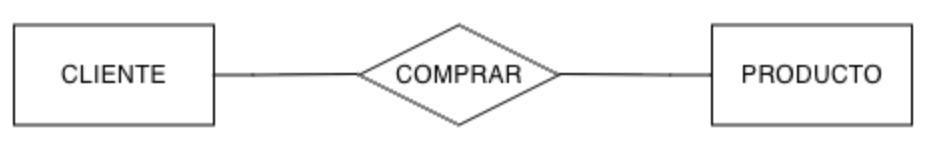
  <figcaption>Ejemplo de relación</figcaption>
</figure>

Realmente una relación entre dos entidades contiene dos direcciones, de manera que la relación `COMPRAR` se puede dividir en que:

- Un `CLIENTE` compra uno o más productos, de manera que la relación va de `CLIENTE` hacia `PRODUCTO`.
- Un `PRODUCTO` lo pueden comprar uno o más clientes, de manera que la relación va de `PRODUCTO` hacia `CLIENTE`.

!!! info "Notación"

    Existen múltiples notaciones para representar las relaciones (las entidades se suelen representar igual en todas las notaciones). En los apuntes vamos a utilizar tanto la notación empleada por la herramienta [ERDPlus](https://erdplus.com/) (también conocida como de pata de gallo), la notación de Chen (con las cardinalidades mínima y máxima) así como diferentes notaciones empleadas de forma generalizada por las empresas.

    Una vez dominada una notación es muy fácil entender y cambiar a cualquiera de las otras. Eso sí, debes ser constante y modelar siempre con la misma notación.

### 👥 Grado

Se denomina **grado** de una relación a la cantidad de entidades involucradas en una relación, lo que nos permite clasificarlas las relaciones en:

- binarias: son las más comunes, e implica la participación de dos entidades.
- ternarias: participan tres entidades. A ser posible, es mejor simplificarlas mediante el uso de varias relaciones binarias y agregaciones. Por ejemplo, la relación existente entre un libro, su autor y la editorial donde se publica el libro. En este curso no vamos a trabajar las relaciones ternarias y en su caso, cuando sea posible, haremos uso de agregaciones o entidades asociativas.
- n-arias: muy excepcionales, ya que involucran 4 o más entidades.
- reflexivas (unarias): son relaciones binarias entre la misma entidad. Por ejemplo, una persona se casa con otra persona.

### 🧮 Cardinalidad

La cardinalidad define la cantidad de **ocurrencias** de una entidad que se **relacionan** con una relación (que a su vez se relaciona con otra entidad).

Para ello, definimos las cardinalidades:

- **mínima** (también conocido como participación): indica el número mínimo de asociaciones en las que aparecerá cada ejemplar de la entidad. Los valores que puede tomar son **cero** (opcional) o **uno** (obligatorio)
- **máxima**: indica el número máximo de relaciones en las que puede aparecer cada ejemplar de la entidad. Los valores pueden ser **uno** o **N** (muchos).

La cardinalidad entre una entidad y una relación se representa entre paréntesis indicando el valor mínimo a la izquierda y el mayor a la derecha mediante `Card(E,R) = (min, max)`. Las posibles combinaciones son:

- `(0, 1)` - Una ocurrencia de una entidad se puede relacionar con ninguna o una ocurrencia de otra/s entidad/es.
- `(1, 1)` - Una ocurrencia de una entidad se relaciona siempre con una ocurrencia de otra/s entidad/es.
- `(0, N)` - Una ocurrencia de una entidad se puede relacionar con ninguna o muchas ocurrencias de otra/s entidad/es.
- `(1, N)` - Una ocurrencia de una entidad se puede relacionar con una o muchas ocurrencias de otra/s entidad/es.

Para averiguar la cardinalidad entre dos entidades vía una relación, cogemos una ocurrencia de una entidad y nos preguntamos con cuantas ocurrencias de la otra entidad se va a relacionar.

!!! example "Ejemplo"

    Pongamos un ejemplo. Si pensamos en la relación que existe un producto y la categoría a la que pertenece, tendremos dos cardinalidades para cada lado de la relación.

    Si tenemos un producto concreto 
    - ¿A cuántas categorías va a pertenecer como mínimo y como máximo? 
    - ¿El `Bolígrafo azul de gel` a cuantas categorías pertenece?

    > `Card(PRODUCTO, PERTENECER) = (1, 1)` - Un producto siempre pertenece a una categoría

    Y en el otro sentido, dada una categoría concreta, ¿cuántos productos van a pertenecer a esta categoría? Si pensamos en la categoría `Papelería`, tendremos muchos productos diferentes.

    > `Card(CATEGORIA, PERTENECER) = (0, N)` - Una categoría puede no tener productos, pero si tiene, pertenecerán muchos.
  
    Para representar la cardinalidad en el modelo ER, **las cardinalidades se anotan en el extremo opuesto de la entidad**, utilizándose la regla _Entidad, Relación, Cardinalidad, Entidad_:

    <figure markdown="span">
      
      <figcaption>Cardinalidades en la relación</figcaption>
    </figure>

    Así pues, si aplicamos la regla de izquierda a derecha tenemos 
    > `PRODUCTO, PERTENECER, (1,1), CATEGORIA`, lo que significa que un producto pertenece siempre a una categoría y como mucho a una también. 

    En cambio, si la aplicamos de derecha a izquierda tenemos 
    > `CATEGORIA, PERTENECER, (0,N), PRODUCTO` indica que a una categoría puede no pertenecer ningún producto pero también muchos.

### 📚 Tipos

Si nos fijamos en las cardinalidades máximas, tenemos tres tipos de relaciones binarias:

- 1:1 (**uno a uno**) – Un elemento de la primera relación se corresponde con uno solo de la segunda y viceversa. Por ejemplo, una pantalla digital está en un aula y en un aula sólo hay una pantalla digital.
- 1:N (**uno a muchos**) – Un elemento de la primera relación se corresponde con uno o varios de la segunda y uno de la segunda se relaciona con uno solo de la primera. Por ejemplo, un trabajador solo puede trabajar en una empresa y en la empresa puede haber muchos trabajadores.
- N:M (**muchos a muchos**) – Un elemento de la primera relación se corresponden con muchos de la segunda y viceversa. Por ejemplo, un alumno puede estar matriculado en varias asignaturas y en una asignatura puede haber muchos alumnos.

Para representar las relaciones, además de la notación de **_Chen_** (indicando las cardinalidades en el lado opuesto), utilizaremos la notación de pata de gallo:

| Descripción | Símbolo |
| --- | --- |
| Un anillo representa "_cero_" |  |
| Un guion representa "_uno_" | { align=center} |
| La pata de gallo representa "_muchos_" (N) |  |

Para ello, dibujaremos la cardinalidad máxima lo más cerca de cada entidad y la mínima lo más separada. En la siguiente tabla se supone que tenemos la relación a la izquierda y la entidad a la derecha:

| Descripción | Cardinalidad | Símbolo |
| --- | --- | --- |
| Anillo y guion | (0, 1) |  |
| Guion y guion | (1, 1) |  |
| Anillo y pata de gallo | (0, N) |  |
| Guion y pata de gallo | (1, N) |  |

-----

### 🤝 Relación 1:1

En las relaciones uno a uno, las dos cardinalidades máximas toman el valor 1, e indican que una ocurrencia de la entidad A se relaciona con sólo uno de la B, y viceversa.

<figure markdown="span">
  
  <figcaption>Relación 1:1</figcaption>
</figure>

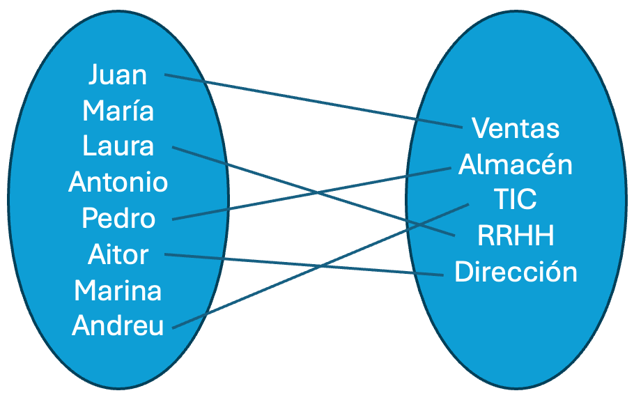

Si nos fijamos en las ocurrencias de las entidades, vemos como cada departamento tiene asignado siempre un empleado y sólo uno. Por ello, `Card(DPTO, DIRIGIR) = (1,1)`. En cambio, tenemos empleados que no tienen asignado ningún departamento, y en el caso de tenerlo, sólo tienen uno, lo que implica que `Card(EMPLEADO, DIRIGIR) = (0,1)`.

Como las dos cardinalidades máximas son 1, decimos que la relación es uno a uno.

!!! question "Autoevaluación"

    ¿En qué cambiaría el gráfico de ocurrencias si las cardinalidades fueran `Card(DPTO, DIRIGIR) = (0,1)` y `Card(EMPLEADO, DIRIGIR) = (1,1)`?  
    ¿Cuáles pueden quedarse sin relacionar? ¿Los departamentos? ¿Los empleados?

Todas las posibles combinaciones de cardinalidades de una relación 1:1 son:

-   
    
Relación 1:1 (0,1)-(0,1)

-   
    
Relación 1:1 ((1,1)-0,1)

-   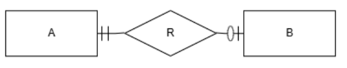
    
Relación 1:1 (0,1)-(1,1)

-   
    
Relación 1:1 (1,1)-(1,1)

!!! question "¿1:1 imposible?"

    Imagina que tenemos una relación 1:1 con las dos cardinalidades mínimas también a 1.

    Si cuando damos de alta una ocurrencia de la entidad A necesitamos de otra ocurrencia de la entidad B, y viceversa, nos encontramos con la paradoja circular del dilema del _huevo y la gallina_.

    Para evitar este problema, una de las dos cardinalidades mínimas se deja a 0, aquella que consideremos menos crítica.

### 🤝 Relación 1:N

En las relaciones uno a muchos, en un sentido hay una cardinalidad máxima de uno, y en la otra de N, es decir, una ocurrencia de la entidad A se relaciona con una de la entidad B, pero una ocurrencia de la entidad B lo hace con muchas de la entidad A.

En el siguiente ejemplo, tenemos que cada producto tendrá una categoría y en cambio, que de una categoría, tendremos muchos productos.

<figure markdown="span">
  
  <figcaption>Ocurrencias 1:N</figcaption>
</figure>

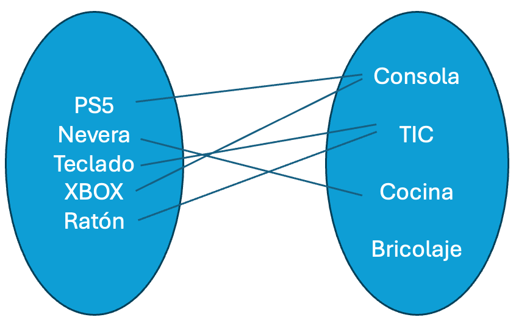

 

Si nos fijamos en las ocurrencias de las entidades, vemos como un producto pertenece a una categoría, y siempre a una. Por ello, `Card(PRODUCTO, PERTENECER) = (1,1)`. En cambio, tenemos categorías a las que pertenecen muchos productos, e incluso categorías sin productos, lo que implica que `Card(CATEGORIA, PERTENECER) = (0,N)`.

Autoevaluación

¿En qué cambiaría el gráfico de ocurrencias si las cardinalidades fueran `Card(PRODUCTO, PERTENECER) = (0,1)` y `Card(CATEGORIA, PERTENECER) = (1,N)`?

¿Y si les damos la vuelta siendo `Card(PRODUCTO, PERTENECER) = (1,N)` y `Card(CATEGORIA, PERTENECER) = (0,1)`?

Todas las posibles combinaciones de cardinalidades de una relación 1:N son:

-   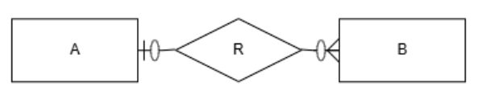
    
Relación 1:1 (0,N)-(0,1)

-   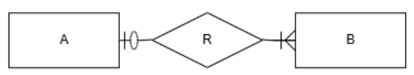
    
Relación 1:N (1,N)-(0,1)

-   
    
Relación 1:1 (0,N)-(1,1)

-   
    
Relación 1:1 (0,N)-(1,1)

!!! info "Supuesto I Empresa"

    Queremos gestionar la información sobre los empleados de una empresa, a partir de las siguientes condiciones: para cada empleado dispondremos de su DNI, nombre, fecha de nacimiento, salario y departamento en el que trabaja.

    De cada departamento sabremos su nombre, el número del despacho en el que se ubica y conoceremos quien es el jefe de dicho departamento.

    ??? solution "Solución"

        El primero paso es, a partir del enunciado, identificar las entidades buscando los sustantivos.

        > "Queremos gestionar la información sobre los empleados de una empresa, a partir de las siguientes condiciones: para cada **empleado** dispondremos de su DNI, nombre, fecha de nacimiento, salario y departamento en el que trabaja. De cada **departamento** sabremos su nombre, el número del despacho en el que se ubica y conoceremos quien es el jefe de dicho departamento."

        Tras su revisión, deducimos que tenemos empleados y departamentos, que serán nuestras dos entidades principales: `EMPLEADO` y `DPTO` (hemos reducido la palabra para reducir el tamaño del diagrama).

        El siguiente paso es localizar las relaciones. Para ello, buscaremos los verbos que relacionen las entidades localizadas.

        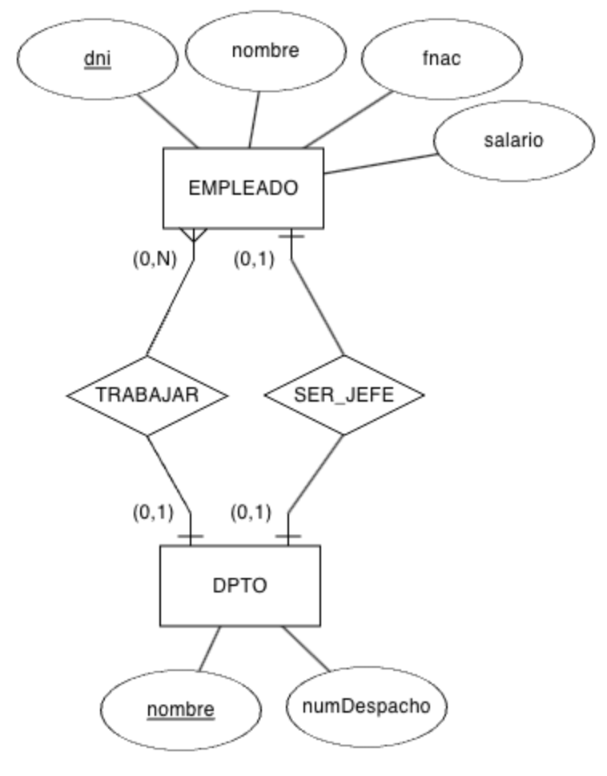

        > "Queremos gestionar la información sobre los empleados de una empresa, a partir de las siguientes condiciones: para cada empleado dispondremos de su DNI, nombre, fecha de nacimiento, salario y departamento en el que **trabaja**. De cada departamento sabremos su nombre, el número del despacho en el que se ubica y conoceremos quien **es el jefe** de dicho departamento.".

        Así pues, tenemos dos relaciones: `TRABAJAR` y `SER_JEFE`.

        Y por último, localizamos los atributos de las entidades y de las relaciones. Para ello, buscaremos los adjetivos y complementos que describan a las entidades y relaciones:

        > "Queremos gestionar la información sobre los empleados de una empresa, a partir de las siguientes condiciones: para cada empleado dispondremos de su **DNI**, **nombre**, **fecha de nacimiento**, **salario** y departamento en el que trabaja. De cada departamento sabremos su **nombre**, el **número del despacho** en el que se ubica y conoceremos quien es el jefe de dicho departamento.".

        Así pues, hemos localizado las siguientes entidades y sus atributos:

        - Atributos de `EMPLEADO`: `dni` (atributo identificador), `nombre`, `fecha de nacimiento`, `salario`.
        - Atributos de `DPTO`: `nombre`, `número de despacho`.

### 🤝 Relación N:M

En las relaciones muchos a muchos, en los dos sentidos hay una cardinalidad máxima de muchos, es decir, una ocurrencia de la entidad A se relaciona con muchas de la entidad B, y una ocurrencia de la entidad B lo hace con muchas de la entidad A.

En el siguiente ejemplo, tenemos que cada empleado puede trabajar en muchos proyectos, y que en cada proyecto, pueden trabajar muchos empleados:

<figure markdown="span">
  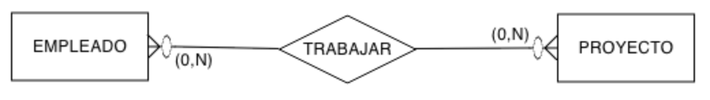
  <figcaption>Ocurrencias N:M</figcaption>
</figure>

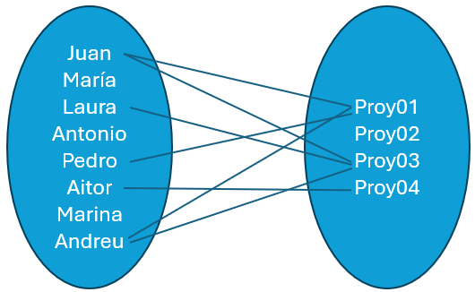

  

Si nos fijamos en las ocurrencias de las entidades, vemos como un empleado trabaja en uno o más proyectos (o en ninguno). Por ello, `Card(EMPLEADO, TRABAJAR) = (0,N)`. En cambio, tenemos proyectos en los que trabajan varios empleados, o incluso proyectos sin empleados, lo que implica que `Card(PROYECTO, TRABAJAR) = (0,N)`.

 

!!! question "Autoevaluación"

    Igual que en las relaciones 1:1 y 1:N, ¿Serías capaz de anotar las combinaciones de cardinalidades y modelar todos los tipos de relaciones N:M posibles?  
    ¿Tiene sentido que las cardinalidades mínimas, en las relaciones N:M, sean 1? ¿Por qué?

### 🤝 Reflexivas

<figure markdown="span">
  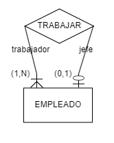
  <figcaption>Relación reflexiva 1:N</figcaption>
</figure>

Las **relaciones reflexivas (o unarias)** son aquellas relaciones de grado uno donde la misma entidad cumple dos roles diferentes en la relación, los cuales se representan escribiéndolo en cada lado de la relación.

Algunos ejemplos comunes son cuando una persona se casa con otra persona, una pieza que se compone de otras piezas o un empleado es responsable de otro empleado.

Vamos a centrarnos en el caso de que un empleado sea el responsable de otro, donde podemos decir que todo empleado trabaja para otro pero que el empleado responsable (el jefe) lo es de varios empleados, lo que daría lugar a una relación 1:N. Así pues, creamos una relación `TRABAJAR` y la unimos con `EMPLEADO` por los dos sentidos de la misma, y anotamos el rol en cada una de las cardinalidades.

## ⏹️ **Atributos**

Los atributos describen propiedades de las entidades y de las relaciones, y se representan mediante elipses u óvalos conectado a la entidad o la relación mediante una línea. Es importante destacar que en una misma entidad, el nombre de los atributos no se puede repetir, pero sí en entidades diferentes.

<figure markdown="span">
  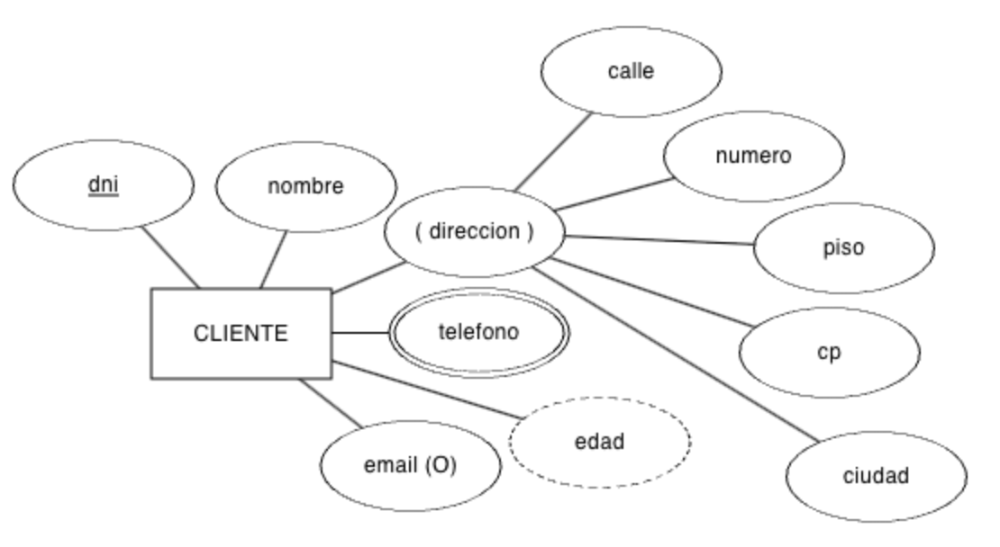
  <figcaption>Atributos</figcaption>
</figure>

Existen diferentes tipos de atributos:

- **Identificador (clave)**: atributos únicos que identifican las ocurrencias de la entidad. Se subraya la palabra, como el `dni` que identifica a un cliente (no tendremos dos clientes con el mismo DNI)
- **Compuesto**: agrupación de varios atributos, ya sean simples o compuestos. Por ejemplo, el campo `direccion` se compone de la calle, número, etc... Se representa mediante óvalos conectados entre sí, y pondremos el nombre compuesto entre paréntesis.
- **Multivaluado**: el atributo puede tomar varios valores, como el `telefono` del cliente, que realmente puede almacenar el fijo, el móvil y el número del trabajo. Se representa mediante un doble óvalo. (en otras notaciones, se pone una `n` al lado del conector del atributo)
- **Derivado**: Su valor se deduce a partir de otros atributos de la misma entidad, otras entidades con las que se relaciona o se calcula a partir de un dato. Por ejemplo, el campo `edad` se obtiene a partir de la fecha de nacimiento del cliente. Se representa mediante un óvalo con el borde punteado.
- **Opcional**: el atributo puede contener valores nulos, como el `email`.
- **No nulo**: opuesto al atributo opcional, marca el atributo como obligatorio. En alguna notaciones se indica con un pequeño circulo entre el conector y el óvalo.
- *En una relación*: Su valor depende de la relación, no de ninguna entidad

!!! question "Autoevaluación"

    Piensa en dos entidades que tengan una relación con la cardinalidad que consideres, e identifica al menos un atributo de cada tipo.

#### 🆔 Identificadores

Recuerda esta frase: **Toda entidad debe tener uno o más atributos identificadores**. Más adelante veremos que en algún caso particular de entidad no es necesario, pero por lo general, al realizar el modelo conceptual siempre debemos comprobar si hemos identificado un atributo identificador para cada entidad.

Respecto a los atributos identificadores podemos tener:

- Atributos identificadores **sencillos**. Un atributo identifica de forma unívoca a una ocurrencia de la entidad. Por ejemplo, el `isbn` de un libro.
- Atributos identificadores **compuestos**, donde una entidad se identifica por dos o más atributos a la vez. Por ejemplo, una calle que se identifique por el tipo de vía y por el nombre de la calle, de manera que no es lo mismo la "_Avenida América_" que la "_Calle América_".
- Varios atributos **candidatos** que pueden identificar a la entidad. Por ejemplo, una persona que podemos identificar mediante su DNI, número de pasaporte, número de la seguridad social, etc.. Todos los atributos pueden identificar a la entidad `PERSONA`. Lo que haremos es elegir uno de ellos como identificador (el más común o importante dependiendo del contexto del problema), y el resto de atributos se consideran _claves alternativas_, y se marcan como que aceptan valores únicos subrayando el nombre de los atributos con una línea troceada.  
    ¿Y si tenemos una entidad que no tiene aparentemente ningún atributo identificador? En ese caso, crearemos un nuevo atributo que lo haga, como `codigo` o `id`, y más adelante, el SGBD le dará un valor secuencial.
- Atributos identificadores que se **complementan** con otra entidad (este tipo lo estudiaremos en esta unidad dentro de las [Restricciones](https://aitor-medrano.github.io/bd/02er.html#restricciones))

Dicho esto, un atributo identificador, como su propio nombre indica, debe identificar a la entidad de forma única, siempre debe tener valor (no admite nulos), debe ser estable (a priori, no debería cambiar), mejor si es sencilla y corta, y debe evitar la redundancia.

!!! example "Entidad Usuario"

    Por ejemplo, pensemos en una entidad `USUARIO`, la cual tiene los atributos `login`, `password`, `email`, `nombre` y `telefono`. Si analizamos sus características, claramente, los atributos candidatos serían `login` y `email`, aunque como un usuario puede cambiar su email (por ejemplo, entre el personal y el de trabajo), sería recomendable utilizar el atributo `login` como atributo identificador.

    | Nombre atributo | único | siempre valor | estable | sencilla |
    | --- | --- | --- | --- | --- |
    | `login` | Sí | Sí | Sí | Sí |
    | `password` | No | Sí | No | No |
    | `email` | Sí | Sí | No | Sí |
    | `nombre` | No | Sí | Sí | Sí |
    | `telefono` | No | No | No | Sí |

!!! question "Autoevaluación"
    Piensa en una entidad PRODUCTO y deduce al menos 5 atributos que comparten todos los productos ¿Qué atributo consideras identificador? ¿Es un atributo identificador simple o compuesto? Por último, ¿has considerado otros atributos como candidatos?

En resumen, **los pasos que seguiremos a la hora de modelar un sistema de información son**:

1. **Leer y comprender** el problema.
2. **Localizar las entidades y relaciones candidatas**. Para ello, sobre el enunciado, podemos rodear con un rectángulo las entidades (sustantivos) y con un rombo las relaciones (rombos).
3. De las **entidades, extraer los atributos, evitando la duplicidad y usando relaciones** cuando sea necesario. Para cada entidad, debemos comprobar si tenemos uno o más atributos identificadores.
4. Comprobar si alguno de los **atributos** debe ir en una **relación en vez de una entidad**.
5. **Analizar y definir las cardinalidades de las relaciones**, comenzando por la máxima, para luego fijar la mínima y comprobar si las entidades participantes en la relación son fuertes o débiles.
6. Revisar el modelo final y **comprobar posibles relaciones redundantes o atributos derivados**.

!!! info "Supuesto II Carreteras"

    Se desea diseñar una base de datos que contenga la información relativa a todas las carreteras de España. Se pide realizar el diseño del modelo ER sabiendo que:

    - Las carreteras se encuentran divididas en tramos.
    - Un tramo, del que nos interesa su longitud, siempre pertenece a una única carretera y no puede cambiar de carretera.
    - Un tramo puede pasar por varios términos municipales, siendo un dato de interés el km del tramo por el que entra en dicho término municipal y el km por el que sale.
    - Existen una serie de áreas en las que se agrupan los tramos, cada uno de los cuales no puede pertenecer a más de un área.

    ??? solution "Solución"

        Primero localizamos las entidades y sus atributos:

        - Entidades: `CARRETERA`, `TRAMO`, `MUNICIPIO`, `AREA`
        - Atributos: cada entidad tendrá un atributo identificador, y cómo en el enunciado no se indica, en unos casos creamos un atributo `codigo` y en otros con el nombre es suficiente (como es el caso de `MUNICIPIO`). Como atributo propio, cada `TRAMO` tiene un atributo `longitud`.

        Las relaciones son:

        - Relación 1:N nombrada como `PERTENECER` entre `CARRETERA` Y `TRAMO`, ya que "**las carreteras se encuentran divididas en tramos**" y "**un tramo**, del que nos interesa su longitud, siempre **pertenece a una única carretera** y no puede cambiar de carretera".
        - Relación N:M nombrada como `PASAR` entre `TRAMO` y `MUNICIPIO`, ya que "**un tramo puede pasar por varios términos municipales**", y aunque no lo indica de forma explícita, deducimos que por un municipio pueden pasar varios tramos. Además, añadimos dos atributos en la relación para almacenar "el **km del tramo por el que entra** en dicho término municipal y el **km por el que sale**". Si hubiéramos colocado los atributos en `TRAMO` o en `MUNICIPIO` no tendrían el mismo significado, ya que nos interesa el dato de la relación entre las dos entidades y no de una de ellas por separado.
        - Relación 1:N nombrada como `AGRUPAR` entre `TRAMO` Y `AREA`, ya que "existen una serie de **áreas en las que se agrupan los tramos**, cada uno de los cuales **no puede pertenecer a más de un área**.".

        <figure markdown="span">
        
        <figcaption>Solución supuesto Carretera</figcaption>
        </figure>