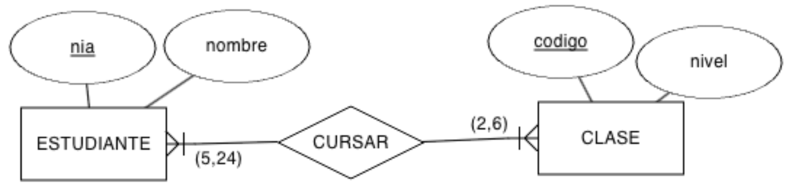
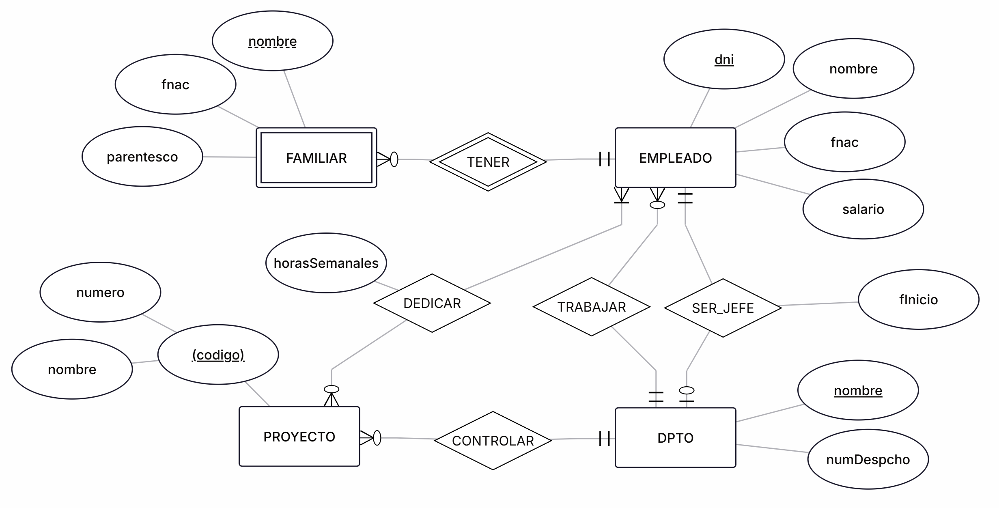

# **2.2 Restricciones**

En el apartado de [Entidades](./2.1-ModeloER.md#️entidades) vimos que tenemos entidades fuertes y débiles, y en las débiles su existencia depende de otra entidad, de manera que se identifica por sus propiedades y por las propiedades de las entidades de las que depende.

## 🆔 **Existencia e identificación**

Las entidades débiles, que representamos mediante un doble rectángulo, presentan dos tipos de dependencia:

- Dependencia en **existencia**: la entidad débil no puede existir sin la entidad débil, lo que implica que, si desaparece una instancia de entidad fuerte desaparecerán las instancias de entidad débiles que dependan de la primera. La representación de este tipo de dependencia incluirá una `E` en el conector o en el interior de la relación débil. En todos casos las restricciones de existencia implican que la cardinalidad mínima es 1.
    
- Dependencia en **identificación**: debe darse una dependencia en existencia y además, una ocurrencia de la entidad débil no puede identificarse por sí misma, debiendo hacerse mediante los atributos identificadores de la entidad fuerte asociada. La representación de este tipo de dependencia incluirá una `ID` en el conector o en el interior de la relación débil. También se puede representar con un rombo doble. Además de que la cardinalidad mínima será 1, es muy común que en estos casos, la relación tenga una cardinalidad de 1:N.
    
<figure markdown="span">
  
  <figcaption>Restricción de ID</figcaption>
</figure>

En el ejemplo del gráfico tenemos una relación que tiene una **restricción de identificación** entre una línea de pedido (entidad débil) respecto a un pedido (entidad fuerte). El pedido tendrá un código y un montante total que se calcula a partir de los valores de las líneas de pedido. La propia restricción de identificación implica que las líneas de pedido realmente se identifican por su número de línea y por el código del pedido, por ejemplo la línea `1` del pedido `R2024A01`, la línea `2` del mismo pedido, etc... o la línea `1` de otro pedido diferente.

En las **restricciones de identificación** es muy común que la entidad débil se identifique mediante un número o código secuencial, el cual se reinicia por cada cambio de la entidad fuerte. Por ejemplo, pensemos en que todos los apartamentos de un edificio empiezan desde el número `101`, pudiendo tener el apartamento `102` del edificio `E1` y el apartamento `102` del edificio `E2`, es decir, la entidad `APARTAMENTO` tiene una restricción de identificación con `EDIFICIO`.

Pongamos otro ejemplo, si identificamos al alumnado por su número de lista y por el grupo al que pertenecen, tendremos que no será el mismo estudiante el número `1` del grupo `1K` que el estudiante `1` del grupo `2K`, de manera que tendremos una restricción de identificación entre la entidad `ESTUDIANTE` y la entidad `GRUPO`.

!!! question "Débil o fuerte"

    

    Hay casos en los que una entidad tiene relación con varias entidades, comportándose como débil en una, y como fuerte en otras. Es por ello, que además de marcar la entidad como débil, debemos marcar la relación con un doble rombo.

    Veámoslo con un ejemplo. Si sobre la línea de pedido, añadimos una relación 1:N con observaciones sobre la misma, tendríamos el siguiente modelo, donde LINEA_PEDIDO es una entidad débil respecto a la relación CONTENER, pero hace de entidad fuerte respecto a la relación TENER.

!!! info "Cardinalidades exactas"

    En ocasiones sabemos la cantidad exacta de ocurrencias con las que se puede relacionar una entidad. En dicho caso, seguirán siendo relaciones 1:N o N:M, pero en el modelo, indicaremos la cantidad de ocurrencias.

    Por ejemplo, si en una clase se matriculan un mínimo de 5 estudiantes y un máximo de 24, y un estudiante se matricula en al menos 2 clases y 6 como máximo, tendremos:

    <figure markdown="span">
      
      <figcaption>Restricción de ID</figcaption>
    </figure>

!!! tip "Supuesto III Empresa"

    Vamos a ampliar el sistema de información anterior para almacenar más información. El nuevo sistema es:

    - La empresa está organizada en **departamentos**. Cada uno tiene un nombre único, el número del despacho en el que se ubica y un empleado que lo dirige. Nos interesa la fecha que empezó a dirigirlo.
    - Cada departamento **controla una serie de proyectos**, los cuales tienen nombre y número únicos.
    - De cada **empleado** nos interesa el DNI, nombre, fecha de nacimiento, salario y departamento en el que trabaja. Cada empleado puede trabajar en más de un proyecto, dedicándole un determinado número de horas a la semana en cada proyecto.
    - Finalmente, queremos guardar también los **familiares de cada empleado**, para administrar información relativa a las pólizas de seguros. De los familiares, queremos saber el nombre, fecha de nacimiento y parentesco con el empleado.

    ??? solution "Solución"

        Si volvemos a repetir el mismo proceso que hemos realizando anteriormente, vamos a localizar las entidades y las relaciones buscando los sustantivos y los verbos:

        - La empresa está organizada en departamentos. Cada uno tiene un nombre único, el número del despacho en el que se ubica y un empleado que lo dirige. Nos interesa la fecha que empezó a dirigirlo.
        - Cada departamento controla una serie de proyectos, los cuales tienen nombre y número únicos.
        - De cada empleado nos interesa el DNI, nombre, fecha de nacimiento, salario y departamento en el que trabaja. Cada empleado puede dedicarse a más de un proyecto, facturando un determinado número de horas a la semana a cada proyecto.
        - Finalmente, queremos guardar también los familiares que tiene cada empleado, para administrar información relativa a las pólizas de seguros. De los familiares, queremos saber el nombre, fecha de nacimiento y parentesco con el empleado.

        Resumiendo, hemos localizado: 
        
        - Entidades: EMPLEADO, DPTO, PROYECTO y FAMILIAR.
  
        Relaciones:

        - TRABAJAR entre EMPLEADO y DPTO.
        - SER_JEFE entre EMPLEADO y DPTO.
        - CONTROLAR entre DPTO y PROYECTO.
        - DEDICAR entre EMPLEADO y PROYECTO.
        - TENER entre EMPLEADO y FAMILIAR.
        
        Si nos centramos en las cardinalidades de las relaciones, tenemos:

        - Card(EMPLEADO, TRABAJAR) = (0, 1) y Card(DPTO, TRABAJAR) = (0, N)
        - Card(EMPLEADO, SER_JEFE) = (0, 1) y Card(DPTO, SER_JEFE) = (1, 1)
        - Card(DPTO, CONTROLAR) = (0, N) y Card(PROYECTO, CONTROLAR) = (1, 1)
        - Card(EMPLEADO, DEDICAR) = (0, N) y Card(PROYECTO, DEDICAR) = (1, N)
        - Card(EMPLEADO, TENER) = (0, N) y Card(FAMILIAR, TENER) = (1, 1)
        
        Finalmente, los atributos de las entidades y las relaciones son:

        - Atributos de EMPLEADO: dni (atributo identificador), nombre, fecha de nacimiento, salario.
        - Atributos de DPTO: nombre (atributo identificador), número de despacho.
        - Atributos de PROYECTO: nombre y número (ambos atributos identificadores).
        - Atributos de FAMILIAR: nombre (atributo identificador), fecha de nacimiento, parentesco.
        
        Atributos de las relaciones:
        
        - SER_JEFE: fecha de inicio
        - DEDICARSE: horas semanales
        
        Con estas consideraciones, el modelo resultante es:

        <figure markdown="span">
          
          <figcaption>Solución</figcaption>
        </figure>

#### Pérdida expresiva

En ocasiones, los modelos conceptuales no son capaces de expresar todas las restricciones, relaciones o propiedades el mundo real, ya sea por algunas relaciones muy complejas, dependencias temporales o reglas de negocio.

Para ello, en el pie de los modelos indicaremos con texto una frase del estilo _"Pérdida expresiva: Todo cliente debe haber nacido en la misma provincia que la tienda donde realiza el pedido"_.