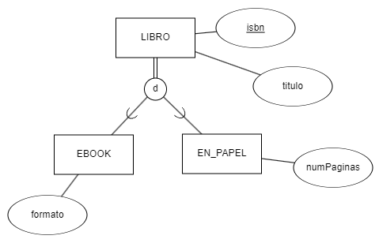
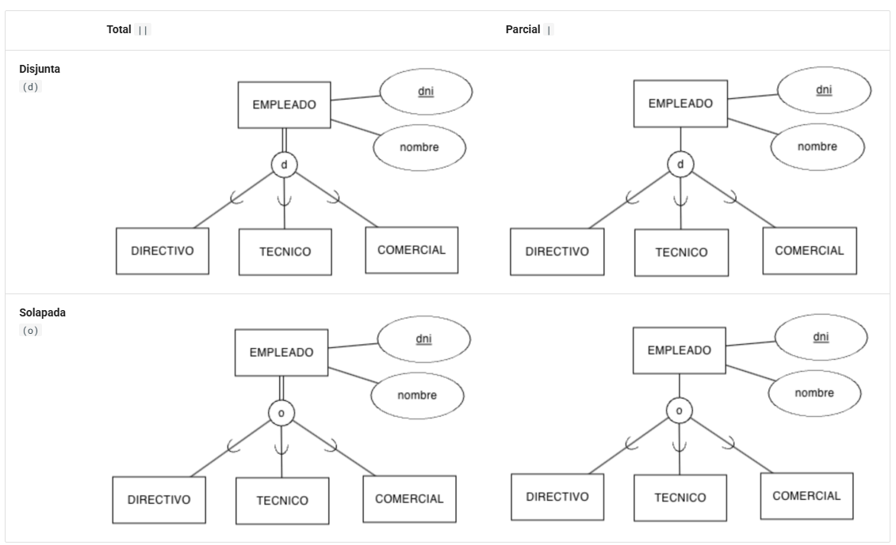
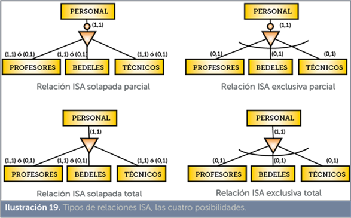
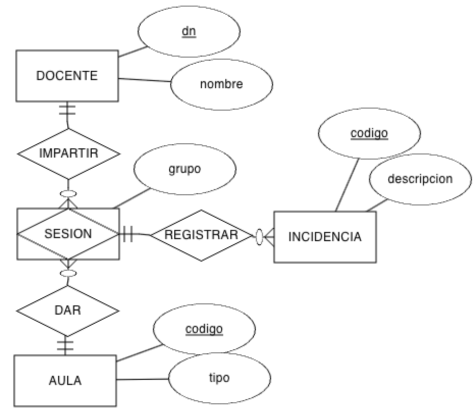

# **2.3 El modelo Entidad Relación Extendido**

Con el paso de los años, y dadas ciertas carencias del modelo entidad relación, a mediados de los años 80 se extendió con la incorporación de los conceptos de clase y subclase, junto con los conceptos de generalización y especialización, así como la agregación de entidades, dando lugar al modelo _Entidad Relación Extendido_ (**EER**).

## 🔷 **Generalización**

La descomposición de tipos de entidad en varios subtipos o subclases permite identificar jerarquías de entidades, entre una entidad general, que denominamos entidad superclase (o entidad padre), que se puede especializar en entidades subclase (o entidades hijas):

- La entidad **superclase** modelan las características comunes de la entidad vista de una forma genérica.
- Las entidades **subclase** modelan las características propias de sus especializaciones.

Es necesario que se cumpla que toda ocurrencia de una entidad subclase sea también una ocurrencia de su entidad superclase, propagando sus características de padres a hijos, lo que se denomina _herencia de propiedades_.

**Generalización vs Especialización**

Se dice que tenemos una **generalización**, cuando dos o más tipos de entidades van a compartir diferentes atributos. Para ello, la entidad superclase contendrá aquellos atributos comunes a las subclases. En cambio, se dice que realizamos una especialización cuando un tipo de entidad tiene algunos atributos que tienen sentido para algunas subclases, pero no para todas. Para ello, cada subclase contendrá sus atributos específicos, y los comunes se colocan en la superclase.

Así pues, se dice que la generalización va de abajo hacia arriba, subiendo los atributos comunes al padre, y en consecuencia, la especialización va de arriba a abajo, colocando en los hijos los atributos específicos que no comparten todas las subclases.

Con generalización y la especialización se establece una relación **_ES-UN_** (en inglés, _IS-A_), indicando que una entidad hijo ES-UN con la entidad padre. Por ejemplo, si la superclase es `VEHICULO`, ejemplos de subclases serían `CAMION`, `AUTOBUS`, `MOTO`, etc... ya que un `CAMION` es un `VEHICULO`.

En la generalización/especialización, las características (atributos o interrelaciones) de la entidad superclase se propagan hacia las entidades subclase. Es lo que se denomina **herencia de propiedades**.

<figure markdown="span">
  
  <figcaption>Generalización</figcaption>
</figure>

Las **generalizaciones** siempre se representan en vertical, situando la entidad superclase arriba y las subclases debajo. Para conectarlas, se utiliza un círculo que puede contener la letra `d` o la letra `o` de forma similar al ejemplo que tenemos en el lateral, para indicar que la especialización es disjunta o solapada (_overlap_). Entre la clase padre y el círculo, si se utiliza una línea simple indicamos que es una especialización parcial y si es doble, que se trata de una generalización total.

Finalmente, el circulo conecta con los hijos mediante una línea que contiene un arco indicando el sentido del padre a los hijos.

Así pues, en el ejemplo tenemos que un `LIBRO` tiene un isbn y un título. Y que un `EBOOK` _ES-UN_ `LIBRO` y que `EN_PAPEL` también _ES-UN_ `LIBRO`. Un `EBOOK` en total tiene tres atributos, los dos que hereda del padre, más el formato del _ebook_. De forma similar, `EN_PAPEL`, también tiene tres atributos, los dos que hereda de `LIBRO` más el número de páginas de la copia impresa.

### 📚 Tipos

Cuando definimos una especialización es muy importante definir cómo se relacionan las superclases con las subclases.

Vamos a centrarnos en un supuesto donde tenemos una superclase `EMPLEADO` y tenemos tres subclases: `DIRECTIVO`, `TECNICO` y `COMERCIAL`.

Si nos centramos en la cantidad de subtipos posibles tenemos:

- **Total**: La superclase pertenece obligatoriamente a alguna de las subclases. No puede haber un `EMPLEADO` que no sea ni `DIRECTIVO`, ni `TECNICO`, ni `COMERCIAL`. Se representa uniendo mediante una línea doble (`||`) la superclase con el círculo.
- **Parcial**: La superclase puede no pertenecer a alguna de las subclases. Podríamos tener un `EMPLEADO` que no sea ni `DIRECTIVO`, ni `TECNICO`, ni `COMERCIAL`. Se representa uniendo mediante una línea sencilla (`|`) la superclase con el círculo.

Y si ponemos en foco en la exclusividad de las subclases:

- **Disjunta** / Exclusiva: La superclase sólo pertenece a una de las subclases. Si un `EMPLEADO` es un `DIRECTIVO`, no puede ser un `TECNICO` ni un `COMERCIAL`. Se representa poniendo una **`d`** dentro del círculo.
- **Solapada**: La superclase puede pertenecer a varias de las subclases a la vez. Un `EMPLEADO` puede ser un `DIRECTIVO` y un `COMERCIAL` a la vez. Se representa poniendo una **`o`** dentro del círculo.

Con lo cual, se pueden dar las siguientes combianciones:

<figure markdown="span">
  
  <figcaption>Tipos de relaciones IS-a</figcaption>
</figure>

??? fix "Otras formas de representar este tipo de relaciones:"

    <figure markdown="span">
      
      <figcaption>Tipos de relaciones IS-a (representación alternativa)</figcaption>
    </figure>

!!! tip "Supuesto IV Tienda"

    Se pide diseñar la base de datos de una tienda, la cual está organizada por departamentos, que contenga información sobre los trabajadores y los artículos que se ofertan.

    Se deben tener en cuenta las siguientes restricciones:

    De todos los trabajadores nos interesa almacenar su DNI, nombre completo y número de teléfono, así como el departamento en el que trabajan.
    Existen tres tipos de trabajadores: gerentes (del que guardaremos el bonus anual), jefes (nos interesa almacenar cuantos vendedores tiene a su cargo) y vendedores (de cada vendedor, guardaremos su sueldo base y la zona donde trabaja).
    Cada departamento lo dirige un gerente, aunque se puede dar el caso que tengamos gerentes que no dirijan ningún departamento, pero nunca dirigirán más de uno.
    Un gerente tiene a su cargo a un cierto número de jefes y éstos a su vez a un cierto número de vendedores.
    En cuanto a los productos nos interesa su código, nombre y precio, y departamento en el que se encuentran.
    Cada producto lo pueden vender muchos vendedores, y cada vendedor, a su vez, puede vender muchos productos. Además, cada vendedor le aplicará un determinado descuento a los productos con los que trabaja.

    ??? solution "Solución"

        Primero localizamos las entidades y sus atributos:

        - **Entidades**: TRABAJADOR, DPTO, PRODUCTO. Los trabajadores a su vez, se descomponen en las subclases VENDEDOR, JEFE y GERENTE.
        - **Atributos**: los trabajadores se identifican por su dni, mientras que los departamentos y los productos por su codigo.

        Las relaciones son:

        - **Relación 1:N** nombrada como PERTENECER entre TRABAJADOR Y DPTO, ya que de los trabajadores nos interesa "el departamento en el que trabajan" y se entiende que a un departamento pertenecerán varios trabajadores.
        - Generalización total y disjunta entre TRABAJADOR y sus hijos VENDEDOR, JEFE y GERENTE, cada uno con sus propios atributos. Destacar que el atributo de cantVendedores es derivado, ya que se obtiene de la cardinalidad de la relación SUPERVISAR.
        - **Relación 1:1** nombrada como DIRIGIR entre DPTO Y GERENTE, ya que "Cada departamento lo dirige un gerente, aunque se puede dar el caso que tengamos gerentes que no dirijan ningún departamento, pero nunca dirigirán más de uno"
        - **Relación 1:N** nombrada como MANDAR entre GERENTE Y JEFE, ya que "Un gerente tiene a su cargo a un cierto número de jefes".
        - **Relación 1:N** nombrada como SUPERVISAR entre JEFE Y VENDEDOR, continuando "y éstos (los jefes) a su vez a un cierto número de vendedores".
        - **Relación 1:N** nombrada como ENCONTRAR entre DPTO Y PRODUCTO, ya que "En cuanto a los productos nos interesa ... departamento en el que se encuentran", y entendemos que en un departamento encontraremos varios productos.
        - **Relación N:M** nombrada como VENDER entre VENDEDOR y PRODUCTO, ya que "Cada producto lo pueden vender muchos vendedores, y cada vendedor, a su vez, puede vender muchos productos". Además, añadimos el atributo descuento en la relación para almacenar el descuento que cada vendedor aplica a los productos.

        <figure markdown="span">
          
          <figcaption>Solución</figcaption>
        </figure>

## ✖️ **Agregación**

La agregación surge de la limitación que existe en el modelo ER de no permitir expresar relaciones entre relaciones binarias, y en gran medida, haciendo uso de agregaciones podemos evitar hacer uso de relaciones ternarias.

Así pues, una agregación se comporta como una entidad más, con un nivel de abstracción mayor que la propia relación.

!!! example "Ejemplo Agregación"

    Por ejemplo, tengamos el caso de un docente que imparte clase en una determinada aula. El docente dará clase a varios grupos en el aula, y en el aula entran varios docentes. Queda claro que una relación N:M entre `DOCENTE` y `AULA` (por ejemplo, `IMPARTIR`) nos permite modelar este caso. Pero ¿y si queremos registrar las incidencias que se producen en el aula cuando un docente está dando clase? Si unimos la entidad `INCIDENCIA` con `DOCENTE` o con `AULA`, estaríamos perdiendo información.

    <figure markdown="span">
      
      <figcaption>Agregación</figcaption>
    </figure>

    Así pues, creamos una **entidad asociativa** que funciona como una **agregación**, y la nombramos, por ejemplo como `SESION` (una sesión lectiva la imparte un docente en un aula) y ésta es la que relacionamos con la entidad `INCIDENCIA` mediante la relación `REGISTRAR`. Es importante destacar que la entidad asociativa no tiene atributo identificador, porque realmente es como si tuviera una restricción de identificación respecto a las otras entidades, a modo de entidad débil que necesita de todas las entidades con las que se asocia para identificarse.

El **mecanismo de agregación** lo que hace es abstraer las entidades y la relación que las asocia para obtener una **entidad compleja**, conocida como **entidad asociativa**, que a su vez puede relacionarse como una entidad normal con el resto de entidades de nuestro sistema.

Aunque tiene muchos puntos de contacto con una relación ternaria, la agregación remarca la relación entre una determinada pareja de entidades, al mismo tiempo que **no implica una necesaria asociación con la tercera entidad**, como si ocurre en las ternarias.