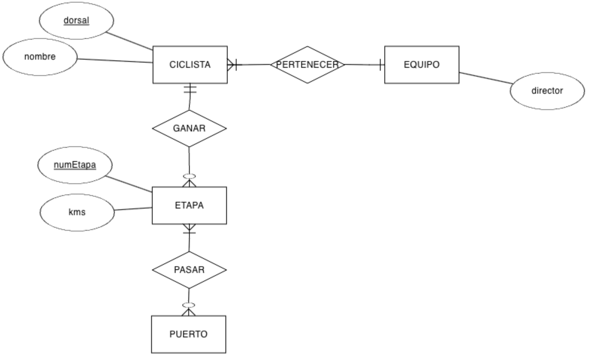

# **UT2-A. Actividades**

## **Actividades**

### **AC201**. (RABD.6 // CE6b, CE6c)

??? abstract "A partir del siguiente sistema de información"

    Vamos a diseñar la base de datos para una **flota de vehículos y las multas asociadas**.

    Tenemos una flota de vehículos de los cuales queremos guardar los siguientes datos: `matrícula`, `modelo`, `marca` y `año de fabricación`. Nos interesa almacenar información de su `propietario`, que tiene los siguientes datos: `DNI`, `nombre`, `apellidos`, `edad`, `teléfono`, `dirección`, `código postal` y la `fecha desde la que ese propietario tiene el vehículo`.

    **Ampliación: Gestión de Multas** 👮

    Se desea conocer las multas impuestas a cada vehículo.

    De cada multa interesa conocer: la `identificación de la multa` (número único), `fecha`, `hora`, `breve descripción`, `ubicación`, si estaba `presente o ausente` el propietario/conductor, `importe total`, el `agente` que ha puesto la multa (del cual nos interesa saber su `DNI`, `número de agente`, `nombre` y `apellidos`, `años en el cuerpo`) y las infracciones asociadas a la multa.

    Una multa puede tener asociada **más de una infracción**. De las infracciones que se pueden cometer queremos registrar el `identificador de infracción`, `denominación`, `tipo` (Leve, Grave, Muy grave), `sanción económica` (mínimo y máximo) y `pérdida de puntos`.

    ---

    Se pide:

    1. Identifica las entidades, atributos y relaciones
    2. Una vez identificados, realiza el modelo ER únicamente con las entidades y las relaciones (sin colocar los atributos) y define las cardinalidades de las relaciones

### **AR202**. (RABD.6 // CE6b)

??? abstract "Diseña el modelo ER únicamente con las entidades y las relaciones de un Centro Educativo"

    **Diseñar la base de datos para gestionar alumnos, profesores y módulos**.

    Se desea guardar información de los `alumnos` (`Número de expediente`, `NIF`, `nombre`, `apellido 1`, `apellido 2`, `teléfono`, `dirección`, `ciudad`, `código postal`, `edad`, `email`), de los `módulos` que se imparten (`denominación`, `número de horas` y `ciclo` al que pertenecen), el `profesor` que lo imparte y la `nota final` obtenida por cada alumno en cada módulo (sólo una nota final).

    Del `profesor` queremos guardar su `DNI`, `nombre` y `apellidos`, `teléfono`, `email`, `fecha de ingreso`, si tiene `plaza definitiva` o no y `departamento` al que pertenece. Se desea conocer también el profesor que es `jefe de departamento`.

    **Ampliación: Gestión de Convocatorias** 📄

    En el caso de que el alumno haya suspendido un módulo, se debe almacenar la nota obtenida en cada una de las convocatorias. Estas se guardarán como `MAR` (marzo), `JUN` (junio) y `SEP` (septiembre) y el `año` al que corresponda.

### **AC203**. (RABD.6 // CE6d)

??? abstract "A partir del siguiente modelo ER"

    Indica las cardinalidades de las relaciones, y a continuación, redacta el texto que daría lugar como resultado este modelo

    <figure markdown="span">
      
      <figcaption>Actividad 203</figcaption>
    </figure>

### **AC204**. (RABD.6 // CE6b, CE6c, CE6e):

??? abstract "Empresa Venta de Productos"

    Una empresa vende productos a varios clientes. Se desea registrar los datos de los clientes, los datos de los productos, de los proveedores que lo proporcionan y de las compras que realizan los clientes.

    *   **Clientes**: `nombre`, `apellidos`, `DNI`, `dirección completa`, `teléfono`, `email` y `edad`.
    *   **Productos que compran**: `número de unidades` de cada producto y la `fecha` en la que lo compran.
    *   **Productos**: Se clasifican en `categorías` (textil, menaje, tecnología, ...), de forma que un producto pertenece a una **única categoría**. Cada producto tiene un `nombre`, un `código`, un `precio unitario de compra`, `precio de venta` y `tipo de IVA` (21, 10 o 4).
    *   **Compras**: Un cliente puede comprar varios productos, y un mismo producto puede ser comprado por varios clientes. Si se realiza una compra de un mismo artículo un mismo día, se registrará como una única compra.
    *   **Proveedores**: Un producto sólo puede ser suministrado por **un proveedor**, y un proveedor puede suministrar diferentes productos. De cada proveedor se desea conocer el `NIF`, `nombre`, `apellidos`, `teléfono` y el `precio` al que suministra cada producto.

### **AC205**. (RABD.6 // CE6b, CE6c, CE6e)

??? abstract "Realiza el modelo ER de los siguientes sistemas de información"

    - `205.1`: Una empresa ubicada en distintos edificios de distintos polígonos industriales desea registrar la distribución de sus departamentos.
        Un departamento puede estar distribuido en varios edificios. Del departamento tenemos su nombre y el número de empleados que lo integran.
        De los edificios sabemos su nombre y el número de despachos que tienen. En cada edificio (que está localizado en un polígono industrial, y del que se conoce su nombre y la ciudad en la que está situado) pueden ubicarse distintos departamentos.
        Debido a esto, se desea controlar el número de despachos que cada departamento tiene en cada edificio.

    - `205.2`: Una pequeña empresa telefónica desea crear una base de datos para el control de las llamadas efectuadas exclusivamente entre sus clientes.
        Dispondrá de información sobre las terminales de su red (si se trata de teléfonos móviles o fijos, el no de teléfono y el nombre del cliente), y de cada llamada realizada entre ellos se almacenará: números de teléfono del emisor y el receptor de la llamada, la hora de comienzo de la misma y su duración.

### **AR206**. (RABD.6 // CE6b, CE6c, CE6e)

??? abstract "Realiza el modelo ER de una base de datos para una Autoescuela."

      En una autoescuela hay varios profesores y varios coches para realizar las prácticas.

      Se desea guardar información respecto a los **alumnos** (`DNI`, `nombre`, `apellidos`, `fecha de matriculación`, `teléfono`, `email`), el **profesor** que se les asigna (`DNI`, `nombre` y `apellidos`, `dirección`, `teléfono`, `fecha ingreso`) y el **coche** que conducirán (`matrícula`, `color`, `año de compra`, `potencia`).

    - Caso A) 🚗
        Cada alumno da clase **siempre en el mismo coche y con el mismo profesor**.

    - Caso B) 🔄
      Cada alumno puede dar clases con un **profesor y/o coche distinto**. Se desea reflejarlo y saber en qué `fecha` ha dado la clase, con qué coche y con qué profesor.

### **AP207**. (RABD.6 // CE6b, CE6c, CE6e):

??? abstract "Realiza el modelo ER empresa de logística"

    Nos subimos al camión para diseñar la base de datos de una empresa de logística que reparte paquetes por toda España.

    Se desea informatizar la gestión de una empresa de transportes.

    *   **Camioneros**: `DNI`, `nombre`, `teléfono`, `dirección`, `salario` y `población` y `provincia` en la que vive.
    *   **Paquetes**: `código de paquete`, `descripción`, `nombre destinatario` y `dirección completa del destinatario`.
    *   **Reglas de reparto**: Un camionero distribuye **muchos paquetes**, y un paquete sólo puede ser distribuido por **un camionero**.
    *   **Provincias**: `código de provincia` y `nombre`. Un paquete sólo puede llegar a **una provincia**. Sin embargo, a una provincia pueden llegar **varios paquetes**.
    *   **Camiones**: `matrícula`, `marca`, `modelo` y `potencia`. Un camionero puede conducir **diferentes camiones en fechas diferentes**, y un camión puede ser conducido por **varios camioneros en una misma fecha**. Puede haber camiones nuevos que no se hayan usado en el reparto todavía.

### **AC208**. (RABD.6 // CE6b, CE6c, CE6e)

??? abstract "Realiza el modelo ER una prueba ciclista"

    A los ciclistas inscritos en la prueba se les asigna un dorsal único. De cada ciclista participante se desea conocer su edad, nombre y equipo al que pertenece. De cada equipo se desea conocer su director.

    La prueba es por etapas. De cada etapa se registra el número de etapa, los kilómetros, la ciudad de salida y la de llegada (con unas breves reseñas geográficas, históricas y económicas) y los puertos por los que pasa la etapa (nombre, altura, categoría).

    Se quiere conocer qué ciclista ha ganado en cada puerto y quién ha ganado cada etapa.

    <figure markdown="span">
      
      <figcaption>Actividad 208</figcaption>
    </figure>

### **AC209**. (RABD.6 // CE6b, CE6c, CE6e)

??? abstract "Realiza el modelo ER sobre cine"

    De cada película le interesará conocer el título, el año de producción, la nacionalidad, y los datos (nombre, fecha de nacimiento y nacionalidad) de los intérpretes (como mucho los 6 intérpretes principales), del director y los autores del guion en el que está basada la película. De este último -el guion- se sabrá además el título.

    También desea conocer los posibles Oscars ganados por cada película en las modalidades de: mejor película, mejor guion, mejores intérpretes y mejor director.

    Por último, se tendrán identificadas las películas que son remakes de otras, conociendo en ese caso, la película original y los distintos remakes.

### **AC210**. (RABD.6 // CE6b, CE6c, CE6e)

??? abstract "Realiza el modelo ER sobre una academía de inglés"

    Se desea generar una base de datos para almacenar información respecto a una academia de inglés.

    *   **Personas (Alumnos)**: Se almacena el `expediente`, `nombre`, `apellidos`, `dirección completa`, `teléfono` y `edad`.
    *   **Grupos**: Cada persona se ubica en un grupo en función de su nivel de inglés. El grupo se identifica por un `código` y tendrá un `número de alumnos`. Hay un grupo por cada nivel. En cada grupo hay un alumno que es el **delegado**. Puede haber grupos sin alumnos.
    *   **Profesores**: Hay varios profesores de nacionalidades distintas. Se guarda su `DNI`, `nombre`, `dirección completa`, `teléfono` y `nacionalidad`.
    *   **Relaciones clave**:
        *   Cada profesor da clase a **varios grupos**.
        *   Cada grupo está formado por **varios alumnos**.
        *   A cada grupo **sólo le imparte clase un profesor**.
        *   Debe quedar reflejado cuál es el profesor de un determinado alumno (esto se deduce de la relación grupo-profesor).

### **AP211**. (RABD.6 // CE6b, CE6c, CE6e)

??? abstract "Actividad: REaliza el ER sobre un campeonato de ajedrez que gestiona toda la información participantes, alojamientos y partidas"

    En el campeonato participan jugadores y árbitros; de ambos se requiere conocer el número de asociado, nombre, dirección, teléfono de contacto y campeonatos en los que han participado (como jugador o como árbitro). De los jugadores se precisa además el nivel de juego en una escala de 1 a 10. Ningún árbitro puede participar como jugador.

    Los países envían al campeonato un conjunto de jugadores y árbitros, aunque no todos los países envían participantes. Todo jugador y árbitro es enviado por un único país. Un país puede ser representado por otro país. Cada país se identifica por un número correlativo según su orden alfabético e interesa conocer además de su nombre, el número de clubes de ajedrez existentes en el mismo.

    Cada partida se identifica por un numero correlativo (`codigop`), la juegan dos jugadores y la arbitra un árbitro. Interesa registrar las partidas que juegan cada jugador y el color (blancas o negras) con el que juega. Ha de tenerse en cuenta que un árbitro no puede arbitrar a jugadores enviados por el mismo país que le ha enviado a él. Todo participante participa en al menos una partida.

    Tanto jugadores como árbitros se alojan en uno de los hoteles en los que se desarrollan las partidas, se desea conocer en qué hotel y en qué fechas se ha alojado cada uno de los participantes. Los participantes pueden no permanecer en el mismo hotel que se realiza el campeonato durante todo el campeonato, sino acudir cuando tienen que jugar alguna partida alojándose en el mismo o distinto hotel. De cada hotel, se desea conocer el nombre, la dirección y el número de teléfono.

    El campeonato se desarrolla a lo largo de una serie de jornadas (año, mes, día) y cada partida tiene lugar en una de las jornadas aunque no tengan lugar partidas todas las jornadas.

    Cada partida se celebra en una de las salas de las que pueden disponer los hoteles, se desea conocer el número de entradas vendidas en la sala para cada partida. De cada sala, se desea conocer la capacidad y medios de que dispone (radio, televisión, video...) para facilitar la retransmisión de los encuentros. Una sala puede disponer de varios medios distintos.

    De cada partida se pretende registrar todos los movimientos que la componen. La identificación de movimiento se establece en base a un numero de orden dentro de cada partida: para cada movimiento se guardan la jugada (5 posiciones) y un breve comentario realizado por un experto.

### **AC212**. (RABD.6 // CE6b, CE6c, CE6e)

??? abstract "Realiza el modelo ER del siguiente sistema de información sobre las cadenas de radio del panorama radiofónico"

    De cada cadena conoceremos el nombre, el género (musical, de noticias, deportiva, ...) y además, el nombre de las provincias en las que emite, teniendo en cuenta que una cadena puede tener varias emisoras en una misma provincia, cada una de ellas emitiendo en su correspondiente dial.

    Por otra parte, conoceremos el nombre y la antigüedad de todos los empleados de cada cadena de radio. De los técnicos conoceremos además su especialidad (de sonido, de archivo, de mantenimiento, ...) y de los locutores los programas que presentan.

    Sabremos, para cada programa, su nombre, la hora de inicio, su duración en minutos y la cadena de radio que lo emite.

    Hemos de tener en cuenta además que cada locutor puede presentar un máximo de tres programas distintos y que cada programa es presentado como mucho por cinco locutores.

    Los programas pueden tener un patrocinador del que conoceremos el nombre y el aporte económico; distintos programas pueden tener el mismo patrocinador.

### **AR213**. (RABD.6 // CE6b, CE6c, CE6e)

??? abstract "Realiza el modelo ER del siguiente sistema de información sobre la Eurocopa:"

    Nos interesa conocer el nombre de cada selección y su indumentaria habitual (color de la camiseta, del pantalón y las calzas), el nombre del seleccionador y el número de años que éste lleva en el cargo, y los nombres, número de camiseta y posición (portero, defensa, centrocampista, ...) de los 22 jugadores de cada equipo.

    Además, se desea almacenar información de todos los partidos jugados por cada equipo: la fecha, el lugar, el equipo local y el resultado (número de goles del equipo local y del visitante).

    También, de cada gol marcado, el jugador que lo marca, el portero que lo encaja, el minuto de juego y el tipo de gol (de falta, de penalti, en jugada, etc...).

### **AC214**. (RABD.6 // CE6b, CE6c, CE6e)

??? abstract "Realiza el modelo ER sobre una Museo"

    Se desea almacenar por cada museo un código, nombre, provincia, dirección. Cada museo dispone de una serie de salas donde se muestran sus obras; cada sala se identifica con un número consecutivo dentro del código del museo al que pertenece, además se almacena su ubicación y tamaño en metros cuadrados. Cada museo dispondrá, al menos, de una sala de exposición.

    Se necesita personal para controlar el sistema, es decir, trabajadores especializados en tres diferentes funciones: personal de vigilancia al cual se le asigna un número de control y un número de arma, personal de conservación del cual se registra su función y personal de gestión para labores administrativas. Para todo el personal es necesario almacenar su DNI y el número de la seguridad social. Un trabajador tiene exclusividad en un museo. Cada sala está vigilada siempre por un solo trabajador del área de vigilancia. Cada vigilante tiene su propia sala de vigilancia de la que es responsable, aunque hay vigilantes que se encargan de otras áreas del museo. A veces, las labores del personal de vigilancia son delicadas, por ello hay un trabajador con funciones de coordinador para cada grupo de vigilantes, aunque no todos los trabajadores tienen coordinador ni todos los trabajadores son coordinadores. No hay más de un coordinador por grupo.

    Además, se quiere registrar las visitas del público; con respecto al visitante el DNI, nombre, teléfono y el museo o museos que ha visitado en una o varias fechas, teniendo en cuenta que el visitante puede entrar al museo o museos el mismo día varias veces en distintas horas. Es necesario registrar dichas fechas y horas.

    Todos los museos han sido inaugurados, abiertos al público y visitados desde hace tiempo.

### **AC215**. (RABD.6 // CE6b, CE6c, CE6d, CE6e)

??? abstract "A partir del siguiente modelo EER sobre un concurso de cocina"

    <figure markdown="span">
      
      <figcaption>Modelo ER Cocina</figcaption>
    </figure>

    Contesta las siguientes cuestiones justificando tu respuesta:

    1. ¿Cuantos tipos de concursantes hay? ¿Podemos tener más? ¿Y están relacionados entre sí?
    2. ¿Qué tipo de relación existe entre `EDICION` y `PREMIO`. ¿Se puede repetir el mismo premio en diferentes ediciones?
    3. ¿Puede ganar el concurso un restaurante que lo dirige un concursante de un país diferente?
    4. ¿Para qué sirve el atributo `contrato` de la relación `TRABAJAR` entre `RESTAURANTE` y `PROFESIONAL`
    5. Respecto a las recetas, ¿por qué tiene una relación reflexiva?
    6. Si eliminamos la entidad `PAIS`, ¿qué cambios habría que hacer en el modelo para que siguiera expresando lo mismo?

### **PY216**. (RABD.6 // CE6b, CE6c, CE6d, CE6e)

??? abstract "Reto I"

    Una vez que ya tenemos unas nociones básicas sobre el modelado conceptual de datos, llega el momento de concretar el sistema de información y crear el modelo de datos del [Reto I - Diseñamos](./2.A-Actividades.md#reto-i---diseñamos) de nuestro equipo.

    Toda solución debe:

    - Tener un mínimo de 6 entidades.
    - Utilizar relaciones con diferentes cardinalidades.
    - Emplear atributos de diferente tipo.
    - (opcional) Utilizar una generalización o agregación.

    Se debe entregar un informe con el sistema de información, el modelo EER y describir las decisiones tomadas en su elaboración.

    Se utilizará una rúbrica para su evaluación en base a la siguiente lista de cotejo:

    - Todas las entidades tienen un atributo que las identifica.
    - La nomenclatura es homogénea en todo el modelo.
    - Las entidades se nombran en singular y mayúsculas.
    - Las relaciones se nombran con verbos en mayúsculas.
    - Los atributos se nombran en minúsculas.
    - Todas las relaciones indican la cardinalidad

## 🧠 **Reto I - Diseñamos**

A lo largo de las tres siguientes unidades vamos a desarrollar una base de datos desde cero. Para ello, en equipos de 3-4 personas, y siguiendo un enfoque metodológico de [Aprendizaje Colaborativo basado en Retos](https://catedu.github.io/ACbR/), cada equipo va a definir:

- Un sistema de información.
- El modelo entidad relación (diseño conceptual)
- El modelo relacional (diseño lógico)

Si no se os ocurre ningún sistema de información, algunas propuestas que podéis diseñar son la base de datos de un gimnasio, una academia de idiomas, una biblioteca, un liga amateur de fútbol/baloncesto o la base de datos de un festival de música.

Durante el desarrollo del reto estableceremos diferentes hitos que deberéis cumplir, a modo de entregables. En cada unidad dedicaremos una o más sesiones a trabajar el reto y compartir el resultado con la clase.

En la [prueba escrita](#TODO) que realizaremos a finales de la unidad 4 aparecerán actividades sobre alguna de las soluciones creadas.
