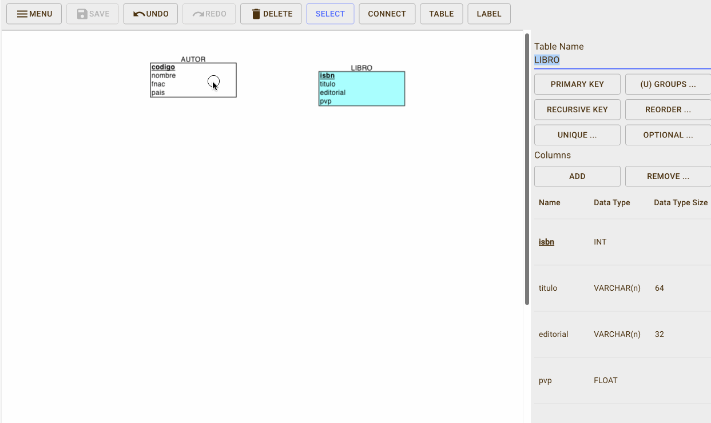

# **2.4. El modelo relacional**

En la [unidad anterior](../02/2.1-ModeloER.md) estudiamos que un **modelo lógico** representa de forma conceptual la estructura de una base de datos, pero dependiendo del SGBD a utilizar.

<figure markdown="span">
  
  <figcaption>Modelo lógico</figcaption>
</figure>


Si nuestra elección es un SGBD relacional, el modelo por excelencia es el **modelo relacional**. Creado por _Codd_ a finales de los años 60, aunque los primeros SGBD relacionales no aparecieron hasta los 80. Una base de datos modelada mediante el modelo relacional se conoce como una base de datos relacional.

Supuso una revolución en el diseño lógico de las base de datos, dando lugar a la segunda generación de SGBD.

Es el modelo lógico más extendido, y _por ende_, el mercado de SGBD está copado de soluciones relacionales como _Oracle_, _PostgreSQL_, _MySQL_, _SQL Server_, etc...

Los objetivos del modelo relacional son:

- Independencia física
    - La forma de almacenar los datos no debe influir en su manipulación lógica
- Independencia lógica
    - Las aplicaciones que usan el SGBD no deben sufrir una modificación cuando se modifique una base de datos.
- Flexibilidad
    - Diferentes vistas para diferentes usuarios
- Uniformidad
- Sencillez

## Elementos

El elemento principal es la **relación**, que consiste en una tabla que contiene filas y columnas. Una base de datos relacional consiste en un conjunto de tablas relacionadas donde cada tabla tiene un nombre único.

Las relaciones se conocen como tablas relacionales o más comúnmente como **tablas**.

Cada **columna** (también llamado **campo** o atributo de la relación) almacena información sobre una propiedad determinada de la tabla, como puede ser el nombre, DNI, apellidos o la edad.

Cada **fila** posee una ocurrencia o ejemplar de la instancia o relación representada por la tabla (a las filas se las llama también **tuplas** o **registros**).

<figure markdown="span">
  
  <figcaption>Elementos de una tabla</figcaption>
</figure>


Así pues, un ejemplo de una relación `CLIENTE` de grado 5 (`dni`, `nombre`, `direccion`, `fecha` y `genero`) con 3 tuplas sería:

| dni | nombre | dirección | fecha | genero |
| --- | --- | --- | --- | --- |
| 12345678A | Pedro Casas | Avenida de la libertad, 23 | 21/03/24 | M |
| 48123456B | Mireia Vidal | Porta de la Morera, 6 | 22/03/24 | F |
| 34123456C | Laura Meca | Plaça de Baix, s/n | 23/03/24 | F |

Como podemos observar, en la cabecera están los nombres de las columnas, y cada fila supone una nueva ocurrencia. Podemos referirnos al campo de una tabla mediante la notación **`TABLA.campo`**, por ejemplo, `CLIENTE.nombre` referencia el campo `nombre` de la tabla `CLIENTE`.

En una misma tabla, no podemos repetir el nombre de las columnas, aunque sí que lo podemos repetir en tablas diferentes. Por ejemplo, `CLIENTE.dni` y `PROVEEDOR.dni` serían campos de tablas diferentes con el mismo nombre.

Una restricción del modelo relacional es que dentro de una tabla no puede haber dos tuplas iguales, ya que implicaría el mismo dato dos veces. Además, todas las tuplas deben tener el mismo número de campos, aunque alguno esté vacío (se permiten campos con valores nulos).

!!! sa "El orden no importa"

    El orden de las tuplas no importa, ni tampoco el orden de los atributos.

    Dicho esto, esta sería otra representación de la misma tabla:

    | dni | dirección | genero | fecha | nombre |
    | --- | --- | --- | --- | --- |
    | 34123456C | Plaça de Baix, s/n | F | 23/03/24 | Laura Meca |
    | 48123456B | Porta de la Morera, 6 | F | 22/03/24 | Mireia Vidal |
    | 12345678A | Avenida de la libertad, 23 | M | 21/03/24 | Pedro Casas |


### Dominio

El dominio de un atributo indica el tipo de valores para un determinado campo. Dicho de otro modo, cada atributo sólo puede tomar un valor en el dominio en el que está inscrito.

Si nos basamos en el ejemplo anterior, tendríamos que los dominios serían:

- `dni`: 8 dígitos y una letra.
- `nombre`: cadena de hasta 32 caracteres.
- `dirección`: cadena de hasta 64 caracteres.
- `fecha`: fecha compuesta de `dd/mm/yy`.
- `genero`: caracteres `M`, `F` o `?`

Como cada atributo sólo puede tomar un valor para una misma tupla (los valores de los campos son atómicos), no podríamos poner dos DNIs o dos fechas a un mismo cliente.

A muy alto nivel, los tipos de datos básicos para los dominios son:

- Texto: cadena de caracteres, letras, símbolos o números con los que no se realizan operaciones (por ejemplo, un código postal).
- Numérico: números sobre los cuales se pueden realizar operaciones matemáticas.
- Fecha/hora: fechas, horas, o ambas.
- Booleano (V/F - Sí/No): datos con dos posibles valores.
- Autonumérico: secuencia (1,2,3,...) que el SGBD incrementa de forma automática cuando se añade un nuevo registro.

Tipos de dominio

Cuando estudiemos el modelo físico haremos más hincapié en todos los tipos de dominio existente. De momento, lo más importante es tener claro que todos los valores de un determinado campo en una tabla comparten el mismo dominio.

### Claves

Cada tabla tiene una columna (o en algunos casos un conjunto de columnas) que sirven como **clave primaria** (**PK** / _primary key_). Su propósito es distinguir a una tupla de otra dentro de la tabla.

Cada tabla debe tener una clave primaria, la cual es una columna (o conjunto de columnas) cuyo valor es único para cada fila.

Volvamos al ejemplo anterior sobre la tabla `CLIENTE`:

| dni | nombre | dirección | fecha | genero |
| --- | --- | --- | --- | --- |
| 12345678A | Pedro Casas | Avenida de la libertad, 23 | 21/03/24 | M |
| 48123456B | Mireia Vidal | Porta de la Morera, 6 | 22/03/24 | F |
| 34123456C | Laura Meca | Plaça de Baix, s/n | 23/03/24 | F |

El campo `dni` funciona como clave primaria de la tabla, ya que no hay dos clientes con el mismo DNI. Pero ¿y el campo `nombre`? Aunque en la tabla no tengamos ahora mismo dos clientes con el mismo nombre, conceptualmente sabemos que se puede dar el caso, y por lo tanto, no sería una elección correcta, ya que el nombre de un cliente no lo identifica de forma univoca.

#### Clave subrogada

Cuando en una tabla no tengamos una columna que identifique claramente a una tabla, podemos crear una nueva columna numérica, normalmente denominada `id`, que tomas valores secuenciales y autoincrementables, de manera que actúa como una clave sustituta independiente de los valores de negocio, que realmente no tiene un significado por sí misma.

Si añadimos una clave subrogada a la tabla `CLIENTE` tendríamos:

| id | dni | nombre | dirección | fecha | genero |
| --- | --- | --- | --- | --- | --- |
| 1 | 12345678A | Pedro Casas | Avenida de la libertad, 23 | 21/03/24 | M |
| 2 | 48123456B | Mireia Vidal | Porta de la Morera, 6 | 22/03/24 | F |
| 3 | 34123456C | Laura Meca | Plaça de Baix, s/n | 23/03/24 | F |

#### Claves candidatas

Si una tabla tiene más de un campo (o un conjunto de ellos) que pueden identificar unívocamente a cada tupla de la tabla, se dice que todas las claves posibles son **claves candidatas**.

De entre las claves candidatas, elegiremos una como la clave primaria y el resto serán **claves alternativas**. Así pues, una clave alternativa es una clave candidata que no es primaria.

Por ejemplo, si pensamos en la tabla `ESTUDIANTE` podemos definir los siguientes campos: `nif`, `codigo`, `nombre`, `fMatricula`, `direccion`. Las claves candidatas serían `ESTUDIANTE.codigo` y `ESTUDIANTE.nif`, ya que permiten identificar de forma unívoca a cada estudiante. Si nos decantamos por `ESTUDIANTE.codigo` como su clave primaria, entonces `ESTUDIANTE.nif` sería una clave alternativa.

| nif | codigo | nombre | fMatricula | direccion |
| --- | --- | --- | --- | --- |
| 12345678A | 1 | Pedro Casas | 1/9/24 | Avenida de la libertad, 23 |
| 48123456B | 2 | Mireia Vidal | 1/9/24 | Porta de la Morera, 6 |
| 34123456C | 3 | Laura Meca | 1/9/24 | Plaça de Baix, s/n |

#### Claves ajenas

Finalmente, tenemos las **claves ajenas** (**FK** / _foreign key_), los cuales son campos cuyos valores referencian a valores de otra tabla.

Dentro del modelo relacional, el hecho de relacionar los datos de una tabla con otra es crucial, y se realiza mediante las claves ajenas. Así pues, la clave ajena de una tabla referencia, normalmente, al valor de la clave primaria de otra tabla. Por ello, los dominios de la clave ajena y de la clave primaria referenciada deben ser iguales (un campo numérico no puede referenciar a un campo de texto).

Comencemos con el mismo ejemplo que vimos con las [relaciones 1:N](../02/2.1-ModeloER.html#relacion-1n) del modelo conceptual, donde teníamos que todo producto tiene una categoría, pero de una categoría, tenemos muchos productos, el cual representamos así:

Si lo representamos mediante tablas, podríamos tener la siguiente estructura:


<div class="grid cards" markdown>

  - `CATEGORIA`
    
    | codigo | nombre |
    | --- | --- |
    | 1 | Consola |
    | 2 | TIC |
    | 3 | Cocina |
    | 4 | Bricolaje |

  - `PRODUCTO`
    
    | codigo | nombre | codCategoria`*` |
    | --- | --- | --- |
    | 1 | PS5 | 1 |
    | 2 | Nevera | 3 |
    | 3 | Teclado | 2 |
    | 4 | XBOX | 1 |
    | 5 | Ratón | 2 |
    | 6 | Volante | `NULL` |

  - Representación de las ocurrencias
    
    { align="center"}  

  - Representación relacional
    
    ---
    
    


</div>


Puedes observar como hemos subrayado las claves primaria de cada tabla. ¿Qué atributo tiene la función de clave ajena? En este ejemplo, la columna `PRODUCTO.codCategoria` es una clave ajena que apunta a `CATEGORIA.codigo` (fíjate que en este caso, al atributo que es clave ajena le hemos puesto un asterisco `*` tras su nombre). Si revisamos los valores, podemos comprobar como podemos tener valores repetidos y valores nulos, facilitando que de una categoría tengamos varios productos (categorías de los productos `1` y `4`), que de una categoría no tengamos productos (la categoría `4` no está asociada a ningún producto) y, aunque el modelo conceptual no representaba dicha cardinalidad, que tengamos productos sin categoría (como el producto `6`).

Cuando tenemos dos tablas relacionadas mediante una clave ajena, mediante operaciones relacionales que veremos en la [Unidad 6](https://aitor-medrano.github.io/bd/06sql.html), podremos crear una nueva relación con el resultado de unir una clave ajena con los datos a los que referencia.

Así pues, al unir ambas tablas, obtendríamos como resultado:

| PRODUCTO.codigo | PRODUCTO.nombre | PRODUCTO.codCategoria | CATEGORIA.nombre |
| --- | --- | --- | --- |
| 1 | PS5 | 1 | Consola |
| 2 | Nevera | 3 | Cocina |
| 3 | Teclado | 2 | TIC |
| 4 | XBOX | 1 | Consola |
| 5 | Ratón | 2 | TIC |
| 6 | Volante | `NULL` | `NULL` |

---

Veamos otro ejemplo, donde tenemos dos tablas, una para estudiantes (igual que el ejemplo de las claves candidatas) y otra para almacenar qué cursos realizan los estudiantes, similares a las siguientes:

- `ESTUDIANTE`
    
    | nif | codigo | nombre | fMatricula | direccion |
    | --- | --- | --- | --- | --- |
    | 12345678A | 1 | Pedro Casas | 1/9/24 | Avenida de la libertad, 23 |
    | 48123456B | 2 | Mireia Vidal | 1/9/24 | Porta de la Morera, 6 |
    | 34123456C | 3 | Laura Meca | 1/9/24 | Plaça de Baix, s/n |
    
- `CURSAR`
    
    | nifEstudiante`*` | asignatura | anyo | repetidor |
    | --- | --- | --- | --- |
    | 12345678A | 1 | 2024 | true |
    | 48123456B | 1 | 2024 | false |
    | 12345678A | 2 | 2023 | false |
    

El campo `CURSAR.nifEstudiante` es una clave ajena de la relación `CURSAR` y enlaza con la relación `ESTUDIANTE` con el campo `ESTUDIANTE.nif`.

Visualmente, lo podemos representar mediante el siguiente gráfico:

<figure markdown="span">
  
  <figcaption>Clave ajena entre ESTUDIANTE y CURSAR</figcaption>
</figure>

Conviene aclarar que un campo puede ser clave primaria y clave ajena a la vez. Además, una tabla puede tener más de una clave ajena o no tener ninguna. Además, en el caso de las relaciones reflexivas, la clave ajena de la relación enlazará con la clave primaria de sí misma.

#### Borrado y actualización

Cuanto trabajamos con varias tablas relacionadas mediante claves ajenas y claves primarias, debemos definir las reglas y modificar la clave primaria a la que referencian.

Al actualizar/borrar un registro que contiene una clave ajena, se puede:

- **Rechazar**: no se permite el borrado/modificación
- **Propagar**: se borra/modifica el registro, y las tuplas que lo referencian
- **Anular**: se borra/modifica el registro y las tuplas que lo referencian ponen a nulo la clave ajena.

 
!!! question "Autoevaluación"

    Si volvemos a la relación entre `ESTUDIANTE` y `CURSAR`, ¿qué sucede cuando eliminamos el estudiante `12345678A`?

    - `ESTUDIANTE`
        
        | nif | codigo | nombre | fMatricula | direccion |
        | --- | --- | --- | --- | --- |
        | 12345678A | 1 | Pedro Casas | 1/9/24 | Avenida de la libertad, 23 |
        | 48123456B | 2 | Mireia Vidal | 1/9/24 | Porta de la Morera, 6 |
        
    - `CURSAR`
        
        | nifEstudiante`*` | asignatura | anyo | repetidor |
        | --- | --- | --- | --- |
        | 12345678A | 1 | 2024 | `true` |
        | 48123456B | 1 | 2024 | `false` |
        | 12345678A | 2 | 2023 | `false` |
    
 
 Profundizaremos en las operaciones entre claves ajenas y primarias cuando trabajemos las operaciones DML sobre el modelo físico en la _Unidad 3.- Lenguaje de definición de datos (DDL)_.

## Restricciones semánticas

A la hora de definir las propiedades de una tabla y sus columnas podemos emplear las siguientes restricciones:

- **clave primaria**: los atributos marcados como clave primaria no puedan repetir valores.
- **unicidad**: impide que los valores de los atributos marcados de esa forma puedan repetirse, considerándose unívocos. A nivel visual se marcan con `UK`. Vamos a considerar que un atributo `UK` no permite valores repetidos pero sí nulos (dependiendo del SGBD, en algunos casos se permiten y en otros no).
- **obligatoriedad** (`VNN`): prohíbe que el atributo marcado de esta forma no tenga ningún valor (valor no nulo).
- **regla de validación**: condición que debe de cumplir un dato concreto para que sea actualizado.

Además, podemos definir diferentes restricciones:

- a **nivel de fila**, por ejemplo, de relación entre columnas, del tipo la fecha de devolución debe ser posterior a la fecha de préstamo
- a **nivel de conjunto de filas**, por ejemplo, un cliente no puede hacer más de 20 pedidos en un día
- a **nivel de negocio**, del tipo, al insertar un pedido, se debe comprobar si la dirección de envío es la misma que la dirección del cliente, y en caso de no serlo, añadir una nueva dirección al cliente.

### Nulos

Los valores nulos (`NULL`) indican contenidos de atributos que no tienen ningún valor, bien porque la información es desconocida o no aplicable. Es decir, más que un valor, es la ausencia de información. Algunos SGBD muestran la palabra clave `NULL`, mientras que otros muestran el campo en blanco.

Por ejemplo, si en la tabla `ESTUDIANTE` tenemos un registro con la dirección nula, está indicando que desconocemos la dirección de `Mireia Vidal`, no que no tenga dirección.

| nif | codigo | nombre | fMatricula | direccion |
| --- | --- | --- | --- | --- |
| 12345678A | 1 | Pedro Casas | 1/9/24 | Avenida de la libertad, 23 |
| 48123456B | 2 | Mireia Vidal | 1/9/24 | `NULL` |
| 34123456C | 3 | Laura Meca | 1/9/24 | Plaça de Baix, s/n |

Si el campo es una clave ajena, indica que el registro actual no está relacionado con ninguno.

Las bases de datos relacionales admiten utilizar ese valor en todo tipo de operaciones.

En cuanto a los campos booleano (V/F), define un tercer valor en la lógica, ya que además del valor verdadero o falso, existe el valor para los nulos.

### Integridad de entidad

La integridad de entidad define que todas las claves primarias deben tener valor, y, por lo tanto, no admiten valores nulos.

Si volvemos a la tabla `ESTUDIANTE`, no podemos tener ningún estudiante con el NIF vacío.

Al definir un campo como `PK` ya estamos declarando que dicho campo no admite valores nulos (ni repetidos por el propio concepto de clave primaria).

### Integridad referencial

Si una relación R1 posee una clave ajena que la enlaza con la relación R2, entonces diremos que cumple la restricción de **integridad referencial** si todo valor de dicha clave ajena de R1 cumple una de las dos condiciones:

1. coincide con algún valor de la clave primaria en la relación R2
2. toma el valor nulo (`NULL`)

Es decir, prohíbe colocar valores en una clave ajena que no estén reflejados en la clave primaria de la tabla que relaciona.

Veamos un ejemplo que no cumple con la integridad referencial. Tengamos los siguientes datos, sabiendo que `CURSAR.nifEstudiante` es una clave ajena que apunta a `ESTUDIANTE.nif`:

- `ESTUDIANTE`
    
    | nif | codigo | nombre | fMatricula | direccion |
    | --- | --- | --- | --- | --- |
    | 12345678A | 1 | Pedro Casas | 1/9/24 | Avenida de la libertad, 23 |
    | 48123456B | 2 | Mireia Vidal | 1/9/24 | Porta de la Morera, 6 |
    | 34123456C | 3 | Laura Meca | 1/9/24 | Plaça de Baix, s/n |
    
- `CURSAR`
    
    | nifEstudiante`*` | asignatura | anyo | repetidor |
    | --- | --- | --- | --- |
    | 12345678A | 1 | 2024 | `true` |
    |  | 1 | 2024 | `false` |
    | 66666666Z | 2 | 2023 | `false` |
    

El primer fallo que encontramos es que el campo `CURSAR.nifEstudiante` contiene nulos. Aunque las claves ajenas permiten valores nulos, al tratarse también de una clave primaria, estaría incumpliendo la integridad de entidad.

El segundo error es que el valor `66666666Z` referencia a un estudiante invalido, y este valor sí que viola la integridad referencial, ya que dicho valor no existe en `ESTUDIANTE.nif`.

## Notación

Para representar una tabla en el modelo relación usaremos una notación textual que facilita su comprensión y posterior transformación al modelo físico. A esta representación se le conoce como **esquema relacional** (o esquema lógico/canónico).

Pondremos el nombre de la tabla en mayúsculas, y a continuación, entre paréntesis, enumeraremos los campos mediante su nombre en minúsculas (y opcionalmente su dominio). Como convención, el primer atributo será aquel que hace la función de clave primaria, el cual además subrayaremos para facilitar la legibilidad, y a aquellos campos que sean claves ajenas les añadiremos un asterisco (`*`) para indicar su condición.

Tras el listado de campos, enumeraremos las restricciones, con el siguiente orden:

1. la clave primaria (`PK`), con el atributo o conjunto de atributos que identifican unívocamente a una tupla.
2. las claves ajenas (`FK`) (si las hubiera), indicando el nombre de la columna, una flecha, y la relación a la que referencia.
3. el resto de restricciones (`UK`, `VNN`, comprobaciones, etc...) (si las hubiera)

Más propiedades

Un campo puede tener opcionalmente las siguientes propiedades:

- Descripción: texto breve que aporta información sobre el contenido o la finalidad del campo.
- Tamaño: tamaño máximo permitido.
- Rango de valores posibles, a modo de enumeración.
- Requerido o `NOT NULL`: no permite valores nulos.
- Predeterminado (`DEFAULT`): valor por defecto para cuando no se inserta ningún valor.

Por ejemplo, un esquema lógico en modelo relacional que relaciona un libro con un autor, y un autor con muchos libros (relación 1:N) podría ser el siguiente:

`**AUTOR** (codigo: autonumérico, nombre: texto, fnac: fecha, nacionalidad: texto)   · PK: (codigo)`

``**LIBRO** (isbn: texto, titulo: texto, descripcion: texto, autor`*`: numérico, editorial: texto, pvp: real)   · PK: (isbn)   · FK: (autor) → AUTOR``

Por legibilidad, vamos a omitir los dominios y representar las tablas únicamente con el nombre de los campos, y posteriormente, en el diccionario de datos, definiremos sus tipos. De este modo, quedaría así:

`**AUTOR** (codigo, nombre, fnac, pais)   · PK: (codigo)`

``**LIBRO** (isbn, titulo, autor`*`, editorial, pvp)   · PK: (isbn)   · FK: (autor) → AUTOR``

!!! fact "DBML - Database Markup Language""

    Tenemos que el autor se identifica por un código, el cual es su clave primaria. En cambio, los libros se identifican por su ISBN, y tienen un atributo `autor` que referencia a la clave primaria de `AUTOR` (y por tanto, deben tener el mismo dominio). De esta relación, deducimos que el nombre del atributo de la clave ajena no tiene por qué coincidir con el nombre de la clave primaria, pero sí su dominio.

    Si analizamos las cardinalidades de las tablas, tenemos:

    - `Card(LIBRO, ESCRIBIR) = (0, 1)`: Todo libro tiene un atributo autor, y sólo uno, el cual puede estar rellenado o no.
    - `Card(AUTOR, ESCRIBIR) = (0, N)`: Si un libro tiene un atributo autor, y el mismo autor puede aparecer en más de un libro, entonces un autor puede escribir muchos libros (o ninguno, si no aparece en ninguna ocurrencia de `LIBRO`).

    En la próxima unidad estudiaremos el proceso de transformación de un modelo conceptual a uno relacional, y en concreto, cómo se gestionan las claves ajenas para cumplir las cardinalidades y restricciones de las relaciones.
    
    
    La notación que vamos a emplear en clase es sencilla y cumple su propósito.

    Dicho esto, desde principio de 2020, gracias a la empresa https://dbdiagram.io/, se está popularizando [DBML](https://dbml.dbdiagram.io/home) como un lenguaje de marcado para representar bases de datos.

    Si quieres profundizar en su uso, es recomendable consultar su [sintaxis](https://dbml.dbdiagram.io/docs) o puedes probar a generar diagramas en [https://dbdiagram.io/](https://dbdiagram.io/).

    En nuestro caso, por ejemplo, podemos representa las entidades `AUTOR` y `LIBRO` del siguiente modo:

    ```
    Table AUTOR {
        codigo entero [primary key]
        nombre cadena
        fnac fecha
        pais cadena
    }

    Table LIBRO {
        isbn cadena [primary key]
        titulo cadena
        autor entero [ref: > AUTOR.codigo]
        editorial cadena
        pvp real
    }
    ```

    Obteniendo como resultado el diagrama:
    
    <figure markdown="span">
        
        <figcaption>Diagrama AUTOR-LIBRO</figcaption>
    </figure>
 
 
 
 Vamos a crear datos ficticios y comprobaremos si el modelo cumple la relación de uno a muchos:

- `AUTOR`
    
    | codigo | nombre | fnac | pais |
    | --- | --- | --- | --- |
    | 1 | Brandon Sanderson | 19/12/75 | USA |
    | 2 | Juan Gómez Jurado | 16/12/77 | España |
    | 3 | Jöel Dicker | 16/06/85 | Suiza |
    
- `LIBRO`
    
    | isbn | titulo | autor`*` | editorial | pvp |
    | --- | --- | --- | --- | --- |
    | 9788420476841 | Un animal salvaje | 3 | Alfaguara | 23,90 |
    | 9788420414065 | La verdad sobre el caso Harry Quebert | 3 | Alfaguara | 23,90 |
    | 9788491221722 | Lazarillo de Tormes | `NULL` | Santillana | 14,20 |
    | 9788419260444 | Nacidos de la bruma | 1 | Nova | 24,90 |
    

Así pues, comprobamos que tenemos un autor (el `3` con dos libros), e incluso un libro sin autor, confirmando la relación 1:N conforme queríamos diseñar.

Cardinalidad de las relaciones

Con lo que sabemos hasta ahora, piensa:

- ¿Cómo evitamos que la cardinalidad mínima sea 0 entre LIBRO y AUTOR, es decir, que `Card(LIBRO, ESCRIBIR) = (1,1)`, de manera que cada libro lo escriba siempre un autor, no permitiendo valores nulos en la clave ajena?
- ¿Cómo cambiamos la relación de 1:N a una relación 1:1, para que cada autor solo pudiera escribir un libro?

### Representación gráfica

Aunque ya hemos visto que podemos emplear [DBDiagrams](https://dbdiagram.io/) para generar un diagrama a partir del esquema lógico mediante [DBML](https://dbml.dbdiagram.io/docs), también podemos emplear diversas herramientas existentes en el mercado, como [ERDPlus](https://erdplus.com/) o [MySQLWorbench](https://www.mysql.com/products/workbench/) (más cercano al modelo físico), que permiten dibujar los elementos.

En nuestro caso, nos vamos a centrar en ERDPlus, principalmente por ser una herramienta online gratuita. Una vez registrados, tenemos la opción de generar un diagrama ER o un esquema relacional. En este caso, nos centraremos en el esquema relacional.

Mediante la barra superior, con el botón `TABLE` nos aparecerá un diálogo a la derecha donde podremos indicar el nombre de la tabla y añadir y configurar los atributos de la tabla. Tras añadir todos los atributos, debemos configurar su clave primaria mediante el botón _PRIMARY KEY_ del menú lateral:
 
<figure markdown="span">
    
    <figcaption>Tabla AUTOR en ERDPlus</figcaption>
</figure>
 
 
 A continuación, repetimos los pasos y añadimos los campos de la tabla `LIBRO`, pero sin añadir la clave ajena. Para ello, mediante el botón _CONNECT_ de la barra superior, pinchamos en `AUTOR` y arrastramos a `LIBRO`, y veremos como añade un nuevo atributo en la tabla `LIBRO` con la clave primaria de `AUTOR`, marcando el nuevo atributo con la etiqueta _FK_. A continuación, para que coincida con nuestro modelo lógico, renombramos el atributo, y lo colocamos tras el `titulo`:

Clave ajena con ERDPlus
 
<figure markdown="span">
    
    <figcaption>Clave ajena con ERDPlus</figcaption>
</figure>
 
 
 ### Diccionario de datos

El diccionario de datos de un modelo relacional es un repositorio central que almacena metadatos sobre los elementos de una base de datos.

En un sistema de bases de datos relacional, el diccionario de datos incluye detalles sobre las estructuras de las tablas, las relaciones entre las tablas, las columnas, los índices, las restricciones, los procedimientos almacenados y otros objetos de la base de datos. Es esencialmente un _catálogo_ que describe la estructura lógica y la organización de la base de datos.

Las funciones del diccionario de datos son:

- **Documentación**: Sirve como referencia para desarrolladores y administradores de bases de datos, ayudándoles a entender la estructura y organización de la base de datos.
    
- **Control de integridad**: Ayuda a asegurar que las definiciones de las tablas y relaciones se mantengan coherentes y conformes a las reglas establecidas.
    

#### Componentes

1. **Tablas y columnas**: Describe las tablas en la base de datos, los nombres de las columnas, tipos de datos (los diferentes [tipos de datos](https://aitor-medrano.github.io/bd/05ddl.html#tipos-de-datos) los estudiaremos en detalle en la _unidad 3_, tamaños y si permiten valores nulos.
    
2. **Relaciones y claves**: Define las relaciones entre tablas y especifica las claves primarias y ajenas.
    
3. **Restricciones**: Incluye detalles sobre restricciones como `UNIQUE`, `CHECK`, `NOT NULL`, y `DEFAULT`.
    

Si nos centramos en los modelos físicos, podríamos incluir otros componentes como índices, vistas, procedimientos almacenados y funciones o _triggers_, así como usuarios y permisos.

#### Ejemplo

Para este ejemplo, nos vamos a basar en el mismo ejemplo que hemos utilizado en el apartado de [Notación](https://aitor-medrano.github.io/bd/03mr.html#notacion), donde un `AUTOR` escribe muchos `LIBRO`, pero un `LIBRO` sólo lo escribe un `AUTOR`.

Para documentar el diccionario de datos, se utiliza una estructura de tabla con el nombre de la columna, el tipo de datos y una descripción del campo:

- Tabla `AUTOR`
    
    | **Columna** | **Tipo de Datos** | **Descripción** |
    | --- | --- | --- |
    | `codigo` | `INT` | Clave primaria. Identificador único del autor. |
    | `nombre` | `VARCHAR(64)` | Nombre del autor. |
    | `fnac` | `DATE` | Fecha de nacimiento del autor. |
    | `pais` | `VARCHAR(32)` | País de nacimiento del autor. |
    
- Tabla `LIBRO`
    
    | **Columna** | **Tipo de Datos** | **Descripción** |
    | --- | --- | --- |
    | `isbn` | `INT` | Clave primaria. Identificador único del libro. |
    | `titulo` | `VARCHAR(64)` | Título del libro. |
    | `autor` | `INT` | Clave foránea que referencia a `AUTOR.codigo`. Indica el autor del libro. |
    | `editorial` | `VARCHAR(32)` | Editorial que publica el libro. |
    | `pvp` | `DECIMAL(10,2)` | Precio de venta al público del libro. |
    

A continuación, indicamos las relaciones y restricciones

- **Clave primaria en `AUTOR`**: `codigo`
- **Clave primaria en `LIBRO`**: `isbn`
- **Clave ajena en `LIBRO`**: `autor` referencia a `codigo` en la tabla `AUTOR`, indicando la relación entre un libro y su autor.
    - Restricción de borrado: rechazar.
    - Restricción de modificación: propagar.
 
 
 ## Normalización

Un principio del diseño relacional es que "_hechos distintos se deben almacenar en objetos distintos_".

Para conseguir este objetivo, la **normalización** es una técnica dentro del diseño de bases de datos relacionales que consiste en la separación de atributos en tablas lo más simples posibles para suprimir dependencias erróneas entre atributos, reducir la redundancia así como optimizar los procesos de inserción, modificación y borrado en la bases de datos, evitando las anomalías previamente comentadas, lo que maximiza la integridad de los datos y su consistencia.

Podemos simplificar el objetivo de la normalización en maximizar la integridad de los datos, reduciendo su redundancia.

Para conseguirlo, se basa en el análisis de dependencias entre atributos mediante un proceso que consiste en identificar y aplicar una serie de reglas a las relaciones obtenidas del esquema relacional.
 
 
 --------------------------
 -------------
 --------------
 ---------------------------


