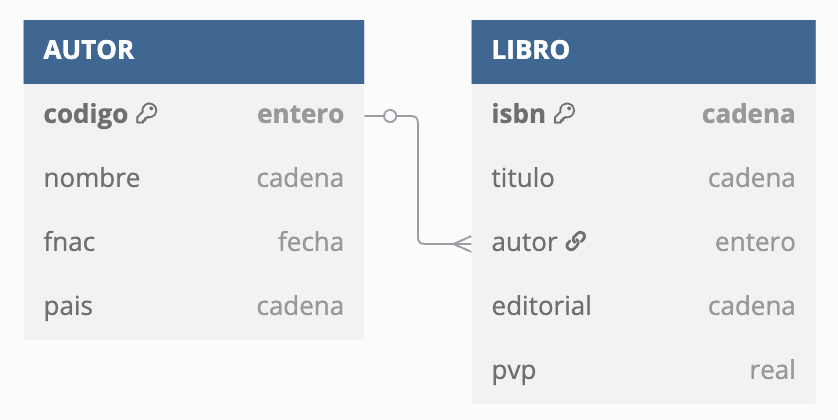

# **2.4. El modelo relacional**

!!! tip "Presentación Modelo Relacional"

    🔥 Fundamental ver: [Presentación en Genially del modelo relacional](https://view.genially.com/671f4aa89a3556cea96e8ac2/learning-experience-didactic-unit-modelo-relacional)

En la [unidad anterior](../02/2.1-ModeloER.md) estudiamos que un **modelo lógico** representa de forma conceptual la estructura de una base de datos, pero dependiendo del SGBD a utilizar.

<figure markdown="span">
  
  <figcaption>Modelo lógico</figcaption>
</figure>


Si nuestra elección es un SGBD relacional, el modelo por excelencia es el **modelo relacional**. Creado por _Codd_ a finales de los años 60, aunque los primeros SGBD relacionales no aparecieron hasta los 80. Una base de datos modelada mediante el modelo relacional se conoce como una base de datos relacional.

Supuso una revolución en el diseño lógico de las base de datos, dando lugar a la segunda generación de SGBD.

Es el modelo lógico más extendido, y _por ende_, el mercado de SGBD está copado de soluciones relacionales como _Oracle_, _PostgreSQL_, _MySQL_, _SQL Server_, etc...

Los objetivos del modelo relacional son:

- Independencia física
    - La forma de almacenar los datos no debe influir en su manipulación lógica
- Independencia lógica
    - Las aplicaciones que usan el SGBD no deben sufrir una modificación cuando se modifique una base de datos.
- Flexibilidad
    - Diferentes vistas para diferentes usuarios
- Uniformidad
- Sencillez


## 2.4.1 Elementos

El elemento principal es la **relación**, que consiste en una tabla que contiene filas y columnas. Una base de datos relacional consiste en un conjunto de tablas relacionadas donde cada tabla tiene un nombre único.

Las relaciones se conocen como tablas relacionales o más comúnmente como **tablas**.

Cada **columna** (también llamado **campo** o atributo de la relación) almacena información sobre una propiedad determinada de la tabla, como puede ser el nombre, DNI, apellidos o la edad.

Cada **fila** posee una ocurrencia o ejemplar de la instancia o relación representada por la tabla (a las filas se las llama también **tuplas** o **registros**).

<figure markdown="span">
  
  <figcaption>Elementos de una tabla</figcaption>
</figure>


Así pues, un ejemplo de una relación `CLIENTE` de grado 5 (`dni`, `nombre`, `direccion`, `fecha` y `genero`) con 3 tuplas sería:

| dni | nombre | dirección | fecha | genero |
| --- | --- | --- | --- | --- |
| 12345678A | Pedro Casas | Avenida de la libertad, 23 | 21/03/24 | M |
| 48123456B | Mireia Vidal | Porta de la Morera, 6 | 22/03/24 | F |
| 34123456C | Laura Meca | Plaça de Baix, s/n | 23/03/24 | F |

Como podemos observar, en la cabecera están los nombres de las columnas, y cada fila supone una nueva ocurrencia. Podemos referirnos al campo de una tabla mediante la notación **`TABLA.campo`**, por ejemplo, `CLIENTE.nombre` referencia el campo `nombre` de la tabla `CLIENTE`.

En una misma tabla, no podemos repetir el nombre de las columnas, aunque sí que lo podemos repetir en tablas diferentes. Por ejemplo, `CLIENTE.dni` y `PROVEEDOR.dni` serían campos de tablas diferentes con el mismo nombre.

Una restricción del modelo relacional es que dentro de una tabla no puede haber dos tuplas iguales, ya que implicaría el mismo dato dos veces. Además, todas las tuplas deben tener el mismo número de campos, aunque alguno esté vacío (se permiten campos con valores nulos).

!!! sa "El orden no importa"

    El orden de las tuplas no importa, ni tampoco el orden de los atributos.

    Dicho esto, esta sería otra representación de la misma tabla:

    | dni | dirección | genero | fecha | nombre |
    | --- | --- | --- | --- | --- |
    | 34123456C | Plaça de Baix, s/n | F | 23/03/24 | Laura Meca |
    | 48123456B | Porta de la Morera, 6 | F | 22/03/24 | Mireia Vidal |
    | 12345678A | Avenida de la libertad, 23 | M | 21/03/24 | Pedro Casas |


### Dominio

El dominio de un atributo indica el tipo de valores para un determinado campo. Dicho de otro modo, cada atributo sólo puede tomar un valor en el dominio en el que está inscrito.

Si nos basamos en el ejemplo anterior, tendríamos que los dominios serían:

- `dni`: 8 dígitos y una letra.
- `nombre`: cadena de hasta 32 caracteres.
- `dirección`: cadena de hasta 64 caracteres.
- `fecha`: fecha compuesta de `dd/mm/yy`.
- `genero`: caracteres `M`, `F` o `?`

Como cada atributo sólo puede tomar un valor para una misma tupla (los valores de los campos son atómicos), no podríamos poner dos DNIs o dos fechas a un mismo cliente.

A muy alto nivel, los tipos de datos básicos para los dominios son:

- Texto: cadena de caracteres, letras, símbolos o números con los que no se realizan operaciones (por ejemplo, un código postal).
- Numérico: números sobre los cuales se pueden realizar operaciones matemáticas.
- Fecha/hora: fechas, horas, o ambas.
- Booleano (V/F - Sí/No): datos con dos posibles valores.
- Autonumérico: secuencia (1,2,3,...) que el SGBD incrementa de forma automática cuando se añade un nuevo registro.

Tipos de dominio

Cuando estudiemos el modelo físico haremos más hincapié en todos los tipos de dominio existente. De momento, lo más importante es tener claro que todos los valores de un determinado campo en una tabla comparten el mismo dominio.

### Claves

Cada tabla tiene una columna (o en algunos casos un conjunto de columnas) que sirven como **clave primaria** (**PK** / _primary key_). Su propósito es distinguir a una tupla de otra dentro de la tabla.

Cada tabla debe tener una clave primaria, la cual es una columna (o conjunto de columnas) cuyo valor es único para cada fila.

Volvamos al ejemplo anterior sobre la tabla `CLIENTE`:

| dni | nombre | dirección | fecha | genero |
| --- | --- | --- | --- | --- |
| 12345678A | Pedro Casas | Avenida de la libertad, 23 | 21/03/24 | M |
| 48123456B | Mireia Vidal | Porta de la Morera, 6 | 22/03/24 | F |
| 34123456C | Laura Meca | Plaça de Baix, s/n | 23/03/24 | F |

El campo `dni` funciona como clave primaria de la tabla, ya que no hay dos clientes con el mismo DNI. Pero ¿y el campo `nombre`? Aunque en la tabla no tengamos ahora mismo dos clientes con el mismo nombre, conceptualmente sabemos que se puede dar el caso, y por lo tanto, no sería una elección correcta, ya que el nombre de un cliente no lo identifica de forma univoca.

#### Clave subrogada

Cuando en una tabla no tengamos una columna que identifique claramente a una tabla, podemos crear una nueva columna numérica, normalmente denominada `id`, que tomas valores secuenciales y autoincrementables, de manera que actúa como una clave sustituta independiente de los valores de negocio, que realmente no tiene un significado por sí misma.

Si añadimos una clave subrogada a la tabla `CLIENTE` tendríamos:

| id | dni | nombre | dirección | fecha | genero |
| --- | --- | --- | --- | --- | --- |
| 1 | 12345678A | Pedro Casas | Avenida de la libertad, 23 | 21/03/24 | M |
| 2 | 48123456B | Mireia Vidal | Porta de la Morera, 6 | 22/03/24 | F |
| 3 | 34123456C | Laura Meca | Plaça de Baix, s/n | 23/03/24 | F |

#### Claves candidatas

Si una tabla tiene más de un campo (o un conjunto de ellos) que pueden identificar unívocamente a cada tupla de la tabla, se dice que todas las claves posibles son **claves candidatas**.

De entre las claves candidatas, elegiremos una como la clave primaria y el resto serán **claves alternativas**. Así pues, una clave alternativa es una clave candidata que no es primaria.

Por ejemplo, si pensamos en la tabla `ESTUDIANTE` podemos definir los siguientes campos: `nif`, `codigo`, `nombre`, `fMatricula`, `direccion`. Las claves candidatas serían `ESTUDIANTE.codigo` y `ESTUDIANTE.nif`, ya que permiten identificar de forma unívoca a cada estudiante. Si nos decantamos por `ESTUDIANTE.codigo` como su clave primaria, entonces `ESTUDIANTE.nif` sería una clave alternativa.

| nif | codigo | nombre | fMatricula | direccion |
| --- | --- | --- | --- | --- |
| 12345678A | 1 | Pedro Casas | 1/9/24 | Avenida de la libertad, 23 |
| 48123456B | 2 | Mireia Vidal | 1/9/24 | Porta de la Morera, 6 |
| 34123456C | 3 | Laura Meca | 1/9/24 | Plaça de Baix, s/n |

#### Claves ajenas

Finalmente, tenemos las **claves ajenas** (**FK** / _foreign key_), los cuales son campos cuyos valores referencian a valores de otra tabla.

Dentro del modelo relacional, el hecho de relacionar los datos de una tabla con otra es crucial, y se realiza mediante las claves ajenas. Así pues, la clave ajena de una tabla referencia, normalmente, al valor de la clave primaria de otra tabla. Por ello, los dominios de la clave ajena y de la clave primaria referenciada deben ser iguales (un campo numérico no puede referenciar a un campo de texto).

Comencemos con el mismo ejemplo que vimos con las [relaciones 1:N](../02/2.1-ModeloER.html#relacion-1n) del modelo conceptual, donde teníamos que todo producto tiene una categoría, pero de una categoría, tenemos muchos productos, el cual representamos así:

Si lo representamos mediante tablas, podríamos tener la siguiente estructura:


<div class="grid cards" markdown>

  - `CATEGORIA`
    
    | codigo | nombre |
    | --- | --- |
    | 1 | Consola |
    | 2 | TIC |
    | 3 | Cocina |
    | 4 | Bricolaje |

  - `PRODUCTO`
    
    | codigo | nombre | codCategoria`*` |
    | --- | --- | --- |
    | 1 | PS5 | 1 |
    | 2 | Nevera | 3 |
    | 3 | Teclado | 2 |
    | 4 | XBOX | 1 |
    | 5 | Ratón | 2 |
    | 6 | Volante | `NULL` |

  - Representación de las ocurrencias
    
    { align="center"}  

  - Representación relacional
    
    ---
    
    


</div>


Puedes observar como hemos subrayado las claves primaria de cada tabla. ¿Qué atributo tiene la función de clave ajena? En este ejemplo, la columna `PRODUCTO.codCategoria` es una clave ajena que apunta a `CATEGORIA.codigo` (fíjate que en este caso, al atributo que es clave ajena le hemos puesto un asterisco `*` tras su nombre). Si revisamos los valores, podemos comprobar como podemos tener valores repetidos y valores nulos, facilitando que de una categoría tengamos varios productos (categorías de los productos `1` y `4`), que de una categoría no tengamos productos (la categoría `4` no está asociada a ningún producto) y, aunque el modelo conceptual no representaba dicha cardinalidad, que tengamos productos sin categoría (como el producto `6`).

Cuando tenemos dos tablas relacionadas mediante una clave ajena, mediante operaciones relacionales que veremos en la [Unidad 6](https://aitor-medrano.github.io/bd/06sql.html), podremos crear una nueva relación con el resultado de unir una clave ajena con los datos a los que referencia.

Así pues, al unir ambas tablas, obtendríamos como resultado:

| PRODUCTO.codigo | PRODUCTO.nombre | PRODUCTO.codCategoria | CATEGORIA.nombre |
| --- | --- | --- | --- |
| 1 | PS5 | 1 | Consola |
| 2 | Nevera | 3 | Cocina |
| 3 | Teclado | 2 | TIC |
| 4 | XBOX | 1 | Consola |
| 5 | Ratón | 2 | TIC |
| 6 | Volante | `NULL` | `NULL` |

---

Veamos otro ejemplo, donde tenemos dos tablas, una para estudiantes (igual que el ejemplo de las claves candidatas) y otra para almacenar qué cursos realizan los estudiantes, similares a las siguientes:

- `ESTUDIANTE`
    
    | nif | codigo | nombre | fMatricula | direccion |
    | --- | --- | --- | --- | --- |
    | 12345678A | 1 | Pedro Casas | 1/9/24 | Avenida de la libertad, 23 |
    | 48123456B | 2 | Mireia Vidal | 1/9/24 | Porta de la Morera, 6 |
    | 34123456C | 3 | Laura Meca | 1/9/24 | Plaça de Baix, s/n |
    
- `CURSAR`
    
    | nifEstudiante`*` | asignatura | anyo | repetidor |
    | --- | --- | --- | --- |
    | 12345678A | 1 | 2024 | true |
    | 48123456B | 1 | 2024 | false |
    | 12345678A | 2 | 2023 | false |
    

El campo `CURSAR.nifEstudiante` es una clave ajena de la relación `CURSAR` y enlaza con la relación `ESTUDIANTE` con el campo `ESTUDIANTE.nif`.

Visualmente, lo podemos representar mediante el siguiente gráfico:

<figure markdown="span">
  
  <figcaption>Clave ajena entre ESTUDIANTE y CURSAR</figcaption>
</figure>

Conviene aclarar que un campo puede ser clave primaria y clave ajena a la vez. Además, una tabla puede tener más de una clave ajena o no tener ninguna. Además, en el caso de las relaciones reflexivas, la clave ajena de la relación enlazará con la clave primaria de sí misma.

#### Borrado y actualización

Cuanto trabajamos con varias tablas relacionadas mediante claves ajenas y claves primarias, debemos definir las reglas y modificar la clave primaria a la que referencian.

Al actualizar/borrar un registro que contiene una clave ajena, se puede:

- **Rechazar**: no se permite el borrado/modificación
- **Propagar**: se borra/modifica el registro, y las tuplas que lo referencian
- **Anular**: se borra/modifica el registro y las tuplas que lo referencian ponen a nulo la clave ajena.

 
!!! question "Autoevaluación"

    Si volvemos a la relación entre `ESTUDIANTE` y `CURSAR`, ¿qué sucede cuando eliminamos el estudiante `12345678A`?

    - `ESTUDIANTE`
        
        | nif | codigo | nombre | fMatricula | direccion |
        | --- | --- | --- | --- | --- |
        | 12345678A | 1 | Pedro Casas | 1/9/24 | Avenida de la libertad, 23 |
        | 48123456B | 2 | Mireia Vidal | 1/9/24 | Porta de la Morera, 6 |
        
    - `CURSAR`
        
        | nifEstudiante`*` | asignatura | anyo | repetidor |
        | --- | --- | --- | --- |
        | 12345678A | 1 | 2024 | `true` |
        | 48123456B | 1 | 2024 | `false` |
        | 12345678A | 2 | 2023 | `false` |
    
 
 Profundizaremos en las operaciones entre claves ajenas y primarias cuando trabajemos las operaciones DML sobre el modelo físico en la _Unidad 3.- Lenguaje de definición de datos (DDL)_.

## 2.4.2Restricciones semánticas

A la hora de definir las propiedades de una tabla y sus columnas podemos emplear las siguientes restricciones:

- **clave primaria**: los atributos marcados como clave primaria no puedan repetir valores.
- **unicidad**: impide que los valores de los atributos marcados de esa forma puedan repetirse, considerándose unívocos. A nivel visual se marcan con `UK`. Vamos a considerar que un atributo `UK` no permite valores repetidos pero sí nulos (dependiendo del SGBD, en algunos casos se permiten y en otros no).
- **obligatoriedad** (`VNN`): prohíbe que el atributo marcado de esta forma no tenga ningún valor (valor no nulo).
- **regla de validación**: condición que debe de cumplir un dato concreto para que sea actualizado.

Además, podemos definir diferentes restricciones:

- a **nivel de fila**, por ejemplo, de relación entre columnas, del tipo la fecha de devolución debe ser posterior a la fecha de préstamo
- a **nivel de conjunto de filas**, por ejemplo, un cliente no puede hacer más de 20 pedidos en un día
- a **nivel de negocio**, del tipo, al insertar un pedido, se debe comprobar si la dirección de envío es la misma que la dirección del cliente, y en caso de no serlo, añadir una nueva dirección al cliente.

### Nulos

Los valores nulos (`NULL`) indican contenidos de atributos que no tienen ningún valor, bien porque la información es desconocida o no aplicable. Es decir, más que un valor, es la ausencia de información. Algunos SGBD muestran la palabra clave `NULL`, mientras que otros muestran el campo en blanco.

Por ejemplo, si en la tabla `ESTUDIANTE` tenemos un registro con la dirección nula, está indicando que desconocemos la dirección de `Mireia Vidal`, no que no tenga dirección.

| nif | codigo | nombre | fMatricula | direccion |
| --- | --- | --- | --- | --- |
| 12345678A | 1 | Pedro Casas | 1/9/24 | Avenida de la libertad, 23 |
| 48123456B | 2 | Mireia Vidal | 1/9/24 | `NULL` |
| 34123456C | 3 | Laura Meca | 1/9/24 | Plaça de Baix, s/n |

Si el campo es una clave ajena, indica que el registro actual no está relacionado con ninguno.

Las bases de datos relacionales admiten utilizar ese valor en todo tipo de operaciones.

En cuanto a los campos booleano (V/F), define un tercer valor en la lógica, ya que además del valor verdadero o falso, existe el valor para los nulos.

### Integridad de entidad

La integridad de entidad define que todas las claves primarias deben tener valor, y, por lo tanto, no admiten valores nulos.

Si volvemos a la tabla `ESTUDIANTE`, no podemos tener ningún estudiante con el NIF vacío.

Al definir un campo como `PK` ya estamos declarando que dicho campo no admite valores nulos (ni repetidos por el propio concepto de clave primaria).

### Integridad referencial

Si una relación R1 posee una clave ajena que la enlaza con la relación R2, entonces diremos que cumple la restricción de **integridad referencial** si todo valor de dicha clave ajena de R1 cumple una de las dos condiciones:

1. coincide con algún valor de la clave primaria en la relación R2
2. toma el valor nulo (`NULL`)

Es decir, prohíbe colocar valores en una clave ajena que no estén reflejados en la clave primaria de la tabla que relaciona.

Veamos un ejemplo que no cumple con la integridad referencial. Tengamos los siguientes datos, sabiendo que `CURSAR.nifEstudiante` es una clave ajena que apunta a `ESTUDIANTE.nif`:

- `ESTUDIANTE`
    
    | nif | codigo | nombre | fMatricula | direccion |
    | --- | --- | --- | --- | --- |
    | 12345678A | 1 | Pedro Casas | 1/9/24 | Avenida de la libertad, 23 |
    | 48123456B | 2 | Mireia Vidal | 1/9/24 | Porta de la Morera, 6 |
    | 34123456C | 3 | Laura Meca | 1/9/24 | Plaça de Baix, s/n |
    
- `CURSAR`
    
    | nifEstudiante`*` | asignatura | anyo | repetidor |
    | --- | --- | --- | --- |
    | 12345678A | 1 | 2024 | `true` |
    |  | 1 | 2024 | `false` |
    | 66666666Z | 2 | 2023 | `false` |
    

El primer fallo que encontramos es que el campo `CURSAR.nifEstudiante` contiene nulos. Aunque las claves ajenas permiten valores nulos, al tratarse también de una clave primaria, estaría incumpliendo la integridad de entidad.

El segundo error es que el valor `66666666Z` referencia a un estudiante invalido, y este valor sí que viola la integridad referencial, ya que dicho valor no existe en `ESTUDIANTE.nif`.

## 2.4.3 Notación

Para representar una tabla en el modelo relación usaremos una notación textual que facilita su comprensión y posterior transformación al modelo físico. A esta representación se le conoce como **esquema relacional** (o esquema lógico/canónico).

Pondremos el nombre de la tabla en mayúsculas, y a continuación, entre paréntesis, enumeraremos los campos mediante su nombre en minúsculas (y opcionalmente su dominio). Como convención, el primer atributo será aquel que hace la función de clave primaria, el cual además subrayaremos para facilitar la legibilidad, y a aquellos campos que sean claves ajenas les añadiremos un asterisco (`*`) para indicar su condición.

Tras el listado de campos, enumeraremos las restricciones, con el siguiente orden:

1. la clave primaria (`PK`), con el atributo o conjunto de atributos que identifican unívocamente a una tupla.
2. las claves ajenas (`FK`) (si las hubiera), indicando el nombre de la columna, una flecha, y la relación a la que referencia.
3. el resto de restricciones (`UK`, `VNN`, comprobaciones, etc...) (si las hubiera)

Más propiedades

Un campo puede tener opcionalmente las siguientes propiedades:

- Descripción: texto breve que aporta información sobre el contenido o la finalidad del campo.
- Tamaño: tamaño máximo permitido.
- Rango de valores posibles, a modo de enumeración.
- Requerido o `NOT NULL`: no permite valores nulos.
- Predeterminado (`DEFAULT`): valor por defecto para cuando no se inserta ningún valor.

Por ejemplo, un esquema lógico en modelo relacional que relaciona un libro con un autor, y un autor con muchos libros (relación 1:N) podría ser el siguiente:

`**AUTOR** (codigo: autonumérico, nombre: texto, fnac: fecha, nacionalidad: texto)`<br>
`· PK: (codigo)`

`**LIBRO** (isbn: texto, titulo: texto, descripcion: texto, autor*: numérico, editorial: texto, pvp: real)`<br>
`· PK: (isbn)`<br>
`· FK: (autor) → AUTOR`<br>

Por legibilidad, vamos a omitir los dominios y representar las tablas únicamente con el nombre de los campos, y posteriormente, en el diccionario de datos, definiremos sus tipos. De este modo, quedaría así:

`**AUTOR** (codigo, nombre, fnac, pais)`
`· PK: (codigo)`

`**LIBRO** (isbn, titulo, autor*, editorial, pvp)`
`· PK: (isbn)`   
`· FK: (autor) → AUTOR`

!!! fact "DBML - Database Markup Language"

    Tenemos que el autor se identifica por un código, el cual es su clave primaria. En cambio, los libros se identifican por su ISBN, y tienen un atributo `autor` que referencia a la clave primaria de `AUTOR` (y por tanto, deben tener el mismo dominio). De esta relación, deducimos que el nombre del atributo de la clave ajena no tiene por qué coincidir con el nombre de la clave primaria, pero sí su dominio.

    Si analizamos las cardinalidades de las tablas, tenemos:

    - `Card(LIBRO, ESCRIBIR) = (0, 1)`: Todo libro tiene un atributo autor, y sólo uno, el cual puede estar rellenado o no.
    - `Card(AUTOR, ESCRIBIR) = (0, N)`: Si un libro tiene un atributo autor, y el mismo autor puede aparecer en más de un libro, entonces un autor puede escribir muchos libros (o ninguno, si no aparece en ninguna ocurrencia de `LIBRO`).

    En la próxima unidad estudiaremos el proceso de transformación de un modelo conceptual a uno relacional, y en concreto, cómo se gestionan las claves ajenas para cumplir las cardinalidades y restricciones de las relaciones.
    
    
    La notación que vamos a emplear en clase es sencilla y cumple su propósito.

    Dicho esto, desde principio de 2020, gracias a la empresa https://dbdiagram.io/, se está popularizando [DBML](https://dbml.dbdiagram.io/home) como un lenguaje de marcado para representar bases de datos.

    Si quieres profundizar en su uso, es recomendable consultar su [sintaxis](https://dbml.dbdiagram.io/docs) o puedes probar a generar diagramas en [https://dbdiagram.io/](https://dbdiagram.io/).

    En nuestro caso, por ejemplo, podemos representa las entidades `AUTOR` y `LIBRO` del siguiente modo:

    ```
    Table AUTOR {
        codigo entero [primary key]
        nombre cadena
        fnac fecha
        pais cadena
    }

    Table LIBRO {
        isbn cadena [primary key]
        titulo cadena
        autor entero [ref: > AUTOR.codigo]
        editorial cadena
        pvp real
    }
    ```

    Obteniendo como resultado el diagrama:
    
    <figure markdown="span">
        
        <figcaption>Diagrama AUTOR-LIBRO</figcaption>
    </figure>
 
 
 
 Vamos a crear datos ficticios y comprobaremos si el modelo cumple la relación de uno a muchos:

- `AUTOR`
    
    | codigo | nombre | fnac | pais |
    | --- | --- | --- | --- |
    | 1 | Brandon Sanderson | 19/12/75 | USA |
    | 2 | Juan Gómez Jurado | 16/12/77 | España |
    | 3 | Jöel Dicker | 16/06/85 | Suiza |
    
- `LIBRO`
    
    | isbn | titulo | autor`*` | editorial | pvp |
    | --- | --- | --- | --- | --- |
    | 9788420476841 | Un animal salvaje | 3 | Alfaguara | 23,90 |
    | 9788420414065 | La verdad sobre el caso Harry Quebert | 3 | Alfaguara | 23,90 |
    | 9788491221722 | Lazarillo de Tormes | `NULL` | Santillana | 14,20 |
    | 9788419260444 | Nacidos de la bruma | 1 | Nova | 24,90 |
    

Así pues, comprobamos que tenemos un autor (el `3` con dos libros), e incluso un libro sin autor, confirmando la relación 1:N conforme queríamos diseñar.

**Cardinalidad de las relaciones**

Con lo que sabemos hasta ahora, piensa:

- ¿Cómo evitamos que la cardinalidad mínima sea 0 entre LIBRO y AUTOR, es decir, que `Card(LIBRO, ESCRIBIR) = (1,1)`, de manera que cada libro lo escriba siempre un autor, no permitiendo valores nulos en la clave ajena?
- ¿Cómo cambiamos la relación de 1:N a una relación 1:1, para que cada autor solo pudiera escribir un libro?

### Representación gráfica

Aunque ya hemos visto que podemos emplear [DBDiagrams](https://dbdiagram.io/) para generar un diagrama a partir del esquema lógico mediante [DBML](https://dbml.dbdiagram.io/docs), también podemos emplear diversas herramientas existentes en el mercado, como [ERDPlus](https://erdplus.com/) o [MySQLWorbench](https://www.mysql.com/products/workbench/) (más cercano al modelo físico), que permiten dibujar los elementos.

En nuestro caso, nos vamos a centrar en DBDiagrams, principalmente por ser una herramienta online y que actualmente el lenguaje [DBML (Database Markup Language)](https://dbml.dbdiagram.io/home/) se está instaurando como el lenguaje de referencia para esta función.
 
 
### Diccionario de datos

El diccionario de datos de un modelo relacional es un repositorio central que almacena metadatos sobre los elementos de una base de datos.

En un sistema de bases de datos relacional, el diccionario de datos incluye detalles sobre las estructuras de las tablas, las relaciones entre las tablas, las columnas, los índices, las restricciones, los procedimientos almacenados y otros objetos de la base de datos. Es esencialmente un _catálogo_ que describe la estructura lógica y la organización de la base de datos.

Las funciones del diccionario de datos son:

- **Documentación**: Sirve como referencia para desarrolladores y administradores de bases de datos, ayudándoles a entender la estructura y organización de la base de datos.
    
- **Control de integridad**: Ayuda a asegurar que las definiciones de las tablas y relaciones se mantengan coherentes y conformes a las reglas establecidas.
    

#### Componentes

1. **Tablas y columnas**: Describe las tablas en la base de datos, los nombres de las columnas, tipos de datos (los diferentes [tipos de datos](#todo) los estudiaremos en detalle en la _unidad 3_, tamaños y si permiten valores nulos.
    
2. **Relaciones y claves**: Define las relaciones entre tablas y especifica las claves primarias y ajenas.
    
3. **Restricciones**: Incluye detalles sobre restricciones como `UNIQUE`, `CHECK`, `NOT NULL`, y `DEFAULT`.
    

Si nos centramos en los modelos físicos, podríamos incluir otros componentes como índices, vistas, procedimientos almacenados y funciones o _triggers_, así como usuarios y permisos.

#### Ejemplo

Para este ejemplo, nos vamos a basar en el mismo ejemplo que hemos utilizado en el apartado de [Notación](#notación), donde un `AUTOR` escribe muchos `LIBRO`, pero un `LIBRO` sólo lo escribe un `AUTOR`.

Para documentar el diccionario de datos, se utiliza una estructura de tabla con el nombre de la columna, el tipo de datos y una descripción del campo:

- Tabla `AUTOR`
    
    | **Columna** | **Tipo de Datos** | **Descripción** |
    | --- | --- | --- |
    | `codigo` | `INT` | Clave primaria. Identificador único del autor. |
    | `nombre` | `VARCHAR(64)` | Nombre del autor. |
    | `fnac` | `DATE` | Fecha de nacimiento del autor. |
    | `pais` | `VARCHAR(32)` | País de nacimiento del autor. |
    
- Tabla `LIBRO`
    
    | **Columna** | **Tipo de Datos** | **Descripción** |
    | --- | --- | --- |
    | `isbn` | `INT` | Clave primaria. Identificador único del libro. |
    | `titulo` | `VARCHAR(64)` | Título del libro. |
    | `autor` | `INT` | Clave foránea que referencia a `AUTOR.codigo`. Indica el autor del libro. |
    | `editorial` | `VARCHAR(32)` | Editorial que publica el libro. |
    | `pvp` | `DECIMAL(10,2)` | Precio de venta al público del libro. |
    

A continuación, indicamos las relaciones y restricciones

- **Clave primaria en `AUTOR`**: `codigo`
- **Clave primaria en `LIBRO`**: `isbn`
- **Clave ajena en `LIBRO`**: `autor` referencia a `codigo` en la tabla `AUTOR`, indicando la relación entre un libro y su autor.
    - Restricción de borrado: rechazar.
    - Restricción de modificación: propagar.
 
---

## 2.4.4 Normalización

Un principio del diseño relacional es que "_hechos distintos se deben almacenar en objetos distintos_".

Para conseguir este objetivo, la **normalización** es una técnica dentro del diseño de bases de datos relacionales que consiste en la separación de atributos en tablas lo más simples posibles para **suprimir dependencias erróneas entre atributos, reducir la redundancia así como optimizar los procesos de inserción, modificación y borrado en la bases de datos**, evitando las anomalías previamente comentadas, lo que maximiza la integridad de los datos y su consistencia.

Podemos simplificar el objetivo de la normalización en **maximizar la integridad de los datos, reduciendo su redundancia**.

Para conseguirlo, se basa en el análisis de dependencias entre atributos mediante un proceso que consiste en identificar y aplicar una serie de reglas a las relaciones obtenidas del esquema relacional.
 
 
!!! abstract "Supuesto Comerciales"

    Supongamos los siguientes datos sobre ventas que realizan una serie de comerciales de los cuales tenemos su código y nombre, su estado laboral (con un código y una descripción), la ciudad y la provincia donde realizan las ventas, así como las poblaciones de dichas ciudades y provincias.

    | comercialID | comercialNom | estadoID | estadoDesc | ciudad | provincia | ciudadPob | provinciaPob | ventas |
    | --- | --- | --- | --- | --- | --- | --- | --- | --- |
    | C1 | Carlos Suarez | JC | Jornada Completa | Elche | Alicante | 230.000 | 1.800.000 | 33 |
    | C1 | Carlos Suarez | JC | Jornada Completa | Denia | Alicante | 42.000 | 1.800.000 | 22 |
    | C2 | Manoli Campos | JC | Jornada Completa | Elche | Alicante | 230.000 | 1.800.000 | 55 |
    | C2 | Manoli Campos | JC | Jornada Completa | Aspe | Alicante | 22.000 | 1.800.000 | 44 |
    | C3 | Carlos Suarez | JPM | Jornada Partida Mañanas | Cartagena | Murcia | 218.000 | 1.520.000 | 17 |
    | C4 | Sonia Sánchez | JPT | Jornada Partida Tardes | Gandía | Valencia | 73.000 | 2.550.000 | 27 |
    | C5 | Marina Vidal | JC | Jornada Completa | Valencia | Valencia | 807.000 | 1.800.000 | 37 |
    | C6 | Michael Johnson | JC | Jornada Completa | Valencia | California | 63.000 | 38.940.000 | 47 |

    Claramente, tenemos datos redundantes. Si reorganizamos los datos de otra manera podríamos evitar dependencias.

### Anomalías

Una **anomalía** se refiere a una inconsistencia o problema que puede surgir en una base de datos, especialmente cuando no está normalizada. Estas anomalías pueden manifestarse de diversas maneras, afectando la integridad y consistencia de la información almacenada.

Los tipos de anomalías en bases de datos son:

- **anomalías de actualización**: ocurren cuando se intenta actualizar un registro en múltiples ubicaciones y no todas las copias se actualizan correctamente, generando discrepancias en los datos.
- **anomalías de inserción**: surgen cuando no se puede insertar un nuevo registro en una tabla sin introducir datos redundantes o violar ciertas restricciones. Por ejemplo, si tenemos una tabla que almacena información de estudiantes y cursos, si no hay una clave principal que identifique de forma única cada registro, se podrían generar anomalías al intentar insertar nueva información.
- **anomalías de eliminación**: se producen cuando se elimina información importante al intentar eliminar un registro específico, lo que puede llevar a la pérdida de datos. Siguiendo con el ejemplo anterior, si se elimina un registro de estudiante y este registro también contiene información sobre un curso, podría perderse la información del curso si no se toman precauciones.

Para *solucionar* las anomalías, debemos **normalizar las tablas**.

### Dependencias funcionales

Antes de entrar a conocer los pasos de la normalización, previamente tenemos que definir una serie de conceptos:

- **Dependencia funcional** (DF): es la relación semántica existente entre atributos de una misma tabla. Decimos que **A → B**, es decir, que **B depende funcionalmente de A** (o A determina a B), si y solo si para cada valor de A sólo puede existir un B.
    
    El sentido de la relación no es bidireccional. Que para una valor de A sólo exista un B, no significa que dado B, siempre obtengamos A. Por ejemplo, la dependencia `dni → nombre, apellidos` es correcta, ya que tanto el nombre de una persona como sus apellidos dependen funcionalmente de su DNI, pero no al revés. ¿Dado un nombre de una persona, podemos saber su DNI?


!!! abstract "DF - Supuesto Comerciales"

    > El primer paso es para cada columna, identificar las dependencias que hay entre los atributos.

    Por ejemplo, cogemos el nombre del comercial, y detectamos que dependen funcionalmente del identificador del comercial, por lo tanto: `comercialID → comercialNom`. Pero si nos fijamos bien en los nombres de los comerciales, no podemos decir lo mismo en el sentido contrario, ya que tenemos un nombre repetido en diferentes códigos de comercial (¡qué casualidad!), con lo que no es correcto decir `comercialNom → comercialID`.

    Si hacemos lo mismo con el identificador del estado del comercial, deducimos que depende también del identificador, obteniendo `comercialID → estadoID`.

    Y lo mismo con la descripción del estado. En este caso, se cumplen que tanto el identificador del comercial como el identificador del estado permiten obtener la descripción del estado, obteniendo `comercialID → estadoDesc` y `estadoID → estadoDesc`.

    Si continuamos con todos los atributos y agrupamos las dependencias funcionales tenemos:

    - `comercialID → comercialNom, estadoID, estadoDesc`
    - `estadoID → estadoDesc`
    - `estadoDesc → estadoID`
    - `provincia → provinciaPob`
    - `ciudad, provincia → ciudadPob`, por ejemplo, tenemos dos ciudades `Valencia` en provincias diferentes
    - `comercialID , ciudad, provincia → ventas`

    Tal como hemos comentado previamente, cuando agrupamos los atributos, la dependencia `comercialID → comercialNom, estadoID, estadoDesc` significa que tanto el nombre del comercial, como el código de su estado y el estado dependen del identificador del comercial.

- **Dependencia funcional completa** (DFC): cuando tenemos que _A1, A2, ...AN → B_ (B tiene una dependencia funcional del conjunto A1, A2, ...AN), pero no de ninguno de sus subconjuntos.
    
    Es decir, B depende de la combinación completa de atributos, y no de un parte de la clave.
    
    DFC - Supuesto Comerciales
    
    Tenemos que las ventas dependen de la combinación `comercialID, ciudad, provincia` y no de un subconjunto de ellas, es decir, `comercialID, ciudad, provincia → ventas`.
    
- **Dependencia funcional transitiva** (DFT): se dice que hay un DFT entre A y C, si A → B y B → C, siendo B y C columnas no claves. Dicho de otro modo, cuando tenemos columnas no claves que determinan otras columnas no clave.
    
    DFT - Supuesto Comerciales
    
    Tenemos que `comercialID → comercialNom, estadoID, estadoDesc` y que `estadoID → estadoDesc`, por lo que tenemos una dependencia transitiva de `comercialID` a `estadoDesc`, ya que `comercialID → estadoID → estadoDesc`.


??? example "Ejemplos de dependencias funcionales"

    <u>Ejemplo 1: El Gimnasio del Barrio - Entendiendo la **Dependencia Funcional**</u>

    En el gimnasio "Siempre en Forma", tienen una hoja de cálculo para registrar a sus miembros. Es muy sencilla.

    **Tabla: `MIEMBROS_GIMNASIO`**

    | ID_Socio | Nombre | Apellido | Fecha_Nacimiento | Tipo_Suscripcion |
    | :--- | :--- | :--- | :--- | :--- |
    | SOC-001 | Elena | Ramírez | 1995-03-15 | Mensual |
    | SOC-002 | Marcos | Vidal | 1988-11-20 | Anual |
    | SOC-003 | Carla | Soler | 2001-07-30 | Mensual |

    Aquí, el `ID_Socio` es único para cada persona. Pensemos como la base de datos:

    *   **Si te doy `SOC-001`, ¿puedes decirme el nombre?** Sí, es Elena. No hay duda.
        *   `ID_Socio -> Nombre`
    *   **Si te doy `SOC-001`, ¿puedes decirme la `Fecha_Nacimiento`?** Sí, 1995-03-15.
        *   `ID_Socio -> Fecha_Nacimiento`
    *   **Pero, si te digo que busques a la persona con suscripción "Mensual", ¿puedes darme un `ID_Socio` único?** No, porque tanto Elena como Carla tienen esa suscripción. Por lo tanto, `Tipo_Suscripcion` no determina el `ID_Socio`.

    **Conclusión del ejemplo:** La Dependencia Funcional es una regla de negocio que dice: "Este valor (o conjunto de valores) me sirve como una 'llave' para encontrar exactamente un solo valor de este otro campo". Aquí, `ID_Socio` es la llave para todos los demás datos del miembro.

    ---

    <u>Ejemplo 2: La Pizzería "Mamma Mia" - Descubriendo la **Dependencia Funcional Completa vs. Parcial**</u>

    La pizzería quiere registrar qué ingredientes extra añade cada cliente a sus pizzas en cada pedido. Su tabla inicial es un desastre.

    **Tabla: `EXTRAS_PEDIDO`**

    | Nro_Pedido| Pizza_ID | Nombre_Pizza | Ingrediente_Extra | Precio_Extra |
    | :--- | :--- | :--- | :--- | :--- |
    | 1001 | P01 | Margarita | Champiñones | 1.50 |
    | 1001 | P01 | Margarita | Aceitunas | 1.00 |
    | 1001 | P02 | Barbacoa | Doble Queso | 2.00 |
    | 1002 | P01 | Margarita | Champiñones | 1.50 |

    La clave para identificar una línea de forma única es la combinación de `{Nro_Pedido, Pizza_ID, Ingrediente_Extra}`. ¡Una clave de tres columnas!

    Ahora, analicemos qué depende de qué:

    1.  **Dependencia del `Precio_Extra`**: ¿Cuánto cuesta el extra "Champiñones"? Cuesta 1.50. ¿Necesito saber el número de pedido para saber eso? No. ¿Necesito saber el tipo de pizza? No. El precio del extra solo depende del ingrediente en sí.
        *   `Ingrediente_Extra -> Precio_Extra`
        Esta es una **dependencia parcial**, porque `Precio_Extra` depende de `Ingrediente_Extra`, que es solo un trocito de nuestra larga clave primaria.

    2.  **Dependencia del `Nombre_Pizza`**: Para saber que la "P01" es una "Margarita", ¿necesito el número de pedido o el ingrediente? No, solo necesito el `Pizza_ID`.
        *   `Pizza_ID -> Nombre_Pizza`
        Esta es otra **dependencia parcial**. `Nombre_Pizza` depende de `Pizza_ID`, que es otra parte de la clave.

    **¿Existe alguna dependencia completa aquí?** En esta tabla, tal como está diseñada, no hay ningún atributo que necesite las tres partes de la clave para ser determinado. Esto nos indica que el diseño es muy deficiente y necesita ser descompuesto. Por ejemplo, si añadiéramos un campo `Comentario_Cliente` ("sin cortar"), ese campo sí podría depender de la clave completa: `{Nro_Pedido, Pizza_ID, Ingrediente_Extra} -> Comentario_Cliente`, porque el comentario es específico para un ingrediente en una pizza de un pedido concreto.

    **Conclusión del ejemplo:** Una dependencia es completa solo si necesita **todos** los componentes de la clave compuesta para funcionar. Si le sobra aunque sea uno, es parcial. Las dependencias parciales son una señal de alarma que nos grita: "¡Divide esta tabla!".

    ---

    <u>Ejemplo 3: La Academia de Idiomas - Identificando la **Dependencia Funcional Transitiva**</u>

    La academia "Polyglot" registra los cursos en los que se matriculan sus estudiantes.

    **Tabla: `MATRICULAS`**

    | ID_Matricula | ID_Estudiante| Nombre_Estudiante | ID_Curso | Nivel_Curso | ID_Profesor | Nombre_Profesor |
    | :--- | :--- | :--- | :--- | :--- | :--- | :--- |
    | MAT-01 | EST-12 | Ana Sanz | ING-B1 | Intermedio | PROF-J | John Smith |
    | MAT-02 | EST-15 | Luis Prado | FRA-A2 | Básico | PROF-S | Sophie Dubois |
    | MAT-03 | EST-12 | Ana Sanz | FRA-A2 | Básico | PROF-S | Sophie Dubois |

    La clave primaria que identifica cada acto de matriculación es `ID_Matricula`.

    Vamos a seguir la cadena de dependencias:

    1.  `ID_Matricula` determina el estudiante (`ID_Estudiante`) y el curso (`ID_Curso`). ¡Correcto!
        *   `ID_Matricula -> ID_Estudiante`
        *   `ID_Matricula -> ID_Curso`

    2.  Ahora bien, `Nombre_Estudiante` no depende directamente de la matrícula, sino del estudiante.
        *   `ID_Estudiante -> Nombre_Estudiante`

    3.  Y aquí viene lo interesante. El profesor asignado (`ID_Profesor` y `Nombre_Profesor`) no depende de la matrícula en sí, sino del curso impartido. Cada curso tiene un profesor asignado.
        *   `ID_Curso -> ID_Profesor`
        *   `ID_Profesor -> Nombre_Profesor`

    ¡Hemos encontrado la transitividad!

    *   `ID_Matricula` (la clave) -> `ID_Curso` (atributo no clave)
    *   `ID_Curso` (atributo no clave) -> `Nombre_Profesor` (atributo no clave)

    El `Nombre_Profesor` depende de la `ID_Matricula`, pero de forma **indirecta**, a través del `ID_Curso`. Esto es una **dependencia transitiva**.

    **¿Cuál es el peligro?** Si la profesora Sophie Dubois se va de la academia y es reemplazada por "Pierre Martin" en el curso FRA-A2, tendríamos que buscar todas las matrículas de ese curso (la de Luis, la de Ana y la de cualquier otro alumno) para actualizar el nombre del profesor. Si nos dejamos una sola fila sin actualizar, tendremos datos inconsistentes.

    **Conclusión del ejemplo:** La dependencia transitiva es como un "amigo de un amigo". Un atributo no clave no debería darnos información sobre otro atributo no clave. Cada concepto (estudiantes, cursos, profesores) debería tener su propia tabla para evitar estas peligrosas dependencias en cadena.

    _El objetivo final de identificar estas dependencias es guiarnos para crear un diseño de base de datos normalizado, donde cada pieza de información esté en su lugar lógico y solo en uno._


### Formas Normales

{ width="40%" align="right" }

La normalización consiste en una serie de pasos, cada uno de los cuales se corresponde a una forma normal (FN). Conforme se va avanzando en la normalización, las tablas tienen una estructura más limpia y con menor redundancia.

_Codd_ propuso en 1972 tres formas normales, a las que se sumó la forma normal de _Boyce-Codd_ en 1974, y luego se añadieron dos más por parte de _Fagin_ entre 1977 y 1979. En este curso, nos vamos a centrar en las tres primeras, que cubren la mayoría de casos con los que nos vamos a encontrar, ya que se considera que una base de datos que está en 3FN es una base de datos correctamente diseñada

Todas las formas normales se construyen sobre una forma normal previa, de forma que se anidan unas dentro de otras:

- **1FN**: Una relación está en primera forma normal si, y sólo si, todos sus dominios contienen valores atómicos. Supone la eliminación de todos los campos multivaluados.
    
    Por lo general, si tenemos una tabla de un modelo relacional, por las propias restricciones semánticas del modelo relacional, no deberíamos tener ningún campo con varios valores, ya que deberían haberse transformado en relaciones 1:N.
    
    1FN - Supuesto Comerciales
    
    Como ninguna columna tiene más de un valor, la tabla ya está en 1FN.

    !!! abstract "1FN - Supuesto Comerciales"

        Como ninguna columna tiene más de un valor, la tabla ya está en 1FN.
    
- **2FN**: una relación está en segunda forma normal si está en 1FN y todas las columnas que no son clave tienen un DFC de la clave primaria.
    
    Para ello, descompondremos la tabla en varias subtablas, y comprobaremos que ningún subconjunto de los atributos no clave determinan campos no principales.
    
    Si todas las claves candidatas de las tablas en 1FN son simples (unitarias), automáticamente las tablas ya están en 2FN. En cambio, si la clave primaria es compuesta, deberemos comprobar que todos los atributos dependen de la clave primaria compuesta y no de un subconjunto de esta.

    ??? abstract "2FN - Supuesto Comerciales"

        Si revisamos las dependencia funcionales, hemos de comprobar que todos los atributos no clave dependan de toda la clave primaria. Para ello, necesitamos crear al menos tres tablas:

        `**COMERCIAL** (comercialID, comercialNom, estadoID, estadoDesc)`<br>
        `· PK: (codigo)`<br><br>

        `**CIUDAD** (ciudad, provincia, ciudadPob, provinciaPob)`<br><br>
        `· PK: (ciudad)`

        `**REGISTRO** (comercialID*, ciudad*, provincia*, ventas)`
        `· PK: (comercialID, ciudad, provincia)   · FK: (comercialID) → COMERCIAL   · FK: (ciudad, provincia) → CIUDAD`<br><br>

        Dando como resultado las siguientes tablas con datos:

        - `COMERCIAL`
            
            | comercialID | comercialNom | estadoID | estadoDesc |
            | --- | --- | --- | --- |
            | C1 | Carlos Suarez | JC | Jornada Completa |
            | C2 | Manoli Campos | JC | Jornada Completa |
            | C3 | Carlos Suarez | JPM | Jornada Partida Mañanas |
            | C4 | Sonia Sánchez | JPT | Jornada Partida Tardes |
            | C5 | Marina Vidal | JC | Jornada Completa |
            | C6 | Michael Johnson | JC | Jornada Completa |
            
        - `CIUDAD`
            
            | ciudad | provincia | ciudadPob | provinciaPob |
            | --- | --- | --- | --- |
            | Elche | Alicante | 230.000 | 1.800.000 |
            | Denia | Alicante | 42.000 | 1.800.000 |
            | Aspe | Alicante | 22.000 | 1.800.000 |
            | Cartagena | Murcia | 218.000 | 1.520.000 |
            | Gandía | Valencia | 73.000 | 2.550.000 |
            | Valencia | Valencia | 807.000 | 1.800.000 |
            | Valencia | California | 63.000 | 38.940.000 |
            
        - `REGISTRO`
            
            | comercialID`*` | ciudad`*` | provincia`*` | ventas |
            | --- | --- | --- | --- |
            | C1 | Elche | Alicante | 33 |
            | C1 | Denia | Alicante | 22 |
            | C2 | Elche | Alicante | 55 |
            | C2 | Aspe | Alicante | 44 |
            | C3 | Cartagena | Murcia | 17 |
            | C4 | Gandía | Valencia | 27 |
            | C5 | Valencia | Valencia | 37 |
            | C6 | Valencia | California | 47 |

- **3FN**: 2FN + todo atributo que no es clave primaria no tiene una dependencia funcional transitiva de otro atributo no clave, es decir, depende únicamente de la clave primaria de modo no transitivo.

    ??? abstract "3FN - Supuesto Comerciales"

        Ahora revisamos que no haya atributos que dependan de forma transitiva de la clave primaria. Tanto `COMERCIAL.estadoDesc` como `CIUDAD.provinciaPob` dependen de forma transitiva de un atributo no que es clave en sus tablas (`COMERCIAL.estadoID` y `CIUDAD.provincia`, respectivamente). Es decir, tenemos las DFT `comercialID → estadoID → estadoDesc` y `ciudad → provincia → provinciaPob`.

        Así pues, para deshacer las dependencias funcionales transitivas dividimos las tablas `COMERCIAL` y `CIUDAD` en dos nuevas tablas (`ESTADO`y `PROVINCIA`):

        `**ESTADO** (estadoID, estadoDesc)`<br>
        `· PK: (codigo)`

        `**COMERCIAL** (comercialID, comercialNom, estadoID*)`<br>
        `· PK: (codigo)   · FK: (estadoID) → ESTADO`
        <br>
        `**PROVINCIA** (provincia, provinciaPob)`<br>
        `· PK: (provincia)`

        `**CIUDAD** (ciudad, provincia*, ciudadPob)`<br>
        `· PK: (ciudad)   · FK: (provincia) → PROVINCIA`<br>

        `**REGISTRO** (comercialID*, ciudad*, provincia*, ventas)`<br>
        `· PK: (comercialID, ciudad, provincia)`<br>
        `· FK: (comercialID) → COMERCIAL`<br>
        `· FK: (ciudad, provincia) → CIUDAD`<br>

        Dando como resultado las siguientes tablas con datos:

        <div class="grid cards" markdown>

        - `ESTADO`
            
            | estadoID | estadoDesc |
            | --- | --- |
            | JC | Jornada Completa |
            | JPM | Jornada Partida Mañanas |
            | JPT | Jornada Partida Tardes |
            
        - `COMERCIAL`
            
            | comercialID | comercialNom | estadoID`*` |
            | --- | --- | --- |
            | C1 | Carlos Suarez | JC |
            | C2 | Manoli Campos | JC |
            | C3 | Carlos Suarez | JPM |
            | C4 | Sonia Sánchez | JPT |
            | C5 | Marina Vidal | JC |
            | C6 | Michael Johnson | JC |
            
        - `PROVINCIA`
            
            | provincia | provinciaPob |
            | --- | --- |
            | Alicante | 1.800.000 |
            | Murcia | 1.520.000 |
            | Valencia | 2.550.000 |
            | California | 38.940.000 |
            
        - `CIUDAD`
            
            | ciudad | provincia`*` | ciudadPob |
            | --- | --- | --- |
            | Elche | Alicante | 230.000 |
            | Denia | Alicante | 42.000 |
            | Aspe | Alicante | 22.000 |
            | Cartagena | Murcia | 218.000 |
            | Gandía | Valencia | 73.000 |
            | Valencia | Valencia | 807.000 |
            | Valencia | California | 63.000 |
            
        - `REGISTRO`
            
            | comercialID`*` | ciudad`*` | provincia`*` | ventas |
            | --- | --- | --- | --- |
            | C1 | Elche | Alicante | 33 |
            | C1 | Denia | Alicante | 22 |
            | C2 | Elche | Alicante | 55 |
            | C2 | Aspe | Alicante | 44 |
            | C3 | Cartagena | Murcia | 17 |
            | C4 | Gandía | Valencia | 27 |
            | C5 | Valencia | Valencia | 37 |
            | C6 | Valencia | California | 47 |


        </div>

    El problema de la 3FN es que no maneja relaciones que:

    - Tienen varias claves candidatas,
    - Esas claves candidatas son compuestas, y
    - Las claves candidatas tienen por lo menos un atributo en común.
    <br><br>

- **FNBC**: Es una mejora de la 3FN donde, si tenemos más de una clave candidata y estas son compuestas y comparten algún atributo entonces, ningún atributo, sea clave o no, puede depender de algo que no sea la clave primaria.

    Si la clave no es compuesta y no existe más de una clave candidata (sólo tenemos la clave primaria), la FNBC es equivalente a la 3FN.

    El objetivo de la FNBC es asegurar que cada dato de una tabla depende únicamente de una clave real y completa, y no de otra cosa.

    ??? abstract "FNBC - Supuesto Comerciales"

        En nuestro caso, no tenemos más de una clave candidata, por lo que la FNBC es equivalente a la 3FN.


!!! tip "En resumen"

    En la práctica, cuando todas las tablas están en FNBC, se puede considerar que la base de datos está totalmente normalizada. Una tabla en FNBC ya está desde 1FN hasta 3FN y tiene las siguientes características:

    - Tiene una clave primaria.
    - No tiene columnas multivaluadas.
    - Todas las columnas dependen de una clave pero nada más.
    - No contiene ninguna dependencia transitiva.

    <figure markdown="span">
        
        <figcaption>Proceso de normalización</figcaption>
    </figure>


### Ejemplo Paso a Paso


??? example "Ejemplo 1: Paso a paso. Consultora de software"

    Una pequeña consultora de software, "Código Veloz", registra los datos de los proyectos en una única tabla. Vuestro objetivo es sanear y normalizar esta tabla para evitar problemas de redundancia e inconsistencia.

    **Normalización de una Tabla de Proyectos**

    Una pequeña consultora de software, "Código Veloz", registra los datos de los proyectos en una única tabla. Vuestro objetivo es sanear y normalizar esta tabla para evitar problemas de redundancia e inconsistencia.

    <u>La Tabla Inicial: `PROYECTOS_DESORDENADOS`</u>

    | ID\_Proyecto| Nombre\_Proyecto| ID\_Empleado | Nombre\_Empleado| Horas\_Trabajadas| ID\_Departamento| Jefe\_Departamento| Salario\_Base\_Empleado |
    | :--- | :--- | :--- | :--- | :--- | :--- | :--- | :--- |
    | P100 | App Móvil | E01 | Juan Pérez | 100 | D01 | Ana Torres | 40.000 |
    | P100 | App Móvil | E02 | María Sol | 80 | D01 | Ana Torres | 55.000 |
    | P200 | Web Cliente | E01 | Juan Pérez | 120 | D01 | Ana Torres | 40.000 |
    | P300 | Sistema IA | E03 | Luis Rey | 90 | D02 | Pedro Soto | 60.000 |

    <u>Paso 0: Identificación de Dependencias y Clave</u>

    Antes de empezar, asumimos que esta tabla ya está en **Primera Forma Normal (1FN)**, pues no hay grupos repetitivos ni atributos multivaluados (cada celda contiene un solo valor atómico).

    1.  **Clave Primaria (CP):** Para identificar de forma única cada fila (es decir, las horas que *un* empleado dedicó a *un* proyecto), necesitamos la combinación: `{ID_Proyecto, ID_Empleado}`.

    2.  **Dependencias Funcionales (DFs) Observadas:**
        *   `ID_Proyecto -> Nombre_Proyecto` (El ID del proyecto determina su nombre).
        *   `ID_Empleado -> Nombre_Empleado, ID_Departamento, Salario_Base_Empleado` (El ID del empleado determina sus datos personales y salariales).
        *   `ID_Departamento -> Jefe_Departamento` (El departamento determina quién es su jefe).

    ---

    <u>Paso 1: De 1FN a 2FN (Eliminar Dependencias Parciales)</u>

    **REGLA DE LA 2FN:** Todos los atributos no clave deben ser completamente dependientes de **toda** la Clave Primaria.

    *Identificando las dependencias parciales:*

    1.  `ID_Proyecto -> Nombre_Proyecto`: El nombre del proyecto depende solo de `ID_Proyecto` (una parte de la clave). **Dependencia Parcial.**
    2.  `ID_Empleado -> Nombre_Empleado, ID_Departamento, Salario_Base_Empleado`: Los datos del empleado dependen solo de `ID_Empleado` (otra parte de la clave). **Dependencia Parcial.**

    *Acción: Descomponer la tabla para eliminar las dependencias parciales.*

    **Tabla 1.1: `ASIGNACION_PROYECTO`** (Retiene la clave primaria original y los atributos que dependen de ella de forma COMPLETA).
    *   **DF Remanente:** `{ID_Proyecto, ID_Empleado} -> Horas_Trabajadas`
    *   **CP:** `{ID_Proyecto, ID_Empleado}`

    | ID\_Proyecto| ID\_Empleado| Horas\_Trabajadas |
    | :--- | :--- | :--- |
    | P100 | E01 | 100 |
    | P100 | E02 | 80 |
    | P200 | E01 | 120 |
    | P300 | E03 | 90 |

    **Tabla 1.2: `PROYECTOS`** (Extrae la información que solo depende de `ID_Proyecto`).
    *   **DF Remanente:** `ID_Proyecto -> Nombre_Proyecto`
    *   **CP:** `{ID_Proyecto}`

    | ID\_Proyecto| Nombre\_Proyecto |
    | :--- | :--- |
    | P100 | App Móvil |
    | P200 | Web Cliente |
    | P300 | Sistema IA |

    **Tabla 1.3: `EMPLEADOS`** (Extrae la información que solo depende de `ID_Empleado`).
    *   **DF Remanente:** `ID_Empleado -> Nombre_Empleado, ID_Departamento, Salario_Base_Empleado`
    *   **CP:** `{ID_Empleado}`

    | ID\_Empleado| Nombre\_Empleado| ID\_Departamento| Jefe\_Departamento | Salario\_Base\_Empleado |
    | :--- | :--- | :--- | :--- | :--- |
    | E01 | Juan Pérez | D01 | Ana Torres | 40.000 |
    | E02 | María Sol | D01 | Ana Torres | 55.000 |
    | E03 | Luis Rey | D02 | Pedro Soto | 60.000 |

    **Resultado:** Las tres tablas están ahora en **2FN**.

    ---

    <u>Paso 2: De 2FN a 3FN (Eliminar Dependencias Transitivas)</u>

    **REGLA DE LA 3FN:** No debe existir ninguna dependencia funcional transitiva. Un atributo no clave no puede depender de otro atributo no clave.

    *Identificando las dependencias transitivas:*

    Revisamos las tablas 1.1 y 1.2 (que ya están perfectas) y nos centramos en la **Tabla 1.3: `EMPLEADOS`**.

    *   **DF Observada:** `ID_Departamento -> Jefe_Departamento`
    *   **Análisis:**
        *   `ID_Empleado` es la clave primaria.
        *   `ID_Departamento` es un atributo no clave.
        *   `Jefe_Departamento` es un atributo no clave.
        *   El `Jefe_Departamento` depende de `ID_Departamento`, que a su vez depende de la clave primaria (`ID_Empleado`). ¡**Dependencia Transitiva**!
        *   `ID_Empleado -> ID_Departamento -> Jefe_Departamento`

    *Acción: Crear una nueva tabla para romper la cadena transitiva.*

    **Tabla 2.1: `DEPARTAMENTOS`** (Extrae la información de la dependencia transitiva).

    *   **DF Remanente:** `ID_Departamento -> Jefe_Departamento`
    *   **CP:** `{ID_Departamento}`

    | ID\_Departamento| Jefe\_Departamento |
    | :--- | :--- |
    | D01 | Ana Torres |
    | D02 | Pedro Soto |

    **Tabla 2.2: `EMPLEADOS_NORMALIZADOS`** (Actualiza la tabla de empleados).

    *   **DF Remanente:** `ID_Empleado -> Nombre_Empleado, ID_Departamento, Salario_Base_Empleado`
    *   **CP:** `{ID_Empleado}`

    | ID\_Empleado| Nombre\_Empleado| ID\_Departamento| Jefe\_Departamento | Salario\_Base\_Empleado |
    | :--- | :--- | :--- | :--- | :--- |
    | E01 | Juan Pérez | D01 | Ana Torres | 40.000 |
    | E02 | María Sol | D01 | Ana Torres | 55.000 |
    | E03 | Luis Rey | D02 | Pedro Soto | 60.000 |

    **Resultado:** Ahora tenemos cuatro tablas (ASIGNACION_PROYECTO, PROYECTOS, DEPARTAMENTOS, EMPLEADOS_NORMALIZADOS) que están en **3FN**.

    ---

    <u>Paso 3: De 3FN a FNBC (Boyce-Codd)</u>

    **REGLA DE LA FNBC:** Para cada dependencia funcional no trivial $X \rightarrow A$, $X$ debe ser una **superclave** (o sea, una clave candidata o un conjunto de atributos que la contienen).

    En la mayoría de los casos de la vida real, si una tabla está en 3FN, también lo estará en FNBC. La FNBC solo es más estricta cuando existen **múltiples claves candidatas que se solapan**.

    *Identificando la posibilidad de FNBC:*

    Revisamos las cuatro tablas para buscar dependencias donde el determinante ($X$) no sea una superclave:

    1.  **`ASIGNACION_PROYECTO`**: DF: `{ID_Proyecto, ID_Empleado} -> Horas_Trabajadas`. El determinante es la CP. **OK**.
    2.  **`PROYECTOS`**: DF: `ID_Proyecto -> Nombre_Proyecto`. El determinante es la CP. **OK**.
    3.  **`DEPARTAMENTOS`**: DF: `ID_Departamento -> Jefe_Departamento`. El determinante es la CP. **OK**.
    4.  **`EMPLEADOS_NORMALIZADOS`**: DF: `ID_Empleado -> Nombre_Empleado, ID_Departamento, Salario_Base_Empleado`. El determinante es la CP. **OK**.

    **¡PERO ESPERA!** ¿Qué pasaría si la regla de negocio fuera: *Cada Salario Base determina un Nivel de Empleado, y solo los Jefes de Departamento pueden tener un Nivel 5*?

    *   Si añadiéramos un atributo `Nivel_Empleado` a la tabla `EMPLEADOS_NORMALIZADOS` y existiera la DF: `Salario_Base_Empleado -> Nivel_Empleado` (donde $X$ no es la clave), esto podría forzarnos a aplicar FNBC.

    *Ejemplo Hipotético para romper FNBC (No aplica al caso anterior, pero es didáctico):*

    Imaginemos que en la tabla de empleados existe una regla donde el **Nombre del Empleado** debe ser único. Tendríamos dos claves candidatas: `ID_Empleado` y `Nombre_Empleado`.

    *   **Claves Candidatas (CC):** `{ID_Empleado}` y `{Nombre_Empleado}`
    *   **DFs:** `ID_Empleado -> Nombre_Empleado` y `Nombre_Empleado -> ID_Empleado`

    Si existiera la DF: `Nombre_Empleado -> Salario_Base_Empleado`. El determinante (`Nombre_Empleado`) es una clave candidata (Superclave). **Por lo tanto, sigue estando en FNBC.**

    **Conclusión del ejercicio:** En este caso práctico, al llegar a la **3FN** hemos satisfecho todos los requisitos de la **FNBC**.

    RESUMEN FINAL DE LAS TABLAS NORMALIZADAS (FNBC)

    | Tabla | Clave Primaria (CP) | Atributos | Dependencias Funcionales |
    | :--- | :--- | :--- | :--- |
    | **ASIGNACION_PROYECTO** | `{ID_Proyecto, ID_Empleado}` | `Horas_Trabajadas` | **Completa:** `{ID_Proyecto, ID_Empleado} -> Horas_Trabajadas` |
    | **PROYECTOS** | `ID_Proyecto` | `Nombre_Proyecto` | `ID_Proyecto -> Nombre_Proyecto` |
    | **DEPARTAMENTOS** | `ID_Departamento` | `Jefe_Departamento` | `ID_Departamento -> Jefe_Departamento` |
    | **EMPLEADOS** | `ID_Empleado` | `Nombre_Empleado, ID_Departamento, Salario_Base_Empleado` | `ID_Empleado -> Nombre_Empleado, ID_Departamento, Salario_Base_Empleado` |

    ¡Con esto, hemos pasado de una tabla redundante y propensa a errores a un modelo relacional sólido, limpio y eficiente! Recordad, la normalización es la clave para la integridad de vuestros datos.


### Desnormalización

El concepto de **desnormalizar** un modelo relacional consiste en transformar una base de datos a una forma normal menor, siempre con el objetivo de mejorar el rendimiento de las operaciones de consulta de datos, a costa de aceptar cierta redundancia de datos

Por ejemplo, podemos unir varias relaciones en una si se usan juntas frecuentemente mediante operaciones _join_.

Además del rendimiento en las consultas, podemos desnormalizar nuestros modelos para simplificar el esquema o reducir la complejidad de ciertas consultas.

Un caso muy común es unir los datos de dos tablas que tienen una relación 1:1 en una única tabla (siempre que la semántica de las relaciones lo permita).


---

## Referencias

- Herramienta gráfica [ERDPlus](https://erdplus.com/) para la realización de diagramas de modelos relacionales.
    
- Materiales sobre el módulo de BD:
    
    - _[Model Relacional](https://ioc.xtec.cat/materials/FP/Recursos/fp_dam_m02_/web/fp_dam_m02_htmlindex/WebContent/u3/a1/continguts.html) - Institut Obert de Catalunya_
    - [Modelo Relacional](https://jorgesanchez.net/manuales/gbd/modelo-relacional.html) de _Jorge Sánchez_
    - [Bases de datos relacionales](https://apuntes-daw.javiergutierrez.trade/bases-de-datos/ut3/recopila.html) de _Javier Gutiérrez_
    - [Diseño de modelo lógicos normalizados](https://gestionbasesdatos.readthedocs.io/es/latest/Tema2/index.html) de gestionbasesdatos.readthedocs.io
    - [Diseño lógico](https://www.cs.us.es/cursos/bd-2023/temas/BD-Tema-2.pdf) y [Normalización](https://www.cs.us.es/cursos/bd-2023/temas/BD-Tema-6.pdf) de la _Universidad de Sevilla_