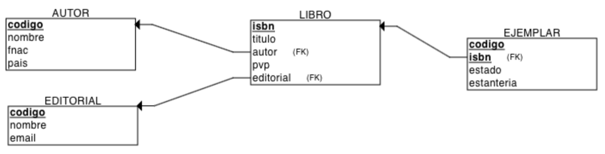
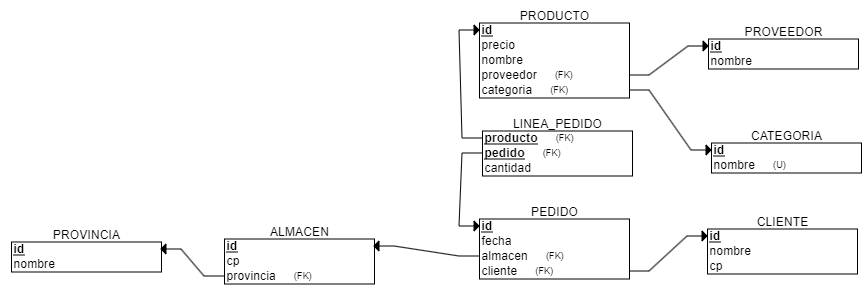
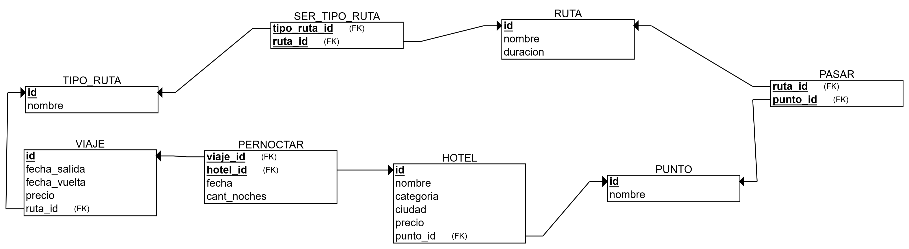

# **UT2-B. Actividades**

## **Actividades**

### **AC201.B**

??? "Ejercicio AC201.B"

    |  Criterios de Evaluación  | Ponderación |
    | --- | --- |
    | RABD.6 // CE6b, CE6c // | 3p |

    Analiza la siguiente tabla EMPLEADO y enumera todos los errores que encuentres. A continuación, aporta una solución para cada uno de ellos. Finalmente, analiza las claves existentes:

    | dni | nombre | genero | direccion | fAlta | casado | nombre | codEmpleado |
    | --- | --- | --- | --- | --- | --- | --- | --- |
    | 12345678A | Guillem Vidal | M | C Mayor, 5 | 11/1/24 | N |  | 1 |
    | 12345679B | Guillem Vidal | M | C Illueca, 26 | 21/1/24 | N |  | 2 |
    | 12345670C, 12345671D | Juan y María Sánchez | M,F | C Illueca, 26 | 31/1/24 | S,N | Ana | 3,4 |
    | 98765431X | Ana Fernández | F |  | 30/2/24 | S | Óscar | X2 |
    | 98765432Z | Domingo Gallardo | M | Avda Alicante, 12 | Lunes | S | María | siete |
    | 98765430Y | Mónica Reig | F | 03206 | 3/2/24 | S |  | 99 |

### **AC202.B**

??? "Ejercicio AC202.B"

    |  Criterios de Evaluación  | Ponderación |
    | --- | --- |
    |  RABD.6 // CE6d, CE6c // | 3p |

    Indica si las siguientes afirmaciones son verdaderas o falsas y justifica la respuesta:

    - La unión de todos los campos de una relación siempre funciona como clave de la relación.
    - Toda relación tiene clave primaria.
    - Toda relación posee, al menos, una clave ajena.
    - Un campo que pertenece a la clave primaria de una relación puede tomar el valor `NULL`.
    - Un campo que pertenece a una clave ajena de una relación puede tomar el valor `NULL`.
    - Un mismo campo puede funcionar a la vez como clave primaria y como clave ajena de una relación.
    - Una clave ajena puede enlazar una relación consigo misma.    |

### **AC203.B**

??? "Ejercicio AC203.B"

    |  Criterios de Evaluación  | Ponderación |
    | --- | --- |
    |  RABD.6 // CE6f // | 3p |

    A partir de los datos de las siguientes tablas, identifica todos los problemas con las restricciones semánticas asociadas al modelo relacional y aporta soluciones de cómo resolverlas, sabiendo que las PK son `PRODUCTO.codigo`y `CATEGORIA.codigo`, y tenemos una clave ajena de `PRODUCTO.categoria` que apunta a `CATEGORIA`.

    - `PRODUCTO`

        | codigo | nombre | cantidad | pvp | categoria`*` |
        | --- | --- | --- | --- | --- |
        | 101 | Televisor LED 42" | \-5 | 299.99 | 1 |
        | 102 | Lavadora XYZ | 010 | abc | 2 |
        | 102 | LEGO Batman | tres | 299.99 | 3 |
        | 105 | Pelota de fútbol |  | 299.99 | `NULL` |
        | 099 | Escritorio | 8 | 299.99 | 5 |

    - `CATEGORIA`

        | codigo | nombre | descr |
        | --- | --- | --- |
        | 1 | Electrónica | Productos electrónicos de consumo |
        | 2 |  | Hogar y cocina |
        | `NULL` | Juguetes y Juegos | Accesorios y juguetes para niños |
        | 4 | Deportes | Artículos deportivos y outdoor |
        | 4 | Deportes | Productos de oficina y papelería |

    Indica las restricciones semáticas que aplicarías para resolver los problemas.

### **AC204.B**

??? "Ejercicio AC204.B"

    |  Criterios de Evaluación  | Ponderación |
    | --- | --- |
    |  RABD.6 // CE6f // | 3p |

    A partir de los datos de la siguiente tabla de `COMERCIAL`, identifica todas las claves y restricciones posibles:

    | dni | codigo | nombre | genero | direccion | fAlta | codPareja |
    | --- | --- | --- | --- | --- | --- | --- |
    | 12345679B | 10 | Ana Vidal | F | C Illueca, 26 | 21/1/24 |  |
    | 12345670C | 20 | Lara Sánchez | M | C Almassera, 15 | 31/1/24 | 3 |
    | 98765431X | 30 | Ana Fernández | F |  | 13/2/24 | 7 |
    | 98765432Z | 40 | Domingo Gallardo | M | Avda Alicante, 12 | 23/2/24 |  |
    | 98765430Y | 50 | Ana Vidal | F | C Eugeni D'Ors 5 | 3/3/24 | 6 |
    | 12345678A | 60 | Guillem Vidal | M | C Mayor, 5 | 11/1/24 | 2 |

    Genera el modelo relacional con [https://dbdiagram.io/](https://dbdiagram.io/) identificando las claves y restricciones.

### **AC205.B**

??? "Ejercicio AC205.B"

    |  Criterios de Evaluación  | Ponderación |
    | --- | --- |
    |  RABD.6 // CE6b, CE6c // | 3p |

    Crea las tablas necesarias con datos ficticios (con al menos 5 registros cada tabla) que respete las restricciones semánticas del modelo relacional a partir del siguiente esquema relacional:

    `**EMPLEADO** (nif, nombre, direccion, cargo)` 
    `· PK: (nif)` 
    `· VNN: (nombre)`  
    `**VEHICULO** (matricula, codigo, marca, modelo, empleado*)` 
    `· PK: (matricula)` 
    `· FK: (empleado) → EMPLEADO` 
    `· VNN (empleado)` 
    `· UK (codigo)` 

    Donde `*` indica clave ajena y `VNN` indica que el campo no puede tomar valores nulos.

    Para mostrar las diferentes restricciones del modelo debes tener en cuenta las cardinalidades de la relación, los posibles valores repetidos o nulos de los campos, etc...

    Utiliza [https://dbdiagram.io/](https://dbdiagram.io/) para crearlo.

### **AP206.B**

??? "Ejercicio AP206.B"

    |  Criterios de Evaluación  | Ponderación |
    | --- | --- |
    |  RABD.6 // CE6d, CE6f // | 3p |

    A partir del siguiente esquema relacional, crea tres tablas con datos ficticios, y explica el tipo de relación existente entre los campos y las tablas relacionadas (cardinalidad):

    | Esquema relacional | Restricciones |
    | --- | --- |
    | Conductor (nif, nombre, fAlta) | PK: (nif) | |
    | Conducir (nif*, matricula*, cantidad) | PK: (nif, matricula) | FK: (nif) → Conductor (matricula) → Autobus |
    | Autobus (matricula, tipo, numPlazas) | PK: (matricula) | VNN: (numPlazas) |

    Genera el diagrama de tablas con [https://dbdiagram.io/](https://dbdiagram.io/). 
    Copia el diagrama al ejercicio e indica los tipos de relación existentes.

### **AR207.B**

??? "Ejercicio AR207.B"

    |  Criterios de Evaluación  | Ponderación |
    | --- | --- |
    |  RABD.6 // CE6d, CE6e, CE6f // | 3p |

    A partir de las tablas de la actividad [AC303](#ac203b), crea el esquema relacional.

    A continuación, crea una nueva tabla `PROVEEDOR` con datos asociados a esta nueva relación, y actualiza el esquema relacional para que estén las tres tablas relacionadas.

### **AR208.B**

??? "Ejercicio AR208.B"

    |  Criterios de Evaluación  | Ponderación |
    | --- | --- |
    |  RABD.6 // CE6b, CE6f // | 3p |

    A partir del siguiente diagrama, crea el esquema relacional. Indica las restriciones en el diagrama.

    <figure markdown="span">
        
        <figcaption>Actividad 208.B</figcaption>
    </figure>

### **AC209.B**

??? "Ejercicio AC209.B"

    |  Criterios de Evaluación  | Ponderación |
    | --- | --- |
    |  RABD.6 // CE6d // | 3p |

    <figure markdown="span">
        
        <figcaption>Actividad 209.B</figcaption>
    </figure>

    Contesta a las siguientes preguntas argumentado tus respuestas:

    1. ¿Puede un `PEDIDO` contener más de un `PRODUCTO`?
    2. ¿Podemos obtener cuales son las categorías de los productos con más pedidos?
    3. Si quisiéramos obtener cuales son las provincias de los clientes donde se realizan más pedidos ¿qué deberíamos añadir?
    4. ¿Podemos tener dos proveedores con el mismo nombre?
    5. ¿Todo `PRODUCTO` obligatoriamente pertenecerá a una `CATEGORIA`?
    6. Cuando en un pedido compramos dos producto diferentes ¿Cuantas `LINEA_PEDIDO` necesitamos? ¿Y si son del mismo producto?

    *(Utiliza una fila de la tabla del ejercicio, una para la pregunta, y otra para la respusta)*

    Genera el diagrama de tablas con [https://dbdiagram.io/](https://dbdiagram.io/) e incluye las restricciones que aparezcan en el diagrama. 
    Copia el diagrama en el ejercicio.

### **AR210.B**

??? "Ejercicio AC210.B"

    |  Criterios de Evaluación  | Ponderación |
    | --- | --- |
    |  RABD.6 // CE6d // | 3p |

    <figure markdown="span">
        
        <figcaption>Actividad 210.B</figcaption>
    </figure>

    Contesta a las siguientes preguntas justificando tus respuestas:

    1. ¿Puede un hotel estar en más de un punto?
    2. Dada una ciudad, ¿Cuántos hoteles podemos tener?
    3. ¿Podemos tener dos rutas con el mismo nombre?
    4. ¿De cuantos tipos puede ser una ruta? ¿Y toda ruta debe tener un tipo?
    5. ¿Podemos tener hoteles que no pertenezcan a ningún viaje? ¿Y al revés?, es decir, ¿Podemos tener viajes sin hotel incluido?
    6. Si en un determinado viaje no está incluido el hotel, ¿Puede haber más de una ruta?

    A continuación, añade al modelo las tablas y relaciones necesarias para almacenar la información de los clientes que realizan el viaje, así como en qué hotel duermen.

    > ▶️ Genera el diagrama de tablas con [https://dbdiagram.io/](https://dbdiagram.io/) completo.

### **AC211.B**

??? "Ejercicio AC311.B"

    |  Criterios de Evaluación  | Ponderación |
    | --- | --- |
    |  RABD.6 // CE6c, CE6d // | 3p |

    A partir del esquema y de las tablas obtenidas en la actividad [AC205.B](#ac205b), completa el [diccionario de datos](./2.4-ModeloRelacional.md#diccionario-de-datos), indicando tanto la información de las tablas, como sus relaciones y restricciones.

### **AC212.B**

??? "Ejercicio AC212.B"

    |  Criterios de Evaluación  | Ponderación |
    | --- | --- |
    |  RABD.6 // CE6c, CE6d // | 3p |

    A partir del diagrama y del esquema obtenidos en la actividad [AR210.B](#ar210b), completa el diccionario de datos.

### **AC213.B**

??? "Ejercicio AC213.B"

    |  Criterios de Evaluación  | Ponderación |
    | --- | --- |
    |  RABD.6 // CE6b // | 3p |

    A partir de la siguiente tabla, indica las dependencias funcionales:

    | codEnvio | fEnvio | codCamion | tipoCamion | codProducto | tipoProducto | cantidad |
    | --- | --- | --- | --- | --- | --- | --- |
    | 111 | 1/1/24 | C1 | Tráiler | A | Zapatos | 180 |
    | 111 | 1/1/24 | C1 | Tráiler | B | Gorras | 120 |
    | 222 | 2/1/24 | C2 | Tráiler | C | Camisetas | 2000 |
    | 333 | 3/1/24 | C3 | Furgoneta | D | Calcetines | 1200 |
    | 333 | 3/1/24 | C3 | Furgoneta | A | Zapatos | 360 |
    | 444 | 3/1/24 | C2 | Tráiler | C | Camisetas | 3000 |
    | 555 | 3/1/24 | C1 | Tráiler | B | Gorras | 140 |

### **AC214.B**

??? "Ejercicio AC214.B"

    |  Criterios de Evaluación  | Ponderación |
    | --- | --- |
    |  RABD.6 // CE6g // | 3p |

    Considera la siguiente relación que almacena información acerca de proyectos en una gran empresa aeroespacial. Se pide normalizar los datos hasta la tercera forma normal.:

    `**TRABAJO** (nomProy, jefeProy, idEmp, horas, nomEmp, fondos, fInicio, salario, nomDpto, jefeDpto, puntos)`

    Teniendo en cuenta que:

    1. Cada proyecto tiene un nombre único.
    2. Los nombres de los empleados, jefes de proyectos y jefes de departamentos no son únicos.
    3. Cada proyecto tiene un jefe de proyecto.
    4. Muchos empleados se pueden asignar para trabajar en cada proyecto, y un empleado se puede asignar a más de un proyecto.
    5. El atributo `horas` indica la cantidad de horas por semana que un empleado particular se asigna a trabajar en un proyecto particular.
    6. El atributo `fondos` almacena la cantidad de dinero asignada para un proyecto.
    7. El atributo `fInicio` da la fecha de comienzo para un proyecto.
    8. El atributo `nomDpto` proporciona el nombre del departamento al que pertenece un empleado. Los nombres de departamentos son únicos.
    9. El atributo `jefeDpto` proporciona el nombre del supervisor de departamento, que puede no ser el mismo que el supervisor o jefe del proyecto.
    10. El atributo `puntos` proporciona una medida del buen hacer de un empleado en un proyecto particular. El jefe de proyecto asigna la calificación al final del trabajo del empleado en dicho proyecto.

    | nomProy | jefeProy | idEmp | horas | nomEmp | fondos | fInicio | salario | nomDpto | jefeDpto | puntos |
    | --- | --- | --- | --- | --- | --- | --- | --- | --- | --- | --- |
    | Zeus | Duque | E101 | 25 | Pedro | 20.000 | 1/4/24 | 30.000 | Aeronáutica | Ángel | 9 |
    | Zeus | Duque | E105 | 30 | Laura | 20.000 | 1/4/24 | 26.000 | Robótica | Paco |  |
    | Zeus | Duque | E110 | 10 | Miguel | 20.000 | 1/4/24 | 21.000 | Aeronáutica | Ángel | 8 |
    | Atreus | Meca | E101 | 5 | Pedro | 50.000 | 15/10/24 | 30.000 | Aeronáutica | Ángel |  |
    | Atreus | Meca | E110 | 20 | Miguel | 50.000 | 15/10/24 | 21.000 | Aeronáutica | Ángel |  |
    | Atreus | Meca | E120 | 15 | Noa | 50.000 | 15/10/24 | 25.000 | Lanzamientos | Paco |  |

### **AC215.B**

??? "Ejercicio AC215.B"

    |  Criterios de Evaluación  | Ponderación |
    | --- | --- |
    |  RABD.6 // CE6g // | 3p |

    A partir del siguiente esquema relacional de una librería, desnormalízalo para simplificar su estructura:

    - LIBRO (isbn, titulo, autor*, editorial*, numPaginas)
        - · PK: (nif)
        - · FK: (autor) → ESCRITOR
        - · FK: (editorial) → EDITORIAL

    - ESCRITOR (nif*, nombre, pais)
        - · PK: (nif)

    - EDITORIAL (codigo*, nombre, pais)
        - · PK: (codigo)

### **AR216.B**

??? "Ejercicio AC216.B"

    |  Criterios de Evaluación  | Ponderación |
    | --- | --- |
    |  RABD.6 // CE6g // | 3p |

    Realiza la normalización, paso a paso, indicando en cada uno de ellos las tablas resultantes y sus datos, de los siguientes supuestos:

    a. Un tabla que contiene la información de estudiantes y los cursos en los que se matricula, la cual tiene la siguiente información:

        | idEstudiante | nomEstudiante | cursos |
        | --- | --- | --- |
        | 134 | Javier Hernández | Matemáticas, Biología, Física |
        | 178 | Sonia Tovar | Biología, Informática |
        | 249 | Juani Moya | Informática, Matemáticas |

    b. Una tabla que contiene información de productos y sus proveedores

        | idProducto | nomProducto | nomProveedor | telefProveedor | categoría |
        | --- | --- | --- | --- | --- |
        | 1234 | Tela de araña | Spiderman | 666000000 | Consumible |
        | 3378 | Máquina del Tiempo | Dr Who | 777000000 | Vehículo |
        | 2549 | Varita Mágica | Harry Potter | 888000000 | Herramienta |

### **AR217.B**

??? "Ejercicio AC217.B"

    |  Criterios de Evaluación  | Ponderación |
    | --- | --- |
    |  RABD.6 // CE6g // | 3p |

    A partir del siguiente esquema relacional, se nos pide optimizar el modelo aplicando desnormalización, ya que, para cada artista, se quieren recuperar las 5 canciones primeras canciones, y con el diseño actual, la consulta es muy lenta:

    - ARTISTA (id, nombre, foto)
        - · PK: (id)

    - ALBUM (id*, nombre, foto, artista_id*)
        - · PK: (id)
        - · FK: (artista_id) → ARTISTA
        - · VNN: (artista_id)

    - CANCION (id, nombre, letra, album_id*)
        - · PK: (id)
        - · FK: (album_id) → ARTISTA
        - · VNN: (album_id)

    ¿Qué has hecho para mejorar el rendimiento? 
    ¿En qué forma normal se encuentra ahora el modelo relacional? 

    Justifica tu respuesta.

### **AR218.B**.

??? "Ejercicio AC218.B"

    |  Criterios de Evaluación  | Ponderación |
    | --- | --- |
    |  RABD.6 // CE6b, CE6c, CE6d, CE6e, CE6f, CE6g // | 3p |

    Una vez finalizada la unidad, responde todas las preguntas del cuestionario, con al menos un par de líneas para cada una de las cuestiones.

    Cuestionario

    1. ¿Qué diferencia el modelo conceptual del lógico?
    2. ¿Cuál es el elemento principal del modelo relacional?
    3. ¿Podemos tener dos atributos con el mismo nombre?
    4. Si una tabla tiene 3 columnas y 5 filas, ¿Cuál es su cardinalidad y grado?
    5. ¿Podemos tener una tabla sin columnas?
    6. ¿Y una tabla sin filas?
    7. ¿Qué función tiene la clave primaria?
    8. ¿Qué es una clave alternativa?
    9. ¿Todas las tablas tienen más de una clave candidata?
    10. ¿En qué consiste la integridad referencial?
    11. ¿El valor de una clave ajena siempre debe tener valor?
    12. ¿Qué es una dependencia funcional?
    13. ¿Y una dependencia funcional completa?
    14. ¿En qué consiste la 1FN? ¿Y la 2FN? ¿Y la 3FN?
    15. ¿Qué es la denormalización y cuál es su objetivo?
