# **2.5. Transformación del modelo ER a MR**

👉 **Pasos**

Una vez conocido el modelo conceptual entidad-relación y el modelo lógico relacional, vamos a estudiar como transformar y pasar de uno a otro. Para ello, seguiremos los siguientes pasos:

- Entidades  →  Tablas
- Atributos  →  Columnas
- Atributos identificadores  →  Claves primarias
- Atributos de relaciones  →  Columnas detrás de claves ajenas
- Relaciones  →  Claves ajenas y/o tablas

!!! tip "Resumen de transformación"

  1. Toda **entidad** se transforma en una **relación**.
  2. Las **interrelaciones N:M** se transforman en una **relación**.
  3. Las **interrelaciones 1:N** dan lugar o bien a una propagación de clave o bien a una relación
  4. Las **interrelaciones 1:1** dan lugar a la propagación de la clave de una entidad a la otra

## 📁 Atributos

Conviene recordar que dentro de una tabla, no se puede repetir el nombre de ningún atributo, pero sí en tablas diferentes.

Algunos profesionales prefieren que no se repitan los identificadores entre diferentes tablas de una misma BD, aunque es cierto que las herramientas ORM de generación de modelos físicos a partir de definición de clases u objetos suelen nombrar todas las claves primarias como `id` o `_id`.

En cuanto a los atributos **compuestos**, se separan como atributos individuales dentro de la tabla, pudiéndoles poner el prefijo del atributo compuesto o el propio nombre del atributo si no da pie a confusión.

Para los atributos **derivados**, dependiendo del caso, bien no se añaden como atributo (ya que se obtendrán a partir de los datos de las relaciones), o bien se renombra el atributo para almacenar el dato en crudo sobre el cual se realiza el cálculo necesario.

{ align="right" width="40%"}

**Transformación de atributos**

Por ejemplo, si partimos de un sencillo modelo ER de un cliente, su transformación al modelo relacional sería la siguiente:

`**CLIENTE** (dni, nombre, calle, numPiso, ciudad, fnac)` 
`· PK: (dni)`

Destacar que no hemos puesto el nombre del atributo compuesto, sino cada uno de sus atributos, y además, hemos renombrado `numero` a `numPiso` para evitar confusiones con otras entidades; respecto al atributo derivado edad, lo hemos cambiado por la fecha de nacimiento.

Respecto a los atributos **multivaluados**, derivan en una relación uno a muchos (1:N), tal como veremos a continuación.

### Claves compuestas

Normalmente, cada entidad tendrá un atributo identificador que traduciremos en una clave primaria. Pero puede darse el caso que una entidad tenga una clave compuesta, o tenga marcados dos atributos identificadores (en este caso, uno será la clave primaria y el otro será una clave alternativa que marcaremos como única).

Por ejemplo, el siguiente diagrama representa un aula que se identifica mediante una clave compuesta:

{ align="left" width="55%"}

`**AULA** (edificio, numSala, numAsientos)` 
`· PK: (edificio, numSala)`

Sin embargo, también podemos tener un empleado con dos atributos identificadores:

`**EMPLEADO** (codigo, nif, nombre, salario)` 
`· PK: (codigo)` 
`· UK: (nif)` 

## ⚡ Transformación de Relaciones (fuertes)

Al transformar las relaciones, dependiendo de la cardinalidad deberemos colocar la clave ajena en un lugar u otro.

Cada entidad se transforma en una tabla, donde los atributos de la entidad se convierten en columnas de la tabla, y el atributo identificador se convierte en la clave primaria de la tabla.

- **Entidades.** Las entidades pasan a ser tablas
- **Atributos**. Los atributos pasan a ser columnas o atributos de la tabla.
    - **Atributos identificadores**. Pasan a ser claves primarias o alternativas.
        - **Claves primarias**. Son aquellos atributos que identifican de forma única cada tupla de la tabla.
        - **Claves alternativas**. Son aquellos atributos que también identifican de forma única cada tupla de la tabla, pero no son la clave primaria. Estos atributos tendrán las restricciones **UNIQUE** y **NOT NULL**.
    - **Atributos compuestos**. Se transforman en los atributos que los componen. Por ejemplo, si viéramos un atributo compuesto que fuera Dirección, que estuviera formado por calle, número, piso y puerta, se transformará en los atributos de la relación calle, número, piso y puerta.
    - **Atributos obligatorios**. Se convierten en atributos de la relación con la restricción de NOT NULL, es decir no puede ser nulo.
    - **Atributos opcionales**. Pueden tomar valores nulos.
    - **Atributos multivaluados**. Se transforman en una nueva tabla, cuya clave primaria está formada por la clave primaria de la entidad en la que se sitúa el atributo multivaluado más el nombre del atributo multivaluado. En ocasiones, si el atributo multivaluado no admite repeticiones, es suficiente éste como clave primaria.

### ↘️ Transforma relacion 1:N

La clave primaria de la entidad con cardinalidad máxima a 1 se incluye en la entidad con cardinalidad máxima N como clave ajena.

{ align="right" width="40%"}

`**A** (a0, a1, b0*)` 
`· PK: (a0)   · FK: (b0) → B` 

`**B** (b0, b1)` 
`· PK: (b0)`

De esta manera, tenemos que dado un registro en A, tendremos uno en B. Y dado un B, podemos tener muchos en A, cumpliendo la cardinalidad de uno a muchos.

!!! example "Ejemplo 2: Relación 1:N. Personas y teléfonos"

    Por ejemplo, si tenemos un modelo donde, en vez de un atributo multivaluado, hemos creado una entidad para modelar que una persona puede tener muchos teléfonos:

    { align="left" width="30%"}

    Si aplicamos la transformación recién vista, obtenemos el siguiente esquema lógico:

    `**PERSONA** (dni, nombre, direccion)` 
    `· PK: (dni)`  
    `**TELEFONO** (numero, propio, dni*)` 
    `· PK: (numero)` 
    `· FK: (dni) → PERSONA` 

    Conviene recordar que la clave ajena será la clave primaria que nos hemos traido desde la entidad con cardinalidad máxima a 1 (en este caso, llevamos la clave primaria de `PERSONA` a `TELEFONO`), de manera que el atributo `TELEFONO.dni` representa la relación `TENER`.

    Las claves ajenas se colocan tras los atributos de cada tabla (en este caso, detrás de `numero` y `propio`), y normalmente, se nombran con el mismo nombre de la clave primaria. Si diera pie a confusión, es recomendable renombrarla pudiendo como sufijo el nombre de la tabla.

    Finalmente, si quisiéramos generar el diagrama relacional, obtendríamos una gráfico similar al siguiente, donde se puede ver como desde `TELEFONO.dni` se conecta con `PERSONA.dni`:

    <figure markdown="span">
        
        <figcaption>Esquema relacional en ERDPlus</figcaption>
    </figure>

> 💡 Recordad la regla de integridad referencial del modelo relacional, donde cada valor de la clave ajena debe coincidir con un valor existente de la clave primaria a la que referencia (o ser nulo). De esta manera, no podemos tener un dni en la tabla TELEFONO que no exista previamente en la tabla PERSONA.

   - `PERSONA`
       
       | dni | nombre | direccion |
       | --- | --- | --- |
       | 11111111A | Pedro Casas | Calle Mayor, 1 |
       | 22222222B | Laura García | Avda Libertad, 33 |
       | 33333333C | Mireia Vidal | Paseo de la Estación, 5 |
       
   - `TELEFONO`
       
       | numero | propio | dni`*` |
       | --- | --- | --- |
       | 636111111 | true | 22222222B |
       | 686222222 | true | 11111111A |
       | 666333333 | false | 11111111A |
       | 666444444 | true | --error: un telefono debe pertenecer a una persona-- |

!!! success "Renombrando claves ajenas"

    Aunque es muy común que el nombre del atributo que hace de clave ajena coincida con la clave primaria a la que apunta, podemos renombrarla y ponerle un nombre que facilite su comprensión.

    En el caso de la tabla `TELEFONO`, el campo `dni` hace referencia al titular del teléfono, no es que un teléfono tenga un dni. Podríamos haber modelado la tabla renombrando el `TELEFONO.dni` como `TELEFONO.propietario` dando un valor semántico al atributo:

    `**TELEFONO** (numero, propio, propietario*)` 
    `· PK: (numero)` 
    `· FK: (propietario) → PERSONA` 

    Lo que sí es obligatorio es que los dominios de las claves ajenas y las claves primarias coincidan.

!!! tip "Atributos multivaluados"

    Cuando tenemos un atributo multivaluado, éste se mapea en una relación separada.

    Podemos crear una nueva tabla con un código o atributo identificador para cada registro y añadir una clave ajena a modo de relación 1:N.

    { align="right" width="30%"}

    Así pues, si tenemos un empleado que tiene muchos teléfonos mediante un atributo, generaremos dos tablas:

    `**EMPLEADO** (nif, nombre)` 
    `· PK: (nif)`
     

    `**TELEFONO** (numero, dni*)` 
    `· PK: (numero)` 
    `· FK: (dni) → EMPLEADO` 

    Si fuera un valor que pudiese compartirse entre varios empleados, como pudiera ser que un empleado tiene muchos cargos, y ese mismo cargo lo pueden tener varios empleados (pero no nos interesa a priori modelarlo conceptualmente como una entidad), podríamos crear una clave primaria compuesta:

    `**CARGO** (cargo, dni*)` 
    `· PK: (cargo, dni)` 
    `· FK: (dni) → EMPLEADO` 

--- 

### ↘️ Transformar relación 1:1

En este caso, la clave ajena se pone en cualquier entidad y se añade como clave alternativa/única (`UK`).

Como **norma general**, las relaciones con cardinalidad 1:1 **no generan una tabla**, lo que haremos será que la clave primaria de una entidad pasará a formar parte de la tabla de la otra entidad, y pasará como un atributo.

La **participación** de cada una de las entidades será lo que **nos ayude a decidir** cuál será la entidad que pasará
su clave primaria a la otra entidad.

> 🔥 **Excepción**: Sólo existe un caso donde una relación con cardinalidad 1:1 genera una nueva tabla, y será
cuando la participación de las dos entidades sea de tipo (0,1) – (0,1).

Veamos ejemplos de los distintos casos:

!!! success "Participación (1,1)-(0,1)"

    En estos casos, la clave primaria de la entidad del lado (1,1) se propagaría la entidad del lado (0,1), es decir, la clave primaria de la entidad USUARIO pasa a la entidad CANAL_YOUTUBE, quedando las tablas del modelo así:

    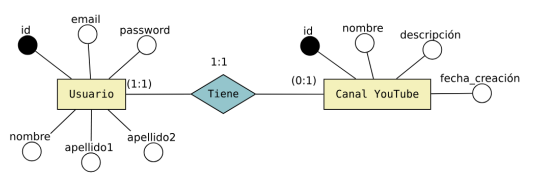{ align="left" width="50%" }
    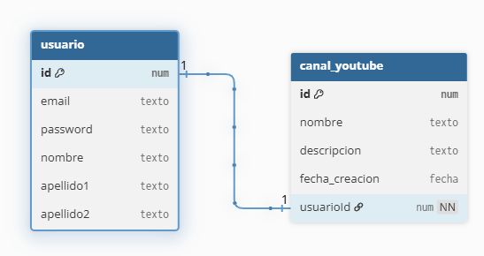{ align="right" width="40%" }
    

!!! success "Participación (1,1)-(1,1)"

    Estos casos podemos resolverlos de dos maneras distintas:

    1. **Propagando la clave primaria de cualquiera de las entidades a la otra**. Da igual que entidad sea la que propague la clave. Este es la manera más habitual de proceder.
    2. **La clave primaria de cada entidad se propaga en la otra** entidad, quedando algo así:

    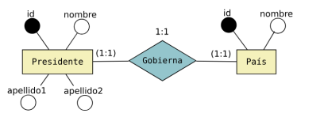{ align="left" width="40%" }
    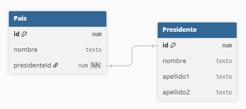{ align="right" width="40%" }

    **Muy importante**: En este caso, la clave ajena deben ser clave única (`UK`), ya que la relación es 1:1. Es decir, debe tener las restricciones de `NOT NULL` y `UNIQUE`.

!!! success "Participación (0,1)-(0,1)"

    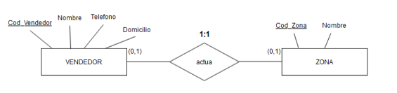{ align="center" width="40%" }

    En este caso tenemos dos opciones:

    1. Propagamos la clave primaria de una entidad a la otra entidad. Esta es la solución más usada.
    
    2. Crear una nueva tabla en la que almacenaremos la relación entre las dos entidades. La clave primaria de esta entidad podría ser cualquiera de las claves primarias de la otras entidades.

    

    -   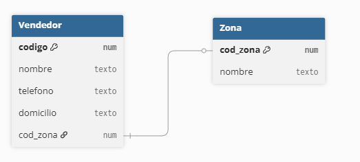
        
Optción 1

    -   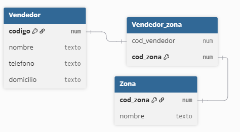
        
Optción 2

    

  

### ↘️ Transformación Relaciones Reflexivas

<u>Interrelaciones Reflexivas 1:M</u>

La clave primaria se almacena en la misma tabla como atributo.

-   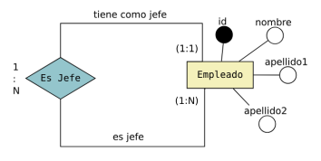
    
Relación reflexiva

-   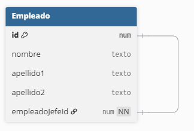
    
Transformación: Relación reflexiva

<u>Interrelaciones Reflexivas N:M</u>

-   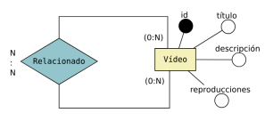{ width=90% }
    
Relación reflexiva N:M

-   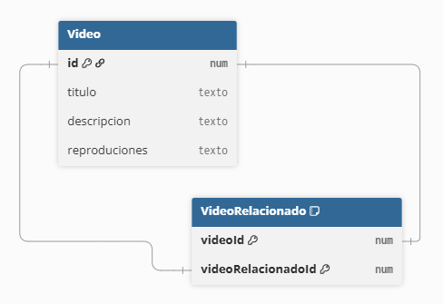{ width=70% }
    
Transformación: Relación reflexiva N:M

!!! question "Claves ajenas compuestas"

    ¿Y si nuestra entidad tiene una clave primaria compuesta? En este caso, la clave ajena también deberá compuesta.
    Esto se aplica a cualquier transformación, 1:1, 1:N, N:M  o reflexivas.

### ↘️ Transformación de relación N:M

En el caso de las relaciones muchos a muchos, la relación se traduce en una nueva tabla, cuya clave primaria se compone de las claves primarias referenciadas, y cada clave primaria es una clave ajena.

En caso del que **la interrelación tuviera un atributo**, se convertiría en un **atributo** de la nueva relación. En algunos casos, sobre todo cuando las interrelaciones tienen atributos que denotan una **dimensión temporal** (generalmente atributos que recogen fechas, horas o intervalos de tiempo), estos deben formar **parte de la clave primaria** de la nueva relación.

Para este ejemplo, tenemos una empresa de transportes, donde un conductor conduce varios autobuses, y luego un autobus lo conducen varios conductores en diferentes trayectos, dando lugar a una relación muchos a muchos, donde en la relación añadimos el atributo `trayecto`:

-   { width=50% }
    
Relación N:M

-   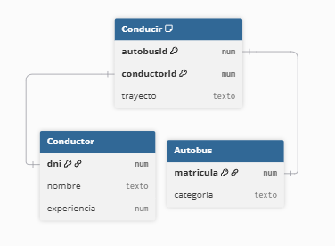{ width=70% }
    
Transformación: Relación N:M

!!! tip "El orden importa"

    Cuando pasamos una relación uno a muchos o muchos a muchos de un modelo ER a un modelo relacional, primero crearemos las tablas que no tienen claves ajenas.

    En este caso, empezaremos por `CONDUCTOR` y `AUTOBUS`, definiendo sus claves primarias y atributos.

    A continuación, crearemos la/s tabla/s que contiene claves ajenas a las tablas ya creadas, esto es, la tabla `CONDUCIR` que apunta a `CONDUCTOR` y `AUTOBUS`.

En este caso, el diagrama del modelo relacional se traduce en tres tablas conectadas, colocando el atributo de la relación en la nueva tabla `CONDUCIR`. Destacar como la tabla tiene una clave primaria compuesta, donde de cada parte de la clave sale una clave ajena a cada una de las tablas que relaciona:

> 👨‍👩‍👧‍👦 La cardinalidad 0..N en ambos lados de la relación se cumple, ya que un conductor puede no conducir ningún autobús (0) o varios (N), y un autobús puede no ser conducido por ningún conductor (0) o varios (N). **¿Cómo se refleja esto en las tablas?** Mediante la ausencia de registros en la tabla intermedia `CONDUCIR`.

Y comprobamos con datos cómo sí se cumplen las cardinalidades:

- `AUTOBUS`
    
    | matricula`*` | categoria |
    | --- | --- |
    | 1111ABC | normal |
    | 2222BCD | larga distancia |
    | 3333DEF | larga distancia |
    
- `CONDUCTOR`
    
    | nif`*` | nombre | experiencia |
    | --- | --- | --- |
    | 11111111A | Andrés Checa | 1 |
    | 22222222B | José Escrig | 2 |
    | 33333333B | Marina Fernández | 3 |
    
- `CONDUCIR`
    
    | conductorId`*` | autobusId`*` | trayecto |
    | --- | --- | --- |
    | 11111111A | 1111ABC | A |
    | 22222222B | 1111ABC | B |
    | 11111111A | 3333DEF | C |

#### N:M con dimensión temporal

Si la relación tiene atributos de tipo fecha, será necesario incluir al menos uno en la clave primaria.

Supongamos una empresa de alquiler de vehículos, donde tenemos que un cliente puede alquilar el mismo vehículo en fechas diferentes, o alquilar diferentes vehículos. Claramente, un vehículo lo pueden alquilar diferentes clientes en fechas diferentes. Para ello, creamos una relación muchos a muchos, colocando la fecha de inicio y de finalización del alquiler en la propia relación.

-   { width=100% }
    
Relación N:M dimension temporal

-   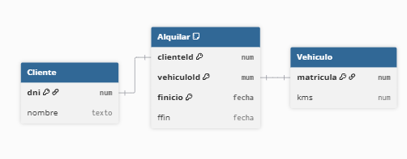{ width=100% }
    
Transformación: Relación N:M dimension temporal

Y la tabla que las relaciona con el atributo de fecha de inicio como parte de la clave primaria (de este modo, el cliente A puede alquilar el vehículo X en días diferentes)

## ❌ Restricciones

Una vez visto como se transforman los atributos y las relaciones, vamos a ver algunas particularidades a la hora de aplicar restricciones sobre las cardinalidades.

### Cardinalidad mínima 1

Cuando la cardinalidad mínima es 1, independientemente de la cardinalidad máxima, estamos indicando que **sí o sí dicha clave ajena debe tener un valor**. Para cumplirla, únicamente debemos marcar la clave ajena como valor no nulo (VNN).

!!! example "Usuario y Post"

    Un usuario puede escribir muchos Post y un Post debe ser escrito por un único usuario. Relación 1-N, con cardinalidad (1,1)-(1,N).

    En este caso, para indicar la cardinalidad mínima a 1 (un post debe tener un usuario), se indica el campo `usuarioId` (FK) en la tabla Post, como NN (Not Null)

    

    -   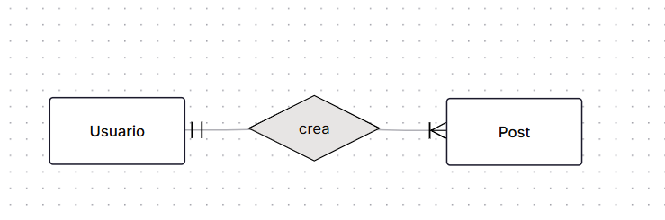{ width=100% }
        
Cardinalidad mínima a 1

    -   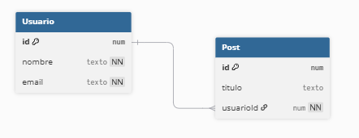{ width=100% }
        
Cardinalidad mínima a 1

    

> 🔥 En los casos de cardinalidad mínima en relaciones 1:1, que son las que cambian más la transformación ya lo vimos en los ejemplos de esos casos.

### Identificación

En las restricciones de identificación, la entidad débil se identifica, completamente o en parte, con la entidad fuerte. Es decir, parte de la clave primaria de la entidad débil son los atributos clave de la entidad fuerte. Es por ello, que la clave ajena debe formar parte de la clave primaria, la cual se define como una clave compuesta por la combinación de la clave primaria de la entidad fuerte y la débil:

{ width=50% }

Los atributos clave de la entidad débil que no apuntan a la entidad fuerte se conocen como clave parcial. En el ejemplo anterior, `a0` sería la clave parcial de la entidad débil `A`.

En el siguiente ejemplo, tenemos que cada sala se identifica por el cine al que pertenece por un número de sala, el cual se reinicia por cada cine. Es decir, la sala 1 del cine IMF no es la misma tupla que la sala 1 del cine ABC:

-   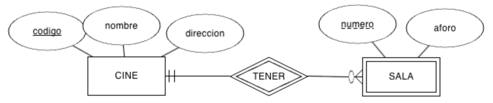{ width=100% }
    
Ejemplo de restricción de IDdentificacion

-   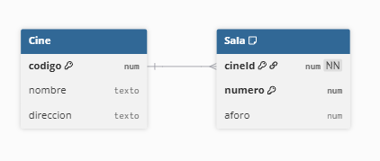{ width=100% }
    
Ejemplo de restricción de IDdentificacion

Las tablas de datos de ejemplo demuestran que aunque la entidad débil repita número, la clave de la entidad fuerte deshace la ambigüedad:

- `CINE`
    
    | codigo | nombre | direccion |
    | --- | --- | --- |
    | 1 | ABC | Elche |
    | 2 | IMF | Ondara |
    | 3 | Odeón | Elche |

- `SALA`
    
    | numero | cineId`*` | aforo |
    | --- | --- | --- |
    | 1 | 1 | 50 |
    | 1 | 2 | 60 |
    | 1 | 3 | 70 |
    | 2 | 1 | 55 |

!!! tip "Ejemplo resuelto"

    Supongamos el diagrama ER que vimos en la unidad 2 al tratar las [restricciones de ID]. Vamos a obtener el modelo MR del mismo, teniendo en cuenta que la entidad `LINEA_PEDIDO` es una entidad débil respecto a la relación `CONTENER`, pero hace de entidad fuerte respecto a la relación `TENER`:

    

    -   { width=100% }
        
Restricción de ID

    -   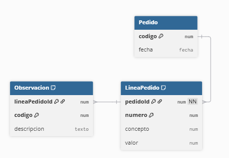{ width=100% }
        
Restricción de IDdentificacion

    

    ¿Qué ha pasado con el atributo `PEDIDO.total`?

## 👨‍👩‍👧‍👦 Generalización y Especialización (Jerarquías)

Existen varias soluciones para realizar el paso a tablas de una especialización. La solución que se elija en cada caso dependerá del tipo de especialización que estemos resolviendo: total, parcial, inclusiva o exclusiva.

Las 3 soluciones posibles que podemos aplicar son las siguientes:

1. Crear **una única tabla** para la superclase. En este caso todos los atributos de las subclases se guardarían en la superclase. 

    Adoptaremos esta solución cuando los subtipos se diferencian en muy pocos atributos y las relaciones que los asocian con el resto de entidades del esquema sean las mismas para todos los subtipos. 

2. Crear **tablas sólo para las subclases**. En este caso los atributos de la superclase habría que guardarlos en cada una de las subclases.
   Elegiremos esta opción cuando existan muchos atributos distintos entre los subtipos.

3. Crear **una tabla para cada una de las entidades**, tanto para la superclase como las subclases. En este caso las **subclases** tendrían que **guardar la clave de la primaria de la superclase**.

En resumen:

- Si es `Parcial` siempre hay que crear una tabla para la `superclase`, y las clases de los `subtipos` dependerá del número de atributos comunes. Si la mayoría son comunes habrá pocos `propios` de cada subtipo, y por tanto, poco valores nulos o por defecto en la `superclase`.
- Si es `Total`, siempre la `superclase` estará contenida el algún `subtipo`. La opción de crear o no la tabla para la `superclase` radica en el número de campos comunes entre la superclase y los subtipos. 
  - Poco comunes -> Crear subtipos.
  - Muchos comunes -> No crear subtipos.

!!! tipo "Exclusiva/Total"

    <figure markdown="span">
        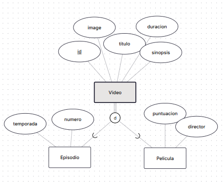
        <figcaption>Exclusiva/Total</figcaption>
    </figure>

    En este caso sería adecuado utilizar la solución 2 o 3. También sería posible utilizar la solución 1, pero al tratarse de una especialización exclusiva y total (las ocurrencias de la superclase están en una subclase y sólo en una) , tendríamos muchas columnas con valores nulos.

    **Solución 2: Crear una tabla para las subclases**

    <figure markdown="span">
    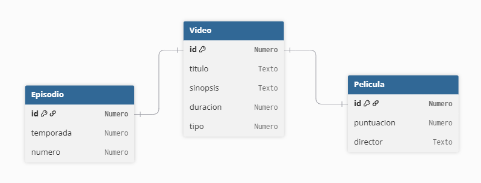
    <figcaption>Solución 2: Crear una tabla para todas las entidades</figcaption>
    </figure>

    **Solución 3: Crear una tabla para todas las entidades**

    En este caso no existenn relaciones entre ambas tablas, y la tabla en sí misma indica el tipo.

    <figure markdown="span">
    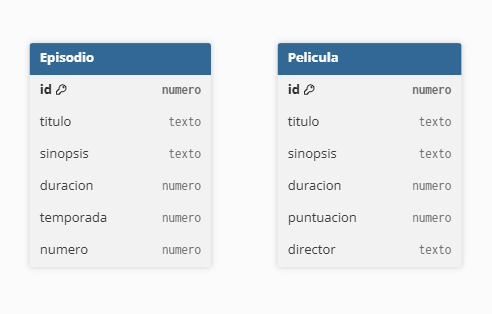
    <figcaption>Solución 3</figcaption>
    </figure>

### Solapada/(Total o Parcial)

Si es solapada, imp

<figure markdown="span">
  
  <figcaption>Exclusiva/Total</figcaption>
</figure>

En este caso sería adecuado utilizar la solución 2 o 3. También sería posible utilizar la solución 1, pero al tratarse de una especialización exclusiva y total (las ocurrencias de la superclase están en una subclase y sólo en una) , tendríamos muchas columnas con valores nulos.

**Solución 2: Crear una tabla para las subclases**

<figure markdown="span">
  
  <figcaption>Solución 2: Crear una tabla para todas las entidades</figcaption>
</figure>

**Solución 3: Crear una tabla para todas las entidades**

En este caso no existenn relaciones entre ambas tablas, y la tabla en sí misma indica el tipo.

<figure markdown="span">
  
  <figcaption>Solución 3</figcaption>
</figure>