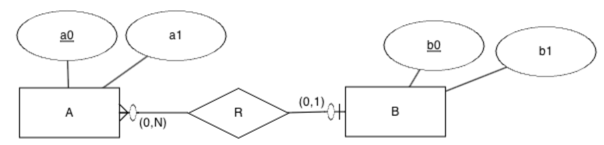
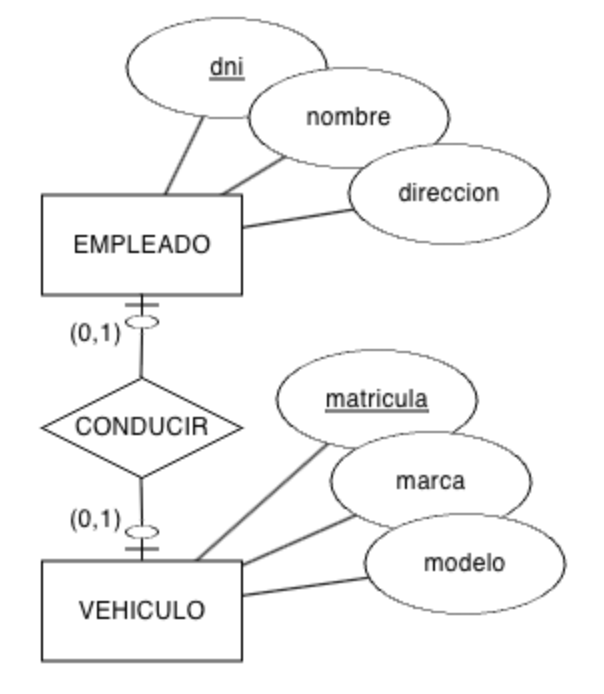
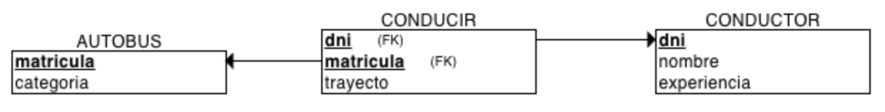

# **2.5. Transformación del modelo ER a MR**

👉 **Pasos**

Una vez conocido el modelo conceptual entidad-relación y el modelo lógico relacional, vamos a estudiar como transformar y pasar de uno a otro. Para ello, seguiremos los siguientes pasos:

1. Las entidades pasan a ser tablas
2. Los atributos pasar a ser columnas
3. Los atributos identificadores pasar a ser claves primarias.
4. Los atributos de las relaciones pasan a columnas detrás de las claves ajenas
5. Las relaciones, dependiendo de la cardinalidad, pasarán a ser claves ajenas y/o tablas.

## Atributos

Conviene recordar que dentro de una tabla, no se puede repetir el nombre de ningún atributo, pero sí en tablas diferentes.

Algunos profesionales prefieren que no se repitan los identificadores entre diferentes tablas de una misma BD, aunque es cierto que las herramientas ORM de generación de modelos físicos a partir de definición de clases u objetos suelen nombrar todas las claves primarias como `id` o `_id`.

En cuanto a los atributos **compuestos**, se separan como atributos individuales dentro de la tabla, pudiéndoles poner el prefijo del atributo compuesto o el propio nombre del atributo si no da pie a confusión.

Para los atributos **derivados**, dependiendo del caso, bien no se añaden como atributo (ya que se obtendrán a partir de los datos de las relaciones), o bien se renombra el atributo para almacenar el dato en crudo sobre el cual se realiza el cálculo necesario.

{ align="right" width="40%"}

Transformación de atributos

Por ejemplo, si partimos de un sencillo modelo ER de un cliente, su transformación al modelo relacional sería la siguiente:

`**CLIENTE** (dni, nombre, calle, numPiso, ciudad, fnac)` 
`· PK: (dni)`

Destacar que no hemos puesto el nombre del atributo compuesto, sino cada uno de sus atributos, y además, hemos renombrado `numero` a `numPiso` para evitar confusiones con otras entidades; respecto al atributo derivado edad, lo hemos cambiado por la fecha de nacimiento.

Respecto a los atributos **multivaluados**, derivan en una relación uno a muchos (1:N), tal como veremos a continuación.

### Claves compuestas

Normalmente, cada entidad tendrá un atributo identificador que traduciremos en una clave primaria. Pero puede darse el caso que una entidad tenga una clave compuesta, o tenga marcados dos atributos identificadores (en este caso, uno será la clave primaria y el otro será una clave alternativa que marcaremos como única).

Por ejemplo, el siguiente diagrama representa un aula que se identifica mediante una clave compuesta:

{ align="left" width="55%"}

`**AULA** (edificio, numSala, numAsientos)` 
`· PK: (edificio, numSala)`

Sin embargo, también podemos tener un empleado con dos atributos identificadores:

`**EMPLEADO** (codigo, nif, nombre, salario)` 
`· PK: (codigo)` 
`· UK: (nif)` 

## Transformación de Relaciones

Al transformar las relaciones, dependiendo de la cardinalidad deberemos colocar la clave ajena en un lugar u otro.

### 1:N

La clave primaria de la entidad con cardinalidad máxima a 1 se incluye en la entidad con cardinalidad máxima N como clave ajena.

{ align="right" width="40%"}

`**A** (a0, a1, b0*)` 
`· PK: (a0)   · FK: (b0) → B` 

`**B** (b0, b1)` 
`· PK: (b0)`

De esta manera, tenemos que dado un registro en A, tendremos uno en B. Y dado un B, podemos tener muchos en A, cumpliendo la cardinalidad de uno a muchos.

!!! example "Ejemplo 2: Relación 1:N. Personas y teléfonos"

    Por ejemplo, si tenemos un modelo donde, en vez de un atributo multivaluado, hemos creado una entidad para modelar que una persona puede tener muchos teléfonos:

    { align="left" width="30%"}

    Si aplicamos la transformación recién vista, obtenemos el siguiente esquema lógico:

    `**PERSONA** (dni, nombre, direccion)`
    `· PK: (dni)`  
    `**TELEFONO** (numero, propio, dni*)`
    `· PK: (numero)` 
    `· FK: (dni) → PERSONA` 

    Conviene recordar que la clave ajena será la clave primaria que nos hemos traido desde la entidad con cardinalidad máxima a 1 (en este caso, llevamos la clave primaria de `PERSONA` a `TELEFONO`), de manera que el atributo `TELEFONO.dni` representa la relación `TENER`.

    Las claves ajenas se colocan tras los atributos de cada tabla (en este caso, detrás de `numero` y `propio`), y normalmente, se nombran con el mismo nombre de la clave primaria. Si diera pie a confusión, es recomendable renombrarla pudiendo como sufijo el nombre de la tabla.

    Finalmente, si quisiéramos generar el diagrama relacional, obtendríamos una gráfico similar al siguiente, donde se puede ver como desde `TELEFONO.dni` se conecta con `PERSONA.dni`:

    <figure markdown="span">
        
        <figcaption>Esquema relacional en ERDPlus</figcaption>
    </figure>

> 💡 Recordad la regla de integridad referencial del modelo relacional, donde cada valor de la clave ajena debe coincidir con un valor existente de la clave primaria a la que referencia (o ser nulo). De esta manera, no podemos tener un dni en la tabla TELEFONO que no exista previamente en la tabla PERSONA.

   - `PERSONA`
       
       | dni | nombre | direccion |
       | --- | --- | --- |
       | 11111111A | Pedro Casas | Calle Mayor, 1 |
       | 22222222B | Laura García | Avda Libertad, 33 |
       | 33333333C | Mireia Vidal | Paseo de la Estación, 5 |
       
   - `TELEFONO`
       
       | numero | propio | dni`*` |
       | --- | --- | --- |
       | 636111111 | true | 22222222B |
       | 686222222 | true | 11111111A |
       | 666333333 | false | 11111111A |
       | 666444444 | true |  |

!!! success "Renombrando claves ajenas"

    Aunque es muy común que el nombre del atributo que hace de clave ajena coincida con la clave primaria a la que apunta, podemos renombrarla y ponerle un nombre que facilite su comprensión.

    En el caso de la tabla `TELEFONO`, el campo `dni` hace referencia al titular del teléfono, no es que un teléfono tenga un dni. Podríamos haber modelado la tabla renombrando el `TELEFONO.dni` como `TELEFONO.propietario` dando un valor semántico al atributo:

    `**TELEFONO** (numero, propio, propietario*)` 
    `· PK: (numero)` 
    `· FK: (propietario) → PERSONA` 

    Lo que sí es obligatorio es que los dominios de las claves ajenas y las claves primarias coincidan.

!!! tip "Atributos multivaluados"

    Cuando tenemos un atributo multivaluado, éste se mapea en una relación separada.

    Podemos crear una nueva tabla con un código o atributo identificador para cada registro y añadir una clave ajena a modo de relación 1:N.

    { align="right" width="30%"}

    Así pues, si tenemos un empleado que tiene muchos teléfonos mediante un atributo, generaremos dos tablas:

    `**EMPLEADO** (nif, nombre)` 
    `· PK: (nif)`
     

    `**TELEFONO** (numero, dni*)` 
    `· PK: (numero)` 
    `· FK: (dni) → EMPLEADO` 

    Si fuera un valor que pudiese compartirse entre varios empleados, como pudiera ser que un empleado tiene muchos cargos, y ese mismo cargo lo pueden tener varios empleados (pero no nos interesa a priori modelarlo conceptualmente como una entidad), podríamos crear una clave primaria compuesta:

    `**CARGO** (cargo, dni*)` 
    `· PK: (cargo, dni)` 
    `· FK: (dni) → EMPLEADO` 

--- 

### Transformar relación 1:1

En este caso, la clave ajena se pone en cualquier entidad y se añade como clave alternativa/única (`UK`).

{ align="right" width="40%"}

Transformación de relación 1:1

Así pues, una posible solución sería llevar la clave ajena a A:

`**A** (a0, a1, b0*)` 
`· PK: (a0)` 
`· FK: (b0) → B` 
`· UK: (b0)` 

`**B** (b0, b1)`
`· PK: (b0)` 

Al hacer que el atributo que es clave ajena sea clave única, restringimos que dicho valor no se pueda repetir.

Y la otra posible solución sería llevar la clave ajena a B:

`**A** (a0, a1)`
`· PK: (a0)` 

`**B** (b0, b1, a0*)` 
`· PK: (b0)` 
`· FK: (a0) → A` 
`· UK: (a0)` 

{ align="right" width="30%"}

Vamos a poner otro ejemplo. En este caso, tenemos la relación existente entre un vehículo y el empleado que lo conduce en una empresa, dando lugar a una relación 1:1 (fíjate como en este caso, hemos renombrado la clave ajena a `dniEmpleado` para facilitar la compresión):

`**EMPLEADO** (dni, nombre, dirección)` 
`· PK: (dni)`  
`**VEHICULO** (matrícula, marca, modelo)` 
`· PK: (matrícula)` 
`· UK: (dniEmpleado)` 
`· FK: (dniEmpleado) → EMPLEADO` 

!!! question "¿Sabrías...?"

    ¿Sabrías crear otra solución donde la clave ajena estuviera en la entidad `EMPLEADO`?  
    A continuación, rellena las dos tablas con datos y comprueba si la relación entre ambas entidades es 1:N o 1:1.

### Transformación de relación N:M

En el caso de las relaciones muchos a muchos, la relación se traduce en una nueva tabla, cuya clave primaria se compone de las claves primarias referenciadas, y cada clave primaria es una clave ajena.

{ align="right" width="60%"}

Transformación de relación N:M

`**A** (a0, a1)` 
`· PK: (a0)` 

`**B** (b0, b1)`
`· PK: (b0)` 

`**R** (a0*, b0*)` 
`· PK: (a0, b0)` 
`· FK: (a0) → A` 
`· FK: (b0) → B` 

Para este ejemplo, tenemos una empresa de transportes, donde un conductor conduce varios autobuses, y luego un autobus lo conducen varios conductores en diferentes trayectos, dando lugar a una relación muchos a muchos, donde en la relación añadimos el atributo `trayecto`:

{ align="left" width="30%"}

`**CONDUCTOR** (dni, nombre, experiencia)` 
`· PK: (dni)` 

`**AUTOBUS** (matricula, categoria)` 
`· PK: (matricula)` 

`**CONDUCIR** (dni*, matricula*, trayecto)` 
`· PK: (dni, matricula)` 
`· FK: (dni) → CONDUCTOR` 
`· FK: (matricula) → AUTOBUS` 

 
 
 

!!! tip "El orden importa"

    Cuando pasamos una relación uno a muchos o muchos a muchos de un modelo ER a un modelo relacional, primero crearemos las tablas que no tienen claves ajenas.

    En este caso, empezaremos por `CONDUCTOR` y `AUTOBUS`, definiendo sus claves primarias y atributos.

    A continuación, crearemos la/s tabla/s que contiene claves ajenas a las tablas ya creadas, esto es, la tabla `CONDUCIR` que apunta a `CONDUCTOR` y `AUTOBUS`.

En este caso, el diagrama del modelo relacional se traduce en tres tablas conectadas, colocando el atributo de la relación en la nueva tabla `CONDUCIR`. Destacar como la tabla tiene una clave primaria compuesta, donde de cada parte de la clave sale una clave ajena a cada una de las tablas que relaciona:

<figure markdown="span">
  
  <figcaption>Esquema relacional en ERDPlus</figcaption>
</figure>

Y comprobamos con datos cómo sí se cumplen las cardinalidades:

- `AUTOBUS`
    
    | matricula`*` | categoria |
    | --- | --- |
    | 1111ABC | normal |
    | 2222BCD | larga distancia |
    | 3333DEF | larga distancia |
    
- `CONDUCTOR`
    
    | nif`*` | nombre | experiencia |
    | --- | --- | --- |
    | 11111111A | Andrés Checa | 1 |
    | 22222222B | José Escrig | 2 |
    | 33333333B | Marina Fernández | 3 |
    
- `CONDUCIR`
    
    | nif`*` | matricula`*` | trayecto |
    | --- | --- | --- |
    | 11111111A | 1111ABC | A |
    | 22222222B | 1111ABC | B |
    | 11111111A | 3333DEF | C |

#### N:M con dimensión temporal

Si la relación tiene atributos de tipo fecha, será necesario incluir al menos uno en la clave primaria.

Supongamos una empresa de alquiler de vehículos, donde tenemos que un cliente puede alquilar el mismo vehículo en fechas diferentes, o alquilar diferentes vehículos. Claramente, un vehículo lo pueden alquilar diferentes clientes en fechas diferentes. Para ello, creamos una relación muchos a muchos, colocando la fecha de inicio y de finalización del alquiler en la propia relación.

<figure markdown="span">
  
  <figcaption>Relación N:M con dimensión temporal</figcaption>
</figure>

Al crear el modelo relacional, tendremos las dos tablas de las entidades relacionadas:

`**CLIENTE** (dni, nombre)` 
`· PK: (dni)`

`**VEHICULO** (matricula, kms)` 
`· PK: (matricula)`

Y la tabla que las relaciona con el atributo de fecha de inicio como parte de la clave primaria (de este modo, el cliente A puede alquilar el vehículo X en días diferentes):

`**ALQUILAR** (dni*, matricula*, finicio, ffin)` 
`· PK: (dni, matricula, finicio)` 
`· FK: (dni) → CLIENTE` 
`· FK: (matricula) → VEHICULO` 