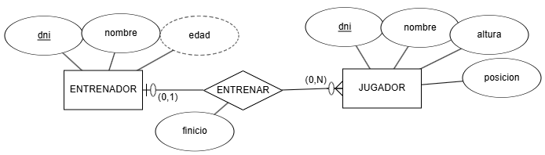
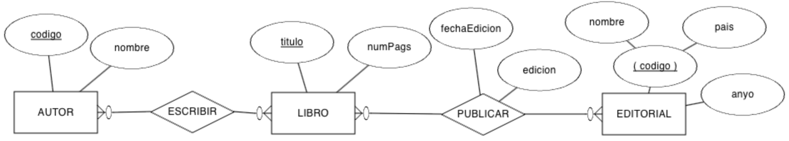
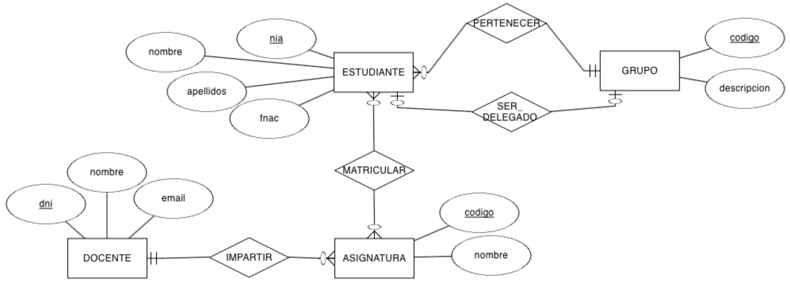
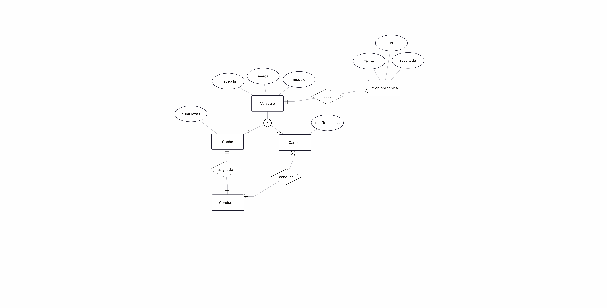
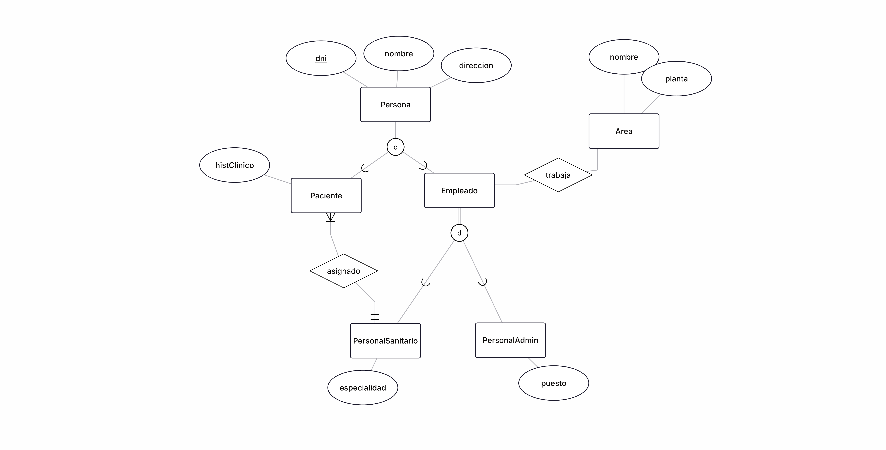

# **UT2-C. Actividades**

## **Actividades**

### **AC201.C**

??? "Ejercicio AC201.C"

    |  Criterios de Evaluación  | Ponderación |
    | --- | --- |
    | RABD.6 // CE6b, CE6c // | 3p |

    Supongamos el siguiente modelo ER donde representamos un sistema de información donde modelamos los datos de un entrenador y los jugadores de un equipo de baloncesto. De momento, sólo modelamos la relación entre el entrenador y los jugadores:

    <figure markdown="span">
        
        <figcaption>Actividad 201.C</figcaption>
    </figure>


    Obtén el esquema relacional mediante *dbdiagram*.

    ??? tip  "Solución"

        Este ejercicio aunque parece fácil, tiene varias opciones de solución dependiendo de cómo interpretemos la relación entre entrenador y jugador.

        - Opción 1: Un entrenador puede entrenar a varios jugadores, y un jugador sólo puede tener un entrenador. En este caso, la relación es 1:N, y se resuelve añadiendo la clave primaria del entrenador como clave ajena en la tabla jugador. La fecha de inicio de la relación se añade a la tabla jugador. Se supone que un jugador solo puede tener un entrenador y la fecha de inicio se refiere a cuando el jugador empezó a ser entrenado por ese entrenador.

        

        ```sql
        Table ENTRENADOR {
        dni texto [pk]
        nombre texto [not null]
        fnac date [not null]
        }

        Table JUGADOR {
        dni texto [pk, note: 'Clave Primaria, DNI del jugador']
        nombre texto [not null]
        altura numero
        posicion texto
        entrenadorId texto [not null]
        finicio date [not null, note: 'Fecha de inicio del periodo de entrenamiento']
        }

        // Definición explícita de las relaciones (Foreign Keys).
        // Esto mejora la legibilidad del diagrama.

        // Relación 1:N - Un Entrenador puede tener muchos Jugadores.
        Ref: ENTRENADOR.dni < JUGADOR.entrenadorId
        ```

        - Opción 2: Un jugador puede ser entrenado por el mismo entrenador en diferentes periodos de tiempo. En este caso, la relación es 1:N, pero la fecha de inicio no puede estar en la tabla jugador, ya que un jugador puede tener varios periodos con el mismo entrenador. Por lo tanto, se crea una tabla intermedia llamada "Entrenamiento" que contiene PK de entrenador y jugador, y la fecha de inicio como atributo adicional. La PK es la combinación del FK de jugador y fecha de inicio.

        

        ```sql
        Table ENTRENADOR {
        dni texto [pk]
        nombre texto [not null]
        fnac date [not null]
        }

        Table JUGADOR {
        dni texto [pk, note: 'Clave Primaria, DNI del jugador']
        nombre texto [not null]
        altura numero
        posicion texto
        }

        Table ENTRENAMIENTO {
        entrenadorId texto [not null]
        jugadorId texto [pk, note: 'Parte de la PK compuesta y FK a JUGADOR']
        finicio date [pk, not null, note: 'Fecha de inicio del periodo de entrenamiento']
        }

        // Definición explícita de las relaciones (Foreign Keys).
        // Esto mejora la legibilidad del diagrama.

        // Relación 1:N - Un Entrenador puede tener muchos Jugadores.
        Ref: ENTRENADOR.dni < ENTRENAMIENTO.entrenadorId

        // Relación de Dependencia - Un Jugador tiene un histórico de periodos.
        Ref: JUGADOR.dni < ENTRENAMIENTO.jugadorId
        ```

### **AC202.C**

??? "Ejercicio AC202.C"

    |  Criterios de Evaluación  | Ponderación |
    | --- | --- |
    |  RABD.6 // CE6a, CE6b, CE6c, CE6d, CE6e, CE6f, CE6h | 2p |

    Sobre el ejercicio anterior, vamos a añadir la entidad `EQUIPO` con el nombre del mismo, su logotipo, dirección y año de creación. Claramente, cada equipo sólo tiene un único entrenador, y un entrenador sólo puede serlo de un equipo.

    Se pide:

    - Modifica el modelo ER para añadir la nueva entidad y la relación necesaria
    - Modifica el modelo relacional a partir del nuevo modelo ER.

    Adjunta (image) el diagrama ER realizado en ERDPlus crea el diagrama del modelo relacional con *dbdiagram*

### **AC203.C**

??? "Ejercicio AC203.C"

    |  Criterios de Evaluación  | Ponderación |
    | --- | --- |
    |  RABD.6 // CE6a, CE6b, CE6c, CE6d, CE6e, CE6f, CE6h // | 3p |

    Realiza el esquema relacional mediante un modelo relacional del siguiente modelo ER:

    <figure markdown="span">
        
        <figcaption>Actividad 203.C</figcaption>
    </figure>

    *Crea mediante dbdiagram*

### **AC204.C**

??? "Ejercicio AC204.C"

    |  Criterios de Evaluación  | Ponderación |
    | --- | --- |
    |  RABD.6 // CE6a, CE6b, CE6c, CE6d, CE6e, CE6f, CE6h // | 3p |

    Tenemos el siguiente modelo ER que representa las diferentes ediciones que de un libro publica una editorial, y los autores que escriben los libros:

    <figure markdown="span">
        
        <figcaption>Actividad 204.C</figcaption>
    </figure>

    *Crea mediante dbdiagram*

### **AC205.C**

??? "Ejercicio AC205.C"

    |  Criterios de Evaluación  | Ponderación |
    | --- | --- |
    |  RABD.6 // CE6a, CE6b, CE6c, CE6d, CE6e, CE6f, CE6h // | 3p |

    Tenemos el siguiente modelo ER sobre la organización de una empresa en departamentos y las características de sus empleados:

    <figure markdown="span">
        
        <figcaption>Actividad 205.C</figcaption>
    </figure>

    *Crea mediante dbdiagram*

### **AC206.C**

??? "Ejercicio AC206.C"

    |  Criterios de Evaluación  | Ponderación |
    | --- | --- |
    |  RABD.6 // CE6a, CE6b, CE6c, CE6d, CE6e, CE6f, CE6h // | 3p |

    A partir del siguiente modelo ER que contiene restricciones de cardinalidad mínima y restricciones de identificación, se pide:

    - Genera el modelo relacional.
    - Rellena tres tablas con datos ficticios (al menos 3 registros por tabla), ya sean datos relacionados o no, conforme consideres

    <figure markdown="span">
        
        <figcaption>Actividad 206.C</figcaption>
    </figure>

### **AC207.C**

??? "Ejercicio AC207.C"

    |  Criterios de Evaluación  | Ponderación |
    | --- | --- |
    |  RABD.6 // CE6a, CE6b, CE6c, CE6d, CE6e, CE6f, CE6h // | 3p |

    Crea el modelo relacional a partir del modelo conceptual sobre un centro educativo.

    <figure markdown="span">
        
        <figcaption>Actividad 207.C</figcaption>
    </figure>

### **AC208.C**

??? "Ejercicio AC208.C"

    |  Criterios de Evaluación  | Ponderación |
    | --- | --- |
    |  RABD.6 // CE6a, CE6b, CE6c, CE6d, CE6e, CE6f, CE6h // | 3p |

    Crea el modelo relacional a partir del modelo conceptual:

    <figure markdown="span">
        
        <figcaption>Actividad 208.C</figcaption>
    </figure>

### **AC209.C**

??? "Ejercicio AC209.C"

    |  Criterios de Evaluación  | Ponderación |
    | --- | --- |
    |  RABD.6 // CE6a, CE6b, CE6c, CE6d, CE6e, CE6f, CE6h // | 3p |

    Crea el modelo relacional a partir del modelo conceptual:

    <figure markdown="span">
        
        <figcaption>Actividad 209.C</figcaption>
    </figure>

### **AC210.C**

??? "Ejercicio AC210.C"

    |  Criterios de Evaluación  | Ponderación |
    | --- | --- |
    |  RABD.6 // CE6a, CE6b, CE6c, CE6d, CE6e, CE6f, CE6h // | 3p |

    Crea el modelo relacional a partir del modelo conceptual:

    <figure markdown="span">
        
        <figcaption>Actividad 210.C</figcaption>
    </figure>

### **AC211.C**

??? "Ejercicio AC211.C"

    |  Criterios de Evaluación  | Ponderación |
    | --- | --- |
    |  RABD.6 // CE6a, CE6b, CE6c, CE6d, CE6e, CE6f, CE6h // | 3p |

    Crea el modelo relacional a partir del modelo conceptual:

    <figure markdown="span">
        
        <figcaption>Actividad 210.C</figcaption>
    </figure>
