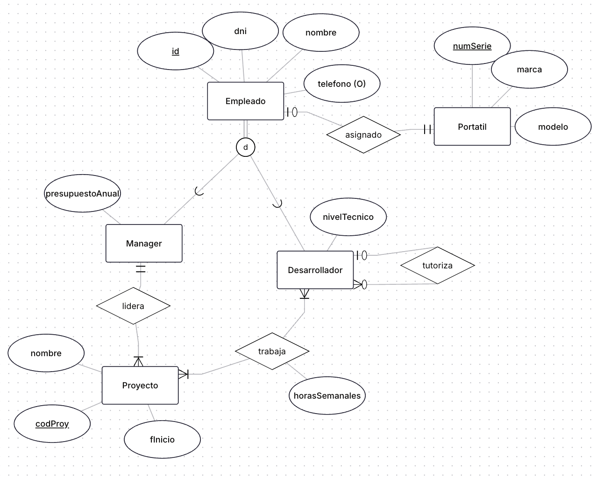
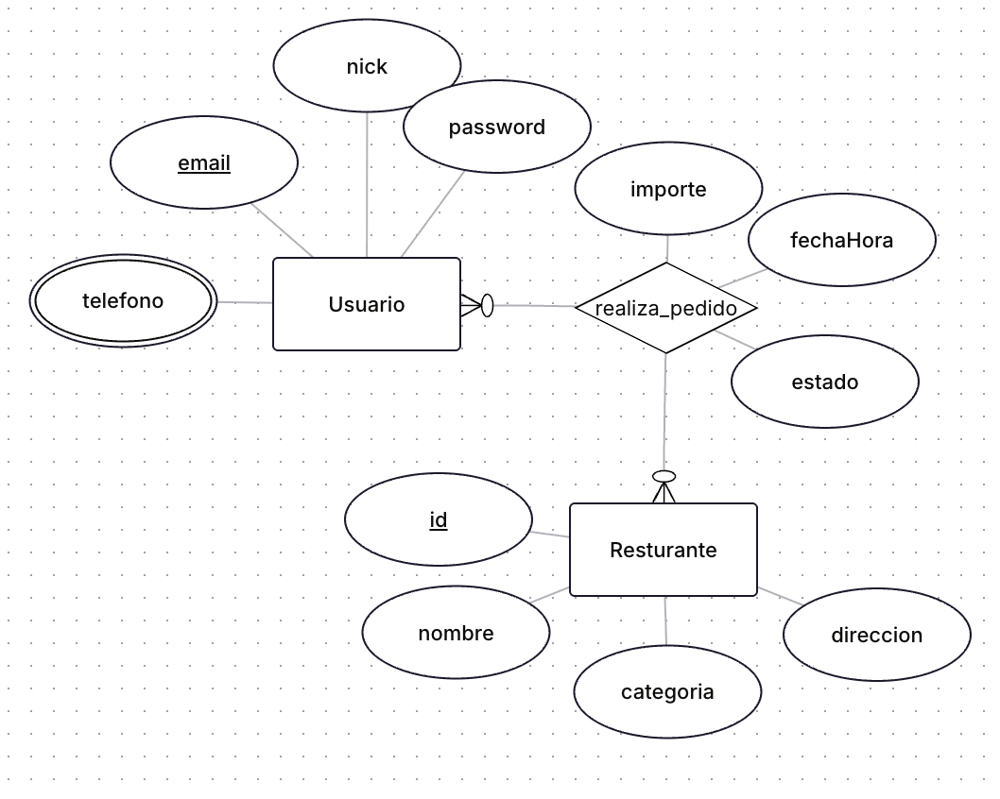

# **Actividades de Repaso: UT2A, UT2B y UT2C**

### **Actividad 1**

Analiza el siguiente diagrama E/R que representa la estructura de recursos humanos y proyectos de una empresa de software. El objetivo es transformar este diseño conceptual en un diseño lógico (tablas) optimizado.

**Reglas de Negocio:**

1.  **Jerarquía de Empleados:**
    - Todos son `EMPLEADOS` (tienen ID, DNI, nombre). El teléfono es un dato opcional.
    - Existen dos perfiles muy diferenciados (Jerarquía **Total y Disjunta**):
      - `MANAGER`: Se encarga de la gestión. Tiene un presupuesto asignado anual.
      - `DESARROLLADOR`: Se encarga del código. Tiene un nivel técnico (Junior, Mid, Senior).
2.  **Activos:**
    - La empresa entrega un `PORTATIL` corporativo a cada empleado.
    - Un portátil (identificado por su número de serie) pertenece a un único empleado.
    - No puede haber empleados sin portátil, pero puede haber portátiles en stock sin asignar (en el almacén).
3.  **Proyectos:**
    - Todo `PROYECTO` debe tener obligatoriamente un **Líder**.
    - Solo los `MANAGERS` pueden liderar proyectos. Un manager puede liderar varios proyectos a la vez.
4.  **Asignación:**
    - Los `DESARROLLADORES` trabajan en los proyectos. Un desarrollador puede estar en varios proyectos y un proyecto tiene varios desarrolladores.
    - Es necesario registrar el número de `horas_semanales` pactadas para cada desarrollador en cada proyecto.
5.  **Mentoria:**
    - Dentro del equipo técnico, un `DESARROLLADOR` Senior puede tutorizar a otros desarrolladores (Juniors).
    - Un desarrollador solo tiene un tutor, pero un tutor puede llevar a varios alumnos.
    - No todos los desarrolladores tienen tutor (los Senior no tienen).

**Se pide:**

1.  **Modelo Relacional:**
    Genera el diagrama de tablas en [https://dbdiagram.io/](https://dbdiagram.io/).

    - _Nota:_ Para la jerarquía, utiliza la estrategia de **"Una tabla por cada subclase"** (es decir, existirá tabla Empleado, tabla Manager y tabla Desarrollador). Asegúrate de propagar la PK correctamente.

2.  **Definición de Claves y Restricciones:**
    En el propio diagrama o como texto adjunto:

    - Indica las PK, restricciones `NOT NULL` y `UNIQUE` necesarias.
    - Define las claves foráneas y agrega las relaciones entre las tablas.

---

### **Actividad 2**

Analiza el siguiente diagrama E/R inicial de una startup de comida a domicilio llamada **"FastBite"**.

El modelo actual es muy básico y solo contempla Usuarios, Restaurantes y Pedidos generales.

**Parte 1: Lectura e Interpretación del Modelo**

Responde a las siguientes preguntas basándote **únicamente** en lo que ves dibujado en el diagrama. Justifica tus respuestas:

1.  **Información incompleta:** Con el diseño actual, ¿podemos saber qué platos concretos (hamburguesa, pizza, etc.) ha pedido el usuario en el pedido `P-100`? ¿Por qué?
2.  **Duplicidad de datos:** ¿Impide este modelo que existan dos restaurantes con el mismo `nombre` y `direccion` en la base de datos?.
3.  **Cardinalidad:** Un pedido, ¿puede contener comida de dos restaurantes diferentes al mismo tiempo (ej: un plato del restaurante A y otro del B en el mismo id_pedido)?
4.  **Restricción:** ¿Es posible guardar dos usuarios que compartan el mismo `email`?

**Parte 2: Completar y Evolucionar el Modelo**

La startup ha recibido una ronda de inversión y necesita profesionalizar la base de datos. Debes **modificar y ampliar** el diagrama E/R anterior para cumplir con los siguientes nuevos requisitos:

1.  **Detalle del Pedido (Platos):** Ahora debemos saber qué se come.
    - Cada `RESTAURANTE` ofrece muchos `PLATOS` (nombre, precio).
    - Un `PEDIDO` se compone de varios `PLATOS`, y un plato puede estar en muchos pedidos.
    - **Importante:** Debemos saber la `cantidad` de cada plato en el pedido (ej: 2 Hamburguesas) y el precio al que se vendió en ese momento.
2.  **Repartidores (Riders):**
    - Aparece la entidad `RIDER` (dni, nombre, vehiculo).
    - Un pedido es asignado a un único Rider para su entrega.
    - Un Rider puede llevar muchos pedidos a lo largo del día, pero un pedido solo lo lleva un Rider.
3.  **Sistema de Valoraciones:**
    - Una vez entregado el pedido, el `USUARIO` puede dejar una valoración (estrellas y comentario).
    - La valoración va asociada al `PEDIDO` concreto (para saber si llegó frío, por ejemplo).

> ▶️ Genera el nuevo diagrama E/R completo.
