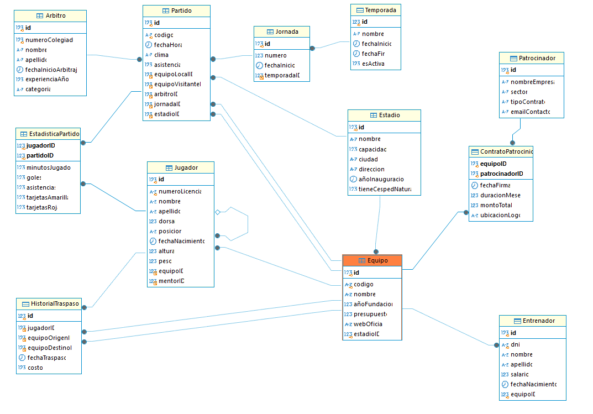

# Base de Datos: Liga de Fútbol

## Modelo Entidad-Relación



??? infor "Script para MySQL"

    ```sql
    DROP DATABASE IF EXISTS LigaFutbol;
    CREATE DATABASE LigaFutbol CHARACTER SET utf8mb4 COLLATE utf8mb4_unicode_ci;
    USE LigaFutbol;

    -- 1. Estadio
    CREATE TABLE Estadio (
        id INT UNSIGNED AUTO_INCREMENT PRIMARY KEY,
        nombre VARCHAR(100) NOT NULL,
        capacidad INT UNSIGNED NOT NULL,
        ciudad VARCHAR(100) NOT NULL,
        direccion VARCHAR(255),
        añoInauguracion YEAR,
        tieneCespedNatural BOOLEAN DEFAULT TRUE
    );

    -- 2. Equipo
    CREATE TABLE Equipo (
        id INT UNSIGNED AUTO_INCREMENT PRIMARY KEY,
        codigo VARCHAR(10) UNIQUE NOT NULL,
        nombre VARCHAR(100) NOT NULL,
        añoFundacion INT,
        presupuesto DECIMAL(15, 2) CHECK (presupuesto >= 0),
        webOficial TEXT,
        estadioID INT UNSIGNED UNIQUE NOT NULL,
        FOREIGN KEY (estadioID) REFERENCES Estadio(id)
    );

    -- 3. Entrenador
    CREATE TABLE Entrenador (
        id INT UNSIGNED AUTO_INCREMENT PRIMARY KEY,
        dni VARCHAR(20) UNIQUE NOT NULL,
        nombre VARCHAR(50) NOT NULL,
        apellido VARCHAR(50) NOT NULL,
        salario DOUBLE,
        fechaNacimiento DATE,
        equipoID INT UNSIGNED UNIQUE NOT NULL,
        FOREIGN KEY (equipoID) REFERENCES Equipo(id)
    );

    -- 4. Jugador
    -- Relación reflexiva: mentorID
    CREATE TABLE Jugador (
        id INT UNSIGNED AUTO_INCREMENT PRIMARY KEY,
        numeroLicencia VARCHAR(20) UNIQUE NOT NULL,
        nombre VARCHAR(50) NOT NULL,
        apellido VARCHAR(50) NOT NULL,
        dorsal INT UNSIGNED,
        posicion ENUM('Portero', 'Defensa', 'Centrocampista', 'Delantero') NOT NULL,
        fechaNacimiento DATE NOT NULL,
        altura FLOAT,
        peso DOUBLE,
        equipoID INT UNSIGNED NOT NULL,
        mentorID INT UNSIGNED,
        FOREIGN KEY (equipoID) REFERENCES Equipo(id),
        FOREIGN KEY (mentorID) REFERENCES Jugador(id)
    );

    -- 5. Arbitro
    -- experienciaAnios es calculado (virtual via Generated Column)
    CREATE TABLE Arbitro (
        id INT UNSIGNED AUTO_INCREMENT PRIMARY KEY,
        numeroColegiado INT UNIQUE NOT NULL,
        nombre VARCHAR(50) NOT NULL,
        apellido VARCHAR(50) NOT NULL,
        fechaInicioArbitraje DATE NOT NULL,
        categoria VARCHAR(50)
    );

    -- 6. Temporada
    CREATE TABLE Temporada (
        id INT UNSIGNED AUTO_INCREMENT PRIMARY KEY,
        nombre VARCHAR(50) NOT NULL, -- Ej: "2024-2025"
        fechaInicio DATE NOT NULL,
        fechaFin DATE NOT NULL,
        esActiva BOOLEAN DEFAULT TRUE
    );

    -- 7. Jornada
    CREATE TABLE Jornada (
        id INT UNSIGNED AUTO_INCREMENT PRIMARY KEY,
        numero INT NOT NULL,
        fechaInicio DATE,
        temporadaID INT UNSIGNED NOT NULL,
        FOREIGN KEY (temporadaID) REFERENCES Temporada(id)
    );

    -- 8. Partido
    -- Relaciona Equipos (Local/Visitante), Arbitro, Jornada, Estadio
    CREATE TABLE Partido (
        id INT UNSIGNED AUTO_INCREMENT PRIMARY KEY,
        codigo VARCHAR(20) UNIQUE NOT NULL,
        fechaHora DATETIME NOT NULL,
        clima VARCHAR(50),
        asistencia INT UNSIGNED,
        equipoLocalID INT UNSIGNED NOT NULL,
        equipoVisitanteID INT UNSIGNED NOT NULL,
        arbitroID INT UNSIGNED NOT NULL,
        jornadaID INT UNSIGNED NOT NULL,
        estadioID INT UNSIGNED NOT NULL,
        FOREIGN KEY (equipoLocalID) REFERENCES Equipo(id),
        FOREIGN KEY (equipoVisitanteID) REFERENCES Equipo(id),
        FOREIGN KEY (arbitroID) REFERENCES Arbitro(id),
        FOREIGN KEY (jornadaID) REFERENCES Jornada(id),
        FOREIGN KEY (estadioID) REFERENCES Estadio(id),
        CHECK (equipoLocalID <> equipoVisitanteID)
    );

    -- 9. EstadisticaPartido
    -- Relación M:N entre Jugador y Partido con atributos
    CREATE TABLE EstadisticaPartido (
        jugadorID INT UNSIGNED NOT NULL,
        partidoID INT UNSIGNED NOT NULL,
        minutosJugados INT DEFAULT 0,
        goles INT DEFAULT 0,
        asistencias INT DEFAULT 0,
        tarjetasAmarilla INT DEFAULT 0,
        tarjetasRoja INT DEFAULT 0,
        PRIMARY KEY (jugadorID, partidoID),
        FOREIGN KEY (jugadorID) REFERENCES Jugador(id),
        FOREIGN KEY (partidoID) REFERENCES Partido(id)
    );

    -- 10. Patrocinador
    CREATE TABLE Patrocinador (
        id INT UNSIGNED AUTO_INCREMENT PRIMARY KEY,
        nombreEmpresa VARCHAR(100) NOT NULL,
        sector VARCHAR(50),
        tipoContrato VARCHAR(50),
        emailContacto VARCHAR(150)
    );

    -- 11. ContratoPatrocinio
    -- Relación M:N entre Equipo y Patrocinador
    CREATE TABLE ContratoPatrocinio (
        equipoID INT UNSIGNED NOT NULL,
        patrocinadorID INT UNSIGNED NOT NULL,
        fechaFirma DATE NOT NULL,
        duracionMeses INT NOT NULL,
        montoTotal DECIMAL(15, 2) NOT NULL,
        ubicacionLogo VARCHAR(100),
        PRIMARY KEY (equipoID, patrocinadorID),
        FOREIGN KEY (equipoID) REFERENCES Equipo(id),
        FOREIGN KEY (patrocinadorID) REFERENCES Patrocinador(id)
    );

    -- 12. HistorialTraspaso
    CREATE TABLE HistorialTraspaso (
        id INT UNSIGNED AUTO_INCREMENT PRIMARY KEY,
        jugadorID INT UNSIGNED NOT NULL,
        equipoOrigenID INT UNSIGNED NOT NULL,
        equipoDestinoID INT UNSIGNED NOT NULL,
        fechaTraspaso DATE NOT NULL,
        costo DECIMAL(15, 2),
        FOREIGN KEY (jugadorID) REFERENCES Jugador(id),
        FOREIGN KEY (equipoOrigenID) REFERENCES Equipo(id),
        FOREIGN KEY (equipoDestinoID) REFERENCES Equipo(id)
    );
    ```

??? data "Datos de prueba"

    ```sql
    USE LigaFutbol;

    SET FOREIGN_KEY_CHECKS = 0;
    TRUNCATE TABLE EstadisticaPartido;
    TRUNCATE TABLE Partido;
    TRUNCATE TABLE Jornada;
    TRUNCATE TABLE HistorialTraspaso;
    TRUNCATE TABLE ContratoPatrocinio;
    TRUNCATE TABLE Patrocinador;
    TRUNCATE TABLE Arbitro;
    TRUNCATE TABLE Jugador;
    TRUNCATE TABLE Entrenador;
    TRUNCATE TABLE Equipo;
    TRUNCATE TABLE Estadio;
    TRUNCATE TABLE Temporada;
    SET FOREIGN_KEY_CHECKS = 1;

    -- 1. Temporadas
    INSERT INTO Temporada (id, nombre, fechaInicio, fechaFin, esActiva) VALUES
    (1, '2022-2023', '2022-08-12', '2023-06-04', FALSE),
    (2, '2023-2024', '2023-08-11', '2024-05-26', FALSE),
    (3, '2024-2025', '2024-08-15', '2025-05-25', TRUE);

    -- 2. Estadios
    INSERT INTO Estadio (id, nombre, capacidad, ciudad, direccion, añoInauguracion, tieneCespedNatural) VALUES
    (1, 'Santiago Bernabeu', 81044, 'Madrid', 'Av. de Concha Espina 1', 1947, TRUE),
    (2, 'Spotify Camp Nou', 99354, 'Barcelona', 'C. d''Aristides Maillol 12', 1957, TRUE),
    (3, 'Civitas Metropolitano', 70460, 'Madrid', 'Av. de Luis Aragones 4', 2017, TRUE),
    (4, 'San Mames', 53289, 'Bilbao', 'Rafael Moreno Pitxitxi', 2013, TRUE),
    (5, 'Reale Arena', 39500, 'San Sebastian', 'Anoeta Pasealekua 1', 1993, TRUE),
    (6, 'Benito Villamarin', 60721, 'Sevilla', 'Av. de Heliopolis', 1929, TRUE),
    (7, 'Ramon Sanchez-Pizjuan', 43883, 'Sevilla', 'C. Sevilla Futbol Club', 1958, TRUE),
    (8, 'Mestalla', 49430, 'Valencia', 'Av. de Suecia', 1923, TRUE),
    (9, 'Estadio de la Ceramica', 23500, 'Villarreal', 'C. Blasco Ibanez 2', 1923, TRUE),
    (10, 'Montilivi', 14624, 'Girona', 'Av. Montilivi', 1970, TRUE);

    -- 3. Equipos
    INSERT INTO Equipo (id, codigo, nombre, añoFundacion, presupuesto, webOficial, estadioID) VALUES
    (1, 'RMA', 'Real Madrid CF', 1902, 750000000.00, 'www.realmadrid.com', 1),
    (2, 'FCB', 'FC Barcelona', 1899, 600000000.00, 'www.fcbarcelona.com', 2),
    (3, 'ATM', 'Atletico de Madrid', 1903, 300000000.00, 'www.atleticodemadrid.com', 3),
    (4, 'ATH', 'Athletic Club', 1898, 120000000.00, 'www.athletic-club.eus', 4),
    (5, 'RSO', 'Real Sociedad', 1909, 110000000.00, 'www.realsociedad.eus', 5),
    (6, 'BET', 'Real Betis Balompie', 1907, 95000000.00, 'www.realbetisbalompie.es', 6),
    (7, 'SEV', 'Sevilla FC', 1890, 150000000.00, 'www.sevillafc.es', 7),
    (8, 'VAL', 'Valencia CF', 1919, 80000000.00, 'www.valenciacf.com', 8),
    (9, 'VIL', 'Villarreal CF', 1923, 100000000.00, 'www.villarrealcf.es', 9),
    (10, 'GIR', 'Girona FC', 1930, 55000000.00, 'www.gironafc.cat', 10);

    -- 4. Entrenadores
    INSERT INTO Entrenador (dni, nombre, apellido, salario, fechaNacimiento, equipoID) VALUES
    ('11111111A', 'Carlo', 'Ancelotti', 11000000, '1959-06-10', 1),
    ('22222222B', 'Hansi', 'Flick', 9000000, '1965-02-24', 2),
    ('33333333C', 'Diego', 'Simeone', 20000000, '1970-04-28', 3),
    ('44444444D', 'Ernesto', 'Valverde', 4000000, '1964-02-09', 4),
    ('55555555E', 'Imanol', 'Alguacil', 2500000, '1971-07-04', 5),
    ('66666666F', 'Manuel', 'Pellegrini', 5000000, '1953-09-16', 6),
    ('77777777G', 'Xavier', 'Garcia Pimienta', 2000000, '1974-08-03', 7),
    ('88888888H', 'Ruben', 'Baraja', 1500000, '1975-07-11', 8),
    ('99999999I', 'Marcelino', 'Garcia Toral', 3000000, '1965-08-14', 9),
    ('00000000J', 'Michel', 'Sanchez', 2000000, '1975-10-30', 10);

    -- 5. Jugadores (15 por equipo, SIN ACENTOS)
    -- Real Madrid (id=1)
    INSERT INTO Jugador (numeroLicencia, nombre, apellido, dorsal, posicion, fechaNacimiento, altura, peso, equipoID, mentorID) VALUES
    ('RMA01', 'Thibaut', 'Courtois', 1, 'Portero', '1992-05-11', 2.00, 96, 1, NULL),
    ('RMA02', 'Daniel', 'Carvajal', 2, 'Defensa', '1992-01-11', 1.73, 73, 1, NULL),
    ('RMA03', 'Eder', 'Militao', 3, 'Defensa', '1998-01-18', 1.86, 78, 1, NULL),
    ('RMA04', 'David', 'Alaba', 4, 'Defensa', '1992-06-24', 1.80, 78, 1, NULL),
    ('RMA05', 'Jude', 'Bellingham', 5, 'Centrocampista', '2003-06-29', 1.86, 75, 1, NULL),
    ('RMA07', 'Vinicius', 'Junior', 7, 'Delantero', '2000-07-12', 1.76, 73, 1, NULL),
    ('RMA08', 'Federico', 'Valverde', 8, 'Centrocampista', '1998-07-22', 1.82, 78, 1, NULL),
    ('RMA09', 'Kylian', 'Mbappe', 9, 'Delantero', '1998-12-20', 1.78, 73, 1, NULL),
    ('RMA10', 'Luka', 'Modric', 10, 'Centrocampista', '1985-09-09', 1.72, 66, 1, NULL),
    ('RMA11', 'Rodrygo', 'Goes', 11, 'Delantero', '2001-01-09', 1.74, 64, 1, NULL),
    ('RMA14', 'Aurelien', 'Tchouameni', 14, 'Centrocampista', '2000-01-27', 1.87, 81, 1, NULL),
    ('RMA15', 'Arda', 'Guler', 15, 'Centrocampista', '2005-02-25', 1.75, 69, 1, 9), -- Mentor Modric
    ('RMA16', 'Endrick', 'Felipe', 16, 'Delantero', '2006-07-21', 1.73, 70, 1, 6), -- Mentor Vinicius
    ('RMA22', 'Antonio', 'Rudiger', 22, 'Defensa', '1993-03-03', 1.90, 85, 1, NULL),
    ('RMA23', 'Ferland', 'Mendy', 23, 'Defensa', '1995-06-08', 1.80, 73, 1, NULL);

    -- FC Barcelona (id=2)
    INSERT INTO Jugador (numeroLicencia, nombre, apellido, dorsal, posicion, fechaNacimiento, altura, peso, equipoID, mentorID) VALUES
    ('FCB01', 'Marc-Andre', 'ter Stegen', 1, 'Portero', '1992-04-30', 1.87, 85, 2, NULL),
    ('FCB02', 'Pau', 'Cubarsi', 2, 'Defensa', '2007-01-22', 1.84, 76, 2, NULL),
    ('FCB03', 'Alejandro', 'Balde', 3, 'Defensa', '2003-10-18', 1.75, 69, 2, NULL),
    ('FCB04', 'Ronald', 'Araujo', 4, 'Defensa', '1999-03-07', 1.88, 79, 2, NULL),
    ('FCB06', 'Pablo', 'Gavi', 6, 'Centrocampista', '2004-08-05', 1.73, 70, 2, NULL),
    ('FCB08', 'Pedro', 'Gonzalez', 8, 'Centrocampista', '2002-11-25', 1.74, 60, 2, NULL),
    ('FCB09', 'Robert', 'Lewandowski', 9, 'Delantero', '1988-08-21', 1.85, 80, 2, NULL),
    ('FCB10', 'Ansu', 'Fati', 10, 'Delantero', '2002-10-31', 1.78, 66, 2, NULL),
    ('FCB11', 'Raphinha', 'Dias', 11, 'Delantero', '1996-12-14', 1.76, 68, 2, NULL),
    ('FCB13', 'Inaki', 'Pena', 13, 'Portero', '1999-03-02', 1.84, 78, 2, 16),
    ('FCB19', 'Lamine', 'Yamal', 19, 'Delantero', '2007-07-13', 1.80, 65, 2, 22), -- Mentor Lewandowski
    ('FCB20', 'Dani', 'Olmo', 20, 'Centrocampista', '1998-05-07', 1.78, 72, 2, NULL),
    ('FCB21', 'Frenkie', 'de Jong', 21, 'Centrocampista', '1997-05-12', 1.80, 74, 2, NULL),
    ('FCB23', 'Jules', 'Kounde', 23, 'Defensa', '1998-11-12', 1.80, 75, 2, NULL),
    ('FCB24', 'Eric', 'Garcia', 24, 'Defensa', '2001-01-09', 1.82, 76, 2, NULL);

    -- Atletico Madrid (id=3)
    INSERT INTO Jugador (numeroLicencia, nombre, apellido, dorsal, posicion, fechaNacimiento, altura, peso, equipoID, mentorID) VALUES
    ('ATM01', 'Jan', 'Oblak', 1, 'Portero', '1993-01-07', 1.88, 87, 3, NULL),
    ('ATM02', 'Jose', 'Gimenez', 2, 'Defensa', '1995-01-20', 1.85, 80, 3, NULL),
    ('ATM03', 'Cesar', 'Azpilicueta', 3, 'Defensa', '1989-08-28', 1.78, 76, 3, NULL),
    ('ATM04', 'Conor', 'Gallagher', 4, 'Centrocampista', '2000-02-06', 1.82, 74, 3, NULL),
    ('ATM05', 'Rodrigo', 'De Paul', 5, 'Centrocampista', '1994-05-24', 1.80, 70, 3, NULL),
    ('ATM06', 'Koke', 'Resurreccion', 6, 'Centrocampista', '1992-01-08', 1.76, 77, 3, NULL),
    ('ATM07', 'Antoine', 'Griezmann', 7, 'Delantero', '1991-03-21', 1.76, 73, 3, NULL),
    ('ATM09', 'Alexander', 'Sorloth', 9, 'Delantero', '1995-12-05', 1.95, 90, 3, NULL),
    ('ATM10', 'Angel', 'Correa', 10, 'Delantero', '1995-03-09', 1.71, 70, 3, NULL),
    ('ATM14', 'Marcos', 'Llorente', 14, 'Centrocampista', '1995-01-30', 1.84, 74, 3, NULL),
    ('ATM16', 'Nahuel', 'Molina', 16, 'Defensa', '1998-04-06', 1.75, 70, 3, 33), -- Mentor Azpilicueta
    ('ATM19', 'Julian', 'Alvarez', 19, 'Delantero', '2000-01-31', 1.70, 71, 3, 37), -- Mentor Griezmann
    ('ATM20', 'Axel', 'Witsel', 20, 'Centrocampista', '1989-01-12', 1.86, 81, 3, NULL),
    ('ATM23', 'Reinildo', 'Mandava', 23, 'Defensa', '1994-01-21', 1.80, 73, 3, NULL),
    ('ATM24', 'Robin', 'Le Normand', 24, 'Defensa', '1996-11-11', 1.87, 81, 3, NULL);

    -- Athletic Club (id=4)
    INSERT INTO Jugador (numeroLicencia, nombre, apellido, dorsal, posicion, fechaNacimiento, altura, peso, equipoID) VALUES
    ('ATH01', 'Unai', 'Simon', 1, 'Portero', '1997-06-11', 1.90, 88, 4),
    ('ATH02', 'Andoni', 'Gorosabel', 2, 'Defensa', '1996-08-04', 1.74, 70, 4),
    ('ATH03', 'Dani', 'Vivian', 3, 'Defensa', '1999-07-05', 1.84, 78, 4),
    ('ATH04', 'Aitor', 'Paredes', 4, 'Defensa', '2000-04-29', 1.86, 80, 4),
    ('ATH05', 'Yeray', 'Alvarez', 5, 'Defensa', '1995-01-24', 1.82, 78, 4),
    ('ATH06', 'Mikel', 'Vesga', 6, 'Centrocampista', '1993-04-08', 1.91, 85, 4),
    ('ATH08', 'Oihan', 'Sancet', 8, 'Centrocampista', '2000-04-25', 1.88, 77, 4),
    ('ATH09', 'Inaki', 'Williams', 9, 'Delantero', '1994-06-15', 1.86, 79, 4),
    ('ATH10', 'Nico', 'Williams', 10, 'Delantero', '2002-07-12', 1.81, 67, 4),
    ('ATH11', 'Alvaro', 'Djalo', 11, 'Delantero', '1999-08-16', 1.75, 72, 4),
    ('ATH12', 'Gorka', 'Guruzeta', 12, 'Delantero', '1996-09-12', 1.88, 79, 4),
    ('ATH18', 'Oscar', 'de Marcos', 18, 'Defensa', '1989-04-14', 1.82, 77, 4),
    ('ATH21', 'Ander', 'Herrera', 21, 'Centrocampista', '1989-08-14', 1.82, 71, 4),
    ('ATH24', 'Benat', 'Prados', 24, 'Centrocampista', '2001-02-08', 1.79, 74, 4),
    ('ATH29', 'Unai', 'Gomez', 29, 'Centrocampista', '2003-05-25', 1.83, 75, 4);

    -- Real Sociedad (id=5)
    INSERT INTO Jugador (numeroLicencia, nombre, apellido, dorsal, posicion, fechaNacimiento, altura, peso, equipoID) VALUES
    ('RSO01', 'Alex', 'Remiro', 1, 'Portero', '1995-03-24', 1.92, 83, 5),
    ('RSO04', 'Martin', 'Zubimendi', 4, 'Centrocampista', '1999-02-02', 1.81, 74, 5),
    ('RSO05', 'Igor', 'Zubeldia', 5, 'Defensa', '1997-03-30', 1.81, 78, 5),
    ('RSO06', 'Aritz', 'Elustondo', 6, 'Defensa', '1994-03-28', 1.82, 76, 5),
    ('RSO07', 'Ander', 'Barrenetxea', 7, 'Delantero', '2001-12-27', 1.78, 75, 5),
    ('RSO08', 'Arsen', 'Zakharyan', 8, 'Centrocampista', '2003-05-26', 1.83, 74, 5),
    ('RSO09', 'Orri', 'Oskarsson', 9, 'Delantero', '2004-08-29', 1.86, 78, 5),
    ('RSO10', 'Mikel', 'Oyarzabal', 10, 'Delantero', '1997-04-21', 1.81, 79, 5),
    ('RSO11', 'Sheraldo', 'Becker', 11, 'Delantero', '1995-02-09', 1.80, 75, 5),
    ('RSO14', 'Takefusa', 'Kubo', 14, 'Delantero', '2001-06-04', 1.73, 67, 5),
    ('RSO17', 'Sergio', 'Gomez', 17, 'Defensa', '2000-09-04', 1.71, 68, 5),
    ('RSO18', 'Hamari', 'Traore', 18, 'Defensa', '1992-01-27', 1.75, 71, 5),
    ('RSO21', 'Nayef', 'Aguerd', 21, 'Defensa', '1996-03-30', 1.88, 76, 5),
    ('RSO23', 'Brais', 'Mendez', 23, 'Centrocampista', '1997-01-07', 1.84, 76, 5),
    ('RSO24', 'Luka', 'Sucic', 24, 'Centrocampista', '2002-09-08', 1.85, 75, 5);

    -- Real Betis (id=6)
    INSERT INTO Jugador (numeroLicencia, nombre, apellido, dorsal, posicion, fechaNacimiento, altura, peso, equipoID) VALUES
    ('BET01', 'Rui', 'Silva', 1, 'Portero', '1994-02-07', 1.91, 84, 6),
    ('BET02', 'Hector', 'Bellerin', 2, 'Defensa', '1995-03-19', 1.78, 74, 6),
    ('BET03', 'Diego', 'Llorente', 3, 'Defensa', '1993-08-16', 1.86, 75, 6),
    ('BET05', 'Marc', 'Bartra', 5, 'Defensa', '1991-01-15', 1.84, 73, 6),
    ('BET06', 'Natan', 'Bernardo', 6, 'Defensa', '2001-02-06', 1.88, 86, 6),
    ('BET08', 'Vitor', 'Roque', 8, 'Delantero', '2005-02-28', 1.72, 70, 6),
    ('BET09', 'Chimy', 'Avila', 9, 'Delantero', '1994-02-06', 1.72, 81, 6),
    ('BET10', 'Abde', 'Ezzalzouli', 10, 'Delantero', '2001-12-17', 1.77, 72, 6),
    ('BET11', 'Cedric', 'Bakambu', 11, 'Delantero', '1991-04-11', 1.82, 76, 6),
    ('BET13', 'Adrian', 'San Miguel', 13, 'Portero', '1987-01-03', 1.90, 80, 6),
    ('BET16', 'Sergi', 'Altimira', 16, 'Centrocampista', '2001-08-25', 1.88, 78, 6),
    ('BET18', 'Pablo', 'Fornals', 18, 'Centrocampista', '1996-02-22', 1.78, 67, 6),
    ('BET20', 'Giovani', 'Lo Celso', 20, 'Centrocampista', '1996-04-09', 1.77, 68, 6),
    ('BET21', 'Marc', 'Roca', 21, 'Centrocampista', '1996-11-26', 1.84, 76, 6),
    ('BET22', 'Isco', 'Alarcon', 22, 'Centrocampista', '1992-04-21', 1.76, 79, 6);

    -- Sevilla FC (id=7)
    INSERT INTO Jugador (numeroLicencia, nombre, apellido, dorsal, posicion, fechaNacimiento, altura, peso, equipoID) VALUES
    ('SEV01', 'Alvaro', 'Fernandez', 1, 'Portero', '1998-04-13', 1.86, 75, 7),
    ('SEV03', 'Adria', 'Pedrosa', 3, 'Defensa', '1998-05-13', 1.72, 69, 7),
    ('SEV04', 'Kike', 'Salas', 4, 'Defensa', '2002-04-23', 1.88, 83, 7),
    ('SEV06', 'Nemanja', 'Gudel', 6, 'Centrocampista', '1991-11-16', 1.87, 82, 7),
    ('SEV07', 'Isaac', 'Romero', 7, 'Delantero', '2000-05-18', 1.84, 78, 7),
    ('SEV09', 'Kelechi', 'Iheanacho', 9, 'Delantero', '1996-10-03', 1.85, 82, 7),
    ('SEV10', 'Suso', 'Fernandez', 10, 'Centrocampista', '1993-11-19', 1.77, 70, 7),
    ('SEV11', 'Dodi', 'Lukebakio', 11, 'Delantero', '1997-09-24', 1.87, 77, 7),
    ('SEV12', 'Albert', 'Sambi Lokonga', 12, 'Centrocampista', '1999-10-22', 1.83, 76, 7),
    ('SEV13', 'Orjan', 'Nyland', 13, 'Portero', '1990-09-10', 1.92, 90, 7),
    ('SEV14', 'Peque', 'Fernandez', 14, 'Delantero', '2002-10-04', 1.72, 65, 7),
    ('SEV16', 'Jesus', 'Navas', 16, 'Defensa', '1985-11-21', 1.70, 60, 7),
    ('SEV17', 'Saul', 'Niguez', 17, 'Centrocampista', '1994-11-21', 1.84, 77, 7),
    ('SEV22', 'Loic', 'Bade', 22, 'Defensa', '2000-04-11', 1.91, 89, 7),
    ('SEV23', 'Marcao', 'Teixeira', 23, 'Defensa', '1996-06-05', 1.85, 84, 7);

    -- Valencia CF (id=8)
    INSERT INTO Jugador (numeroLicencia, nombre, apellido, dorsal, posicion, fechaNacimiento, altura, peso, equipoID, mentorID) VALUES
    ('VAL01', 'Jaume', 'Domenech', 1, 'Portero', '1990-11-05', 1.88, 75, 8, NULL),
    ('VAL03', 'Cristhian', 'Mosquera', 3, 'Defensa', '2004-06-27', 1.91, 85, 8, NULL),
    ('VAL05', 'Enzo', 'Barrenechea', 5, 'Centrocampista', '2001-05-22', 1.86, 76, 8, NULL),
    ('VAL06', 'Hugo', 'Guillamon', 6, 'Centrocampista', '2000-01-31', 1.78, 69, 8, NULL),
    ('VAL07', 'Sergi', 'Canos', 7, 'Delantero', '1997-02-02', 1.78, 75, 8, NULL),
    ('VAL08', 'Javi', 'Guerra', 8, 'Centrocampista', '2003-05-13', 1.87, 75, 8, NULL),
    ('VAL09', 'Hugo', 'Duro', 9, 'Delantero', '1999-11-10', 1.80, 76, 8, NULL),
    ('VAL10', 'Andre', 'Almeida', 10, 'Centrocampista', '2000-05-30', 1.76, 68, 8, NULL),
    ('VAL11', 'Rafa', 'Mir', 11, 'Delantero', '1997-06-18', 1.91, 86, 8, NULL),
    ('VAL12', 'Thierry', 'Correia', 12, 'Defensa', '1999-03-09', 1.76, 69, 8, NULL),
    ('VAL13', 'Giorgi', 'Mamardashvili', 13, 'Portero', '2000-09-29', 1.99, 90, 8, NULL),
    ('VAL14', 'Jose', 'Gaya', 14, 'Defensa', '1995-05-25', 1.72, 66, 8, NULL),
    ('VAL15', 'Cesar', 'Tarrega', 15, 'Defensa', '2002-02-26', 1.93, 85, 8, 117), -- Mentor Gaya
    ('VAL16', 'Diego', 'Lopez', 16, 'Delantero', '2002-05-13', 1.74, 65, 8, NULL),
    ('VAL18', 'Pepelu', 'Garcia', 18, 'Centrocampista', '1998-08-11', 1.86, 78, 8, NULL);

    -- Villarreal CF (id=9)
    INSERT INTO Jugador (numeroLicencia, nombre, apellido, dorsal, posicion, fechaNacimiento, altura, peso, equipoID) VALUES
    ('VIL02', 'Logan', 'Costa', 2, 'Defensa', '2001-04-01', 1.90, 85, 9),
    ('VIL03', 'Raul', 'Albiol', 3, 'Defensa', '1985-09-04', 1.90, 82, 9),
    ('VIL04', 'Eric', 'Bailly', 4, 'Defensa', '1994-04-12', 1.87, 77, 9),
    ('VIL07', 'Gerard', 'Moreno', 7, 'Delantero', '1992-04-07', 1.80, 77, 9),
    ('VIL08', 'Juan', 'Foyth', 8, 'Defensa', '1998-01-12', 1.87, 85, 9),
    ('VIL10', 'Dani', 'Parejo', 10, 'Centrocampista', '1989-04-16', 1.82, 74, 9),
    ('VIL11', 'Ilias', 'Akhomach', 11, 'Delantero', '2004-04-16', 1.75, 65, 9),
    ('VIL13', 'Diego', 'Conde', 13, 'Portero', '1998-10-28', 1.88, 80, 9),
    ('VIL14', 'Santi', 'Comesana', 14, 'Centrocampista', '1996-10-05', 1.84, 75, 9),
    ('VIL15', 'Thierno', 'Barry', 15, 'Delantero', '2002-10-21', 1.95, 86, 9),
    ('VIL16', 'Alex', 'Baena', 16, 'Centrocampista', '2001-07-20', 1.74, 70, 9),
    ('VIL17', 'Kiko', 'Femenia', 17, 'Defensa', '1991-02-02', 1.76, 73, 9),
    ('VIL18', 'Pape', 'Gueye', 18, 'Centrocampista', '1999-01-24', 1.89, 79, 9),
    ('VIL19', 'Nicolas', 'Pepe', 19, 'Delantero', '1995-05-29', 1.83, 73, 9),
    ('VIL21', 'Yeremy', 'Pino', 21, 'Delantero', '2002-10-20', 1.72, 65, 9);

    -- Girona FC (id=10)
    INSERT INTO Jugador (numeroLicencia, nombre, apellido, dorsal, posicion, fechaNacimiento, altura, peso, equipoID) VALUES
    ('GIR01', 'Juan', 'Carlos', 1, 'Portero', '1988-01-20', 1.88, 82, 10),
    ('GIR03', 'Miguel', 'Gutierrez', 3, 'Defensa', '2001-07-27', 1.80, 73, 10),
    ('GIR04', 'Arnau', 'Martinez', 4, 'Defensa', '2003-04-25', 1.81, 74, 10),
    ('GIR05', 'David', 'Lopez', 5, 'Defensa', '1989-10-09', 1.85, 78, 10),
    ('GIR07', 'Cristhian', 'Stuani', 7, 'Delantero', '1986-10-12', 1.86, 78, 10),
    ('GIR08', 'Viktor', 'Tsygankov', 8, 'Delantero', '1997-11-15', 1.78, 73, 10),
    ('GIR09', 'Abel', 'Ruiz', 9, 'Delantero', '2000-01-28', 1.82, 73, 10),
    ('GIR10', 'Yaser', 'Asprilla', 10, 'Centrocampista', '2003-11-19', 1.79, 70, 10),
    ('GIR11', 'Arnaut', 'Danjuma', 11, 'Delantero', '1997-01-31', 1.78, 74, 10),
    ('GIR13', 'Paulo', 'Gazzaniga', 13, 'Portero', '1992-01-02', 1.96, 90, 10),
    ('GIR14', 'Oriol', 'Romeu', 14, 'Centrocampista', '1991-09-24', 1.83, 83, 10),
    ('GIR16', 'Alejandro', 'Frances', 16, 'Defensa', '2002-08-01', 1.83, 78, 10),
    ('GIR17', 'Daley', 'Blind', 17, 'Defensa', '1990-03-09', 1.80, 72, 10),
    ('GIR20', 'Bryan', 'Gil', 20, 'Delantero', '2001-02-11', 1.75, 60, 10),
    ('GIR23', 'Ivan', 'Martin', 23, 'Centrocampista', '1999-02-14', 1.78, 70, 10);

    -- 6. Arbitros
    INSERT INTO Arbitro (numeroColegiado, nombre, apellido, fechaInicioArbitraje, categoria) VALUES
    (1001, 'Jesus', 'Gil Manzano', '2012-08-25', 'Internacional'),
    (1002, 'Cesar', 'Soto Grado', '2019-08-17', 'Primera Division'),
    (1003, 'Jose Maria', 'Sanchez Martinez', '2015-08-29', 'Internacional'),
    (1004, 'Alejandro', 'Hernandez Hernandez', '2012-08-20', 'Internacional'),
    (1005, 'Juan', 'Martinez Munuera', '2013-08-17', 'Internacional');

    -- 7. Jornadas y Partidos
    -- T3: 2024-2025. 7 Jornadas completas (35 partidos)
    INSERT INTO Jornada (id, numero, fechaInicio, temporadaID) VALUES
    (1, 1, '2024-08-15', 3), 
    (2, 2, '2024-08-24', 3), 
    (3, 3, '2024-08-31', 3),
    (4, 4, '2024-09-15', 3),
    (5, 5, '2024-09-22', 3),
    (6, 6, '2024-09-29', 3),
    (7, 7, '2024-10-06', 3),
    (101, 11, '2023-10-28', 2), -- 23/24 Clasico (ID forzado lejos para no colisionar)
    (102, 32, '2024-04-21', 2), -- 23/24 Clasico Vuelta
    (103, 4, '2022-09-03', 1), -- 22/23
    (104, 26, '2023-03-19', 1); -- 22/23

    -- Partidos Temporada 24/25
    -- Jornada 1
    INSERT INTO Partido (id, codigo, fechaHora, clima, asistencia, equipoLocalID, equipoVisitanteID, arbitroID, jornadaID, estadioID) VALUES
    (1, 'P2425-01', '2024-08-15 19:00:00', 'Soleado', 48000, 4, 10, 2, 1, 4), -- ATH-GIR
    (2, 'P2425-02', '2024-08-15 21:30:00', 'Caluroso', 55000, 6, 7, 1, 1, 6), -- BET-SEV
    (3, 'P2425-03', '2024-08-16 21:30:00', 'Despejado', 21000, 9, 3, 3, 1, 9), -- VIL-ATM
    (4, 'P2425-04', '2024-08-17 21:30:00', 'Humedo', 45000, 8, 2, 4, 1, 8), -- VAL-FCB
    (5, 'P2425-05', '2024-08-18 21:00:00', 'Lluvia leve', 38000, 5, 1, 5, 1, 5); -- RSO-RMA

    -- Jornada 2
    INSERT INTO Partido (id, codigo, fechaHora, clima, asistencia, equipoLocalID, equipoVisitanteID, arbitroID, jornadaID, estadioID) VALUES
    (6, 'P2425-06', '2024-08-24 17:00:00', 'Soleado', 78000, 1, 8, 1, 2, 1), -- RMA-VAL
    (7, 'P2425-07', '2024-08-24 19:00:00', 'Soleado', 49000, 2, 4, 2, 2, 2), -- FCB-ATH
    (8, 'P2425-08', '2024-08-25 21:30:00', 'Despejado', 60000, 3, 10, 3, 2, 3), -- ATM-GIR
    (9, 'P2425-09', '2024-08-23 21:30:00', 'Caluroso', 41000, 7, 9, 4, 2, 7), -- SEV-VIL
    (10, 'P2425-10', '2024-08-25 19:00:00', 'Soleado', 52000, 6, 5, 5, 2, 6); -- BET-RSO

    -- Jornada 3
    INSERT INTO Partido (id, codigo, fechaHora, clima, asistencia, equipoLocalID, equipoVisitanteID, arbitroID, jornadaID, estadioID) VALUES
    (11, 'P2425-11', '2024-08-31 17:00:00', 'Despejado', 71000, 1, 6, 2, 3, 1), -- RMA-BET
    (12, 'P2425-12', '2024-08-31 19:00:00', 'Soleado', 45000, 2, 9, 3, 3, 2), -- FCB-VIL
    (13, 'P2425-13', '2024-09-01 21:00:00', 'Lluvia', 61000, 3, 4, 4, 3, 3), -- ATM-ATH
    (14, 'P2425-14', '2024-09-01 19:00:00', 'Nublado', 32000, 5, 7, 5, 3, 5), -- RSO-SEV
    (15, 'P2425-15', '2024-09-01 17:00:00', 'Soleado', 13500, 10, 8, 1, 3, 10); -- GIR-VAL

    -- Jornada 4
    INSERT INTO Partido (id, codigo, fechaHora, clima, asistencia, equipoLocalID, equipoVisitanteID, arbitroID, jornadaID, estadioID) VALUES
    (16, 'P2425-16', '2024-09-15 21:00:00', 'Fresco', 53000, 4, 1, 1, 4, 4), -- ATH-RMA
    (17, 'P2425-17', '2024-09-14 21:00:00', 'Soleado', 95000, 2, 3, 5, 4, 2), -- FCB-ATM
    (18, 'P2425-18', '2024-09-15 17:00:00', 'Soleado', 20000, 9, 5, 2, 4, 9), -- VIL-RSO
    (19, 'P2425-19', '2024-09-14 19:00:00', 'Caluroso', 40000, 7, 10, 3, 4, 7), -- SEV-GIR
    (20, 'P2425-20', '2024-09-16 21:00:00', 'Lluvia', 42000, 8, 6, 4, 4, 8); -- VAL-BET

    -- Jornada 5
    INSERT INTO Partido (id, codigo, fechaHora, clima, asistencia, equipoLocalID, equipoVisitanteID, arbitroID, jornadaID, estadioID) VALUES
    (21, 'P2425-21', '2024-09-22 21:00:00', 'Despejado', 78500, 1, 2, 2, 5, 1), -- RMA-FCB (Clasico)
    (22, 'P2425-22', '2024-09-21 21:00:00', 'Frio', 65000, 3, 8, 1, 5, 3), -- ATM-VAL
    (23, 'P2425-23', '2024-09-22 19:00:00', 'LLuvioso', 38000, 5, 4, 3, 5, 5), -- RSO-ATH (Derbi Vasco)
    (24, 'P2425-24', '2024-09-21 19:00:00', 'Soleado', 54000, 6, 9, 4, 5, 6), -- BET-VIL
    (25, 'P2425-25', '2024-09-23 21:00:00', 'Viento', 14000, 10, 7, 5, 5, 10); -- GIR-SEV

    -- Jornada 6
    INSERT INTO Partido (id, codigo, fechaHora, clima, asistencia, equipoLocalID, equipoVisitanteID, arbitroID, jornadaID, estadioID) VALUES
    (26, 'P2425-26', '2024-09-29 21:00:00', 'Soleado', 79000, 1, 3, 3, 6, 1), -- RMA-ATM (Derbi)
    (27, 'P2425-27', '2024-09-28 19:00:00', 'Nublado', 46000, 2, 5, 4, 6, 2), -- FCB-RSO
    (28, 'P2425-28', '2024-09-29 17:00:00', 'Lluvia', 50000, 4, 6, 5, 6, 4), -- ATH-BET
    (29, 'P2425-29', '2024-09-28 21:00:00', 'Despejado', 22000, 9, 10, 1, 6, 9), -- VIL-GIR
    (30, 'P2425-30', '2024-09-30 21:00:00', 'Fresco', 41000, 8, 7, 2, 6, 8); -- VAL-SEV

    -- Jornada 7
    INSERT INTO Partido (id, codigo, fechaHora, clima, asistencia, equipoLocalID, equipoVisitanteID, arbitroID, jornadaID, estadioID) VALUES
    (31, 'P2425-31', '2024-10-06 21:00:00', 'Soleado', 43000, 7, 1, 2, 7, 7), -- SEV-RMA
    (32, 'P2425-32', '2024-10-05 19:00:00', 'Despejado', 14500, 10, 2, 3, 7, 10), -- GIR-FCB
    (33, 'P2425-33', '2024-10-06 19:00:00', 'Viento', 62000, 3, 6, 1, 7, 3), -- ATM-BET
    (34, 'P2425-34', '2024-10-05 21:00:00', 'Lluvia', 51000, 4, 9, 5, 7, 4), -- ATH-VIL
    (35, 'P2425-35', '2024-10-07 21:00:00', 'Frio', 36000, 5, 8, 4, 7, 5); -- RSO-VAL

    -- Partidos Historicos
    INSERT INTO Partido (id, codigo, fechaHora, clima, asistencia, equipoLocalID, equipoVisitanteID, arbitroID, jornadaID, estadioID) VALUES
    (36, 'P2324-01', '2023-10-28 16:15:00', 'Nublado', 50112, 2, 1, 1, 101, 2), -- FCB-RMA (Clasico J11)
    (37, 'P2324-02', '2024-04-21 21:00:00', 'Despejado', 79300, 1, 2, 2, 102, 1), -- RMA-FCB (Clasico J32)
    (38, 'P2324-03', '2023-09-24 21:00:00', 'Lluvioso', 60000, 3, 1, 3, 101, 3), -- ATM-RMA (Derbi)
    (39, 'P2324-04', '2024-02-04 21:00:00', 'Frio', 76000, 1, 3, 4, 102, 1), -- RMA-ATM
    (40, 'P2223-01', '2022-10-16 16:15:00', 'Soleado', 75000, 1, 2, 1, 103, 1),
    (41, 'P2223-02', '2023-03-19 21:00:00', 'Frio', 90000, 2, 1, 2, 104, 2),
    (42, 'P2223-03', '2022-11-06 21:00:00', 'Lluvia', 50000, 6, 7, 3, 103, 6), -- BET-SEV
    (43, 'P2223-04', '2023-05-21 21:00:00', 'Caluroso', 40000, 7, 6, 4, 104, 7); -- SEV-BET

    -- 10. Patrocinadores
    INSERT INTO Patrocinador (id, nombreEmpresa, sector, tipoContrato, emailContacto) VALUES
    (1, 'Emirates', 'Aerolinea', 'Principal', 'contact@emirates.com'),
    (2, 'Spotify', 'Tecnologia', 'Principal', 'partners@spotify.com'),
    (3, 'Riyadh Air', 'Aerolinea', 'Principal', 'sponsorship@riyadhair.com'),
    (4, 'Kutxabank', 'Banca', 'Principal', 'info@kutxabank.es'),
    (5, 'Yasuda Group', 'Inversion', 'Principal', 'contact@yasuda.jp'),
    (6, 'Hummel', 'Deportivo', 'Tecnico', 'info@hummel.net'),
    (7, 'JD Sports', 'Retail', 'Manga', 'marketing@jdsports.com'),
    (8, 'Puma', 'Deportivo', 'Tecnico', 'puma@puma.com'),
    (9, 'Pamesa Ceramica', 'Industria', 'Principal', 'info@pamesa.com'),
    (10, 'Etihad Airways', 'Aerolinea', 'Principal', 'sponsorship@etihad.com'),
    (11, 'Nike', 'Deportivo', 'Tecnico', 'nike@nike.com'),
    (12, 'Adidas', 'Deportivo', 'Tecnico', 'adidas@adidas.com'),
    (13, 'Coca-Cola', 'Bebidas', 'Patrocinador Oficial', 'coke@coca-cola.com'),
    (14, 'Mahou', 'Bebidas', 'Patrocinador Oficial', 'mahou@mahou.es'),
    (15, 'CaixaBank', 'Banca', 'Patrocinador Oficial', 'info@caixabank.es');


    -- 11. Contratos de Patrocinio
    INSERT INTO ContratoPatrocinio (equipoID, patrocinadorID, fechaFirma, duracionMeses, montoTotal, ubicacionLogo) VALUES
    (1, 1, '2023-03-21', 36, 10463442.00, 'Camiseta Frontal'),
    (1, 12, '2022-02-27', 36, 36287089.00, 'Camiseta Frontal'),
    (1, 14, '2024-08-17', 36, 40623242.00, 'Manga'),
    (2, 2, '2023-05-28', 24, 27672095.00, 'Manga'),
    (2, 11, '2022-08-18', 24, 21596673.00, 'Web'),
    (2, 13, '2024-04-17', 12, 37311345.00, 'Pantalon'),
    (3, 3, '2023-02-07', 36, 42205995.00, 'Camiseta Frontal'),
    (3, 11, '2024-08-28', 24, 16787572.00, 'Camiseta Frontal'),
    (3, 15, '2022-04-22', 24, 43450422.00, 'Valla Publicitaria'),
    (4, 4, '2022-03-09', 48, 37385755.00, 'Web'),
    (4, 12, '2024-08-03', 24, 41393233.00, 'Manga'),
    (5, 5, '2022-07-14', 36, 35678816.00, 'Pantalon'),
    (5, 12, '2024-09-15', 48, 43509186.00, 'Pantalon'),
    (6, 6, '2023-02-18', 12, 4335688.00, 'Manga'),
    (6, 13, '2024-02-04', 36, 8085560.00, 'Pantalon'),
    (7, 7, '2024-04-25', 48, 18647713.00, 'Camiseta Frontal'),
    (7, 12, '2022-06-08', 24, 8153001.00, 'Web'),
    (8, 8, '2023-06-23', 48, 41533415.00, 'Valla Publicitaria'),
    (8, 13, '2022-12-13', 24, 2867275.00, 'Web'),
    (9, 9, '2022-06-02', 36, 8603882.00, 'Manga'),
    (9, 12, '2024-01-11', 48, 26100838.00, 'Valla Publicitaria'),
    (10, 10, '2024-12-15', 24, 19962689.00, 'Camiseta Frontal'),
    (10, 8, '2023-12-21', 24, 13667573.00, 'Manga');


    -- 12. Historial de Traspasos (30 registros)
    INSERT INTO HistorialTraspaso (jugadorID, equipoOrigenID, equipoDestinoID, fechaTraspaso, costo) VALUES
    (136, 6, 10, '2020-08-12', 0.00),
    (70, 7, 5, '2024-08-19', 0.00),
    (52, 5, 4, '2024-07-22', 50000000.00),
    (120, 1, 8, '2020-09-01', 94000000.00),
    (148, 5, 10, '2020-06-02', 75000000.00),
    (114, 2, 8, '2022-07-23', 0.00),
    (98, 4, 7, '2020-09-01', 40000000.00),
    (133, 5, 9, '2022-09-01', 16000000.00),
    (150, 6, 10, '2021-06-25', 29000000.00),
    (90, 8, 6, '2020-06-15', 44000000.00),
    (5, 3, 1, '2022-08-23', 66000000.00),
    (43, 10, 3, '2021-09-01', 2000000.00),
    (56, 5, 4, '2022-06-01', 95000000.00),
    (147, 8, 10, '2020-07-07', 0.00),
    (19, 6, 2, '2020-08-18', 28000000.00),
    (47, 7, 4, '2024-09-01', 0.00),
    (144, 5, 10, '2020-06-03', 15000000.00),
    (112, 4, 8, '2020-08-16', 80000000.00),
    (28, 7, 2, '2021-06-17', 55000000.00),
    (72, 4, 5, '2022-08-05', 0.00),
    (143, 7, 10, '2021-06-26', 24000000.00),
    (51, 2, 4, '2023-08-03', 87000000.00),
    (49, 3, 4, '2023-06-14', 71000000.00),
    (101, 1, 7, '2022-08-17', 63000000.00),
    (104, 8, 7, '2020-08-21', 87000000.00),
    (79, 7, 6, '2021-06-19', 10000000.00),
    (14, 4, 1, '2020-07-03', 40000000.00),
    (126, 2, 9, '2023-08-14', 37000000.00),
    (38, 6, 3, '2022-07-16', 81000000.00),
    (55, 7, 4, '2022-06-07', 79000000.00);


        INSERT INTO EstadisticaPartido (jugadorID, partidoID, minutosJugados, goles, asistencias, tarjetasAmarilla, tarjetasRoja) VALUES
    (58, 1, 90, 0, 0, 1, 0),
    (51, 1, 90, 0, 0, 0, 0),
    (60, 1, 90, 0, 0, 0, 0),
    (59, 1, 90, 0, 0, 0, 0),
    (52, 1, 90, 0, 0, 0, 0),
    (53, 1, 90, 0, 0, 0, 0),
    (50, 1, 90, 0, 0, 0, 0),
    (49, 1, 90, 0, 0, 1, 0),
    (57, 1, 90, 0, 0, 0, 0),
    (47, 1, 90, 0, 0, 0, 0),
    (54, 1, 90, 0, 0, 0, 0),
    (46, 1, 10, 0, 0, 1, 0),
    (55, 1, 21, 0, 0, 0, 0),
    (56, 1, 27, 0, 0, 0, 0),
    (146, 1, 90, 0, 0, 0, 0),
    (145, 1, 90, 0, 0, 0, 0),
    (141, 1, 90, 0, 0, 0, 0),
    (150, 1, 90, 0, 0, 0, 0),
    (143, 1, 90, 0, 0, 0, 0),
    (149, 1, 90, 0, 0, 0, 0),
    (142, 1, 90, 0, 0, 0, 0),
    (138, 1, 90, 0, 0, 0, 0),
    (140, 1, 90, 0, 0, 0, 0),
    (136, 1, 90, 0, 0, 0, 0),
    (148, 1, 90, 0, 0, 0, 0),
    (137, 1, 18, 0, 0, 0, 0),
    (139, 1, 20, 0, 0, 0, 0),
    (144, 1, 21, 0, 0, 1, 0),
    (77, 2, 90, 1, 0, 0, 0),
    (85, 2, 90, 1, 0, 0, 0),
    (76, 2, 90, 0, 0, 1, 0),
    (82, 2, 90, 0, 0, 0, 0),
    (80, 2, 90, 0, 0, 0, 0),
    (83, 2, 90, 0, 0, 0, 0),
    (87, 2, 90, 0, 0, 0, 0),
    (90, 2, 90, 0, 0, 1, 0),
    (89, 2, 90, 0, 0, 0, 0),
    (79, 2, 90, 0, 1, 0, 0),
    (84, 2, 90, 0, 0, 0, 0),
    (86, 2, 21, 1, 0, 0, 0),
    (81, 2, 18, 0, 0, 0, 0),
    (78, 2, 14, 0, 0, 1, 0),
    (95, 2, 90, 0, 0, 0, 0),
    (98, 2, 90, 0, 0, 0, 0),
    (103, 2, 90, 0, 0, 0, 0),
    (102, 2, 90, 0, 0, 0, 0),
    (96, 2, 90, 0, 0, 0, 0),
    (101, 2, 90, 0, 0, 0, 0),
    (105, 2, 90, 0, 0, 0, 0),
    (93, 2, 90, 0, 0, 0, 0),
    (100, 2, 90, 0, 0, 0, 0),
    (91, 2, 90, 0, 0, 0, 0),
    (94, 2, 90, 0, 0, 0, 0),
    (104, 2, 29, 0, 0, 0, 0),
    (92, 2, 29, 0, 0, 0, 0),
    (99, 2, 18, 0, 0, 0, 0),
    (135, 3, 90, 1, 0, 0, 0),
    (124, 3, 90, 0, 0, 0, 0),
    (121, 3, 90, 0, 0, 0, 0),
    (133, 3, 90, 0, 0, 0, 0),
    (126, 3, 90, 0, 0, 0, 0),
    (122, 3, 90, 0, 0, 0, 0),
    (123, 3, 90, 1, 0, 0, 0),
    (129, 3, 90, 0, 0, 0, 0),
    (125, 3, 90, 0, 0, 1, 0),
    (134, 3, 90, 1, 0, 0, 0),
    (128, 3, 90, 0, 0, 0, 0),
    (130, 3, 29, 0, 0, 0, 0),
    (131, 3, 24, 0, 0, 0, 0),
    (127, 3, 22, 0, 1, 0, 0),
    (31, 3, 90, 0, 0, 0, 0),
    (37, 3, 90, 0, 1, 0, 0),
    (44, 3, 90, 0, 0, 0, 0),
    (39, 3, 90, 0, 0, 0, 0),
    (43, 3, 90, 0, 0, 1, 0),
    (41, 3, 90, 0, 0, 0, 0),
    (33, 3, 90, 0, 0, 1, 0),
    (38, 3, 90, 0, 0, 0, 0),
    (36, 3, 90, 0, 0, 1, 0),
    (45, 3, 90, 0, 0, 0, 0),
    (42, 3, 90, 0, 0, 0, 0),
    (32, 3, 15, 0, 1, 0, 0),
    (40, 3, 29, 2, 0, 1, 0),
    (35, 3, 10, 0, 0, 0, 0),
    (110, 4, 90, 1, 0, 0, 0),
    (116, 4, 90, 0, 0, 1, 0),
    (117, 4, 90, 0, 0, 0, 0),
    (114, 4, 90, 0, 0, 0, 0),
    (119, 4, 90, 0, 0, 0, 0),
    (109, 4, 90, 0, 0, 0, 0),
    (113, 4, 90, 0, 0, 0, 0),
    (118, 4, 90, 0, 0, 0, 0),
    (107, 4, 90, 0, 0, 1, 0),
    (108, 4, 90, 1, 1, 0, 0),
    (106, 4, 90, 0, 0, 0, 0),
    (111, 4, 11, 0, 0, 0, 0),
    (112, 4, 13, 0, 0, 0, 0),
    (120, 4, 22, 0, 0, 0, 0),
    (30, 4, 90, 0, 0, 0, 0),
    (26, 4, 90, 0, 0, 0, 0),
    (23, 4, 90, 0, 0, 0, 0),
    (18, 4, 90, 0, 0, 1, 0),
    (22, 4, 90, 0, 0, 0, 0),
    (24, 4, 90, 0, 0, 0, 0),
    (19, 4, 90, 0, 0, 0, 0),
    (20, 4, 90, 0, 0, 0, 0),
    (28, 4, 90, 0, 0, 0, 0),
    (29, 4, 90, 0, 0, 0, 0),
    (21, 4, 90, 0, 0, 0, 0),
    (17, 4, 27, 0, 0, 0, 0),
    (27, 4, 21, 0, 0, 0, 0),
    (25, 4, 15, 0, 0, 0, 0),
    (68, 5, 90, 1, 0, 0, 0),
    (61, 5, 90, 0, 0, 0, 0),
    (65, 5, 90, 1, 0, 0, 0),
    (71, 5, 90, 0, 0, 0, 0),
    (73, 5, 90, 0, 0, 0, 0),
    (72, 5, 90, 0, 0, 0, 0),
    (74, 5, 90, 0, 0, 0, 0),
    (63, 5, 90, 0, 0, 0, 0),
    (67, 5, 90, 0, 0, 0, 0),
    (66, 5, 90, 0, 1, 0, 0),
    (64, 5, 90, 0, 0, 0, 0),
    (69, 5, 17, 0, 0, 0, 0),
    (75, 5, 19, 0, 0, 0, 0),
    (70, 5, 12, 0, 0, 0, 0),
    (7, 5, 90, 0, 0, 0, 0),
    (15, 5, 90, 0, 0, 1, 0),
    (6, 5, 90, 0, 0, 0, 0),
    (12, 5, 90, 1, 0, 0, 0),
    (11, 5, 90, 1, 0, 1, 0),
    (8, 5, 90, 0, 0, 0, 0),
    (13, 5, 90, 0, 0, 1, 0),
    (1, 5, 90, 0, 0, 0, 0),
    (5, 5, 90, 0, 0, 0, 0),
    (14, 5, 90, 0, 0, 0, 0),
    (10, 5, 90, 0, 0, 1, 0),
    (2, 5, 26, 0, 0, 0, 0),
    (9, 5, 18, 0, 0, 1, 0),
    (3, 5, 29, 0, 0, 0, 0),
    (5, 6, 90, 0, 0, 0, 0),
    (4, 6, 90, 0, 0, 0, 0),
    (7, 6, 90, 0, 0, 0, 0),
    (6, 6, 90, 0, 0, 1, 0),
    (2, 6, 90, 0, 0, 0, 0),
    (9, 6, 90, 1, 0, 0, 0),
    (15, 6, 90, 0, 0, 0, 0),
    (3, 6, 90, 0, 0, 0, 0),
    (8, 6, 90, 0, 0, 0, 0),
    (14, 6, 90, 0, 1, 0, 0),
    (13, 6, 90, 1, 1, 0, 0),
    (10, 6, 26, 0, 0, 0, 0),
    (11, 6, 23, 0, 0, 0, 0),
    (1, 6, 12, 0, 0, 0, 0),
    (106, 6, 90, 0, 0, 1, 0),
    (113, 6, 90, 0, 0, 0, 0),
    (116, 6, 90, 0, 0, 0, 0),
    (112, 6, 90, 0, 0, 0, 0),
    (107, 6, 90, 0, 0, 0, 0),
    (118, 6, 90, 0, 0, 0, 0),
    (117, 6, 90, 0, 0, 0, 0),
    (110, 6, 90, 0, 0, 0, 0),
    (109, 6, 90, 0, 0, 0, 0),
    (120, 6, 90, 0, 0, 0, 0),
    (114, 6, 90, 0, 0, 0, 0),
    (119, 6, 24, 0, 0, 0, 0),
    (111, 6, 25, 0, 0, 0, 0),
    (115, 6, 20, 0, 0, 0, 0),
    (27, 7, 90, 1, 0, 0, 0),
    (28, 7, 90, 0, 0, 0, 0),
    (25, 7, 90, 0, 0, 0, 0),
    (30, 7, 90, 0, 0, 1, 0),
    (18, 7, 90, 0, 0, 0, 0),
    (22, 7, 90, 0, 0, 0, 0),
    (29, 7, 90, 0, 0, 0, 0),
    (19, 7, 90, 0, 0, 0, 0),
    (21, 7, 90, 0, 1, 0, 0),
    (24, 7, 90, 1, 0, 0, 0),
    (23, 7, 90, 0, 0, 0, 0),
    (16, 7, 18, 0, 0, 0, 0),
    (26, 7, 20, 0, 0, 0, 0),
    (20, 7, 30, 0, 0, 0, 0),
    (51, 7, 90, 0, 0, 1, 0),
    (48, 7, 90, 0, 0, 0, 0),
    (59, 7, 90, 0, 0, 0, 0),
    (52, 7, 90, 0, 0, 0, 0),
    (57, 7, 90, 0, 0, 0, 0),
    (46, 7, 90, 0, 0, 0, 0),
    (55, 7, 90, 0, 0, 0, 0),
    (47, 7, 90, 0, 0, 0, 0),
    (53, 7, 90, 0, 0, 0, 0),
    (58, 7, 90, 0, 0, 0, 0),
    (50, 7, 90, 0, 0, 0, 0),
    (56, 7, 10, 0, 0, 0, 0),
    (60, 7, 30, 0, 0, 1, 0),
    (54, 7, 16, 0, 0, 1, 0),
    (31, 8, 90, 0, 0, 0, 0),
    (40, 8, 90, 0, 0, 0, 0),
    (42, 8, 90, 0, 0, 0, 0),
    (37, 8, 90, 0, 0, 0, 0),
    (41, 8, 90, 0, 0, 1, 0),
    (34, 8, 90, 0, 0, 0, 0),
    (39, 8, 90, 0, 0, 0, 0),
    (35, 8, 90, 0, 0, 0, 0),
    (36, 8, 90, 0, 0, 0, 0),
    (33, 8, 90, 0, 0, 0, 0),
    (32, 8, 90, 0, 0, 0, 0),
    (44, 8, 25, 0, 0, 0, 0),
    (43, 8, 11, 0, 0, 0, 0),
    (38, 8, 27, 0, 0, 0, 0),
    (150, 8, 90, 0, 0, 0, 0),
    (139, 8, 90, 1, 0, 0, 0),
    (142, 8, 90, 0, 0, 0, 0),
    (138, 8, 90, 0, 0, 0, 0),
    (137, 8, 90, 0, 0, 0, 0),
    (146, 8, 90, 0, 0, 0, 0),
    (143, 8, 90, 0, 0, 0, 0),
    (145, 8, 90, 0, 0, 0, 0),
    (144, 8, 90, 0, 0, 1, 0),
    (141, 8, 90, 0, 0, 0, 0),
    (147, 8, 90, 0, 0, 0, 0),
    (149, 8, 15, 0, 0, 0, 0),
    (140, 8, 19, 0, 0, 0, 0),
    (148, 8, 17, 0, 0, 0, 0),
    (105, 9, 90, 0, 1, 0, 0),
    (100, 9, 90, 0, 0, 0, 0),
    (102, 9, 90, 0, 0, 1, 0),
    (98, 9, 90, 0, 0, 0, 0),
    (103, 9, 90, 0, 0, 0, 0),
    (104, 9, 90, 0, 0, 0, 0),
    (95, 9, 90, 0, 0, 0, 0),
    (97, 9, 90, 1, 0, 0, 0),
    (92, 9, 90, 0, 0, 1, 0),
    (94, 9, 90, 0, 0, 0, 0),
    (96, 9, 90, 0, 0, 1, 0),
    (101, 9, 23, 0, 0, 0, 0),
    (99, 9, 11, 0, 0, 0, 0),
    (93, 9, 24, 0, 0, 0, 0),
    (131, 9, 90, 0, 0, 0, 0),
    (126, 9, 90, 0, 0, 0, 0),
    (123, 9, 90, 1, 1, 0, 0),
    (127, 9, 90, 0, 0, 0, 0),
    (132, 9, 90, 0, 0, 0, 0),
    (130, 9, 90, 1, 0, 0, 0),
    (122, 9, 90, 0, 0, 0, 0),
    (134, 9, 90, 0, 0, 0, 0),
    (125, 9, 90, 0, 0, 0, 0),
    (128, 9, 90, 0, 0, 1, 0),
    (124, 9, 90, 0, 0, 0, 0),
    (121, 9, 18, 0, 0, 0, 0),
    (129, 9, 16, 0, 0, 0, 0),
    (133, 9, 25, 0, 1, 0, 0),
    (79, 10, 90, 0, 0, 0, 0),
    (83, 10, 90, 0, 0, 0, 0),
    (85, 10, 90, 0, 0, 1, 0),
    (80, 10, 90, 0, 0, 0, 0),
    (82, 10, 90, 0, 1, 0, 0),
    (86, 10, 90, 0, 0, 0, 0),
    (84, 10, 90, 0, 0, 0, 0),
    (81, 10, 90, 2, 0, 0, 0),
    (77, 10, 90, 0, 0, 0, 0),
    (90, 10, 90, 0, 0, 0, 0),
    (78, 10, 90, 1, 0, 0, 0),
    (87, 10, 28, 0, 0, 0, 0),
    (89, 10, 18, 0, 0, 0, 0),
    (76, 10, 30, 0, 0, 1, 0),
    (73, 10, 90, 0, 0, 0, 0),
    (74, 10, 90, 0, 0, 0, 0),
    (67, 10, 90, 0, 0, 0, 0),
    (68, 10, 90, 0, 0, 0, 0),
    (62, 10, 90, 0, 0, 0, 0),
    (69, 10, 90, 0, 0, 0, 0),
    (64, 10, 90, 0, 0, 1, 0),
    (71, 10, 90, 0, 0, 0, 0),
    (66, 10, 90, 0, 0, 0, 0),
    (63, 10, 90, 0, 0, 0, 0),
    (61, 10, 90, 0, 0, 0, 0),
    (70, 10, 13, 0, 0, 0, 0),
    (75, 10, 24, 0, 0, 0, 0),
    (65, 10, 17, 0, 0, 0, 0),
    (3, 11, 90, 0, 0, 1, 0),
    (2, 11, 90, 0, 0, 0, 0),
    (14, 11, 90, 0, 0, 1, 0),
    (4, 11, 90, 0, 0, 1, 0),
    (10, 11, 90, 0, 0, 0, 0),
    (5, 11, 90, 0, 0, 0, 0),
    (6, 11, 90, 0, 0, 1, 0),
    (11, 11, 90, 0, 0, 0, 0),
    (1, 11, 90, 0, 0, 0, 0),
    (8, 11, 90, 0, 0, 0, 0),
    (9, 11, 90, 0, 0, 0, 0),
    (7, 11, 19, 0, 0, 0, 0),
    (15, 11, 22, 0, 0, 0, 0),
    (13, 11, 15, 0, 0, 0, 0),
    (85, 11, 90, 0, 0, 0, 0),
    (87, 11, 90, 0, 0, 1, 0),
    (88, 11, 90, 0, 0, 0, 0),
    (81, 11, 90, 0, 0, 0, 0),
    (77, 11, 90, 0, 0, 0, 0),
    (80, 11, 90, 0, 0, 0, 0),
    (90, 11, 90, 0, 0, 0, 0),
    (83, 11, 90, 0, 0, 1, 0),
    (86, 11, 90, 0, 0, 0, 0),
    (84, 11, 90, 0, 0, 0, 0),
    (79, 11, 90, 0, 0, 0, 0),
    (78, 11, 13, 0, 0, 0, 0),
    (76, 11, 26, 0, 0, 0, 0),
    (89, 11, 23, 0, 0, 0, 0),
    (27, 12, 90, 0, 0, 1, 0),
    (23, 12, 90, 0, 0, 0, 0),
    (19, 12, 90, 0, 0, 0, 0),
    (30, 12, 90, 0, 0, 0, 0),
    (22, 12, 90, 0, 0, 0, 0),
    (17, 12, 90, 0, 0, 1, 0),
    (26, 12, 90, 0, 0, 1, 0),
    (18, 12, 90, 0, 0, 0, 0),
    (20, 12, 90, 0, 0, 0, 0),
    (24, 12, 90, 0, 0, 0, 0),
    (16, 12, 90, 0, 0, 0, 0),
    (28, 12, 16, 0, 0, 0, 0),
    (21, 12, 20, 0, 0, 1, 0),
    (25, 12, 27, 0, 0, 0, 0),
    (135, 12, 90, 0, 0, 1, 0),
    (124, 12, 90, 0, 0, 0, 0),
    (133, 12, 90, 0, 0, 0, 0),
    (122, 12, 90, 0, 0, 0, 0),
    (134, 12, 90, 0, 0, 0, 0),
    (121, 12, 90, 0, 0, 0, 0),
    (132, 12, 90, 0, 0, 0, 0),
    (131, 12, 90, 0, 0, 0, 0),
    (130, 12, 90, 1, 0, 0, 0),
    (128, 12, 90, 0, 0, 0, 0),
    (126, 12, 90, 0, 0, 0, 0),
    (125, 12, 30, 0, 0, 0, 0),
    (127, 12, 28, 0, 1, 0, 0),
    (129, 12, 20, 0, 0, 0, 0),
    (41, 13, 90, 0, 0, 0, 0),
    (34, 13, 90, 0, 0, 0, 0),
    (40, 13, 90, 0, 0, 0, 0),
    (33, 13, 90, 0, 0, 0, 0),
    (38, 13, 90, 0, 0, 0, 0),
    (36, 13, 90, 0, 0, 0, 0),
    (35, 13, 90, 0, 0, 1, 0),
    (44, 13, 90, 0, 0, 0, 0),
    (42, 13, 90, 0, 0, 0, 0),
    (43, 13, 90, 0, 0, 0, 0),
    (37, 13, 90, 0, 0, 1, 0),
    (32, 13, 28, 0, 0, 0, 0),
    (31, 13, 15, 0, 0, 1, 0),
    (45, 13, 15, 0, 0, 1, 0),
    (52, 13, 90, 0, 0, 0, 0),
    (59, 13, 90, 0, 0, 0, 0),
    (57, 13, 90, 0, 0, 1, 0),
    (51, 13, 90, 0, 0, 0, 0),
    (60, 13, 90, 0, 0, 0, 0),
    (49, 13, 90, 0, 0, 0, 0),
    (58, 13, 90, 0, 1, 0, 0),
    (54, 13, 90, 0, 0, 0, 0),
    (56, 13, 90, 0, 0, 0, 0),
    (55, 13, 90, 1, 0, 0, 0),
    (50, 13, 90, 0, 0, 0, 0),
    (48, 13, 21, 0, 0, 0, 0),
    (46, 13, 17, 0, 0, 1, 0),
    (47, 13, 21, 0, 0, 0, 0),
    (66, 14, 90, 0, 0, 0, 0),
    (71, 14, 90, 0, 0, 0, 0),
    (74, 14, 90, 0, 0, 0, 0),
    (72, 14, 90, 0, 0, 0, 0),
    (75, 14, 90, 0, 0, 0, 0),
    (63, 14, 90, 0, 0, 0, 0),
    (73, 14, 90, 0, 0, 1, 0),
    (65, 14, 90, 0, 0, 2, 1),
    (70, 14, 90, 0, 0, 0, 0),
    (61, 14, 90, 0, 0, 0, 0),
    (68, 14, 90, 0, 0, 0, 0),
    (62, 14, 23, 0, 0, 0, 0),
    (69, 14, 26, 0, 0, 0, 0),
    (67, 14, 17, 1, 0, 0, 0),
    (92, 14, 90, 0, 0, 0, 0),
    (91, 14, 90, 0, 0, 0, 0),
    (96, 14, 90, 0, 0, 0, 0),
    (95, 14, 90, 0, 0, 0, 0),
    (104, 14, 90, 0, 0, 0, 0),
    (105, 14, 90, 0, 0, 1, 0),
    (93, 14, 90, 0, 0, 0, 0),
    (100, 14, 90, 0, 0, 0, 0),
    (101, 14, 90, 0, 0, 0, 0),
    (97, 14, 90, 0, 0, 0, 0),
    (102, 14, 90, 0, 0, 0, 0),
    (94, 14, 21, 0, 0, 0, 0),
    (98, 14, 22, 0, 0, 0, 0),
    (103, 14, 10, 0, 0, 0, 0),
    (149, 15, 90, 0, 0, 0, 0),
    (136, 15, 90, 0, 0, 1, 0),
    (139, 15, 90, 0, 1, 0, 0),
    (145, 15, 90, 0, 0, 0, 0),
    (150, 15, 90, 0, 0, 0, 0),
    (146, 15, 90, 0, 0, 0, 0),
    (143, 15, 90, 0, 0, 0, 0),
    (141, 15, 90, 0, 0, 0, 0),
    (144, 15, 90, 0, 0, 0, 0),
    (147, 15, 90, 1, 0, 0, 0),
    (142, 15, 90, 1, 0, 0, 0),
    (138, 15, 25, 0, 0, 0, 0),
    (137, 15, 28, 0, 0, 0, 0),
    (140, 15, 25, 0, 1, 0, 0),
    (108, 15, 90, 0, 0, 0, 0),
    (115, 15, 90, 0, 0, 0, 0),
    (116, 15, 90, 0, 0, 0, 0),
    (112, 15, 90, 0, 0, 0, 0),
    (106, 15, 90, 0, 0, 0, 0),
    (120, 15, 90, 0, 1, 0, 0),
    (114, 15, 90, 0, 0, 0, 0),
    (111, 15, 90, 0, 0, 0, 0),
    (107, 15, 90, 0, 0, 0, 0),
    (118, 15, 90, 1, 0, 1, 0),
    (113, 15, 90, 0, 0, 0, 0),
    (110, 15, 18, 0, 0, 0, 0),
    (109, 15, 14, 0, 0, 0, 0),
    (117, 15, 27, 0, 0, 0, 0),
    (52, 16, 90, 0, 0, 0, 0),
    (55, 16, 90, 0, 0, 0, 0),
    (60, 16, 90, 0, 0, 1, 0),
    (54, 16, 90, 0, 0, 0, 0),
    (57, 16, 90, 0, 0, 0, 0),
    (56, 16, 90, 0, 0, 0, 0),
    (59, 16, 90, 0, 0, 0, 0),
    (50, 16, 90, 0, 0, 1, 0),
    (49, 16, 90, 0, 0, 0, 0),
    (53, 16, 90, 0, 0, 0, 0),
    (51, 16, 90, 0, 0, 0, 0),
    (48, 16, 19, 0, 0, 0, 0),
    (58, 16, 16, 0, 0, 0, 0),
    (46, 16, 20, 0, 0, 0, 0),
    (3, 16, 90, 0, 0, 0, 0),
    (14, 16, 90, 0, 0, 0, 0),
    (9, 16, 90, 0, 0, 0, 0),
    (11, 16, 90, 0, 0, 0, 0),
    (7, 16, 90, 0, 0, 0, 0),
    (1, 16, 90, 0, 0, 0, 0),
    (15, 16, 90, 0, 0, 0, 0),
    (8, 16, 90, 0, 0, 0, 0),
    (6, 16, 90, 0, 0, 0, 0),
    (12, 16, 90, 0, 0, 0, 0),
    (4, 16, 90, 0, 0, 0, 0),
    (13, 16, 14, 0, 0, 0, 0),
    (2, 16, 24, 0, 0, 1, 0),
    (10, 16, 19, 0, 0, 0, 0),
    (28, 17, 90, 0, 0, 0, 0),
    (30, 17, 90, 0, 0, 0, 0),
    (23, 17, 90, 0, 0, 0, 0),
    (18, 17, 90, 0, 0, 0, 0),
    (17, 17, 90, 0, 0, 0, 0),
    (21, 17, 90, 0, 0, 0, 0),
    (24, 17, 90, 0, 0, 0, 0),
    (20, 17, 90, 0, 0, 0, 0),
    (16, 17, 90, 0, 0, 0, 0),
    (22, 17, 90, 0, 0, 0, 0),
    (25, 17, 90, 0, 0, 1, 0),
    (27, 17, 28, 0, 0, 0, 0),
    (26, 17, 25, 0, 0, 0, 0),
    (29, 17, 12, 0, 0, 0, 0),
    (42, 17, 90, 0, 0, 0, 0),
    (32, 17, 90, 0, 0, 0, 0),
    (39, 17, 90, 0, 0, 0, 0),
    (34, 17, 90, 0, 0, 0, 0),
    (45, 17, 90, 0, 0, 0, 0),
    (31, 17, 90, 0, 0, 0, 0),
    (44, 17, 90, 0, 0, 0, 0),
    (41, 17, 90, 0, 0, 1, 0),
    (33, 17, 90, 0, 0, 0, 0),
    (36, 17, 90, 0, 0, 0, 0),
    (37, 17, 90, 0, 0, 0, 0),
    (43, 17, 15, 0, 0, 0, 0),
    (40, 17, 13, 0, 0, 0, 0),
    (38, 17, 20, 0, 0, 0, 0),
    (121, 18, 90, 1, 0, 0, 0),
    (131, 18, 90, 0, 0, 0, 0),
    (132, 18, 90, 1, 0, 0, 0),
    (124, 18, 90, 0, 1, 0, 0),
    (126, 18, 90, 0, 0, 0, 0),
    (125, 18, 90, 0, 1, 0, 0),
    (134, 18, 90, 0, 0, 1, 0),
    (122, 18, 90, 0, 0, 2, 1),
    (135, 18, 90, 1, 0, 0, 0),
    (127, 18, 90, 0, 0, 0, 0),
    (128, 18, 90, 0, 0, 1, 0),
    (130, 18, 19, 0, 0, 0, 0),
    (123, 18, 13, 0, 0, 0, 0),
    (129, 18, 28, 0, 0, 0, 0),
    (61, 18, 90, 0, 0, 0, 0),
    (62, 18, 90, 0, 0, 0, 0),
    (63, 18, 90, 0, 0, 0, 0),
    (72, 18, 90, 0, 0, 0, 0),
    (64, 18, 90, 0, 0, 0, 0),
    (71, 18, 90, 0, 0, 0, 0),
    (66, 18, 90, 0, 0, 0, 0),
    (75, 18, 90, 0, 0, 0, 0),
    (70, 18, 90, 0, 0, 0, 0),
    (73, 18, 90, 0, 0, 0, 0),
    (68, 18, 90, 0, 0, 0, 0),
    (67, 18, 23, 0, 0, 0, 0),
    (74, 18, 17, 0, 0, 0, 0),
    (69, 18, 15, 0, 0, 0, 0),
    (98, 19, 90, 0, 0, 0, 0),
    (93, 19, 90, 0, 0, 0, 0),
    (102, 19, 90, 0, 0, 1, 0),
    (92, 19, 90, 0, 0, 1, 0),
    (94, 19, 90, 0, 0, 0, 0),
    (91, 19, 90, 0, 0, 0, 0),
    (103, 19, 90, 0, 0, 0, 0),
    (105, 19, 90, 0, 0, 0, 0),
    (99, 19, 90, 0, 0, 0, 0),
    (97, 19, 90, 0, 0, 0, 0),
    (104, 19, 90, 0, 0, 0, 0),
    (95, 19, 24, 0, 0, 0, 0),
    (101, 19, 14, 0, 0, 0, 0),
    (100, 19, 23, 0, 0, 0, 0),
    (139, 19, 90, 0, 0, 0, 0),
    (138, 19, 90, 0, 0, 0, 0),
    (149, 19, 90, 0, 0, 0, 0),
    (142, 19, 90, 0, 0, 1, 0),
    (147, 19, 90, 1, 0, 0, 0),
    (143, 19, 90, 0, 0, 0, 0),
    (144, 19, 90, 0, 0, 0, 0),
    (146, 19, 90, 0, 0, 0, 0),
    (148, 19, 90, 0, 0, 0, 0),
    (141, 19, 90, 0, 0, 1, 0),
    (140, 19, 90, 0, 0, 0, 0),
    (145, 19, 12, 0, 0, 0, 0),
    (137, 19, 11, 0, 0, 2, 1),
    (150, 19, 29, 0, 0, 0, 0),
    (114, 20, 90, 0, 0, 0, 0),
    (107, 20, 90, 0, 0, 0, 0),
    (116, 20, 90, 0, 1, 1, 0),
    (106, 20, 90, 0, 0, 0, 0),
    (119, 20, 90, 0, 0, 0, 0),
    (109, 20, 90, 0, 0, 0, 0),
    (108, 20, 90, 0, 0, 0, 0),
    (115, 20, 90, 0, 0, 0, 0),
    (112, 20, 90, 0, 0, 0, 0),
    (111, 20, 90, 0, 0, 0, 0),
    (110, 20, 90, 0, 0, 0, 0),
    (113, 20, 24, 0, 0, 0, 0),
    (118, 20, 30, 1, 0, 0, 0),
    (117, 20, 13, 0, 0, 0, 0),
    (81, 20, 90, 0, 0, 0, 0),
    (76, 20, 90, 0, 0, 0, 0),
    (87, 20, 90, 0, 0, 2, 1),
    (80, 20, 90, 0, 0, 0, 0),
    (85, 20, 90, 0, 0, 0, 0),
    (83, 20, 90, 0, 0, 0, 0),
    (89, 20, 90, 0, 0, 0, 0),
    (88, 20, 90, 0, 0, 1, 0),
    (86, 20, 90, 0, 0, 0, 0),
    (79, 20, 90, 0, 0, 0, 0),
    (77, 20, 90, 0, 0, 0, 0),
    (78, 20, 10, 0, 0, 0, 0),
    (82, 20, 15, 0, 0, 2, 1),
    (90, 20, 20, 0, 0, 0, 0),
    (9, 21, 90, 0, 0, 0, 0),
    (4, 21, 90, 0, 0, 2, 1),
    (8, 21, 90, 0, 0, 0, 0),
    (7, 21, 90, 0, 0, 0, 0),
    (3, 21, 90, 0, 0, 0, 0),
    (6, 21, 90, 0, 0, 0, 0),
    (14, 21, 90, 1, 0, 1, 0),
    (15, 21, 90, 0, 0, 0, 0),
    (2, 21, 90, 0, 0, 0, 0),
    (10, 21, 90, 0, 0, 0, 0),
    (1, 21, 90, 0, 1, 0, 0),
    (11, 21, 14, 0, 0, 0, 0),
    (13, 21, 20, 0, 0, 0, 0),
    (5, 21, 13, 0, 0, 0, 0),
    (26, 21, 90, 0, 0, 0, 0),
    (23, 21, 90, 0, 0, 0, 0),
    (27, 21, 90, 0, 0, 0, 0),
    (16, 21, 90, 0, 0, 0, 0),
    (17, 21, 90, 0, 0, 0, 0),
    (29, 21, 90, 0, 0, 0, 0),
    (20, 21, 90, 0, 0, 0, 0),
    (24, 21, 90, 0, 0, 0, 0),
    (21, 21, 90, 0, 0, 0, 0),
    (28, 21, 90, 0, 0, 1, 0),
    (30, 21, 90, 0, 0, 1, 0),
    (19, 21, 27, 0, 0, 0, 0),
    (22, 21, 20, 0, 0, 1, 0),
    (18, 21, 10, 0, 0, 0, 0),
    (36, 22, 90, 0, 0, 0, 0),
    (35, 22, 90, 0, 0, 0, 0),
    (32, 22, 90, 1, 2, 0, 0),
    (31, 22, 90, 0, 0, 1, 0),
    (34, 22, 90, 0, 0, 0, 0),
    (33, 22, 90, 0, 0, 0, 0),
    (40, 22, 90, 0, 0, 0, 0),
    (38, 22, 90, 0, 0, 0, 0),
    (43, 22, 90, 0, 0, 0, 0),
    (41, 22, 90, 0, 0, 0, 0),
    (42, 22, 90, 1, 0, 0, 0),
    (39, 22, 29, 0, 0, 0, 0),
    (37, 22, 17, 0, 0, 0, 0),
    (44, 22, 14, 0, 0, 0, 0),
    (112, 22, 90, 1, 0, 0, 0),
    (115, 22, 90, 0, 0, 0, 0),
    (118, 22, 90, 0, 0, 0, 0),
    (120, 22, 90, 0, 0, 0, 0),
    (107, 22, 90, 0, 0, 1, 0),
    (110, 22, 90, 0, 0, 0, 0),
    (109, 22, 90, 0, 0, 0, 0),
    (114, 22, 90, 0, 1, 0, 0),
    (113, 22, 90, 0, 0, 0, 0),
    (111, 22, 90, 0, 0, 0, 0),
    (117, 22, 90, 0, 0, 1, 0),
    (116, 22, 16, 0, 0, 0, 0),
    (108, 22, 18, 0, 0, 0, 0),
    (119, 22, 26, 1, 0, 0, 0),
    (71, 23, 90, 0, 0, 0, 0),
    (68, 23, 90, 0, 1, 0, 0),
    (62, 23, 90, 0, 0, 0, 0),
    (70, 23, 90, 0, 0, 0, 0),
    (64, 23, 90, 1, 0, 1, 0),
    (73, 23, 90, 0, 0, 0, 0),
    (66, 23, 90, 0, 0, 0, 0),
    (74, 23, 90, 0, 0, 1, 0),
    (69, 23, 90, 0, 0, 0, 0),
    (61, 23, 90, 0, 0, 0, 0),
    (63, 23, 90, 0, 0, 0, 0),
    (72, 23, 18, 0, 0, 0, 0),
    (75, 23, 15, 0, 0, 0, 0),
    (65, 23, 29, 0, 0, 0, 0),
    (60, 23, 90, 0, 0, 0, 0),
    (52, 23, 90, 0, 0, 0, 0),
    (54, 23, 90, 0, 0, 0, 0),
    (46, 23, 90, 0, 0, 0, 0),
    (49, 23, 90, 0, 0, 0, 0),
    (56, 23, 90, 0, 0, 0, 0),
    (51, 23, 90, 0, 0, 0, 0),
    (48, 23, 90, 0, 0, 0, 0),
    (53, 23, 90, 0, 0, 0, 0),
    (58, 23, 90, 0, 0, 0, 0),
    (47, 23, 90, 0, 0, 0, 0),
    (57, 23, 30, 0, 0, 0, 0),
    (50, 23, 16, 0, 0, 0, 0),
    (55, 23, 16, 0, 0, 0, 0),
    (86, 24, 90, 0, 0, 1, 0),
    (84, 24, 90, 0, 0, 0, 0),
    (78, 24, 90, 0, 0, 0, 0),
    (79, 24, 90, 0, 0, 0, 0),
    (76, 24, 90, 0, 0, 0, 0),
    (88, 24, 90, 0, 0, 0, 0),
    (82, 24, 90, 0, 0, 0, 0),
    (87, 24, 90, 0, 0, 0, 0),
    (89, 24, 90, 0, 0, 0, 0),
    (80, 24, 90, 0, 0, 0, 0),
    (85, 24, 90, 0, 0, 0, 0),
    (83, 24, 22, 0, 0, 0, 0),
    (77, 24, 10, 0, 0, 0, 0),
    (81, 24, 25, 0, 0, 1, 0),
    (125, 24, 90, 0, 0, 0, 0),
    (126, 24, 90, 0, 1, 0, 0),
    (130, 24, 90, 0, 0, 0, 0),
    (128, 24, 90, 0, 0, 0, 0),
    (133, 24, 90, 1, 0, 0, 0),
    (124, 24, 90, 0, 0, 0, 0),
    (122, 24, 90, 0, 0, 0, 0),
    (127, 24, 90, 0, 0, 1, 0),
    (132, 24, 90, 0, 0, 0, 0),
    (129, 24, 90, 0, 0, 0, 0),
    (123, 24, 90, 0, 0, 0, 0),
    (121, 24, 12, 0, 0, 0, 0),
    (131, 24, 22, 0, 0, 0, 0),
    (134, 24, 10, 0, 0, 0, 0),
    (141, 25, 90, 0, 0, 0, 0),
    (142, 25, 90, 0, 0, 0, 0),
    (139, 25, 90, 0, 0, 0, 0),
    (137, 25, 90, 0, 0, 0, 0),
    (150, 25, 90, 0, 0, 0, 0),
    (148, 25, 90, 0, 0, 0, 0),
    (136, 25, 90, 0, 0, 1, 0),
    (146, 25, 90, 0, 0, 1, 0),
    (145, 25, 90, 0, 0, 1, 0),
    (149, 25, 90, 0, 0, 0, 0),
    (143, 25, 90, 0, 0, 0, 0),
    (138, 25, 27, 0, 0, 0, 0),
    (147, 25, 22, 0, 0, 1, 0),
    (140, 25, 12, 0, 0, 0, 0),
    (100, 25, 90, 0, 0, 0, 0),
    (101, 25, 90, 0, 0, 0, 0),
    (102, 25, 90, 0, 0, 0, 0),
    (95, 25, 90, 0, 0, 0, 0),
    (97, 25, 90, 0, 1, 0, 0),
    (104, 25, 90, 0, 0, 0, 0),
    (103, 25, 90, 0, 0, 0, 0),
    (99, 25, 90, 0, 0, 0, 0),
    (94, 25, 90, 0, 0, 0, 0),
    (105, 25, 90, 2, 0, 0, 0),
    (98, 25, 90, 0, 0, 0, 0),
    (91, 25, 30, 0, 1, 0, 0),
    (93, 25, 24, 0, 0, 0, 0),
    (96, 25, 20, 0, 0, 0, 0),
    (11, 26, 90, 0, 0, 0, 0),
    (15, 26, 90, 0, 0, 0, 0),
    (8, 26, 90, 0, 0, 0, 0),
    (12, 26, 90, 0, 0, 1, 0),
    (14, 26, 90, 0, 0, 0, 0),
    (1, 26, 90, 0, 0, 1, 0),
    (4, 26, 90, 0, 0, 0, 0),
    (6, 26, 90, 0, 0, 0, 0),
    (7, 26, 90, 0, 0, 0, 0),
    (5, 26, 90, 0, 0, 0, 0),
    (9, 26, 90, 0, 0, 0, 0),
    (10, 26, 30, 0, 0, 0, 0),
    (13, 26, 10, 0, 0, 0, 0),
    (2, 26, 25, 0, 0, 0, 0),
    (41, 26, 90, 0, 0, 0, 0),
    (35, 26, 90, 0, 0, 0, 0),
    (32, 26, 90, 0, 0, 0, 0),
    (31, 26, 90, 0, 0, 0, 0),
    (36, 26, 90, 0, 0, 0, 0),
    (45, 26, 90, 0, 0, 0, 0),
    (34, 26, 90, 0, 0, 1, 0),
    (39, 26, 90, 0, 0, 0, 0),
    (42, 26, 90, 0, 0, 0, 0),
    (40, 26, 90, 0, 0, 0, 0),
    (37, 26, 90, 0, 0, 0, 0),
    (38, 26, 20, 0, 0, 0, 0),
    (44, 26, 20, 0, 0, 0, 0),
    (43, 26, 22, 0, 0, 1, 0),
    (30, 27, 90, 0, 0, 1, 0),
    (29, 27, 90, 0, 0, 0, 0),
    (23, 27, 90, 0, 0, 0, 0),
    (27, 27, 90, 0, 0, 0, 0),
    (25, 27, 90, 0, 0, 0, 0),
    (21, 27, 90, 0, 0, 0, 0),
    (28, 27, 90, 0, 0, 0, 0),
    (18, 27, 90, 0, 0, 0, 0),
    (22, 27, 90, 0, 0, 0, 0),
    (20, 27, 90, 0, 0, 1, 0),
    (17, 27, 90, 0, 0, 2, 1),
    (24, 27, 13, 0, 0, 0, 0),
    (16, 27, 26, 0, 0, 0, 0),
    (26, 27, 22, 0, 0, 1, 0),
    (63, 27, 90, 0, 0, 0, 0),
    (70, 27, 90, 0, 0, 0, 0),
    (68, 27, 90, 0, 0, 0, 0),
    (69, 27, 90, 0, 0, 0, 0),
    (62, 27, 90, 0, 0, 0, 0),
    (61, 27, 90, 0, 0, 0, 0),
    (74, 27, 90, 0, 0, 0, 0),
    (65, 27, 90, 0, 0, 1, 0),
    (71, 27, 90, 0, 0, 0, 0),
    (64, 27, 90, 0, 0, 0, 0),
    (66, 27, 90, 0, 0, 0, 0),
    (72, 27, 29, 0, 0, 0, 0),
    (75, 27, 21, 0, 0, 0, 0),
    (67, 27, 25, 0, 0, 0, 0),
    (47, 28, 90, 0, 0, 0, 0),
    (52, 28, 90, 0, 0, 0, 0),
    (50, 28, 90, 0, 0, 0, 0),
    (49, 28, 90, 0, 0, 0, 0),
    (51, 28, 90, 0, 0, 0, 0),
    (59, 28, 90, 0, 0, 0, 0),
    (54, 28, 90, 0, 0, 0, 0),
    (60, 28, 90, 0, 0, 0, 0),
    (58, 28, 90, 0, 0, 0, 0),
    (55, 28, 90, 0, 0, 0, 0),
    (48, 28, 90, 0, 0, 1, 0),
    (56, 28, 20, 0, 0, 0, 0),
    (53, 28, 19, 0, 0, 0, 0),
    (46, 28, 30, 0, 0, 0, 0),
    (84, 28, 90, 0, 0, 0, 0),
    (88, 28, 90, 0, 0, 0, 0),
    (87, 28, 90, 0, 0, 0, 0),
    (82, 28, 90, 0, 0, 0, 0),
    (89, 28, 90, 0, 0, 0, 0),
    (86, 28, 90, 0, 0, 0, 0),
    (77, 28, 90, 0, 0, 0, 0),
    (83, 28, 90, 0, 0, 0, 0),
    (76, 28, 90, 0, 0, 0, 0),
    (85, 28, 90, 0, 0, 0, 0),
    (81, 28, 90, 0, 0, 0, 0),
    (80, 28, 11, 0, 0, 1, 0),
    (79, 28, 19, 0, 0, 0, 0),
    (78, 28, 27, 0, 0, 0, 0),
    (132, 29, 90, 1, 1, 0, 0),
    (121, 29, 90, 0, 0, 0, 0),
    (126, 29, 90, 1, 0, 1, 0),
    (125, 29, 90, 0, 0, 1, 0),
    (128, 29, 90, 0, 0, 0, 0),
    (122, 29, 90, 0, 1, 0, 0),
    (124, 29, 90, 0, 0, 1, 0),
    (130, 29, 90, 0, 0, 1, 0),
    (135, 29, 90, 0, 0, 0, 0),
    (129, 29, 90, 0, 0, 0, 0),
    (133, 29, 90, 0, 0, 0, 0),
    (123, 29, 23, 0, 0, 0, 0),
    (127, 29, 27, 1, 0, 0, 0),
    (134, 29, 23, 0, 0, 1, 0),
    (143, 29, 90, 0, 0, 0, 0),
    (136, 29, 90, 0, 0, 0, 0),
    (140, 29, 90, 0, 0, 0, 0),
    (145, 29, 90, 0, 0, 0, 0),
    (142, 29, 90, 0, 0, 0, 0),
    (148, 29, 90, 0, 0, 0, 0),
    (150, 29, 90, 0, 0, 0, 0),
    (144, 29, 90, 0, 0, 0, 0),
    (137, 29, 90, 0, 0, 0, 0),
    (138, 29, 90, 0, 0, 0, 0),
    (149, 29, 90, 0, 0, 0, 0),
    (147, 29, 12, 0, 0, 0, 0),
    (141, 29, 27, 0, 0, 0, 0),
    (139, 29, 27, 0, 0, 0, 0),
    (111, 30, 90, 0, 0, 0, 0),
    (120, 30, 90, 0, 1, 0, 0),
    (119, 30, 90, 0, 0, 0, 0),
    (110, 30, 90, 0, 0, 0, 0),
    (118, 30, 90, 0, 0, 0, 0),
    (109, 30, 90, 1, 0, 0, 0),
    (115, 30, 90, 0, 0, 0, 0),
    (106, 30, 90, 0, 0, 0, 0),
    (107, 30, 90, 0, 0, 0, 0),
    (116, 30, 90, 0, 0, 0, 0),
    (114, 30, 90, 0, 0, 0, 0),
    (117, 30, 12, 0, 0, 0, 0),
    (112, 30, 18, 0, 0, 0, 0),
    (113, 30, 30, 0, 0, 0, 0),
    (93, 30, 90, 0, 0, 0, 0),
    (98, 30, 90, 0, 0, 0, 0),
    (101, 30, 90, 0, 0, 0, 0),
    (92, 30, 90, 0, 0, 0, 0),
    (91, 30, 90, 0, 0, 1, 0),
    (103, 30, 90, 0, 0, 0, 0),
    (94, 30, 90, 0, 0, 0, 0),
    (96, 30, 90, 0, 0, 0, 0),
    (102, 30, 90, 0, 0, 0, 0),
    (97, 30, 90, 0, 0, 0, 0),
    (95, 30, 90, 0, 0, 0, 0),
    (104, 30, 20, 1, 0, 0, 0),
    (100, 30, 15, 0, 0, 1, 0),
    (105, 30, 12, 0, 0, 0, 0),
    (100, 31, 90, 0, 0, 0, 0),
    (104, 31, 90, 0, 0, 0, 0),
    (91, 31, 90, 0, 0, 0, 0),
    (94, 31, 90, 1, 0, 1, 0),
    (98, 31, 90, 1, 0, 0, 0),
    (93, 31, 90, 0, 0, 0, 0),
    (101, 31, 90, 1, 0, 0, 0),
    (97, 31, 90, 0, 0, 0, 0),
    (102, 31, 90, 0, 0, 0, 0),
    (99, 31, 90, 0, 0, 0, 0),
    (103, 31, 90, 0, 0, 1, 0),
    (95, 31, 19, 0, 0, 0, 0),
    (92, 31, 27, 0, 0, 0, 0),
    (105, 31, 23, 0, 2, 0, 0),
    (14, 31, 90, 0, 0, 1, 0),
    (8, 31, 90, 0, 0, 0, 0),
    (6, 31, 90, 0, 0, 0, 0),
    (4, 31, 90, 0, 0, 0, 0),
    (10, 31, 90, 0, 0, 0, 0),
    (5, 31, 90, 0, 0, 0, 0),
    (7, 31, 90, 0, 0, 0, 0),
    (1, 31, 90, 0, 0, 1, 0),
    (9, 31, 90, 0, 0, 0, 0),
    (15, 31, 90, 0, 0, 0, 0),
    (3, 31, 90, 0, 0, 0, 0),
    (12, 31, 12, 0, 0, 0, 0),
    (13, 31, 20, 0, 0, 0, 0),
    (2, 31, 30, 0, 0, 1, 0),
    (139, 32, 90, 0, 1, 0, 0),
    (147, 32, 90, 0, 0, 0, 0),
    (141, 32, 90, 1, 0, 0, 0),
    (137, 32, 90, 0, 0, 0, 0),
    (145, 32, 90, 0, 0, 0, 0),
    (138, 32, 90, 0, 0, 1, 0),
    (143, 32, 90, 0, 0, 0, 0),
    (148, 32, 90, 0, 0, 0, 0),
    (150, 32, 90, 0, 0, 0, 0),
    (144, 32, 90, 0, 0, 1, 0),
    (140, 32, 90, 0, 0, 0, 0),
    (146, 32, 25, 0, 0, 0, 0),
    (142, 32, 15, 0, 0, 0, 0),
    (136, 32, 26, 0, 0, 0, 0),
    (25, 32, 90, 0, 0, 0, 0),
    (21, 32, 90, 0, 0, 0, 0),
    (16, 32, 90, 0, 0, 0, 0),
    (30, 32, 90, 0, 0, 1, 0),
    (17, 32, 90, 1, 0, 1, 0),
    (22, 32, 90, 0, 0, 0, 0),
    (28, 32, 90, 0, 0, 0, 0),
    (27, 32, 90, 0, 0, 1, 0),
    (23, 32, 90, 0, 0, 0, 0),
    (18, 32, 90, 0, 0, 0, 0),
    (26, 32, 90, 0, 1, 0, 0),
    (29, 32, 14, 0, 0, 1, 0),
    (24, 32, 10, 0, 0, 0, 0),
    (20, 32, 10, 0, 0, 0, 0),
    (35, 33, 90, 0, 0, 0, 0),
    (42, 33, 90, 0, 0, 0, 0),
    (31, 33, 90, 0, 0, 0, 0),
    (41, 33, 90, 0, 0, 1, 0),
    (36, 33, 90, 0, 0, 0, 0),
    (37, 33, 90, 0, 0, 1, 0),
    (39, 33, 90, 0, 0, 0, 0),
    (45, 33, 90, 0, 0, 0, 0),
    (32, 33, 90, 0, 0, 0, 0),
    (44, 33, 90, 0, 0, 0, 0),
    (38, 33, 90, 0, 0, 0, 0),
    (33, 33, 26, 0, 0, 0, 0),
    (34, 33, 10, 0, 0, 0, 0),
    (40, 33, 19, 0, 0, 0, 0),
    (89, 33, 90, 0, 0, 0, 0),
    (79, 33, 90, 0, 0, 0, 0),
    (85, 33, 90, 0, 0, 0, 0),
    (78, 33, 90, 0, 0, 0, 0),
    (87, 33, 90, 0, 0, 0, 0),
    (76, 33, 90, 0, 0, 1, 0),
    (86, 33, 90, 0, 0, 0, 0),
    (77, 33, 90, 0, 0, 1, 0),
    (83, 33, 90, 0, 0, 0, 0),
    (90, 33, 90, 0, 0, 0, 0),
    (84, 33, 90, 0, 0, 0, 0),
    (88, 33, 12, 0, 0, 0, 0),
    (81, 33, 24, 0, 0, 0, 0),
    (82, 33, 26, 0, 0, 0, 0),
    (57, 34, 90, 1, 0, 0, 0),
    (56, 34, 90, 0, 1, 0, 0),
    (53, 34, 90, 0, 0, 0, 0),
    (58, 34, 90, 0, 1, 1, 0),
    (54, 34, 90, 0, 0, 0, 0),
    (52, 34, 90, 0, 0, 0, 0),
    (50, 34, 90, 0, 0, 0, 0),
    (46, 34, 90, 0, 0, 0, 0),
    (55, 34, 90, 0, 0, 0, 0),
    (59, 34, 90, 0, 0, 0, 0),
    (48, 34, 90, 2, 0, 0, 0),
    (49, 34, 14, 0, 0, 0, 0),
    (47, 34, 25, 0, 0, 1, 0),
    (60, 34, 23, 0, 0, 0, 0),
    (122, 34, 90, 0, 0, 0, 0),
    (124, 34, 90, 0, 0, 0, 0),
    (135, 34, 90, 0, 0, 0, 0),
    (128, 34, 90, 0, 0, 0, 0),
    (132, 34, 90, 0, 0, 0, 0),
    (123, 34, 90, 0, 0, 0, 0),
    (129, 34, 90, 1, 0, 1, 0),
    (127, 34, 90, 1, 0, 0, 0),
    (126, 34, 90, 0, 0, 0, 0),
    (131, 34, 90, 0, 0, 0, 0),
    (133, 34, 90, 0, 0, 1, 0),
    (121, 34, 17, 0, 2, 0, 0),
    (130, 34, 21, 0, 0, 0, 0),
    (134, 34, 29, 0, 0, 1, 0),
    (62, 35, 90, 0, 0, 0, 0),
    (67, 35, 90, 0, 0, 0, 0),
    (74, 35, 90, 0, 0, 0, 0),
    (73, 35, 90, 0, 0, 0, 0),
    (72, 35, 90, 0, 0, 1, 0),
    (63, 35, 90, 0, 0, 0, 0),
    (71, 35, 90, 0, 0, 0, 0),
    (61, 35, 90, 0, 0, 0, 0),
    (66, 35, 90, 0, 0, 1, 0),
    (64, 35, 90, 0, 0, 0, 0),
    (65, 35, 90, 0, 0, 0, 0),
    (70, 35, 23, 0, 0, 0, 0),
    (68, 35, 26, 0, 0, 1, 0),
    (69, 35, 19, 0, 0, 0, 0),
    (116, 35, 90, 0, 0, 0, 0),
    (112, 35, 90, 0, 0, 0, 0),
    (114, 35, 90, 0, 0, 0, 0),
    (115, 35, 90, 0, 0, 1, 0),
    (107, 35, 90, 0, 0, 0, 0),
    (109, 35, 90, 0, 0, 0, 0),
    (117, 35, 90, 0, 0, 0, 0),
    (120, 35, 90, 0, 0, 0, 0),
    (110, 35, 90, 0, 0, 0, 0),
    (113, 35, 90, 0, 0, 0, 0),
    (119, 35, 90, 0, 0, 1, 0),
    (108, 35, 21, 0, 0, 0, 0),
    (118, 35, 25, 0, 0, 0, 0),
    (111, 35, 13, 0, 0, 0, 0);
    ```


