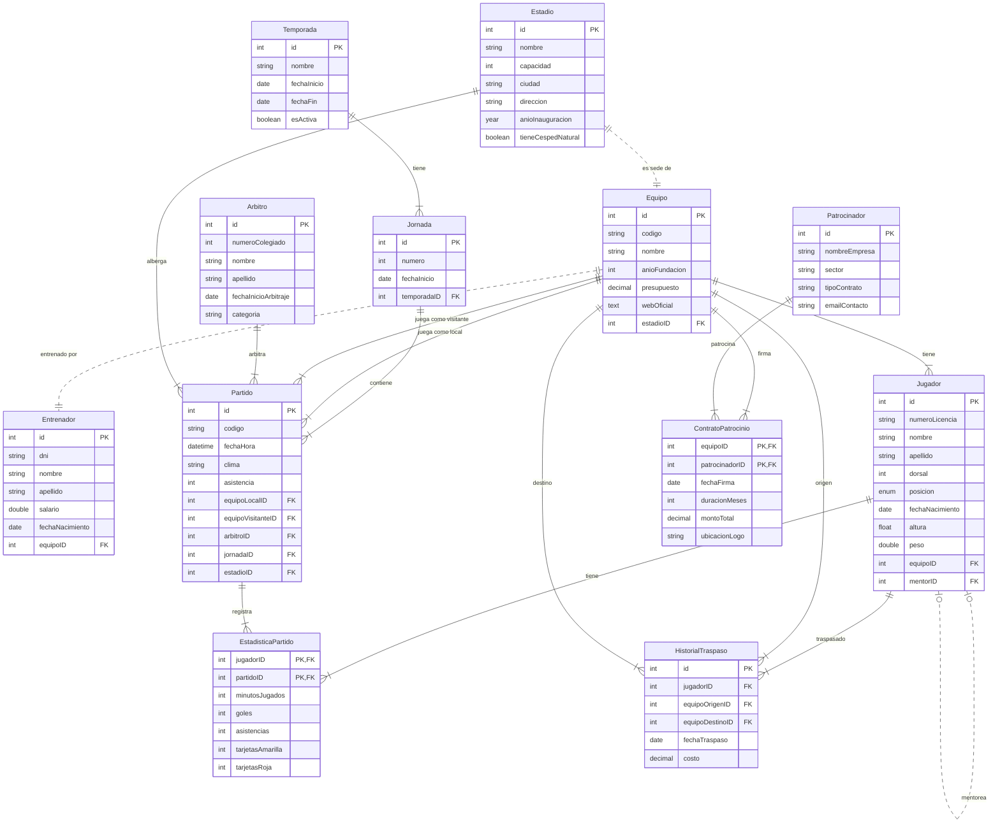

```mermaid
erDiagram
    Estadio {
        int id PK
        string nombre
        int capacidad
        string ciudad
        string direccion
        year anioInauguracion
        boolean tieneCespedNatural
    }
    Equipo {
        int id PK
        string codigo
        string nombre
        int anioFundacion
        decimal presupuesto
        text webOficial
        int estadioID FK
    }
    Entrenador {
        int id PK
        string dni
        string nombre
        string apellido
        double salario
        date fechaNacimiento
        int equipoID FK
    }
    Jugador {
        int id PK
        string numeroLicencia
        string nombre
        string apellido
        int dorsal
        enum posicion
        date fechaNacimiento
        float altura
        double peso
        int equipoID FK
        int mentorID FK
    }
    Arbitro {
        int id PK
        int numeroColegiado
        string nombre
        string apellido
        date fechaInicioArbitraje
        string categoria
    }
    Temporada {
        int id PK
        string nombre
        date fechaInicio
        date fechaFin
        boolean esActiva
    }
    Jornada {
        int id PK
        int numero
        date fechaInicio
        int temporadaID FK
    }
    Partido {
        int id PK
        string codigo
        datetime fechaHora
        string clima
        int asistencia
        int equipoLocalID FK
        int equipoVisitanteID FK
        int arbitroID FK
        int jornadaID FK
        int estadioID FK
    }
    EstadisticaPartido {
        int jugadorID PK,FK
        int partidoID PK,FK
        int minutosJugados
        int goles
        int asistencias
        int tarjetasAmarilla
        int tarjetasRoja
    }
    Patrocinador {
        int id PK
        string nombreEmpresa
        string sector
        string tipoContrato
        string emailContacto
    }
    ContratoPatrocinio {
        int equipoID PK,FK
        int patrocinadorID PK,FK
        date fechaFirma
        int duracionMeses
        decimal montoTotal
        string ubicacionLogo
    }
    HistorialTraspaso {
        int id PK
        int jugadorID FK
        int equipoOrigenID FK
        int equipoDestinoID FK
        date fechaTraspaso
        decimal costo
    }

    Estadio ||..|| Equipo : "es sede de"
    Equipo ||..|| Entrenador : "entrenado por"
    Equipo ||--|{ Jugador : "tiene"
    Jugador |o..o| Jugador : "mentorea"
    Temporada ||--|{ Jornada : "tiene"
    Jornada ||--|{ Partido : "contiene"
    Equipo ||--|{ Partido : "juega como local"
    Equipo ||--|{ Partido : "juega como visitante"
    Arbitro ||--|{ Partido : "arbitra"
    Estadio ||--|{ Partido : "alberga"
    Jugador ||--|{ EstadisticaPartido : "tiene"
    Partido ||--|{ EstadisticaPartido : "registra"
    Equipo ||--|{ ContratoPatrocinio : "firma"
    Patrocinador ||--|{ ContratoPatrocinio : "patrocina"
    Jugador ||--|{ HistorialTraspaso : "traspasado"
    Equipo ||--|{ HistorialTraspaso : "origen"
    Equipo ||--|{ HistorialTraspaso : "destino"
```
