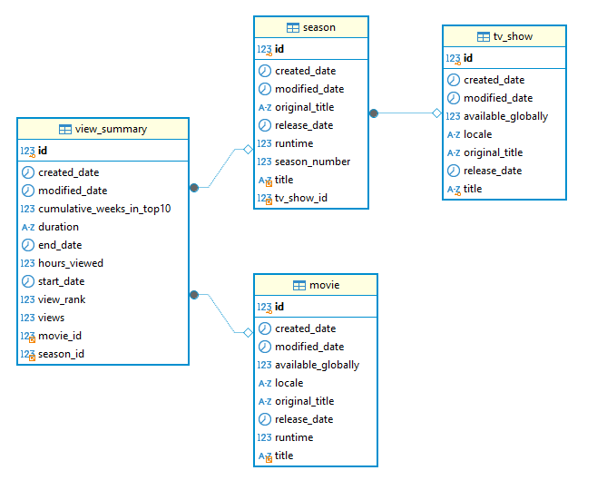

# Base de Datos: Sakila

## Descripción

🍿 ¿Qué es NetflixDB? 

Es una base de datos que usa datos reales de netflix desde informes de audiencia de la plataforma. Incluye información sobre películas, series, temporadas, episodios y visualizaciones.

- [Script de creación](netflix.schema.sql)
- [Script de inserción](netflix.data.sql)

!!! info "Esquema"

    