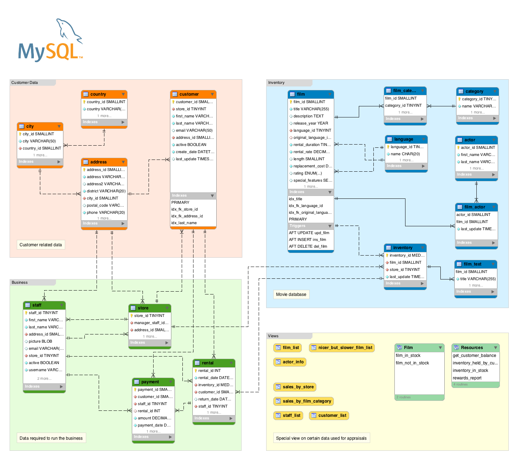

# Base de Datos: Sakila

## Descripción

🍿 ¿Qué es Sakila? 

Es el **estándar de oro** de las bases de datos de ejemplo creadas por [MySQL](https://dev.mysql.com/doc/sakila/en/sakila-installation.html). Su objetivo es que podáis practicar consultas reales sobre un esquema que imita un negocio real de alquiler de películas. 

La base de datos

**Sakila** consta de **16 tablas** que modelan todo el ecosistema de un videoclub. Para que sea más fácil de estudiar, se suelen agrupar por su función en el negocio: 

🎬 Inventario de Películas 

- **`film`**: La tabla principal con los títulos, descripciones, años de estreno y tarifas de alquiler.
- **`actor`**: Listado de actores con su nombre y apellidos.
- **`category`**: Las categorías o géneros (acción, comedia, etc.).
- **`language`**: Idiomas disponibles para las películas (audio y subtítulos).
- **`film_actor`**: Tabla intermedia que relaciona actores con películas (una película tiene varios actores y viceversa).
- **`film_category`**: Tabla intermedia que asigna una o más categorías a cada película.
- **`film_text`**: Una tabla especial para búsquedas de texto que replica el título y la descripción de las películas. 

👥 Datos de Clientes y Personal 

- **`customer`**: Información de los clientes (nombre, email, tienda habitual y si están activos).
- **`staff`**: Datos de los empleados, incluyendo fotos (BLOB) y credenciales de acceso.
- **`store`**: Define las tiendas físicas, vinculándolas a un gerente y una dirección. 

🌍 Ubicación Geográfica 

- **`address`**: Direcciones completas, distritos y números de teléfono.
- **`city`**: Listado de ciudades vinculadas a sus respectivos países.
- **`country`**: Los países donde residen los clientes o se ubican las tiendas. 

💳 Operaciones de Negocio 

- **`inventory`**: Representa las copias físicas de cada película disponibles en cada tienda.
- **`rental`**: Registra cada alquiler: quién alquiló qué, cuándo se lo llevó y cuándo lo devolvió.
- **`payment`**: Almacena los pagos realizados por los clientes asociados a un alquiler específico.

**Scripts**

- [Script de creación](sakila.schema.sql)
- [Script de inserción](sakila.data.sql)

!!! info "Esquema"

    