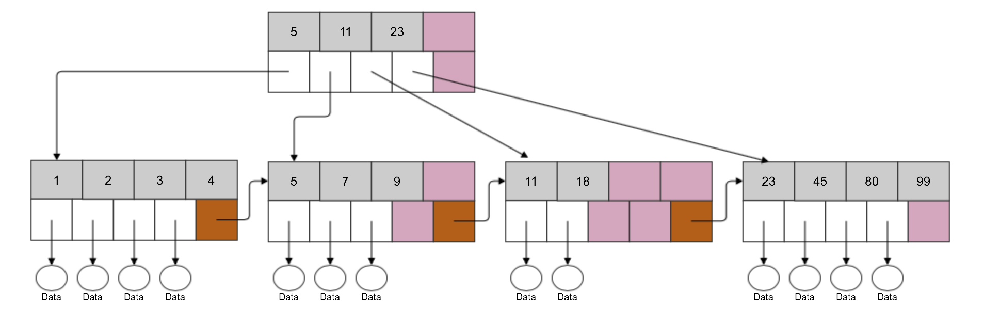

# 📊 **SQL (DML). Consultas Avanzadas**

!!! info "Información de la unidad"

    === "Contenidos"

        Realización de consultas:

        - Consultas de resumen.
        - Agrupamiento de registros.
        - Funciones ventana.
        - Subconsultas.
        - Optimización de consultas.

        Bases de datos relacionales:

        - Vistas.
  
    === "Propuesta didáctica"

          Una vez conocido el modelo relacional, en esta unidad vamos a comenzar a trabajar el RA3 "**Consulta la información almacenada en una base de datos empleando asistentes, herramientas gráficas y el lenguaje de manipulación de datos.**",

          Criterios de evaluación

        - **CE3a**: Se han identificado las herramientas y sentencias para realizar consultas.
        - **CE3b**: Se han realizado consultas simples sobre una tabla.
        - **CE3c**: Se han realizado consultas sobre el contenido de varias tablas mediante composiciones internas.
        - **CE3d**: Se han realizado consultas sobre el contenido de varias tablas mediante composiciones externas.definición y control de datos.
        - **CE3e**: Se han realizado consultas resumen.
        - **CE2f**: Se han creado vistas.


!!! info "Bases de datos recursos"

    Aquí tienes los enlaces a las bases de datos de recursos para esta unidad:

    - [Sakila](bd/sakila/sakila.md)
    - [Universidad](../04/res/UniversidadA.md)
    - [LigaFutbol](../04/res/liga_futbol.md)


En este tema abordaremos 2 grandes bloques:

1. Consultas agregadas o resumen
2. Subconsultas y optimización

---

## 📈 **1.1 Consultas agregadas o resumen**
Vamos a recordar la sintaxis para realizar una consulta con la sentencia `SELECT` en MySQL:

```sql
SELECT [DISTINCT] select_expr [, select_expr ...]
[FROM table_references]
[WHERE where_condition]
[GROUP BY {col_name | expr | position} [ASC | DESC], ... [WITH ROLLUP]]
[HAVING where_condition]
[ORDER BY {col_name | expr | position} [ASC | DESC], ...]
[LIMIT {[offset,] row_COUNT | row_COUNT OFFSET offset}]
```

Es muy importante conocer **en qué orden se ejecuta cada una de las cláusulas** que forman la sentencia `SELECT`. El orden de ejecución es el siguiente:

- Cláusula `FROM`.
- Cláusula `WHERE` (Es opcional, puede ser que no aparezca).
- Cláusula `GROUP BY` (Es opcional, puede ser que no aparezca).
- Cláusula `HAVING` (Es opcional, puede ser que no aparezca).
- Cláusula `SELECT`.
- Cláusula `ORDER BY` (Es opcional, puede ser que no aparezca).
- Cláusula `LIMIT` (Es opcional, puede ser que no aparezca).

**En esta unidad vamos a trabajar con dos nuevas cláusulas `GROUP BY` y `HAVING`.**

### Funciones de agregación

Estas funciones realizan una operación específica sobre todas las filas de un grupo.

Las funciones de agregación más comunes son:

| Función | Descripción |
| --- | --- |
| `MAX(expr)` | Valor máximo del grupo |
| `MIN(expr)` | Valor mínimo del grupo |
| `AVG(expr)` | Valor medio del grupo |
| `SUM(expr)` | Suma de todos los valores del grupo |
| `COUNT(*)` | Número de filas que tiene el resultado de la consulta |
| `COUNT(columna)` | Número de valores no nulos que hay en esa columna |

En la [documentación oficial de MySQL](https://dev.mysql.com/doc/refman/5.7/en/group-by-functions.html) puede encontrar una lista completa de todas las funciones de agregación que se pueden usar.

> **Importante:** Las funciones de agregación sólo se pueden usar en las cláusulas `SELECT` Y `HAVING`.

#### Diferencia entre `COUNT(*)` y `COUNT(columna)`

- `COUNT(*)`: Calcula el número de filas que tiene el resultado de la consulta.
- `COUNT(columna)`: Cuenta el número de valores no nulos que hay en esa columna.

**Importante:** Tenga en cuenta la diferencia que existe entre las funciones `COUNT(*)` y `COUNT(columna)`, ya que devolverán resultados diferentes cuando haya valores nulos en la columna que estamos usando en la función.

**Ejemplos:**

Supongamos que tenemos los siguientes valores en la tabla `alumno`:

| id | nombre | apellido1 | apellido2 | fecha\_nacimiento | es\_repetidor | teléfono |
| --- | --- | --- | --- | --- | --- | --- |
| 1 | María | Sánchez | Pérez | 1990/12/01 | no | `NULL` |
| 2 | Juan | Sáez | Vega | 1998/04/02 | no | 618253876 |
| 3 | Pepe | Ramírez | Gea | 1988/01/03 | no | `NULL` |
| 4 | Lucía | López | Ruiz | 1993/06/13 | sí | 678516294 |

La consulta:

```sql
SELECT COUNT(teléfono)
FROM alumno;
```

devolverá:

| COUNT(teléfono) |
| --- |
| 2 |

mientras que la consulta:

```sql
SELECT COUNT(*)
FROM alumno;
```

| COUNT(\*) |
| --- |
| 4 |

### Contar valores distintos

Supongamos que tenemos los siguientes valores en la tabla `producto`:

| id | nombre | precio | código\_fabricante |
| --- | --- | --- | --- |
| 1 | Disco duro SATA3 1TB | 86 | 5 |
| 2 | Memoria RAM DDR4 8GB | 120 | 4 |
| 3 | Disco SSD 1 TB | 150 | 5 |
| 4 | GeForce GTX 1050Ti | 185 | 5 |

Y nos piden calcular el número de valores distintos de código de fabricante que aparecen en la tabla `producto`.

```sql
SELECT COUNT(DISTINCT código_fabricante)
FROM producto;
```

Esta consulta devolverá:

| COUNT(DISTINCT código\_fabricante) |
| --- |
| 2 |


### **La cláusula GROUP BY**

La cláusula [`GROUP BY`](https://mariadb.com/kb/en/group-by/) se utiliza para agrupar filas que tienen valores iguales en una o más columnas. Esto permite aplicar funciones de agregación como `SUM`, `COUNT`, `AVG`, etc., a cada grupo, es decir, permite realizar cálculos en vertical, sobre el resultado de agrupar registros.


<figure>
    
    <figcaption>Funcionamiento de GROUP BY</figcaption>
</figure>

Los pasos que vamos a realizar son:

1. `select`: Indicar las columnas a agrupar.
2. `select`: Indicar los cálculos mediante funciones agregadas (`count`, `sum`, `max`, `min`, `avg`, ...)
3. `GROUP BY`: indicar las agrupaciones (deben coincidir al menos con las columnas a mostrar)


Para demostrar su uso, nos vamos a centrar en los pagos realizados por los clientes. Veamos los datos que tenemos en la tabla `payment`:

```sql
SELECT customer_id, amount, payment_date 
FROM payment 
LIMIT 6;
```

| customer_id | amount | payment_date |
| :--- | :--- | :--- |
| 1 | 2.99 | 2005-05-25 11:30:37 |
| 1 | 0.99 | 2005-05-28 10:35:23 |
| 1 | 5.99 | 2005-06-15 00:54:12 |
| 2 | 0.99 | 2005-06-15 18:02:53 |
| 2 | 9.99 | 2005-06-15 21:08:46 |
| 3 | 4.99 | 2005-06-15 19:20:11 |

Podemos observar que un mismo cliente puede tener varios pagos. ¿Y si queremos saber el total que ha gastado cada cliente? Para ello, necesitamos agrupar por el ID del cliente y sumar sus pagos. En la parte de `select` indicamos los datos a mostrar, y en `group by` las columnas por las que debe agrupar:

```sql
SELECT customer_id, SUM(amount) 
FROM payment 
GROUP BY customer_id 
LIMIT 3;
```

| customer_id | SUM(amount) |
| :--- | :--- |
| 1 | 118.68 |
| 2 | 128.73 |
| 3 | 135.74 |

Es decir, el valor de `118.68` del cliente `1` se obtiene de sumar todas las filas de la tabla de pagos de dicho cliente. Dicho de otro modo, al realizar una agrupación, juntamos las filas que tienen el mismo valor en la columna agrupada, y realiza el cálculo indicado con dichas filas.

¿Y si quiero obtener el nombre del cliente en vez de su código? Podemos pensar que, si hago un _join_ y muestro su nombre y el pago, obtendré la misma información:

```sql
SELECT c.first_name, c.last_name, p.amount 
FROM payment p 
JOIN customer c ON p.customer_id = c.customer_id 
LIMIT 4;
```

| first_name | last_name | amount |
| :--- | :--- | :--- |
| MARY | SMITH | 2.99 |
| MARY | SMITH | 0.99 |
| MARY | SMITH | 5.99 |
| PATRICIA | JOHNSON | 0.99 |

Pero no. Obtengo el resultado de realizar la combinación de las dos tablas, no el cálculo agregado. Así pues, necesito agrupar el resultado del _join_:

```sql
SELECT c.first_name, c.last_name, SUM(p.amount) 
FROM payment p 
JOIN customer c ON p.customer_id = c.customer_id 
GROUP BY c.customer_id 
LIMIT 3;
```

| first_name | last_name | SUM(p.amount) |
| :--- | :--- | :--- |
| MARY | SMITH | 118.68 |
| PATRICIA | JOHNSON | 128.73 |
| LINDA | WILLIAMS | 135.74 |

### Agrupaciones con combinaciones externas

Imagina que queremos calcular cuántos alquileres tiene cada cliente:

```sql
SELECT c.first_name, c.last_name, COUNT(r.rental_id) 
FROM customer c 
INNER JOIN rental r ON c.customer_id = r.customer_id 
GROUP BY c.customer_id 
LIMIT 3;
```

| first_name | last_name | COUNT(r.rental_id) |
| :--- | :--- | :--- |
| MARY | SMITH | 32 |
| PATRICIA | JOHNSON | 28 |
| LINDA | WILLIAMS | 26 |

Al realizar una agrupación, juntamos las filas que tienen el mismo valor en la columna agrupada, y realiza el cálculo indicado con dichas filas. Sin embargo, si usamos un `inner join`, sólo aparecen los clientes que tienen alquileres. Si nos interesa que aparezcan todos los clientes, y si no tienen alquileres que salga 0, necesitamos hacer un _left join_:

```sql
SELECT c.first_name, c.last_name, COUNT(r.rental_id) 
FROM customer c 
LEFT JOIN rental r ON c.customer_id = r.customer_id 
GROUP BY c.customer_id 
LIMIT 3;
```

| first_name | last_name | COUNT(r.rental_id) |
| :--- | :--- | :--- |
| MARY | SMITH | 32 |
| PATRICIA | JOHNSON | 28 |
| LINDA | WILLIAMS | 26 |

### Agrupaciones compuestas

También es posible agrupar por más de una columna. Por ejemplo, podemos obtener la recaudación po tienda y empleado. Para ello, combinamos las tablas y agrupamos por el criterio deseado:

```sql
SELECT s.store_id, st.first_name, st.last_name, SUM(p.amount) 
FROM payment p 
JOIN staff st ON p.staff_id = st.staff_id 
JOIN store s ON st.store_id = s.store_id 
GROUP BY s.store_id, st.staff_id;
```

| store_id | first_name | last_name | SUM(p.amount) |
| :--- | :--- | :--- | :--- |
| 1 | Mike | Hillyer | 33489.47 |
| 2 | Jon | Stephens | 33927.04 |


### **`SELECT` N - `GROUP BY`**

Es importante destacar que al menos la cantidad y datos que utilizamos en la proyección (`SELECT`) que agrupan, también hemos de utilizarlos dentro del `GROUP BY`. Dicho de otro modo, si en el `SELECT` ponemos tres columnas y dos cálculos, en el `GROUP BY` deberemos poner las tres mismas columnas.

Es decir, **no debemos hacer esto** (dos en `SELECT`, uno en `GROUP BY`), ya que no estaría mostrando la información que queremos. Si repetimos el ejemplo anterior, obtenemos un resultado en _MariaDB_ , pero lo que obtenemos no es correcto (en _PosgreSQL_ directamente obtendremos un error):

```sql
SELECT s.store_id, st.first_name, st.last_name, SUM(p.amount)
FROM payment p
JOIN staff st ON p.staff_id = st.staff_id
JOIN store s ON st.store_id = s.store_id
GROUP BY s.store_id;
```

| store_id | first_name | last_name | SUM(p.amount) |
| :--- | :--- | :--- | :--- |
| 1 | Mike | Hillyer | 67416.51 |

En cambio, sí que es correcto agrupar por más columnas de las que mostramos (aunque su uso es cuestionable):

```sql
SELECT s.store_id, SUM(p.amount)
FROM payment p
JOIN staff st ON p.staff_id = st.staff_id
JOIN store s ON st.store_id = s.store_id
GROUP BY s.store_id, st.staff_id;
```

| store_id | SUM(p.amount) |
| :--- | :--- |
| 1 | 33489.47 |
| 2 | 33927.04 |

### **`ROLLUP` (Resúmenes de totales)**

Cuando hacemos una consulta con una agregación, podemos emplear la cláusula [SELECT ... WITH ROLLUP](https://mariadb.com/kb/en/select-with-rollup/) para que añada filas extras con totales de la agregación.

Si recuperamos la consulta que obtenía la recaudación por cliente, pero le añadimos `WITH ROLLUP` podemos observar cómo añade al resultado una nueva fila con el gran total:

```sql
SELECT customer_id, SUM(amount)
FROM payment
GROUP BY customer_id WITH ROLLUP
LIMIT 4;
```

| customer_id | SUM(amount) |
| :--- | :--- |
| 1 | 118.68 |
| 2 | 128.73 |
| 3 | 135.74 |
| NULL | 67416.51 |

En el caso de que la consulta agrupe por más de un valor, mostrará los diferentes subtotales:

```sql
SELECT s.store_id, st.staff_id, SUM(p.amount)
FROM payment p
JOIN staff st ON p.staff_id = st.staff_id
JOIN store s ON st.store_id = s.store_id
GROUP BY s.store_id, st.staff_id WITH ROLLUP;
```

| store_id | staff_id | SUM(p.amount) |
| :--- | :--- | :--- |
| 1 | 1 | 33489.47 |
| 1 | NULL | 33489.47 |
| 2 | 2 | 33927.04 |
| 2 | NULL | 33927.04 |
| NULL | NULL | 67416.51 |

!!! info "PostgreSQL"

    En el caso de _PostgreSQL_ cabe destacar que no tiene soporte para `WITH ROLLUP`. En cambio, dispone de otras funciones similares como `GROUPING SETS`, `CUBE` y `ROLLUP`.

🔍 **Filtrando grupos con HAVING**

La cláusula `HAVING` permite filtrar tras realizar los cálculos de agrupación. Sería similar al `WHERE` pero una vez realizados los datos agregados.

El orden de ejecución de las cláusulas dentro de una consulta es:

1. `WHERE` que filtra las filas según las condiciones que pongamos.
2. `GROUP BY` que crea una tabla agregada a partir de las columnas que agrupa.
3. `HAVING` filtra los grupos.
4. `ORDER BY` que ordena o clasifica la salida.

Para estos ejemplos, nos vamos a centrar en los clientes que han gastado mucho dinero. Para ello, agrupamos por el ID del cliente y sumamos sus pagos:

```sql
SELECT customer_id, SUM(amount) AS total
FROM payment
GROUP BY customer_id
LIMIT 3;
```

| customer_id | total |
| :--- | :--- |
| 1 | 118.68 |
| 2 | 128.73 |
| 3 | 135.74 |

Si de este resultado quiero filtrar aquellos que han gastado más de 180, necesito hacerlo mediante la cláusula `HAVING`:

```sql
SELECT customer_id, SUM(amount) AS total
FROM payment
GROUP BY customer_id
HAVING total > 180;
```

| customer_id | total |
| :--- | :--- |
| 144 | 189.73 |
| 148 | 211.55 |
| 526 | 208.58 |

Por supuesto, también podemos incluir un filtrado previo a la ejecución. Por ejemplo, para obtener el total gastado por cliente, pero contando solo los pagos individuales superiores a 10, y que el total final sea superior a 50:

```sql
SELECT customer_id, SUM(amount) AS total
FROM payment
WHERE amount > 10
GROUP BY customer_id
HAVING total > 50;
```

| customer_id | total |
| :--- | :--- |
| 211 | 54.91 |
| 526 | 54.91 |

Recuerda que `WHERE` filtra las filas antes de aplicar la agrupación, mientras que `HAVING` filtra los grupos después de que se han calculado las funciones de agregación.

### ⚙️ **Orden de ejecución de las cláusulas**

En este punto que ya hemos visto la mayoría de las cláusulas dentro de una consulta SQL, es conveniente tener claro su orden de ejecución.

Las etapas de ejecución de una consulta son:

1. `FROM` y `JOIN`: selección de tablas y su combinación, tanto internas como externas
2. `WHERE`: filtrado de los datos
3. `GROUP BY`: agrupación/agregación
4. `HAVING`: filtrado de la agrupación
5. `SELECT` y `DISTINCT`: proyección de los campos
6. `ORDER BY`: ordenación del resultado
7. `LIMIT`: filtrado del resultado

A modo de ejemplo tendríamos:

```text
SELECT DISTINCT c.NomCen                -- 5.1 y 5.2 
FROM departamento d                     -- 1.1 
JOIN centro c ON d.CodCen = c.CodCen    -- 1.2 
WHERE d.PreAnu > 20000000               -- 2                          
GROUP BY c.NomCen                       -- 3 
HAVING SUM(d.PreAnu) > 100000000        -- 4 
ORDER BY c.CodCen                       -- 6 
LIMIT 1 OFFSET 2                        -- 7
```

### ❌ **Errores comunes y buenas prácticas**

De forma general, los errores más comunes a la hora de realizar consultas son:

- No usar `WHERE` en las modificaciones o eliminaciones. ¡No te olvide de poner el `WHERE` en el `DELETE FROM`!
    
- Confundir la comparación de valores nulos, utilizando la asignación en vez del operador `IS NULL`:
    
    ```text
    -- Incorrecto 
    SELECT * FROM empleado WHERE ExTelEmp = NULL;

    -- Correcto 
    SELECT * FROM empleado WHERE ExTelEmp IS NULL;
    ```
    
- No comprobar la existencia de uno o más valores en las subconsultas. Si la subconsulta devuelve un único registro, podemos usar `=`. Si no, deberemos utilizar `IN`:
    
    ```text
    -- Incorrecto si la subconsulta retorna más de una fila 
    SELECT * FROM departamento WHERE PreAnu = (SELECT MAX(PreAnu) FROM departamento);

    -- Mejor, ya que podemos tener dos departamentos con el mismo presupuesto máximo 
    SELECT * FROM departamento WHERE PreAnu IN (SELECT MAX(PreAnu) FROM departamento);
    ```
    
- Utilizar `HAVING` para filtrar filas en lugar de `WHERE`: La cláusula `HAVING` se ejecuta después de `GROUP BY` y está pensada para filtrar datos agregados. Si estás filtrando datos no agregados, pertenece a la cláusula `WHERE`. Conocer la diferencia en el orden de ejecución entre WHERE y HAVING te ayuda a determinar dónde debe colocarse cada condición.
    
    Si quiero obtener los departamentos que tiene más de 5 empleados:
    
    ```text
    -- Incorrecto 
    SELECT CodDep, COUNT(*) AS total 
    FROM empleado 
    WHERE COUNT(*) > 5 
    GROUP BY CodDep; 

    -- Correcto 
    SELECT CodDep, COUNT(*) AS total 
    FROM empleado 
    GROUP BY CodDep 
    HAVING COUNT(*) > 5;
    ```
    
- Uso incorrecto de agregaciones en `SELECT` sin `GROUP BY`: Puesto que `GROUP BY` se ejecuta antes que `HAVING` o `SELECT`, si no agrupas tus datos antes de aplicar una función de agregado, se producirán resultados incorrectos o errores. Comprender el orden de ejecución aclara por qué estas dos cláusulas deben ir juntas.

## 🪟 1.2 Funciones ventana

Desde [SQL:2003](https://en.wikipedia.org/wiki/SQL:2003) podemos emplear las [funciones ventana](https://mariadb.com/kb/en/window-functions-overview/), las cuales son similares a las consultas `group by` en cuanto que permiten ejecutar funciones agregadas en varias filas. La diferencia es que permiten funciones de agregación incorporadas sin necesidad de agrupar cada campo en una sola fila, es decir, permiten realizar cálculos en horizontal.

<figure>
    
    <figcaption>Funciones Ventana</figcaption>
</figure>

!!! info "Funciones ventana de forma sencilla"

    Imagina que estás en un **autobús escolar**. 

    - **GROUP BY (El Resumen):** Es como si el profesor gritara: _"¡Que levanten la mano los de 1º de ESO!"_. Él solo cuenta cuántos hay y apunta un número en su libreta. Al final, solo tiene un resumen (1º ESO -> 20 alumnos), pero **ha perdido de vista quién es cada alumno**.
    - **WINDOW FUNCTIONS (La Ventana):** Es como si cada alumno tuviera una **ventanita mágica** al lado de su asiento. El alumno sigue sentado en su sitio (no perdemos su identidad), pero en su ventana puede ver información de su grupo. Por ejemplo, cada alumno de 1º de ESO puede mirar su ventana y ver: _"En mi clase somos 20 y yo soy el número 3 de la lista"_.

    > **La clave**: La función ventana no "machaca" las filas. Agrega información manteniendo el detalle de cada registro.

Para usar una función ventana, siempre seguimos esta estructura:

`FUNCION() OVER (PARTITION BY columna1 ORDER BY columna2)` 

1. **`OVER`**: Es la palabra clave que le dice a SQL: "Ojo, esto no es un agregado normal, es una ventana".
2. **`PARTITION BY`**: Es el "grupo" (como la clase del autobús). Si no lo pones, la ventana es toda la tabla.
3. **`ORDER BY`**: Es el orden dentro de ese grupo (quién va primero en la lista).


### **Sintaxis y Estructura**

Para transformar una función normal en una función ventana, añadimos la cláusula `OVER`:

```sql
FUNCION_O_AGREGADO(...) OVER (
    [PARTITION BY columnas_para_agrupar]
    [ORDER BY columnas_para_ordenar]
)
```

1.  **`PARTITION BY`**: Define la "ventana" o grupo. Es similar al `GROUP BY`, pero solo para el cálculo de esa columna. El contador o acumulador se reinicia cuando cambia este valor.
2.  **`ORDER BY`**: Define el orden dentro de la ventana. Es crucial para rankings o sumas acumuladas.

---

### 🔄 **Interacción entre `GROUP BY` y Funciones Ventana**

Una de las dudas más comunes es: **¿Puedo usar `GROUP BY` y Funciones Ventana en la misma consulta?**

**SÍ.** Pero es vital entender el **orden de ejecución**.

El motor de base de datos ejecuta las cláusulas en este orden:
1.  `FROM` / `JOIN`
2.  `WHERE`
3.  **`GROUP BY`** (Aquí se comprimen las filas)
4.  `HAVING`
5.  **`WINDOW FUNCTIONS`** (Se calculan sobre las filas resultantes del agrupamiento)
6.  `SELECT`
7.  `ORDER BY`

Esto significa que **la función ventana actúa sobre el resultado del agrupamiento**.

!!! info "Caso 1: Funciones Ventana SIN `GROUP BY` (Datos en crudo)"
    Aquí trabajamos sobre las filas originales. Podemos mezclar columnas normales con cálculos de ventana.

    *Ejemplo: Listar cada película, su duración y la duración media de su categoría.*

    ```sql
    SELECT title, length, category_id,
        AVG(length) OVER (PARTITION BY category_id) as media_categoria
    FROM film f 
    JOIN film_category fc USING(film_id);
    ```
    *Aquí no usamos `GROUP BY` porque queremos ver cada película individualmente.*

!!! info "Caso 2: Funciones Ventana CON `GROUP BY` (Datos Agrupados)"
    Aquí primero agrupamos los datos y luego aplicamos una función ventana (como un Ranking) sobre esos grupos resultantes.

    *Ejemplo: Queremos un Ranking de las categorías con más películas. Primero contamos películas por categoría (`GROUP BY`) y luego asignamos el ranking (`RANK OVER`).*

    ```sql
    SELECT category_id, 
        COUNT(*) as total_peliculas,  -- Agregación normal (colapsa filas)
        RANK() OVER (ORDER BY COUNT(*) DESC) as ranking -- Ventana sobre el agrupado
    FROM film_category
    GROUP BY category_id; -- Obligatorio para usar COUNT(*)
    ```

    | category_id | total_peliculas | ranking |
    | :--- | :--- | :--- |
    | 15 | 74 | 1 |
    | 9 | 73 | 2 |
    | 8 | 68 | 3 |

    > **Observa:** Dentro del `OVER (ORDER BY ...)` hemos puesto `COUNT(*)`. Esto es porque la función ventana necesita saber cómo ordenar los grupos ya creados.

---

### 🧮 **Tipos de Funciones Ventana**

Podemos clasificar las funciones que usamos con `OVER` en tres tipos. Es importante notar que **las funciones de agregación clásicas (SUM, AVG) pueden comportarse como funciones ventana**.

#### **1. Funciones de Agregación como Ventana (`SUM`, `AVG`, `COUNT`, `MAX`...)**
Si usas `SUM(x)` sin `OVER`, necesitas `GROUP BY`. Si usas `SUM(x) OVER(...)`, es una función ventana.

*   **Sin `ORDER BY` dentro del OVER:** Calcula el total del grupo y lo repite en cada fila.
*   **Con `ORDER BY` dentro del OVER:** Calcula un **acumulado (Running Total)**.

*Ejemplo: Suma acumulada de pagos por fecha.*

```sql
SELECT payment_date, amount,
       SUM(amount) OVER (ORDER BY payment_date) as total_acumulado
FROM payment
LIMIT 5;
```

| payment_date | amount | total_acumulado |
| :--- | :--- | :--- |
| 2005-05-24... | 2.99 | 2.99 |
| 2005-05-24... | 0.99 | 3.98 (2.99 + 0.99) |
| 2005-05-24... | 5.99 | 9.97 (3.98 + 5.99) |

#### **2. Funciones de Ranking (`ROW_NUMBER`, `RANK`, `DENSE_RANK`)**
Estas funciones **solo** existen como funciones ventana. Sirven para enumerar filas.

*   `ROW_NUMBER()`: Numera 1, 2, 3, 4... (Sin empates).
*   `RANK()`: Numera 1, 2, 2, 4... (Con empates y saltos).
*   `DENSE_RANK()`: Numera 1, 2, 2, 3... (Con empates pero sin saltos).

*Ejemplo: Ranking de clientes por gastos (usando GROUP BY y Ventana a la vez).*

```sql
SELECT customer_id, 
       SUM(amount) as total_gastado,
       RANK() OVER (ORDER BY SUM(amount) DESC) as posicion_ranking
FROM payment
GROUP BY customer_id
LIMIT 3;
```

#### **3. Funciones de Valor (`LAG`, `LEAD`)**
Permiten acceder a datos de una fila anterior (`LAG`) o posterior (`LEAD`) sin hacer subconsultas complejas.

*Ejemplo: Comparar lo que pagó un cliente hoy vs lo que pagó la vez anterior.*

```sql
SELECT customer_id, payment_date, amount,
       LAG(amount) OVER (PARTITION BY customer_id ORDER BY payment_date) as pago_anterior,
       amount - LAG(amount) OVER (PARTITION BY customer_id ORDER BY payment_date) as diferencia
FROM payment
ORDER BY customer_id, payment_date;
```

---

### 🧪 **Resumen: ¿Qué puedo mezclar en el SELECT?**

A menudo surge la duda al construir el `SELECT`: *¿Qué columnas puedo poner?*

| Escenario | Cláusulas | ¿Qué va en el SELECT? |
| :--- | :--- | :--- |
| **Agregación Simple** | `GROUP BY A` | Solo columna `A` y funciones agregadas como `SUM(B)`, `COUNT(*)`. No puedes poner `C` si no agrupas por ella. |
| **Ventana Simple** | `OVER(...)` (Sin Group By) | Cualquier columna de la tabla (`A`, `B`, `C`) y cualquier función ventana `SUM(B) OVER(...)`. Mantiene todas las filas. |
| **Híbrido** | `GROUP BY A` + `OVER(...)` | Solo columna `A`, agregaciones `SUM(B)` y funciones ventana aplicadas **sobre las agregaciones** `RANK() OVER (ORDER BY SUM(B))`. |

!!! failure "Error Común"
    ```sql
    -- ESTO FALLARÁ
    SELECT customer_id, 
           amount, -- Error: 'amount' no está en GROUP BY y no tiene función agregada
           RANK() OVER (ORDER BY amount) 
    FROM payment
    GROUP BY customer_id;
    ```
    *Solución:* O quitas el `GROUP BY` (si quieres ver cada pago), o aplicas `SUM(amount)` si quieres agrupar por cliente.

---

🎓 **¿Quieres saber más?**

Las funciones ventana son un aspecto avanzado. Si quieres profundizar, te recomiendo:

- [_Guía de funciones ventana SQL_](https://hackernoon.com/lang/es/una-guia-para-principiantes-para-comprender-las-funciones-de-ventana-sql-y-sus-capacidades)
- [Documentación sobre marcos de ventana (Window Frames)](https://mariadb.com/kb/en/window-frames/)


## 🖼️ 1.3 **Vistas**

Si retomamos la [arquitectura de tres niveles](https://aitor-medrano.github.io/bd/01intro.html#arquitectura-de-3-niveles) que estudiamos en la primera unidad, un esquema externo, que es a lo que accede el usuario final, se compone de un conjunto de tablas y vistas que luego se transforman en formularios e informes.

Una vista es un objeto que se define con una consulta y que se comporta como una **tabla virtual**. Cuando un usuario accede a una vista, no percibe si los datos están físicamente en una tabla o son el resultado de una consulta dinámica.

<figure>
    
    <figcaption>Vistas</figcaption>
</figure>

**Creación de una vista**

Para crear una vista, usaremos la sentencia [`CREATE [OR REPLACE] VIEW nombre AS SELECT...`](https://mariadb.com/kb/en/create-view/).

Por ejemplo, vamos a crear una vista llamada `premium_films` que solo contenga las películas cuyo precio de alquiler sea superior a 4.00:

```sql
CREATE VIEW premium_films AS
SELECT film_id, title, rental_rate, replacement_cost
FROM film
WHERE rental_rate > 4.00;
```

Una vez creada, podemos realizar consultas directamente sobre ella como si fuera una tabla normal:

```sql
SELECT * 
FROM premium_films 
LIMIT 3;
```

| film_id | title | rental_rate | replacement_cost |
| :--- | :--- | :--- | :--- |
| 2 | ACE GOLDFINGER | 4.99 | 12.99 |
| 7 | AIRPLANE SIERRA | 4.99 | 28.99 |
| 8 | ALADDIN CALENDAR | 4.99 | 24.99 |

**Naturaleza dinámica**

Las vistas son dinámicas, lo que significa que reflejan automáticamente cualquier cambio en la tabla original. Si insertamos una nueva película en `film` que cumpla la condición del `WHERE`, aparecerá inmediatamente en nuestra vista:

```sql
INSERT INTO film (title, language_id, rental_rate, replacement_cost) 
VALUES ('ZODIAC SQL', 1, 4.99, 29.99);

SELECT * 
FROM premium_films 
WHERE title = 'ZODIAC SQL';
```

| film_id | title | rental_rate | replacement_cost |
| :--- | :--- | :--- | :--- |
| 1001 | ZODIAC SQL | 4.99 | 29.99 |

**Inserción y modificación mediante vistas**

En muchos casos, es posible utilizar una [vista para insertar o modificar datos](https://mariadb.com/kb/en/inserting-and-updating-with-views/), lo que repercutirá directamente en la tabla base:

```sql
UPDATE premium_films 
SET replacement_cost = 35.00 
WHERE title = 'ZODIAC SQL';
```

!!! success "Autoevaluación"

    Podemos combinar vistas con otras tablas. ¿Qué información crees que obtendremos con la siguiente consulta?

    ```sql
    SELECT c.name, COUNT(p.film_id) AS total_premium
    FROM category c
    JOIN film_category fc ON c.category_id = fc.category_id
    JOIN premium_films p ON fc.film_id = p.film_id
    GROUP BY c.name;
    ```

**Restricciones**

A la hora de modificar datos a través de una vista, existen ciertas limitaciones:

- No se puede modificar el contenido si la vista utiliza `GROUP BY`, `DISTINCT`, `HAVING`, `UNION` o funciones de agregación.
- La vista debe incluir todos los campos obligatorios (`NOT NULL`) de la tabla base que no tengan un valor por defecto.
- No se pueden modificar campos que sean cálculos o expresiones derivadas.

**Gestión de vistas**

Para borrar una vista, utilizaremos la sentencia [`DROP VIEW nombre`](https://mariadb.com/kb/en/drop-view/):

```sql
DROP VIEW premium_films;
```

Para ver qué vistas tenemos creadas en nuestra base de datos, podemos consultar los metadatos en `information_schema.VIEWS`:

```sql
SELECT TABLE_NAME AS vistas 
FROM information_schema.VIEWS 
WHERE TABLE_SCHEMA = 'sakila';
```
 
!!! info "Vistas materializadas"

    Aunque MariaDB no las soporte de forma nativa (aunque existen plugins), otros SGBD como PostgreSQL u Oracle permiten crear **Vistas Materializadas**.

    A diferencia de las normales, estas persisten los datos en disco, lo que mejora drásticamente el rendimiento en consultas complejas, a costa de tener que "refrescarlas" cuando los datos cambian.

    Ejemplo en **PostgreSQL**:

    ```sql
    CREATE MATERIALIZED VIEW premium_films_cached AS
    SELECT title, rental_rate
    FROM film
    WHERE rental_rate > 4.00;

    -- Para actualizar los datos después de cambios en la tabla base:
    REFRESH MATERIALIZED VIEW premium_films_cached;
    ```

---

### Referencias

*   Sintaxis SQL oficial de [PostgreSQL](https://www.postgresql.org/docs/current/sql-commands.html) y [MariaDB](https://mariadb.com/kb/en/sql-statements/).
    
*   _Cheatsheets_ de [https://learnsql.com/](https://learnsql.com/) sobre:
       
    - [SQL Básico](https://learnsql.com/blog/sql-basics-cheat-sheet/sql-basics-cheat-sheet-a4.pdf)
    - [Funciones ventana](https://learnsql.com/blog/sql-window-functions-cheat-sheet/Window_Functions_Cheat_Sheet.pdf)


Aquí tienes la continuación del tema, desarrollada con mayor profundidad, más ejemplos y un enfoque especial en las CTEs como solicitaste. He mantenido el formato estético y pedagógico del archivo original.

---
## 📦 **2. Subconsultas**

Hasta ahora, nuestras consultas se basaban en unir tablas (`JOIN`) o filtrar datos directamente. Pero, ¿qué ocurre cuando la condición para filtrar un dato **depende de un cálculo previo** que desconocemos?

Una **subconsulta** (o consulta anidada) es una sentencia `SELECT` que se incrusta dentro de otra consulta principal. Actúa como un proveedor de datos dinámico: primero se resuelve la pregunta pequeña (subconsulta) para poder contestar a la pregunta grande (consulta externa).

!!! quote "Analogía: Las Muñecas Matryoshka"

    Imagina que quieres saber: *"¿Qué alumnos son más altos que el promedio de la clase?"*.
    
    No puedes responder a eso directamente porque **no sabes cuál es el promedio**.
    
    1.  **Subconsulta (La muñeca pequeña):** Calculas la altura promedio (ej. 1.70m).
    2.  **Consulta Externa (La muñeca grande):** Ahora sí, filtras: *"Dime los alumnos que miden más de 1.70m"*.

La sintaxis siempre requiere paréntesis:

```sql
SELECT columnas
FROM tabla
WHERE columna OPERADOR (SELECT ...);
```

### **2.1 Tipos de subconsultas**

Para dominar las subconsultas, debemos clasificarlas bajo dos criterios: **qué forma tiene lo que devuelven** y **cómo se ejecutan**.

#### **A. Según su resultado (La forma)**

El tipo de dato que devuelve la subconsulta determina qué operador de comparación (`=`, `IN`, `>`, etc.) podemos usar.

**1. Subconsultas Escalares (Un solo valor)**
Devuelven una única celda (una fila y una columna). Son las más sencillas y se pueden tratar como si fueran un número o un texto fijo.

*   *Ejemplo 1: Filtrar por encima de un promedio.*
    Queremos las películas que duran más que el promedio global.

    ```sql
    SELECT title, length 
    FROM film 
    WHERE length > (SELECT AVG(length) FROM film); 
    -- La subconsulta devuelve un solo número (ej: 115.27).
    -- La consulta final es: WHERE length > 115.27
    ```

*   *Ejemplo 2: Usar el resultado en el SELECT.*
    Podemos usar una subconsulta escalar para mostrar un cálculo junto a cada fila. Vamos a mostrar el título, la duración y la diferencia respecto al máximo de duración existente.

    ```sql
    SELECT title, length,
        (SELECT MAX(length) FROM film) - length AS diferencia_con_maximo
    FROM film
    LIMIT 5;
    ```

**2. Subconsultas de Fila (Row Subqueries)**
Devuelven una única fila con varias columnas. Son útiles para comparar registros completos (tuplas) cuando buscamos coincidencias exactas en varios campos a la vez.

*   *Ejemplo: Buscar un cliente específico por nombre y apellido.*
    Imagina que buscamos al cliente que se llama igual que el actor con ID 10.

    ```sql
    SELECT customer_id, email 
    FROM customer 
    WHERE (first_name, last_name) = (
        SELECT first_name, last_name 
        FROM actor 
        WHERE actor_id = 10
    );
    ```

**3. Subconsultas de Tabla**
Devuelven **varias filas** (una columna o varias). Como el resultado es una lista, **no podemos usar operadores simples** como `=` o `>`. Necesitamos operadores de conjunto (`IN`, `ANY`, `ALL`).

*   *Ejemplo: Películas que están en la categoría 'Action' o 'Comedy'.*
    Primero obtenemos los IDs de esas categorías y luego filtramos las películas.

    ```sql
    SELECT title 
    FROM film 
    JOIN film_category USING (film_id)
    WHERE category_id IN (
        SELECT category_id 
        FROM category 
        WHERE name = 'Action' OR name = 'Comedy'
    );
    ```

#### **B. Según su ejecución (El rendimiento)**

Esta distinción es vital para entender por qué una consulta puede tardar 0.1 segundos o 10 minutos.

**1. Subconsultas Independientes (No correlacionadas)**

La subconsulta **no depende** de la consulta externa.
*   **Funcionamiento:** El motor de base de datos ejecuta la subconsulta **una sola vez**, guarda el resultado en memoria y lo usa para filtrar todas las filas de la tabla externa.
*   *Eficiencia:* Muy alta.

Aquí tienes la sección de **Subconsultas Correlacionadas** ampliada considerablemente. He incluido una analogía detallada, una explicación paso a paso de la ejecución y tres casos de uso distintos para cubrir diferentes escenarios.

---

**2. Subconsultas Correlacionadas (Sincronizadas)**

Este es, sin duda, el concepto más complejo pero potente de las subconsultas. Mientras que una subconsulta normal se ejecuta una sola vez y pasa el resultado, una **subconsulta correlacionada** depende de la consulta externa para funcionar.

!!! quote "Analogía: El Profesor y los Exámenes"

    Imagina un profesor corrigiendo exámenes de diferentes asignaturas (Matemáticas, Historia, Lengua) mezclados en una pila.
    
    *   **Subconsulta Normal:** El profesor calcula la nota media de **todos** los exámenes de la pila (ej: 6.5) y luego busca quién ha sacado más de un 6.5. (Calcula el promedio una sola vez).
    
    *   **Subconsulta Correlacionada:** El profesor coge un examen de **Matemáticas**. Antes de saber si es una nota alta, tiene que buscar todos los exámenes de Matemáticas, calcular **ese** promedio específico, y comparar. Luego coge uno de **Historia**, calcula el promedio de Historia y compara.
    
    > **La clave:** El cálculo de referencia (el promedio) cambia para cada alumno dependiendo de su asignatura.


Las subconsultas correlacionadas **permiten resolver problemas más complejos y refinados**, ya que proporcionan la capacidad de hacer referencias cruzadas entre la consulta principal y la subconsulta.​ Pueden ser utilizadas en diferentes partes de una consulta, como en las cláusulas **`SELECT`**, `FROM`, `WHERE` o `HAVING`.

​Sus características principales son:

1. **Dependencia de la Consulta Externa**: La subconsulta correlacionada hace referencia a columnas de la consulta principal. Su ejecución está ligada a los valores de cada fila de esa consulta.​
2. **Ejecutada Varias Veces**: Se evalúa una vez por cada fila que procesa la consulta externa, lo que puede generar una mayor carga de procesamiento.​
3. **Interacción entre Consultas**: A diferencia de las no correlacionadas, este tipo de subconsulta crea una interacción directa entre las dos consultas, ya que cada fila de la consulta principal afecta el resultado de la subconsulta.​

Las **subconsultas pueden devolver**:

- **Un solo valor** (realmente una tabla resultado de 1x1)
- **Un conjunto de valores** (una tabla de resultados)

#### **¿Cómo funciona técnicamente?**

En una subconsulta correlacionada, la consulta interna utiliza una columna de la tabla de la consulta externa. Esto obliga al motor de base de datos a ejecutar la subconsulta **una vez por cada fila** de la consulta principal. Es un bucle "Fila a Fila".

La sintaxis clave es el uso de **alias** para distinguir la tabla de fuera y la de dentro.

!!! info "Caso de Uso 1: Comparación dentro del mismo grupo"

    *Objetivo:* Queremos saber qué películas duran más que el promedio... pero no el promedio global, sino el **promedio de su propia categoría**. Una película de 100 minutos puede ser larga para "Dibujos animados" pero corta para "Películas épicas".

    ```sql
    SELECT f.title, f.length, f.rating, f.rental_rate
    FROM film f  -- (1) Le damos un alias 'f' a la tabla externa
    WHERE length > (
        SELECT AVG(length)
        FROM film f_sub  -- (2) Usamos otro alias 'f_sub' para la interna
        WHERE f_sub.rating = f.rating -- (3) ¡LA CORRELACIÓN!
    );
    ```

    **Paso a paso de la ejecución:**

    1.  **Fila 1 (Externa):** SQL lee la película "ACE GOLDFINGER". Ve que su rating (`f.rating`) es 'G'.
    2.  **Pausa:** El motor detiene la fila 1 y ejecuta la subconsulta sustituyendo `f.rating` por 'G'.
        *   `SELECT AVG(length) FROM film WHERE rating = 'G'` -> Resultado: **111.05**.
    3.  **Comparación:** ¿La duración de "ACE GOLDFINGER" (48 min) es > 111.05? **NO**. Se descarta.
    4.  **Fila 2 (Externa):** SQL lee "ADAPTATION HOLES". Su rating es 'NC-17'.
    5.  **Pausa:** Ejecuta la subconsulta para 'NC-17'.
        *   `SELECT AVG(length) FROM film WHERE rating = 'NC-17'` -> Resultado: **113.23**.
    6.  **Comparación:** ¿La duración (50 min) es > 113.23? **NO**. Se descarta.
        ... Y así hasta terminar toda la tabla.

!!! info "Caso de Uso 2: Existencia negativa (`NOT EXISTS`)"

    Este es uno de los usos más eficientes. Queremos encontrar registros que **NO** tengan correspondencia en otra tabla.

    *Objetivo:* Encontrar los clientes que **nunca** han alquilado una película de la categoría 'Horror'.

    ```sql
    SELECT c.first_name, c.last_name
    FROM customer c
    WHERE NOT EXISTS (
        SELECT 1
        FROM rental r
        JOIN inventory i ON r.inventory_id = i.inventory_id
        JOIN film_category fc ON i.film_id = fc.film_id
        JOIN category cat ON fc.category_id = cat.category_id
        WHERE cat.name = 'Horror'
        AND r.customer_id = c.customer_id -- (3) Conexión con el cliente actual
    );
    ```

    > **Nota:** Usamos `SELECT 1` porque en `EXISTS` no importa qué devolvemos, solo importa si se encuentra **alguna fila**. Si la subconsulta encuentra un alquiler de Horror para ese cliente, devuelve `TRUE`. Como tenemos un `NOT EXISTS`, ese cliente queda descartado.

!!! info "Caso de Uso 3: Recuperar el "último" o "mayor" registro de un grupo"

    A veces queremos ver la lista de clientes junto con la fecha de su **último** alquiler.

    ```sql
    SELECT r1.customer_id, r1.rental_date, r1.inventory_id
    FROM rental r1
    WHERE r1.rental_date = (
        SELECT MAX(r2.rental_date)
        FROM rental r2
        WHERE r2.customer_id = r1.customer_id -- Correlación por cliente
    );
    ```

    **Explicación:**
    Para cada alquiler de la tabla `rental` (r1), miramos si su fecha coincide con la fecha máxima de alquiler **de ese mismo cliente** (r2). Si coincide, es que esa fila corresponde al último alquiler.

!!! info "Caso de Uso 4: `UPDATE` y `DELETE` Correlacionados"

    Las subconsultas correlacionadas son vitales cuando queremos actualizar datos basándonos en información de otras tablas.

    *Objetivo:* Supongamos que añadimos una columna `last_update_user` en la tabla `customer`. Queremos actualizar ese campo con la fecha del último pago que hizo cada cliente.

    ```sql
    UPDATE customer c
    SET last_update = (
        SELECT MAX(payment_date)
        FROM payment p
        WHERE p.customer_id = c.customer_id -- Actualiza a CADA cliente con SU fecha
    );
    ```

!!! warning "Rendimiento y Optimización"

    Las subconsultas correlacionadas tienen una complejidad algorítmica de **O(N)** (donde N es el número de filas de la tabla externa).
    
    *   Si la tabla `film` tiene 1.000 filas, la subconsulta se ejecutará 1.000 veces.
    *   Si tiene 1.000.000 de filas, se ejecutará 1.000.000 de veces.
    
    **¿Cómo evitar que el servidor explote?**
    Es **obligatorio** que las columnas usadas en la correlación (en el `WHERE` de la subconsulta) tengan **índices**. Si no hay índices, la base de datos será extremadamente lenta.

---

### **2.2 Operadores en subconsultas**

No todos los operadores funcionan con todos los tipos de subconsultas. La regla de oro es: **el operador debe coincidir con la forma de los datos que devuelve la subconsulta**.

#### **A. Operadores de comparación estándar (`=`, `<>`, `>`, `<`, `>=`, `<=`)**

Estos operadores matemáticos clásicos se utilizan **exclusivamente con Subconsultas Escalares**.

!!! danger "Regla de Oro"
    Para usar estos operadores, la subconsulta debe devolver **un solo valor** (una fila, una columna).
    
    Si la subconsulta devuelve varias filas (una lista), la base de datos no sabrá con cuál compararlo y lanzará el error: `Subquery returns more than 1 row`.

Veamos varios escenarios comunes donde estos operadores son la solución perfecta:

**1. Igualdad (`=`): "El mismo que..."**
Usamos este operador cuando queremos encontrar registros que compartan un valor con un registro concreto que usamos de referencia.

*Ejemplo: Queremos saber qué películas tienen el mismo precio de alquiler (`rental_rate`) que la película 'ACADEMY DINOSAUR'.*

```sql
SELECT title, rental_rate
FROM film
WHERE rental_rate = (
    SELECT rental_rate 
    FROM film 
    WHERE title = 'ACADEMY DINOSAUR'
);
```
> **Lógica:** La subconsulta busca el precio de 'ACADEMY DINOSAUR' (que es `0.99`). Luego, la consulta principal se convierte en: `WHERE rental_rate = 0.99`.

**2. Mayor o Menor qué (`>`, `<`): "Por encima/debajo de la media"**
Este es el caso de uso más frecuente: comparar registros individuales contra un dato estadístico global (promedio, máximo, mínimo).

*Ejemplo: Mostrar las películas que son más largas que la duración promedio de todas las películas.*

```sql
SELECT title, length
FROM film
WHERE length > (
    SELECT AVG(length) 
    FROM film
);
```
> **Lógica:** Primero se calcula el promedio (aprox. `115` minutos). Luego, se filtran las películas cuya duración sea `> 115`.

**3. Distinto de (`<>` o `!=`): "Todos menos..."**
Útil para excluir registros que coinciden con un criterio único calculado.

*Ejemplo: Queremos ver todos los actores, excepto aquel que tiene el `actor_id` más alto de la tabla (quizás porque es el último añadido y queremos ignorarlo).*

```sql
SELECT first_name, last_name, actor_id
FROM actor
WHERE actor_id <> (
    SELECT MAX(actor_id) 
    FROM actor
);
```

**4. Comparación de Fechas (`>=`, `<=`): "Desde que ocurrió..."**
Las fechas también se comparan con estos operadores.

*Ejemplo: Queremos encontrar todos los pagos realizados después del último pago realizado por el cliente 'MARY SMITH'.*

```sql
SELECT payment_id, amount, payment_date
FROM payment
WHERE payment_date > (
    SELECT MAX(payment_date)
    FROM payment p
    JOIN customer c ON p.customer_id = c.customer_id
    WHERE c.first_name = 'MARY' AND c.last_name = 'SMITH'
);
```

!!! failure "Error común: Devolver una lista"
    
    Observa esta consulta incorrecta:
    
    ```sql
    -- INCORRECTO
    SELECT title FROM film 
    WHERE language_id = (SELECT language_id FROM language WHERE name LIKE 'E%');
    ```
    
    Si hay dos idiomas que empiezan por 'E' (English e Italian, por ejemplo), la subconsulta devuelve `(1, 2)`.
    La base de datos intenta hacer: `WHERE language_id = (1, 2)`. Como eso es matemáticamente imposible (un valor no puede ser igual a dos cosas a la vez), **fallará**.
    
    **Solución:** Si la subconsulta puede devolver varios valores, debes cambiar el operador `=` por **`IN`**.

---

#### **`IN` y `NOT IN`**
Verifican si un valor existe dentro de la lista devuelta por la subconsulta.

*   *Ejemplo `IN`:* Clientes que han alquilado películas de "Drama".

    ```sql
    SELECT first_name, last_name 
    FROM customer 
    WHERE customer_id IN (
        SELECT DISTINCT r.customer_id
        FROM rental r
        JOIN inventory i ON r.inventory_id = i.inventory_id
        JOIN film_category fc ON i.film_id = fc.film_id
        JOIN category c ON fc.category_id = c.category_id
        WHERE c.name = 'Drama'
        );
    ```

!!! danger "Cuidado con `NOT IN` y los NULL"
    Si la subconsulta devuelve una lista que contiene **aunque sea un solo valor `NULL`**, la operación `NOT IN` **siempre devolverá vacío** (ningún resultado).

    *   `5 NOT IN (1, 2, NULL)` -> El resultado es `UNKNOWN` (Desconocido), y SQL lo trata como falso.
    *   **Solución:** Asegúrate de poner `WHERE columna IS NOT NULL` en la subconsulta.

#### **`ANY` y `ALL`**
Estos operadores permiten comparar un valor único contra una lista de valores.

*   **`> ANY` (Mayor que alguno):** Es verdadero si el valor es mayor que el **mínimo** de la lista. (Equivalente a decir: "Gano más que *alguno* de mis amigos").
*   **`> ALL` (Mayor que todos):** Es verdadero si el valor es mayor que el **máximo** de la lista. (Equivalente a decir: "Gano más que *todos* mis amigos").

*   *Ejemplo `ALL`:* Películas que duran más que **todas** las películas de la categoría 'Children'. Es decir, quiero películas larguísimas que superen incluso a la más larga de niños.

```sql
SELECT title, length
FROM film
WHERE length > ALL (
    SELECT length
    FROM film f
    JOIN film_category fc ON f.film_id = fc.film_id
    WHERE fc.category_id = (SELECT category_id FROM category WHERE name = 'Children')
);
```

#### **`EXISTS` y `NOT EXISTS`**
Estos operadores son especiales. No comparan valores, sino que devuelven `TRUE` si la subconsulta devuelve **al menos una fila** y `FALSE` si no devuelve nada.
Se usan habitualmente con **subconsultas correlacionadas**.

*   *Ejemplo:* Buscar clientes que **jamás** han realizado un pago mayor a 10 dólares.

    ```sql
    SELECT first_name, last_name
    FROM customer c
    WHERE NOT EXISTS (
        SELECT 1             -- No importa qué campo seleccionemos
        FROM payment p
        WHERE p.customer_id = c.customer_id 
        AND p.amount > 10.00
    );
    ```
> **Lógica:** Para cada cliente, busca en la tabla pagos si existe alguno > 10. Si `NOT EXISTS` es verdadero (no encontró ninguno), muestra al cliente.

*   *Ejemplo (EXISTS):* Buscar actores que han participado en alguna película de la categoría 'Sci-Fi'.

    ```sql
    SELECT a.first_name, a.last_name
    FROM actor a
    WHERE EXISTS (
        SELECT 1
        FROM film_actor fa
        JOIN film_category fc ON fa.film_id = fc.film_id
        JOIN category cat ON fc.category_id = cat.category_id
        WHERE fa.actor_id = a.actor_id
        AND cat.name = 'Sci-Fi'
    );
    ```

*   *Ejemplo (NOT EXISTS):* Listar películas que no tienen ningún actor asignado en la base de datos.

    ```sql
    SELECT f.title
    FROM film f
    WHERE NOT EXISTS (
        SELECT 1
        FROM film_actor fa
        WHERE fa.film_id = f.film_id
    );
    ```
> **Lógica:** Muestra el título de la película solo si, al buscar en la tabla `film_actor`, no se encuentra ninguna fila relacionada con su `film_id`.


---

### **2.3 Ubicación de las subconsultas**

#### **En la cláusula `WHERE`**
Es el uso más clásico para filtrar registros (visto en los ejemplos anteriores).

#### **En la cláusula `HAVING`**
Se utiliza para filtrar **grupos** después de un `GROUP BY`.

*   *Ejemplo:* Categorías cuyo promedio de duración de películas es superior al promedio global de todas las películas.

    ```sql
    SELECT category_id, AVG(length) as promedio_categoria
    FROM film_category fc
    JOIN film f ON fc.film_id = f.film_id
    GROUP BY category_id
    HAVING AVG(length) > (SELECT AVG(length) FROM film);
    ```

#### **En la cláusula `FROM` (Tablas Derivadas)**
Aquí la subconsulta genera una tabla temporal "al vuelo". **Es obligatorio ponerle un alias**.

*   *Ejemplo 1:* Queremos saber el promedio de los pagos totales por cliente.
    (Primero sumamos lo de cada cliente, y sobre esa "tabla", hacemos el promedio).

    ```sql
    SELECT AVG(total_gastado)
    FROM (
        SELECT customer_id, SUM(amount) AS total_gastado
        FROM payment
        GROUP BY customer_id
    ) AS tabla_totales; -- <--- El alias es obligatorio
    ```

*   *Ejemplo 2:* Queremos saber cuántas películas tiene el actor que más películas ha hecho.
    (Primero contamos las películas de cada actor, y sobre ese resultado, buscamos el máximo).

    ```sql
    SELECT MAX(num_peliculas)
    FROM (
        SELECT actor_id, COUNT(*) AS num_peliculas
        FROM film_actor
        GROUP BY actor_id
    ) AS recuento_por_actor;
    ```

*   *Ejemplo 3 (Joins con subconsultas):* Listar las películas que son más caras que el promedio de su categoría.
    Aquí usamos la subconsulta para calcular los promedios y luego la unimos (`JOIN`) con la tabla de películas.

    ```sql
    SELECT f.title, f.rental_rate, cat_resumen.media_precio
    FROM film f
    JOIN film_category fc ON f.film_id = fc.film_id
    JOIN (
        -- Esta subconsulta genera una "tabla" con el precio medio por categoría
        SELECT category_id, AVG(rental_rate) AS media_precio
        FROM film
        JOIN film_category USING (film_id)
        GROUP BY category_id
    ) AS cat_resumen ON fc.category_id = cat_resumen.category_id
    WHERE f.rental_rate > cat_resumen.media_precio;
    ```

---

## 🏗️ **2.4 CTE (Common Table Expressions)**

Las subconsultas en el `FROM` (tablas derivadas) tienen un problema: si anidas muchas, el código se vuelve ilegible ("código espagueti"). Tienes que leer de dentro hacia afuera para entender qué está pasando.

Para solucionar esto, SQL estándar introdujo las **CTE** (Expresiones de Tabla Comunes). Una CTE es como definir una **vista temporal** que solo existe durante la ejecución de esa consulta, pero se escribe **arriba**, antes del `SELECT` principal, haciendo el código mucho más ordenado.

### Sintaxis básica

Utilizamos la palabra reservada `WITH`:

```sql
WITH nombre_cte_1 AS (
    SELECT ...
),
nombre_cte_2 AS (
    SELECT ...
)
SELECT ... 
FROM nombre_cte_1 
JOIN nombre_cte_2 ...;
```

### Ventajas clave
1.  **Legibilidad:** Se lee de arriba a abajo, siguiendo una lógica secuencial paso a paso.
2.  **Reutilización:** Puedes llamar a la misma CTE varias veces en la consulta principal sin tener que reescribir el código de la subconsulta.
3.  **Divide y Vencerás:** Permite romper un problema complejo en partes pequeñas y manejables.

---

!!! example "**Ejemplos prácticos de CTE**"

    **Ejemplo 1: Simplificando agregaciones complejas**
    *Objetivo:* Encontrar los clientes cuyo total de pagos es superior al promedio de pagos totales de todos los clientes.

    *Solución paso a paso:*

    1.  Calcular cuánto ha pagado cada cliente.
    2.  Calcular el promedio de esos pagos.
    3.  Filtrar quién supera ese promedio.

    ```sql
    WITH pagos_por_cliente AS (
        -- Paso 1: Definimos la "tabla" con los totales por persona
        SELECT customer_id, first_name, last_name, SUM(amount) AS total_pagado
        FROM payment
        JOIN customer USING (customer_id)
        GROUP BY customer_id
    ),
    promedio_global AS (
        -- Paso 2: Calculamos el promedio sobre la CTE anterior
        SELECT AVG(total_pagado) AS promedio
        FROM pagos_por_cliente
    )
    -- Paso 3: Consulta final combinando ambas partes
    SELECT p.first_name, p.last_name, p.total_pagado, pg.promedio
    FROM pagos_por_cliente p
    JOIN promedio_global pg ON p.total_pagado > pg.promedio
    ORDER BY p.total_pagado DESC;
    ```

    > **Nota:** Fíjate cómo en la segunda CTE (`promedio_global`) leemos datos de la primera (`pagos_por_cliente`). Esto crea una cadena lógica muy fácil de seguir.

    **Ejemplo 2: Jerarquías y lógica de negocio**
    *Objetivo:* Queremos obtener un informe de las tiendas (`store`), indicando cuántos "clientes VIP" tienen. Definimos un VIP como alguien que ha alquilado más de 30 películas.

    ```sql
    WITH conteo_alquileres AS (
        -- Paso 1: Contar alquileres por cliente
        SELECT customer_id, COUNT(*) as num_alquileres
        FROM rental
        GROUP BY customer_id
    ),
    clientes_vip AS (
        -- Paso 2: Filtrar solo los que son VIP
        SELECT customer_id
        FROM conteo_alquileres
        WHERE num_alquileres > 30
    )
    -- Paso 3: Unir con la tienda y contar
    SELECT s.store_id, COUNT(c.customer_id) AS total_vips
    FROM store s
    JOIN customer c ON s.store_id = c.store_id
    JOIN clientes_vip v ON c.customer_id = v.customer_id -- Join solo con los VIPs
    GROUP BY s.store_id;
    ```

    #### **Ejemplo 3: Comparativa con años anteriores (CTE con funciones ventana)**
    *Objetivo:* Comparar los pagos acumulados de cada mes con el mes anterior.

    Aunque esto se puede hacer con una sola consulta compleja, una CTE lo hace cristalino:

    ```sql
    WITH pagos_mensuales AS (
        -- Paso 1: Agrupar pagos por mes (formato YYYY-MM)
        SELECT DATE_FORMAT(payment_date, '%Y-%m') as mes, 
            SUM(amount) as total_mes
        FROM payment
        GROUP BY DATE_FORMAT(payment_date, '%Y-%m')
    )
    -- Paso 2: Usar funciones ventana sobre la CTE limpia
    SELECT mes, 
        total_mes,
        LAG(total_mes) OVER (ORDER BY mes) as mes_anterior,
        total_mes - LAG(total_mes) OVER (ORDER BY mes) as diferencia
    FROM pagos_mensuales;
    ```

---

### **Resumen Visual**

| Característica | Subconsulta en FROM | CTE (`WITH`) |
| :--- | :--- | :--- |
| **Legibilidad** | Difícil (Nidada) | Excelente (Secuencial) |
| **Reutilización** | No (hay que copiar y pegar) | Sí (se define una vez, se usa N veces) |
| **Recursividad** | No | Sí (CTEs recursivas, avanzado) |
| **Mantenimiento** | Complejo | Sencillo |

!!! success "Recomendación del Profesor"
    Acostúmbrate a usar **CTE** siempre que necesites realizar un paso previo de preparación de datos antes de tu consulta final. Es el estándar profesional hoy en día. Deja las subconsultas en el `WHERE` para filtros simples (`IN`, `EXISTS`), pero usa CTEs para lógica estructural.

---


## **3.0 Optimización**

La optimización de consultas es un aspecto clave en las bases de datos relacionales que permite mejorar el rendimiento de las operaciones y reducir los tiempos de ejecución.

La optimización consiste en encontrar la forma más eficiente de ejecutar una consulta SQL, minimizando el tiempo y los recursos utilizados.

1. Proceso de optimización:
    
    - Reescritura de la consulta: El sistema traduce la consulta en diferentes formas equivalentes y elige la más eficiente.
    - Generación del **plan de ejecución**: Se analizan posibles estrategias para ejecutar la consulta.
    - Coste estimado: El SGBD calcula el coste de cada plan basándose en factores como el tamaño de las tablas, la selectividad de los índices y la cardinalidad de las columnas.

2. Factores que afectan a la optimización:
    
    - Selección de **índices**: Un índice es una estructura asociada a una o varias columnas y facilitan la búsqueda de un determinado valor, acelerando el acceso a los datos, de forma similar al índice de un libro. Un uso adecuado de los índices puede acelerar enormemente las búsquedas y las combinaciones de tablas. Por defecto, los SGBD crean un índice por cada clave primaria de las tablas que definimos, así como para las claves ajenas, tanto para optimizar el acceso a un elemento concreto, como para optimizar el _join_ de las tablas. Así pues, su comprensión es clave a la hora de optimizar las consultas que utilizamos en nuestras aplicación.
    - Orden de los _joins_: Elegir qué tabla unir primero puede reducir significativamente el número de filas procesadas.
    - Filtrado anticipado: Aplicar condiciones `WHERE` lo antes posible evita procesar datos innecesarios.

Y para saber si una consulta se está ejecutando de forma óptima, recurriremos al plan de ejecución.

### 3.1 **Plan de ejecución**

El plan de ejecución es un mapa que muestra cómo el SGBD ejecutará una consulta. Incluye detalles como los operadores utilizados (escaneos, uniones, filtros) y su orden, así como cuando un índice se usa o no, si se usa correctamente, lo que permite averiguar si las consultas se ejecutan de forma óptima.

Mediante [`EXPLAIN consulta`](https://mariadb.com/kb/en/explain/), obtendremos el plan de ejecución de la consulta. Por ejemplo, si recuperamos para cada jugador, el nombre del equipo en el que juega:

```sql
EXPLAIN SELECT j.nombre, e.nombre AS equipo
FROM Jugador j
JOIN Equipo e ON j.equipoID = e.id;
```

| id | select_type | table | type | possible_keys | key | key_len | ref | rows | Extra |
| :--- | :--- | :--- | :--- | :--- | :--- | :--- | :--- | :--- | :--- |
| 1 | SIMPLE | e | ALL | PRIMARY | NULL | NULL | NULL | 20 | |
| 1 | SIMPLE | j | ref | equipoID | equipoID | 4 | ligafutbol.e.id | 11 | |


### **Interpretando las columnas del Plan de Ejecución**

El resultado de `EXPLAIN` puede parecer abrumador al principio, pero cada columna nos da una pista vital sobre la eficiencia de nuestra consulta. Aquí tienes el desglose detallado:

| Columna | Significado | ¿Qué debemos buscar? |
| :--- | :--- | :--- |
| **`id`** | Identificador secuencial de la consulta. | Si todas las filas tienen el mismo `id`, se ejecutan juntas (como en un `JOIN`). Si hay IDs distintos, indica subconsultas. |
| **`select_type`** | El tipo de `SELECT` que se está ejecutando. | `SIMPLE` es lo ideal. `SUBQUERY` o `DERIVED` indican que la consulta es más compleja y podría ser más lenta. |
| **`table`** | La tabla a la que se refieren los datos de esa fila. | A veces el optimizador cambia el orden de las tablas respecto a cómo las escribiste en el `JOIN` para ganar velocidad. |
| **`type`** | **La columna más importante.** Indica el "método de acceso" a los datos. | *(Ver detalle abajo)*. Buscamos siempre evitar el valor `ALL`. |
| **`possible_keys`** | Los índices que el motor *podría* haber usado para esta consulta. | Si está vacío pero la consulta es lenta, significa que te falta crear un índice. |
| **`key`** | El índice que el optimizador **realmente elige** usar. | Si es `NULL`, la consulta no está usando índices (peligro de bajo rendimiento). |
| **`key_len`** | La longitud en bytes de la clave (índice) utilizada. | Útil para saber qué parte de un índice compuesto se está usando realmente. |
| **`ref`** | Muestra qué columnas o constantes se comparan con el índice de la columna `key`. | Ver un nombre de columna aquí es buena señal en los `JOIN`. |
| **`rows`** | El número de filas que el motor **estima** que tendrá que examinar. | **Cuanto menor sea este número, mejor.** Es una estimación, no el valor real exacto. |
| **`filtered`** | Porcentaje estimado de filas que serán filtradas por la condición del `WHERE`. | Un valor bajo (ej. 10%) indica que el motor examina muchas filas para quedarse con muy pocas. |
| **`Extra`** | Información adicional sobre cómo SQL resuelve la consulta. | **Cuidado** si ves `Using filesort` o `Using temporary`, ya que indican un alto consumo de memoria/CPU. |

#### **Jerarquía del tipo de acceso (`type`)**
Es fundamental entender que el valor de `type` es un termómetro del rendimiento. De mejor a peor:

1.  🥇 **`const` / `system`**: El motor encuentra los datos al primer intento (ej. buscando por Clave Primaria). Es instantáneo.
2.  🥈 **`eq_ref`**: Se usa un índice único para unir tablas (como una PK). Muy eficiente.
3.  🥉 **`ref`**: Se usa un índice normal (no único) para buscar valores. Es el objetivo mínimo en la mayoría de consultas.
4.  🔸 **`range`**: El motor busca valores en un rango (ej. `WHERE edad > 18` o `BETWEEN`). Usa índices.
5.  ⚠️ **`index`**: Escaneo completo del índice. Mejor que la tabla entera, pero sigue siendo un recorrido largo.
6.  🚨 **`ALL`**: Escaneo completo de la tabla (_Full Table Scan_). El motor tiene que leer cada fila del disco. **Evitar en tablas grandes.**

En nuestro ejemplo anterior, la consulta procesa unas 20 filas en la tabla `e` (los equipos existentes) y unas 11 filas estimadas en la tabla `j` por cada equipo.


Como en el plan nos han aparecido dos filas, el plan ejecuta dos etapas:

1. Primera etapa: tabla e (`equipo`)
    - Se accede a la tabla de equipos. Si no hay filtros específicos, el optimizador puede optar por un escaneo completo (`ALL`) si la tabla es pequeña.
    - Se procesan las filas de los equipos existentes.
2. Segunda etapa: tabla j (`jugador`)
    - Se accede a la tabla de jugadores mediante el índice de la clave ajena (`equipoID`) que conecta con la tabla `equipo`.
    - El optimizador estima cuántos jugadores hay por equipo para refinar el plan.

Si quieres obtener un plan detallado con tiempos reales y cantidad de registros obtenidos, usaremos `EXPLAIN EXTENDED` o `EXPLAIN FORMAT=JSON`:

```json
{
  "query_block": {
    "select_id": 1,
    "table": {
      "table_name": "e",
      "access_type": "ALL",
      "rows": 20,
      "filtered": 100
    },
    "table": {
      "table_name": "j",
      "access_type": "ref",
      "possible_keys": ["equipoID"],
      "key": "equipoID",
      "rows": 11,
      "filtered": 100,
      "using_index": false
    }
  }
}
```


Mediante [`ANALYZE consulta`](https://mariadb.com/docs/server/reference/sql-statements/administrative-sql-statements/analyze-and-explain-statements/analyze-statement) se ejecutará la consulta y devolverá la información sobre el plan de ejecución, con información más cercana a la realidad.

```sql
ANALYZE SELECT j.nombre, e.nombre AS equipo
FROM Jugador j
JOIN Equipo e ON j.equipoID = e.id;
```


## **4.0 Índices**

Antes hemos comentado que un índice en una base de datos es similar a un índice de un libro; permite saltar directamente a la parte del libro en vez de tener que pasar las páginas buscando el tema o la palabra que nos interesa. Esta estructura permite recorrer los datos y ordenarlos de manera muy rápida. Así pues, los índices se utilizan tanto al buscar un elemento como al ordenar los datos de una consulta.

Al buscar un valor concreto en una columna de una tabla, si la columna no tiene un índice, hay que recorrer toda la tabla comparando fila a fila. Si la tabla tiene pocas filas no hay problema.

Para mejorar el rendimiento, podemos crear un índice para cada columna que se utiliza en la cláusula `WHERE` o en `ORDER BY`.

Cuando se crea un índice sobre una columna, el motor de la base de datos construye el índice escaneando toda la tabla y registrando los valores de la columna indexada junto con los punteros a las filas correspondientes. Mediante estos punteros sobre las filas de la tabla, el SGBD puede determinar rápidamente cuáles son las filas necesarias. Internamente, los índices se traducen en estructura de datos en forma de árbol ([_b-tree_](https://es.wikipedia.org/wiki/%C3%81rbol-B)) que facilitan la búsqueda.


<figure>
    
    <figcaption align="center">Índice B-Tree - https://severalnines.com/blog/overview-mysql-database-indexing/</figcaption>
</figure>

#### **La degradación de los índices: Fragmentación**

Aunque los árboles B-Tree son muy eficientes, no son estructuras inmutables. A medida que realizamos operaciones de escritura (`INSERT`, `UPDATE`, `DELETE`), el índice puede sufrir lo que conocemos como **fragmentación**.

La fragmentación ocurre principalmente por dos motivos:

1.  **Huecos por borrado (Fragmentación Interna)**: Cuando eliminamos filas, el espacio que ocupaban en las "hojas" del árbol no siempre se libera inmediatamente al sistema operativo. El motor de la base de datos mantiene esos huecos vacíos para futuros registros, pero si el patrón de uso cambia, podemos acabar con un índice que ocupa mucho más espacio del necesario (lo que los alumnos comprobaréis mediante `data_free` en las actividades).
2.  **División de páginas (Page Splits)**: Si insertamos un dato en medio de un índice que ya está lleno, el motor debe "romper" la página actual en dos para hacer hueco. Esto puede provocar que las páginas de datos dejen de estar contiguas en el disco (fragmentación externa), obligando al cabezal del disco (en HDDs) o al controlador (en SSDs) a realizar más saltos para leer un rango de datos.

**¿Cómo afecta al rendimiento?**

Un índice muy fragmentado provoca que:

*   Las consultas de tipo `range` (ej: `BETWEEN`) sean más lentas, al tener que saltar entre páginas desordenadas.
*   El motor tenga que cargar en memoria (Buffer Pool) muchas páginas que están "medio vacías", desperdiciando RAM preciosa.

**La solución: Reconstrucción**
Como veremos más adelante, la sentencia `OPTIMIZE TABLE` es la herramienta clave para solucionar este problema. Internamente, reconstruye la tabla y sus índices desde cero, compactando las páginas y eliminando los huecos.


!!! warning "No abusar de los índices"

    - No es conveniente crear un índice para cada una de las columnas de una tabla.
    - El exceso de índices innecesarios puede provocar un incremento del espacio de almacenamiento y una penalización en el rendimiento ya que el SGBD debe decidir qué índices necesita utilizar.

    Además añaden una sobrecarga a las operaciones de inserción, actualización y borrado, porque cada índice tiene que ser actualizado después de realizar cada una de estas operaciones.

### 4.1 Tipos

Dependiendo del tipo de los campos, podemos crear diferentes índices sobre una o más columnas. En _MariaDB_ existen los siguientes tipos de índices:

- `PRIMARY KEY`: índice primario que no admite nulos ni valores repetidos. Sólo puede haber uno por tabla y se crea automáticamente al definir la clave primaria de una tabla.
- `UNIQUE`: índice único que no permite valores repetidos pero sí nulos.
- `INDEX`: indices normales que mejoran el rendimiento de las consultas (se pueden usar con columnas que admiten valores duplicados).
- `FULLTEXT`: índices de texto completo, utilizados para optimizar las búsquedas de texto en columnas de tipo `TEXT` o `VARCHAR`.
    
!!! note "Índices FULLTEXT"
    
    Los índices [FULLTEXT](https://mariadb.com/kb/en/full-text-index-overview) mejoran la búsqueda de partes de texto en un campo (similar a las sentencias `LIKE`), pero utilizando el operador [`MATCH(campo) AGAINST (valorABuscar)`](https://mariadb.com/kb/en/match-against/).

    Por ejemplo, si creamos un índice para el nombre de los estadios:

    ```sql
    CREATE FULLTEXT INDEX idx_nombre_estadio ON Estadio(nombre);
    ```

    Luego podemos hacer búsquedas más eficientes:

    ```sql
    SELECT nombre, ciudad 
    FROM Estadio 
    WHERE MATCH(nombre) AGAINST('Santiago');
    ```
        
    E incluso utilizar comodines:

    ```sql
    SELECT nombre, ciudad 
    FROM Estadio 
    WHERE MATCH(nombre) AGAINST('Sant*' IN BOOLEAN MODE);
    ```


### **4.2 Índices Compuestos y el Prefijo a la Izquierda**

Un **índice compuesto** (o index multi-columna) es aquel que se crea sobre más de una columna de una tabla. Son extremadamente útiles cuando nuestras consultas suelen filtrar o buscar por varias condiciones de forma simultánea.

```sql
CREATE INDEX idx_nombre_apellido ON Jugador(nombre, apellido);
```

#### **La Regla del "Prefijo a la Izquierda"**

Para que un índice compuesto sea efectivo, el motor de la base de datos sigue una regla estricta: solo puede utilizar el índice si los filtros de la consulta coinciden con el orden de las columnas del índice, empezando por la izquierda.

!!! tip "La analogía de la Guía Telefónica"

    Imagina que tenemos una **Guía Telefónica** (el índice) donde los datos están ordenados primero por **Apellido** y luego por **Nombre**.

    - **Búsqueda por Apellido y Nombre**: Muy rápida. Vas directo al apellido y luego buscas al "Juan" de ese grupo. (Usa el índice completo).
    - **Búsqueda solo por Apellido**: Muy rápida. Vas directo a la sección de apellidos. (Usa el prefijo del índice).
    - **Búsqueda solo por Nombre**: **Muy lenta**. El índice no te ayuda porque los nombres están mezclados dentro de cada apellido. Tendrías que leer toda la guía. (No puede usar el índice).

En SQL, si tenemos un índice sobre las columnas `(colA, colB, colC)`:

| Consulta filtra por... | ¿Usa el índice? | Motivo |
| :--- | :--- | :--- |
| `colA` | **SÍ** | Es el prefijo principal. |
| `colA` y `colB` | **SÍ** | Usa las dos primeras partes. |
| `colA`, `colB` y `colC`| **SÍ** | Usa el índice completo. |
| `colB` y `colC` | **NO** | Falta `colA`, la primera pieza del puzzle. |
| `colB` | **NO** | No empieza por la izquierda. |

> **Importante:** Al crear un índice compuesto, el orden de las columnas importa. Pon primero la columna que uses con más frecuencia o que tenga mayor **selectividad** (valores más únicos).

#### 4.3 Operaciones

Sobre los índices, podemos realizar diversas operaciones, como:

- Crear un índice, mediante la sentencia [`CREATE INDEX`](https://mariadb.com/kb/en/create-index/):
    
    ```sql
    CREATE INDEX nombreIndice ON tabla(columna);
    ```
    
    Por ejemplo, vamos a crear un índice sobre el apellido de los jugadores:

    ```sql
    CREATE INDEX idx_apellido_jugador ON Jugador(apellido);
    ```

    Si volvemos a ejecutar una consulta filtrando por apellido, vemos cómo ahora utiliza el índice recién creado:

    ```sql
    EXPLAIN SELECT * FROM Jugador WHERE apellido = 'García';
    ```

- Obtener los índices de una tabla, mediante [`SHOW INDEX`](https://mariadb.com/kb/en/show-index):
    
    ```sql
    SHOW INDEX FROM nombreTabla;
    ```
    
    Si queremos recuperar los índices de la tabla `Jugador`, obtendremos:

    ```sql
    SHOW INDEX FROM Jugador;
    ```

    > **¿Por qué aparecen tantos índices?**<br>
    > Si nosotros solo hemos creado un índice de manera explícita, ¿por qué nos aparecen 6? ¿Sabes deducir por el nombre de las columnas y el contenido el tipo de cada uno de ellos?
    
- Eliminar un índice concreto, mediante [`DROP INDEX`](https://mariadb.com/kb/en/drop-index):
    
    ```sql
    DROP INDEX nombreIndice ON nombreTabla;
    ```
    
    Por lo tanto, si queremos eliminar el índice recién creado, haríamos:

    ```sql
    DROP INDEX idx_apellido_jugador ON Jugador;
    ```
    

### **4.4 Forzando planes de ejecución**

En ocasiones, si queremos [forzar](https://mariadb.com/kb/en/index-hints-how-to-force-query-plans/) a que el SGBD se comporte de una determinada manera, podemos emplear

- `STRAIGHT_JOIN`: fuerza el orden de unión de las tablas (la izquierda se lee antes que la derecha).
    
    ```sql
    SELECT STRAIGHT_JOIN e.nombre, est.nombre AS estadio
    FROM Equipo e
    JOIN Estadio est ON e.estadioID = est.id;
    ```
    
- [`USE INDEX`](https://mariadb.com/kb/en/use-index/) / [`FORCE INDEX`](https://mariadb.com/kb/en/force-index/) : propone o fuerza que se utilice un índice determinado. Se pone después de la tabla que contiene el índice.
    
    ```sql
    SELECT * FROM Jugador USE INDEX(idx_apellido_jugador) 
    WHERE apellido = 'García';
    ```
    
- [`IGNORE INDEX`](https://mariadb.com/kb/en/ignore-index/): fuerza que **no** se utilice un índice.
    
    ```sql
    SELECT * FROM Jugador IGNORE INDEX(idx_apellido_jugador) 
    WHERE apellido = 'García';
    ```

### **4.5 Gestión de índices**

Una vez creados los índices, aunque realmente es labor del DBA (_Database Administrator_), es conveniente vigilarlos y mantenerlos. Para ello, podemos:

- Analizar el almacenamiento de los índices de una tabla, mediante [`ANALYZE TABLE nombreTabla`](https://mariadb.com/kb/en/analyze-table/):
    
    ```sql
    ANALYZE TABLE Equipo;
    ```
    
    Se usa para determinar el orden que el servidor seguirá para combinar tablas en un JOIN y qué índices se usarán en una consulta.
    
- Desfragmentar una tabla, mediante [`OPTIMIZE TABLE nombreTabla`](https://mariadb.com/kb/en/optimize-table/):
    
    ```sql
    OPTIMIZE TABLE Equipo;
    ```
    
    Además de reorganizar los datos, actualiza y reordenar los índices, pero sólo para algunos motores de ejecución (las versiones actuales de _InnoDB_ realizan un ajuste automático del espacio minimizando la fragmentación, y por lo tanto, por defecto esta sentencia no realiza nada).

#### **4.5.1 Auditoría de Índices**

Una de las utilidades más importantes del diccionario de datos de MariaDB ([`information_schema.TABLES`](https://mariadb.com/kb/en/information-schema-tables-table/)) es auditar el estado físico de nuestras tablas e índices. 

En entornos con muchos borrados y actualizaciones, el espacio en disco puede verse fragmentado. Podemos detectar este "espacio desperdiciado" mediante la columna `data_free`:

```sql
SELECT table_name, data_length, index_length, data_free 
FROM information_schema.tables 
WHERE table_schema = 'LigaFutbol' AND table_name = 'EstadisticaPartido';
```

- **`data_length`**: Espacio ocupado por los datos de la tabla.
- **`index_length`**: Espacio ocupado exclusivamente por los índices.
- **`data_free`**: Tamaño del espacio asignado pero no utilizado (wasted space). Si este valor es muy alto en relación con los anteriores, es señal de que necesitamos ejecutar un `OPTIMIZE TABLE`.

Si queremos obtener un **porcentaje real de fragmentación**, podemos aplicar la siguiente consulta:

```sql
SELECT 
    table_name AS 'Tabla',
    data_length AS 'Bytes Datos',
    index_length AS 'Bytes Índices',
    data_free AS 'Bytes Libres',
    ROUND((data_free / (data_length + index_length + data_free)) * 100, 2) AS '% Frag'
FROM information_schema.tables 
WHERE table_schema = 'LigaFutbol';
```

!!! note "Nivel de fragmentación aceptable"
    En MariaDB (InnoDB), siempre existirá un mínimo de `data_free` debido a la pre-asignación de espacio. Por lo tanto, un porcentaje inferior al **5% - 10%** se considera óptimo y no requiere mantenimiento inmediato.


### **4.6 Buenas prácticas**

Algunos consejos que debes tener en cuenta a la hora de hacer consultas son:

- Filtra antes con `WHERE`: Como la cláusula `WHERE` se ejecuta antes que `GROUP BY` y `JOIN`, aplicar los filtros antes reduce el número de filas procesadas por las cláusulas posteriores, lo que mejora el rendimiento de la consulta. Al filtrar los datos no agrupados lo antes posible, limitas los datos que hay que agrupar o unir, ahorrando tiempo de procesamiento.
    
- Preagregar datos antes de unirlos: Sabiendo que `FROM` y `JOIN` son las primeras cláusulas que se ejecutan, preagrupar los datos mediante subconsultas o expresiones comunes de tabla (_CTE_) te permite reducir el conjunto de datos antes del proceso de unión. Esto garantiza que se procesen menos filas durante la unión.
    
- Optimizar `ORDER BY` con índices: Puesto que la cláusula ORDER BY es uno de los últimos pasos ejecutados, asegurarse de que las columnas ordenadas están indexadas acelerará el rendimiento de la consulta al ayudar a la base de datos a gestionar las operaciones de ordenación con mayor eficacia.
    
- Evitar `SELECT *` en las consultas de producción: La cláusula `SELECT` se ejecuta después de filtrar, agrupar y agregar, por lo que especificar sólo las columnas necesarias minimiza la cantidad de datos recuperados, reduciendo la sobrecarga innecesaria.