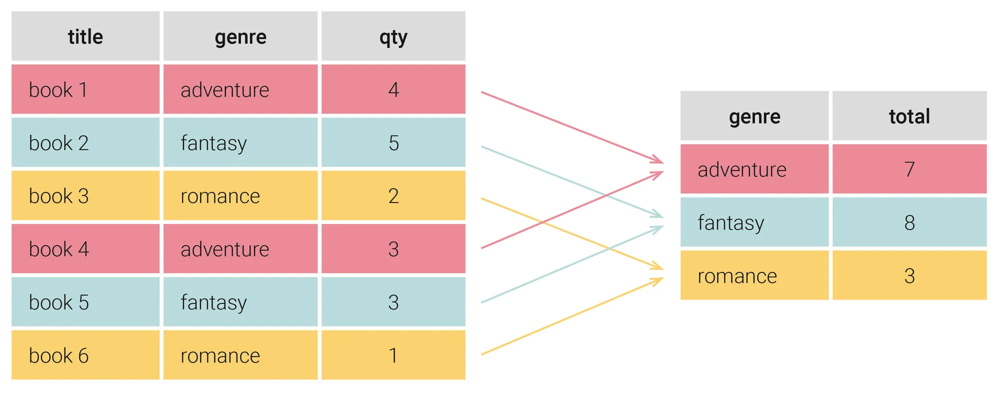
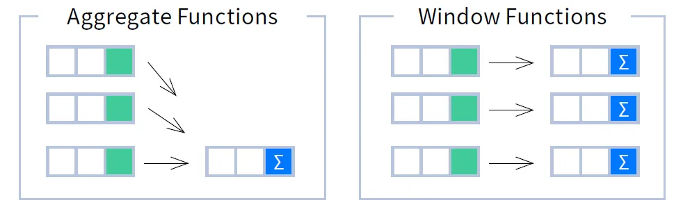
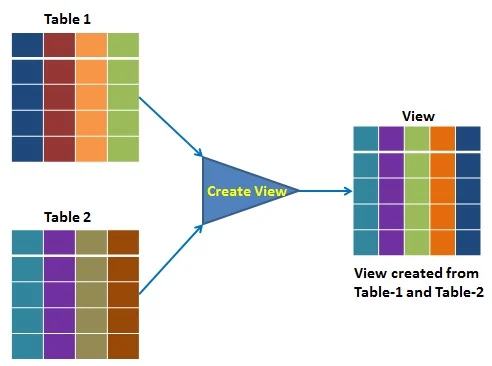

# 📊 **SQL (DML). Consultas Avanzadas**

!!! info "Información de la unidad"

    === "Contenidos"

        Realización de consultas:

        - Proyección, selección y ordenación de registros.
        - Operadores. Operadores de comparación. Operadores lógicos.
        - Composiciones internas.
        - Composiciones externas.
        - Consultas de resumen.
        - Agrupamiento de registros.

        Bases de datos relacionales:

        - Vistas.
  
    === "Propuesta didáctica"

          Una vez conocido el modelo relacional, en esta unidad vamos a comenzar a trabajar el RA3 "**Consulta la información almacenada en una base de datos empleando asistentes, herramientas gráficas y el lenguaje de manipulación de datos.**",

          Criterios de evaluación

        - **CE3a**: Se han identificado las herramientas y sentencias para realizar consultas.
        - **CE3b**: Se han realizado consultas simples sobre una tabla.
        - **CE3c**: Se han realizado consultas sobre el contenido de varias tablas mediante composiciones internas.
        - **CE3d**: Se han realizado consultas sobre el contenido de varias tablas mediante composiciones externas.definición y control de datos.
        - **CE3e**: Se han realizado consultas resumen.
        - **CE2f**: Se han creado vistas.


!!! info "Bases de datos recursos"

    Aquí tienes los enlaces a las bases de datos de recursos para esta unidad:

    - [Sakila](bd/sakila/sakila.md)
    - [NetflixDB](bd/netflix/netflix.md)


En este tema abordaremos 2 grandes bloques:

1. Consultas agregadas o resumen
2. Subconsultas y optimización

---

## 📈 **1. Consultas agregadas o resumen** 📈
Vamos a recordar la sintaxis para realizar una consulta con la sentencia `SELECT` en MySQL:

```sql
SELECT [DISTINCT] select_expr [, select_expr ...]
[FROM table_references]
[WHERE where_condition]
[GROUP BY {col_name | expr | position} [ASC | DESC], ... [WITH ROLLUP]]
[HAVING where_condition]
[ORDER BY {col_name | expr | position} [ASC | DESC], ...]
[LIMIT {[offset,] row_COUNT | row_COUNT OFFSET offset}]
```

Es muy importante conocer **en qué orden se ejecuta cada una de las cláusulas** que forman la sentencia `SELECT`. El orden de ejecución es el siguiente:

- Cláusula `FROM`.
- Cláusula `WHERE` (Es opcional, puede ser que no aparezca).
- Cláusula `GROUP BY` (Es opcional, puede ser que no aparezca).
- Cláusula `HAVING` (Es opcional, puede ser que no aparezca).
- Cláusula `SELECT`.
- Cláusula `ORDER BY` (Es opcional, puede ser que no aparezca).
- Cláusula `LIMIT` (Es opcional, puede ser que no aparezca).

**En esta unidad vamos a trabajar con dos nuevas cláusulas `GROUP BY` y `HAVING`.**

### Funciones de agregación

Estas funciones realizan una operación específica sobre todas las filas de un grupo.

Las funciones de agregación más comunes son:

| Función | Descripción |
| --- | --- |
| `MAX(expr)` | Valor máximo del grupo |
| `MIN(expr)` | Valor mínimo del grupo |
| `AVG(expr)` | Valor medio del grupo |
| `SUM(expr)` | Suma de todos los valores del grupo |
| `COUNT(*)` | Número de filas que tiene el resultado de la consulta |
| `COUNT(columna)` | Número de valores no nulos que hay en esa columna |

En la [documentación oficial de MySQL](https://dev.mysql.com/doc/refman/5.7/en/group-by-functions.html) puede encontrar una lista completa de todas las funciones de agregación que se pueden usar.

> **Importante:** Las funciones de agregación sólo se pueden usar en las cláusulas `SELECT` Y `HAVING`.

### Diferencia entre `COUNT(*)` y `COUNT(columna)`

- `COUNT(*)`: Calcula el número de filas que tiene el resultado de la consulta.
- `COUNT(columna)`: Cuenta el número de valores no nulos que hay en esa columna.

**Importante:** Tenga en cuenta la diferencia que existe entre las funciones `COUNT(*)` y `COUNT(columna)`, ya que devolverán resultados diferentes cuando haya valores nulos en la columna que estamos usando en la función.

**Ejemplos:**

Supongamos que tenemos los siguientes valores en la tabla `alumno`:

| id | nombre | apellido1 | apellido2 | fecha\_nacimiento | es\_repetidor | teléfono |
| --- | --- | --- | --- | --- | --- | --- |
| 1 | María | Sánchez | Pérez | 1990/12/01 | no | `NULL` |
| 2 | Juan | Sáez | Vega | 1998/04/02 | no | 618253876 |
| 3 | Pepe | Ramírez | Gea | 1988/01/03 | no | `NULL` |
| 4 | Lucía | López | Ruiz | 1993/06/13 | sí | 678516294 |

La consulta:

```sql
SELECT COUNT(teléfono)
FROM alumno;
```

devolverá:

| COUNT(teléfono) |
| --- |
| 2 |

mientras que la consulta:

```sql
SELECT COUNT(*)
FROM alumno;
```

| COUNT(\*) |
| --- |
| 4 |

### Contar valores distintos `COUNT(DISTINCT columna)`

Supongamos que tenemos los siguientes valores en la tabla `producto`:

| id | nombre | precio | código\_fabricante |
| --- | --- | --- | --- |
| 1 | Disco duro SATA3 1TB | 86 | 5 |
| 2 | Memoria RAM DDR4 8GB | 120 | 4 |
| 3 | Disco SSD 1 TB | 150 | 5 |
| 4 | GeForce GTX 1050Ti | 185 | 5 |

Y nos piden calcular el número de valores distintos de código de fabricante que aparecen en la tabla `producto`.

```sql
SELECT COUNT(DISTINCT código_fabricante)
FROM producto;
```

Esta consulta devolverá:

| COUNT(DISTINCT código\_fabricante) |
| --- |
| 2 |


## 👥 **La cláusula GROUP BY**

La cláusula [`GROUP BY`](https://mariadb.com/kb/en/group-by/) se utiliza para agrupar filas que tienen valores iguales en una o más columnas. Esto permite aplicar funciones de agregación como `SUM`, `COUNT`, `AVG`, etc., a cada grupo, es decir, permite realizar cálculos en vertical, sobre el resultado de agrupar registros.


<figure>
    
    <figcaption>Funcionamiento de GROUP BY</figcaption>
</figure>

Los pasos que vamos a realizar son:

1. `select`: Indicar las columnas a agrupar.
2. `select`: Indicar los cálculos mediante funciones agregadas (`count`, `sum`, `max`, `min`, `avg`, ...)
3. `GROUP BY`: indicar las agrupaciones (deben coincidir al menos con las columnas a mostrar)


Para demostrar su uso, nos vamos a centrar en los pagos realizados por los clientes. Veamos los datos que tenemos en la tabla `payment`:

```sql
SELECT customer_id, amount, payment_date 
FROM payment 
LIMIT 6;
```

| customer_id | amount | payment_date |
| :--- | :--- | :--- |
| 1 | 2.99 | 2005-05-25 11:30:37 |
| 1 | 0.99 | 2005-05-28 10:35:23 |
| 1 | 5.99 | 2005-06-15 00:54:12 |
| 2 | 0.99 | 2005-06-15 18:02:53 |
| 2 | 9.99 | 2005-06-15 21:08:46 |
| 3 | 4.99 | 2005-06-15 19:20:11 |

Podemos observar que un mismo cliente puede tener varios pagos. ¿Y si queremos saber el total que ha gastado cada cliente? Para ello, necesitamos agrupar por el ID del cliente y sumar sus pagos. En la parte de `select` indicamos los datos a mostrar, y en `group by` las columnas por las que debe agrupar:

```sql
SELECT customer_id, SUM(amount) 
FROM payment 
GROUP BY customer_id 
LIMIT 3;
```

| customer_id | SUM(amount) |
| :--- | :--- |
| 1 | 118.68 |
| 2 | 128.73 |
| 3 | 135.74 |

Es decir, el valor de `118.68` del cliente `1` se obtiene de sumar todas las filas de la tabla de pagos de dicho cliente. Dicho de otro modo, al realizar una agrupación, juntamos las filas que tienen el mismo valor en la columna agrupada, y realiza el cálculo indicado con dichas filas.

¿Y si quiero obtener el nombre del cliente en vez de su código? Podemos pensar que, si hago un _join_ y muestro su nombre y el pago, obtendré la misma información:

```sql
SELECT c.first_name, c.last_name, p.amount 
FROM payment p 
JOIN customer c ON p.customer_id = c.customer_id 
LIMIT 4;
```

| first_name | last_name | amount |
| :--- | :--- | :--- |
| MARY | SMITH | 2.99 |
| MARY | SMITH | 0.99 |
| MARY | SMITH | 5.99 |
| PATRICIA | JOHNSON | 0.99 |

Pero no. Obtengo el resultado de realizar la combinación de las dos tablas, no el cálculo agregado. Así pues, necesito agrupar el resultado del _join_:

```sql
SELECT c.first_name, c.last_name, SUM(p.amount) 
FROM payment p 
JOIN customer c ON p.customer_id = c.customer_id 
GROUP BY c.customer_id 
LIMIT 3;
```

| first_name | last_name | SUM(p.amount) |
| :--- | :--- | :--- |
| MARY | SMITH | 118.68 |
| PATRICIA | JOHNSON | 128.73 |
| LINDA | WILLIAMS | 135.74 |

### Agrupaciones con combinaciones externas

Imagina que queremos calcular cuántos alquileres tiene cada cliente:

```sql
SELECT c.first_name, c.last_name, COUNT(r.rental_id) 
FROM customer c 
INNER JOIN rental r ON c.customer_id = r.customer_id 
GROUP BY c.customer_id 
LIMIT 3;
```

| first_name | last_name | COUNT(r.rental_id) |
| :--- | :--- | :--- |
| MARY | SMITH | 32 |
| PATRICIA | JOHNSON | 28 |
| LINDA | WILLIAMS | 26 |

Al realizar una agrupación, juntamos las filas que tienen el mismo valor en la columna agrupada, y realiza el cálculo indicado con dichas filas. Sin embargo, si usamos un `inner join`, sólo aparecen los clientes que tienen alquileres. Si nos interesa que aparezcan todos los clientes, y si no tienen alquileres que salga 0, necesitamos hacer un _left join_:

```sql
SELECT c.first_name, c.last_name, COUNT(r.rental_id) 
FROM customer c 
LEFT JOIN rental r ON c.customer_id = r.customer_id 
GROUP BY c.customer_id 
LIMIT 3;
```

| first_name | last_name | COUNT(r.rental_id) |
| :--- | :--- | :--- |
| MARY | SMITH | 32 |
| PATRICIA | JOHNSON | 28 |
| LINDA | WILLIAMS | 26 |

### Agrupaciones compuestas

También es posible agrupar por más de una columna. Por ejemplo, podemos obtener la recaudación po tienda y empleado. Para ello, combinamos las tablas y agrupamos por el criterio deseado:

```sql
SELECT s.store_id, st.first_name, st.last_name, SUM(p.amount) 
FROM payment p 
JOIN staff st ON p.staff_id = st.staff_id 
JOIN store s ON st.store_id = s.store_id 
GROUP BY s.store_id, st.staff_id;
```

| store_id | first_name | last_name | SUM(p.amount) |
| :--- | :--- | :--- | :--- |
| 1 | Mike | Hillyer | 33489.47 |
| 2 | Jon | Stephens | 33927.04 |


### **`SELECT` N - `GROUP BY`**

Es importante destacar que al menos la cantidad y datos que utilizamos en la proyección (`SELECT`) que agrupan, también hemos de utilizarlos dentro del `GROUP BY`. Dicho de otro modo, si en el `SELECT` ponemos tres columnas y dos cálculos, en el `GROUP BY` deberemos poner las tres mismas columnas.

Es decir, **no debemos hacer esto** (dos en `SELECT`, uno en `GROUP BY`), ya que no estaría mostrando la información que queremos. Si repetimos el ejemplo anterior, obtenemos un resultado en _MariaDB_ , pero lo que obtenemos no es correcto (en _PosgreSQL_ directamente obtendremos un error):

```sql
SELECT s.store_id, st.first_name, st.last_name, SUM(p.amount)
FROM payment p
JOIN staff st ON p.staff_id = st.staff_id
JOIN store s ON st.store_id = s.store_id
GROUP BY s.store_id;
```

| store_id | first_name | last_name | SUM(p.amount) |
| :--- | :--- | :--- | :--- |
| 1 | Mike | Hillyer | 67416.51 |

En cambio, sí que es correcto agrupar por más columnas de las que mostramos (aunque su uso es cuestionable):

```sql
SELECT s.store_id, SUM(p.amount)
FROM payment p
JOIN staff st ON p.staff_id = st.staff_id
JOIN store s ON st.store_id = s.store_id
GROUP BY s.store_id, st.staff_id;
```

| store_id | SUM(p.amount) |
| :--- | :--- |
| 1 | 33489.47 |
| 2 | 33927.04 |

### **`ROLLUP` (Resúmenes de totales)**

Cuando hacemos una consulta con una agregación, podemos emplear la cláusula [SELECT ... WITH ROLLUP](https://mariadb.com/kb/en/select-with-rollup/) para que añada filas extras con totales de la agregación.

Si recuperamos la consulta que obtenía la recaudación por cliente, pero le añadimos `WITH ROLLUP` podemos observar cómo añade al resultado una nueva fila con el gran total:

```sql
SELECT customer_id, SUM(amount)
FROM payment
GROUP BY customer_id WITH ROLLUP
LIMIT 4;
```

| customer_id | SUM(amount) |
| :--- | :--- |
| 1 | 118.68 |
| 2 | 128.73 |
| 3 | 135.74 |
| NULL | 67416.51 |

En el caso de que la consulta agrupe por más de un valor, mostrará los diferentes subtotales:

```sql
SELECT s.store_id, st.staff_id, SUM(p.amount)
FROM payment p
JOIN staff st ON p.staff_id = st.staff_id
JOIN store s ON st.store_id = s.store_id
GROUP BY s.store_id, st.staff_id WITH ROLLUP;
```

| store_id | staff_id | SUM(p.amount) |
| :--- | :--- | :--- |
| 1 | 1 | 33489.47 |
| 1 | NULL | 33489.47 |
| 2 | 2 | 33927.04 |
| 2 | NULL | 33927.04 |
| NULL | NULL | 67416.51 |

!!! info "PostgreSQL"

    En el caso de _PostgreSQL_ cabe destacar que no tiene soporte para `WITH ROLLUP`. En cambio, dispone de otras funciones similares como `GROUPING SETS`, `CUBE` y `ROLLUP`.

🔍 **Filtrando grupos con HAVING**

La cláusula `HAVING` permite filtrar tras realizar los cálculos de agrupación. Sería similar al `WHERE` pero una vez realizados los datos agregados.

El orden de ejecución de las cláusulas dentro de una consulta es:

1. `WHERE` que filtra las filas según las condiciones que pongamos.
2. `GROUP BY` que crea una tabla agregada a partir de las columnas que agrupa.
3. `HAVING` filtra los grupos.
4. `ORDER BY` que ordena o clasifica la salida.

Para estos ejemplos, nos vamos a centrar en los clientes que han gastado mucho dinero. Para ello, agrupamos por el ID del cliente y sumamos sus pagos:

```sql
SELECT customer_id, SUM(amount) AS total
FROM payment
GROUP BY customer_id
LIMIT 3;
```

| customer_id | total |
| :--- | :--- |
| 1 | 118.68 |
| 2 | 128.73 |
| 3 | 135.74 |

Si de este resultado quiero filtrar aquellos que han gastado más de 180, necesito hacerlo mediante la cláusula `HAVING`:

```sql
SELECT customer_id, SUM(amount) AS total
FROM payment
GROUP BY customer_id
HAVING total > 180;
```

| customer_id | total |
| :--- | :--- |
| 144 | 189.73 |
| 148 | 211.55 |
| 526 | 208.58 |

Por supuesto, también podemos incluir un filtrado previo a la ejecución. Por ejemplo, para obtener el total gastado por cliente, pero contando solo los pagos individuales superiores a 10, y que el total final sea superior a 50:

```sql
SELECT customer_id, SUM(amount) AS total
FROM payment
WHERE amount > 10
GROUP BY customer_id
HAVING total > 50;
```

| customer_id | total |
| :--- | :--- |
| 211 | 54.91 |
| 526 | 54.91 |

Recuerda que `WHERE` filtra las filas antes de aplicar la agrupación, mientras que `HAVING` filtra los grupos después de que se han calculado las funciones de agregación.

## ⚙️ **Orden de ejecución de las cláusulas**

En este punto que ya hemos visto la mayoría de las cláusulas dentro de una consulta SQL, es conveniente tener claro su orden de ejecución.

Las etapas de ejecución de una consulta son:

1. `FROM` y `JOIN`: selección de tablas y su combinación, tanto internas como externas
2. `WHERE`: filtrado de los datos
3. `GROUP BY`: agrupación/agregación
4. `HAVING`: filtrado de la agrupación
5. `SELECT` y `DISTINCT`: proyección de los campos
6. `ORDER BY`: ordenación del resultado
7. `LIMIT`: filtrado del resultado

A modo de ejemplo tendríamos:

```text
SELECT DISTINCT c.NomCen                -- 5.1 y 5.2 
FROM departamento d                     -- 1.1 
JOIN centro c ON d.CodCen = c.CodCen    -- 1.2 
WHERE d.PreAnu > 20000000               -- 2                          
GROUP BY c.NomCen                       -- 3 
HAVING SUM(d.PreAnu) > 100000000        -- 4 
ORDER BY c.CodCen                       -- 6 
LIMIT 1 OFFSET 2                        -- 7
```

## ❌ **Errores comunes y buenas prácticas**

De forma general, los errores más comunes a la hora de realizar consultas son:

- No usar `WHERE` en las modificaciones o eliminaciones. ¡No te olvide de poner el `WHERE` en el `DELETE FROM`!
    
- Confundir la comparación de valores nulos, utilizando la asignación en vez del operador `IS NULL`:
    
    ```text
    -- Incorrecto 
    SELECT * FROM empleado WHERE ExTelEmp = NULL;

    -- Correcto 
    SELECT * FROM empleado WHERE ExTelEmp IS NULL;
    ```
    
- No comprobar la existencia de uno o más valores en las subconsultas. Si la subconsulta devuelve un único registro, podemos usar `=`. Si no, deberemos utilizar `IN`:
    
    ```text
    -- Incorrecto si la subconsulta retorna más de una fila 
    SELECT * FROM departamento WHERE PreAnu = (SELECT MAX(PreAnu) FROM departamento);

    -- Mejor, ya que podemos tener dos departamentos con el mismo presupuesto máximo 
    SELECT * FROM departamento WHERE PreAnu IN (SELECT MAX(PreAnu) FROM departamento);
    ```
    
- Utilizar `HAVING` para filtrar filas en lugar de `WHERE`: La cláusula `HAVING` se ejecuta después de `GROUP BY` y está pensada para filtrar datos agregados. Si estás filtrando datos no agregados, pertenece a la cláusula `WHERE`. Conocer la diferencia en el orden de ejecución entre WHERE y HAVING te ayuda a determinar dónde debe colocarse cada condición.
    
    Si quiero obtener los departamentos que tiene más de 5 empleados:
    
    ```text
    -- Incorrecto 
    SELECT CodDep, COUNT(*) AS total 
    FROM empleado 
    WHERE COUNT(*) > 5 
    GROUP BY CodDep; 

    -- Correcto 
    SELECT CodDep, COUNT(*) AS total 
    FROM empleado 
    GROUP BY CodDep 
    HAVING COUNT(*) > 5;
    ```
    
- Uso incorrecto de agregaciones en `SELECT` sin `GROUP BY`: Puesto que `GROUP BY` se ejecuta antes que `HAVING` o `SELECT`, si no agrupas tus datos antes de aplicar una función de agregado, se producirán resultados incorrectos o errores. Comprender el orden de ejecución aclara por qué estas dos cláusulas deben ir juntas.

## 🪟 Funciones ventana

Desde [SQL:2003](https://en.wikipedia.org/wiki/SQL:2003) podemos emplear las [funciones ventana](https://mariadb.com/kb/en/window-functions-overview/), las cuales son similares a las consultas `group by` en cuanto que permiten ejecutar funciones agregadas en varias filas. La diferencia es que permiten funciones de agregación incorporadas sin necesidad de agrupar cada campo en una sola fila, es decir, permiten realizar cálculos en horizontal.

<figure>
    
    <figcaption>Funciones Ventana</figcaption>
</figure>

!!! info "Funciones ventana de forma sencilla"

    Imagina que estás en un **autobús escolar**. 

    - **GROUP BY (El Resumen):** Es como si el profesor gritara: _"¡Que levanten la mano los de 1º de ESO!"_. Él solo cuenta cuántos hay y apunta un número en su libreta. Al final, solo tiene un resumen (1º ESO -> 20 alumnos), pero **ha perdido de vista quién es cada alumno**.
    - **WINDOW FUNCTIONS (La Ventana):** Es como si cada alumno tuviera una **ventanita mágica** al lado de su asiento. El alumno sigue sentado en su sitio (no perdemos su identidad), pero en su ventana puede ver información de su grupo. Por ejemplo, cada alumno de 1º de ESO puede mirar su ventana y ver: _"En mi clase somos 20 y yo soy el número 3 de la lista"_.

    > **La clave**: La función ventana no "machaca" las filas. Agrega información manteniendo el detalle de cada registro.

Para usar una función ventana, siempre seguimos esta estructura:

`FUNCION() OVER (PARTITION BY columna1 ORDER BY columna2)` 

1. **`OVER`**: Es la palabra clave que le dice a SQL: "Ojo, esto no es un agregado normal, es una ventana".
2. **`PARTITION BY`**: Es el "grupo" (como la clase del autobús). Si no lo pones, la ventana es toda la tabla.
3. **`ORDER BY`**: Es el orden dentro de ese grupo (quién va primero en la lista).


**Ejemplos prácticos con Sakila**

Vamos a realizar un ejemplo para entender mejor qué podemos obtener mediante su uso. Para ello, vamos a recuperar para cada película, cuántas películas pertenecen a su misma categoría (idioma), es decir, cuántas "compañeras" tiene en su idioma.

Nuestra primera idea, para obtener cuántas películas hay por cada idioma, es agrupar por el código del idioma (`language_id`) y contar los registros:

```sql
SELECT language_id, COUNT(*) 
FROM film 
GROUP BY language_id;
```

| language_id | COUNT(*) |
| :--- | :--- |
| 1 | 1000 |

Pero realmente queremos saber, para **cada película**, cuántas películas comparten su idioma, y por lo tanto, necesitamos obtener su título. Si intentamos seleccionar la columna `title` sin agrupar por ella en un `GROUP BY`, MariaDB nos devolvería el primer título que encuentre para ese idioma, perdiendo el resto:

```sql
SELECT title, language_id, COUNT(*) 
FROM film 
GROUP BY language_id;
```

| title | language_id | COUNT(*) |
| :--- | :--- | :--- |
| ACADEMY DINOSAUR | 1 | 1000 |

Mientras que una cláusula `GROUP BY` devuelve un registro por cada grupo, una **función de ventana** no contrae los resultados, permitiendo devolver un registro distinto para cada fila original.

Así que, si quisiéramos obtener el título de todas las películas y, además, cuántas copias existen en su mismo idioma, usamos `OVER (PARTITION BY ...)`:

```sql
SELECT title, language_id, 
       COUNT(*) OVER (PARTITION BY language_id) AS total_idioma 
FROM film 
LIMIT 5;
```

| title | language_id | total_idioma |
| :--- | :--- | :--- |
| ACADEMY DINOSAUR | 1 | 1000 |
| ACE GOLDFINGER | 1 | 1000 |
| ADAPTATION HOLES | 1 | 1000 |
| AFFAIR PREJUDICE | 1 | 1000 |
| AFRICAN EGG | 1 | 1000 |

### Sintaxis y tipos

La [sintaxis](https://mariadb.com/docs/server/reference/sql-functions/special-functions/window-functions/window-functions-overview) básica que emplearemos es:

```sql
SELECT funcion_ventana() OVER (PARTITION BY campo ORDER BY campo) 
FROM tabla;
```

Las funciones ventana se pueden dividir en tres tipos:

1.  **Agregadas**: `SUM`, `COUNT`, `AVG`, etc.
2.  **Ranking o clasificación**: [`ROW_NUMBER()`](https://mariadb.com/kb/en/row_number/), [`RANK()`](https://mariadb.com/kb/en/rank/), [`NTILE()`](https://mariadb.com/kb/en/ntile/), etc.
3.  **De valor**: [`LAG()`](https://mariadb.com/kb/en/lag/), [`LEAD()`](https://mariadb.com/kb/en/lead/), [`FIRST_VALUE()`](https://mariadb.com/kb/en/first_value/), [`LAST_VALUE()`](https://mariadb.com/kb/en/last_value/), etc...

### Otros ejemplos con Sakila

- **Número de fila por categoría de precio** (mediante `ROW_NUMBER()`):<br>
    Esta consulta asigna un número secuencial a cada película, pero **reiniciando la cuenta** cada vez que cambia el precio de alquiler (`rental_rate`). Es muy útil para crear listados numerados por categorías.

```sql
SELECT ROW_NUMBER() OVER (PARTITION BY rental_rate ORDER BY title) AS num_en_precio,
       title, rental_rate 
FROM film 
LIMIT 5;
```

| num_en_precio | title | rental_rate |
| :--- | :--- | :--- |
| 1 | ACADEMY DINOSAUR | 0.99 |
| 2 | ADAPTATION HOLES | 0.99 |
| 3 | ALAMO VIDEOTAPE | 0.99 |
| 4 | AMISTAD REASON | 0.99 |
| 5 | ANGELS LIFE | 0.99 |

*En este caso, todas las películas de 0.99 se ordenan alfabéticamente y reciben un número del 1 al N.*

- **Ranking de las películas más largas por categoría** (mediante `RANK()`):<br>
    Aquí buscamos identificar cuáles son las películas de mayor duración dentro de cada género. A diferencia de `ROW_NUMBER()`, la función `RANK()` **asigna la misma posición en caso de empate**. Si dos películas miden lo mismo (como ocurre con el ranking 2 en el ejemplo), la siguiente posición saltará (pasando del 2 al 4).

```sql
SELECT title, length, category_id,
       RANK() OVER (PARTITION BY category_id ORDER BY length DESC) AS ranking_duracion
FROM film f
JOIN film_category fc ON f.film_id = fc.film_id
LIMIT 5;
```

| title | length | category_id | ranking_duracion |
| :--- | :--- | :--- | :--- |
| CHICAGO NORTH | 185 | 1 | 1 |
| DARKO DORADO | 178 | 1 | 2 |
| WORST BANGER | 178 | 1 | 2 |
| CONSPIRACY SPIRIT | 171 | 1 | 4 |

*Observa cómo `DARKO DORADO` y `WORST BANGER` empatan en el puesto 2, y por eso el siguiente es el 4.*

- **Diferencia de precio con la película anterior y siguiente** (usando `LAG` y `LEAD`):<br>
    Estas funciones nos permiten "mirar" hacia atrás o hacia adelante en el conjunto de resultados **sin necesidad de hacer un JOIN adicional**. En este ejemplo, comparamos el precio de una película con el de la película que iría antes y después en orden alfabético.

```sql
SELECT title, rental_rate,
       LAG(rental_rate) OVER (ORDER BY title) AS precio_anterior,
       LEAD(rental_rate) OVER (ORDER BY title) AS precio_siguiente,
       rental_rate - LAG(rental_rate) OVER (ORDER BY title) AS diferencia
FROM film
LIMIT 5;
```

| title | rental_rate | precio_anterior | precio_siguiente | diferencia |
| :--- | :--- | :--- | :--- | :--- |
| ACADEMY DINOSAUR | 0.99 | NULL | 4.99 | NULL |
| ACE GOLDFINGER | 4.99 | 0.99 | 2.99 | 4.00 |
| ADAPTATION HOLES | 2.99 | 4.99 | 0.99 | -2.00 |
| AFFAIR PREJUDICE | 0.99 | 2.99 | 2.99 | -2.00 |
| AFRICAN EGG | 2.99 | 0.99 | 0.99 | 2.00 |

*Fíjate que la primera película tiene `NULL` en `precio_anterior` porque no hay nadie antes que ella en la ventana.*

---

🎓 **¿Quieres saber más?**

Las funciones ventana son un aspecto avanzado. Si quieres profundizar, te recomiendo:

- [_Guía de funciones ventana SQL_](https://hackernoon.com/lang/es/una-guia-para-principiantes-para-comprender-las-funciones-de-ventana-sql-y-sus-capacidades)
- [Documentación sobre marcos de ventana (Window Frames)](https://mariadb.com/kb/en/window-frames/)


## 🖼️ **Vistas**

Si retomamos la [arquitectura de tres niveles](https://aitor-medrano.github.io/bd/01intro.html#arquitectura-de-3-niveles) que estudiamos en la primera unidad, un esquema externo, que es a lo que accede el usuario final, se compone de un conjunto de tablas y vistas que luego se transforman en formularios e informes.

Una vista es un objeto que se define con una consulta y que se comporta como una **tabla virtual**. Cuando un usuario accede a una vista, no percibe si los datos están físicamente en una tabla o son el resultado de una consulta dinámica.

<figure>
    
    <figcaption>Vistas</figcaption>
</figure>

**Creación de una vista**

Para crear una vista, usaremos la sentencia [`CREATE [OR REPLACE] VIEW nombre AS SELECT...`](https://mariadb.com/kb/en/create-view/).

Por ejemplo, vamos a crear una vista llamada `premium_films` que solo contenga las películas cuyo precio de alquiler sea superior a 4.00:

```sql
CREATE VIEW premium_films AS
SELECT film_id, title, rental_rate, replacement_cost
FROM film
WHERE rental_rate > 4.00;
```

Una vez creada, podemos realizar consultas directamente sobre ella como si fuera una tabla normal:

```sql
SELECT * 
FROM premium_films 
LIMIT 3;
```

| film_id | title | rental_rate | replacement_cost |
| :--- | :--- | :--- | :--- |
| 2 | ACE GOLDFINGER | 4.99 | 12.99 |
| 7 | AIRPLANE SIERRA | 4.99 | 28.99 |
| 8 | ALADDIN CALENDAR | 4.99 | 24.99 |

**Naturaleza dinámica**

Las vistas son dinámicas, lo que significa que reflejan automáticamente cualquier cambio en la tabla original. Si insertamos una nueva película en `film` que cumpla la condición del `WHERE`, aparecerá inmediatamente en nuestra vista:

```sql
INSERT INTO film (title, language_id, rental_rate, replacement_cost) 
VALUES ('ZODIAC SQL', 1, 4.99, 29.99);

SELECT * 
FROM premium_films 
WHERE title = 'ZODIAC SQL';
```

| film_id | title | rental_rate | replacement_cost |
| :--- | :--- | :--- | :--- |
| 1001 | ZODIAC SQL | 4.99 | 29.99 |

**Inserción y modificación mediante vistas**

En muchos casos, es posible utilizar una [vista para insertar o modificar datos](https://mariadb.com/kb/en/inserting-and-updating-with-views/), lo que repercutirá directamente en la tabla base:

```sql
UPDATE premium_films 
SET replacement_cost = 35.00 
WHERE title = 'ZODIAC SQL';
```

!!! success "Autoevaluación"

    Podemos combinar vistas con otras tablas. ¿Qué información crees que obtendremos con la siguiente consulta?

    ```sql
    SELECT c.name, COUNT(p.film_id) AS total_premium
    FROM category c
    JOIN film_category fc ON c.category_id = fc.category_id
    JOIN premium_films p ON fc.film_id = p.film_id
    GROUP BY c.name;
    ```

**Restricciones**

A la hora de modificar datos a través de una vista, existen ciertas limitaciones:

- No se puede modificar el contenido si la vista utiliza `GROUP BY`, `DISTINCT`, `HAVING`, `UNION` o funciones de agregación.
- La vista debe incluir todos los campos obligatorios (`NOT NULL`) de la tabla base que no tengan un valor por defecto.
- No se pueden modificar campos que sean cálculos o expresiones derivadas.

**Gestión de vistas**

Para borrar una vista, utilizaremos la sentencia [`DROP VIEW nombre`](https://mariadb.com/kb/en/drop-view/):

```sql
DROP VIEW premium_films;
```

Para ver qué vistas tenemos creadas en nuestra base de datos, podemos consultar los metadatos en `information_schema.VIEWS`:

```sql
SELECT TABLE_NAME AS vistas 
FROM information_schema.VIEWS 
WHERE TABLE_SCHEMA = 'sakila';
```
 
!!! info "Vistas materializadas"

    Aunque MariaDB no las soporte de forma nativa (aunque existen plugins), otros SGBD como PostgreSQL u Oracle permiten crear **Vistas Materializadas**.

    A diferencia de las normales, estas persisten los datos en disco, lo que mejora drásticamente el rendimiento en consultas complejas, a costa de tener que "refrescarlas" cuando los datos cambian.

    Ejemplo en **PostgreSQL**:

    ```sql
    CREATE MATERIALIZED VIEW premium_films_cached AS
    SELECT title, rental_rate
    FROM film
    WHERE rental_rate > 4.00;

    -- Para actualizar los datos después de cambios en la tabla base:
    REFRESH MATERIALIZED VIEW premium_films_cached;
    ```

---

## Referencias

*   Sintaxis SQL oficial de [PostgreSQL](https://www.postgresql.org/docs/current/sql-commands.html) y [MariaDB](https://mariadb.com/kb/en/sql-statements/).
    
*   _Cheatsheets_ de [https://learnsql.com/](https://learnsql.com/) sobre:
       
    - [SQL Básico](https://learnsql.com/blog/sql-basics-cheat-sheet/sql-basics-cheat-sheet-a4.pdf)
    - [Funciones ventana](https://learnsql.com/blog/sql-window-functions-cheat-sheet/Window_Functions_Cheat_Sheet.pdf)
