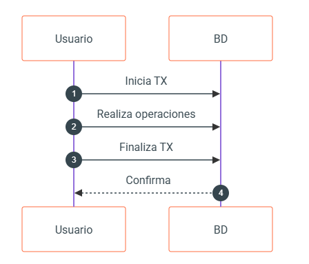
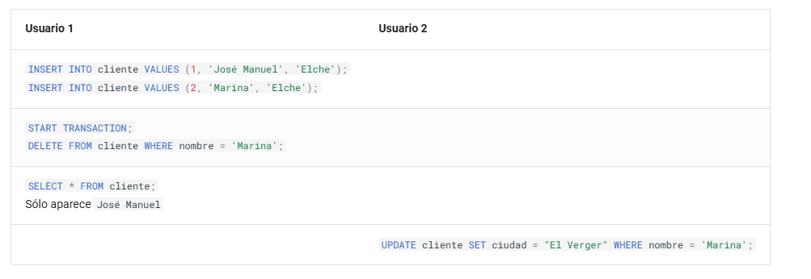

# 📥 **UT7. SQL (DCL y TCL). Control de acceso y transacciones**

!!! info "Información de la unidad"

    === "Contenidos"

        Bases de datos relacionales:

          - Usuarios. Privilegios.
          - Lenguaje de control de datos (DCL).

        Tratamiento de datos:

          - Transacciones.
          - Políticas de bloqueo. Concurrencia.

    === "Propuesta didáctica"

          En esta unidad vamos a trabajar el RA4 "**Modifica la información almacenada en una base de datos empleando asistentes, herramientas gráficas y el lenguaje de manipulación de datos.**"

          Criterios de evaluación

        - **CE4e**: Se ha reconocido el funcionamiento de las transacciones.
        - **CE4f**: Se han anulado parcial o totalmente los cambios producidos por una transacción.
        - **CE4g**: Se han identificado los efectos de las distintas políticas de bloqueo de registros.
        - **CE4h**: Se han adoptado medidas para mantener la integridad y consistencia de la información.


!!! info "Bases de datos recursos"

    Aquí tienes los enlaces a las bases de datos de recursos para esta unidad:

    - [TechStore](../06/bd/bd_tech_store.sql)


## **7.1 Seguridad**

La seguridad en un SGBD es fundamental para proteger la integridad, confidencialidad y disponibilidad de la información almacenada.

Para ello, se implementan **mecanismos de control de acceso** mediante la gestión de usuarios y la asignación de privilegios. Este control permite definir qué operaciones puede realizar cada usuario o rol sobre los distintos objetos de la base de datos, limitando el acceso a información sensible y previniendo acciones no autorizadas.

En SQL, dentro del DCL (*Data Control Language*), las sentencias como `GRANT` y `REVOKE` permiten otorgar o revocar permisos de acceso y modificación sobre los datos. De esta forma, se establece un entorno seguro donde cada usuario tiene acceso únicamente a los recursos necesarios para sus funciones.

Además del control de acceso, la seguridad de un SGBD también se refuerza mediante el **uso de transacciones y políticas de bloqueo y concurrencia**. Las transacciones garantizan que las operaciones sobre la base de datos se ejecuten de manera atómica, consistente, aislada y duradera (propiedades ACID), lo que previene inconsistencias en caso de errores o fallos del sistema.

Para manejar el acceso concurrente de múltiples usuarios, los SGBD implementan mecanismos de bloqueo que evitan conflictos y garantizan la integridad de los datos. Estos bloqueos, combinados con estrategias de control de concurrencia, aseguran que las transacciones se gestionen de forma ordenada y segura, minimizando riesgos como condiciones de carrera, lecturas sucias o actualizaciones perdidas. Todo esto contribuye a mantener la coherencia y fiabilidad de la base de datos frente a accesos simultáneos y posibles fallos.

### Uso de contraseñas

Independientemente de la gestión de seguridad de los SGBD, las aplicaciones que desarrollemos normalmente utilizarán una base de datos donde se almacene la contraseña de los usuarios. Ni que decir tiene que almacenar las contraseñas en texto plano es un agujero de seguridad, ya que si la base de datos se compromete, las contraseñas de todos los usuarios quedarán expuestas.

Una forma de proteger las contraseñas es almacenarlas encriptadas, de manera que aunque la base de datos se vea comprometida, los atacantes no podrán recuperar las contraseñas originales. Para ello, se emplean algoritmos de encriptación _hash_ que generan un valor único e irreversible a partir de la contraseña original.

Un ejemplo de tabla de usuarios con contraseñas encriptadas podría ser la siguiente:

```sql
CREATE TABLE usuarios (
    id INT AUTO_INCREMENT PRIMARY KEY,
    username VARCHAR(50) UNIQUE NOT NULL,
    email VARCHAR(255) UNIQUE NOT NULL,
    password_hash VARCHAR(255) NOT NULL,
    salt VARCHAR(255),
    created_at TIMESTAMP DEFAULT CURRENT_TIMESTAMP,
    updated_at TIMESTAMP DEFAULT CURRENT_TIMESTAMP ON UPDATE CURRENT_TIMESTAMP,
    esta_activo BOOLEAN DEFAULT TRUE
);
```

Conviene explicar el propósito del campo `salt`. El _salt_ es un valor aleatorio único que se añade a cada contraseña antes del proceso de _hashing_. Su propósito es hacer que cada _hash_ sea único, incluso para contraseñas idénticas. Mediante su uso, dos usuarios que tengan la misma contraseña tendrán almacenado diferente `password_hash`. Para ello, usaremos primero la función hash [`MD5`](https://mariadb.com/docs/server/reference/sql-functions/secondary-functions/encryption-hashing-and-compression-functions/md5) para crear una cadena aleatoria.

A continuación, cuando insertemos un nuevo usuario, tras concatenar la contraseña con el _salt_, debemos encriptar el resultado mediante la función _hash_ [`SHA2`](https://mariadb.com/docs/server/reference/sql-functions/secondary-functions/encryption-hashing-and-compression-functions/sha2):

```sql
-- Generar salt aleatorio
SET @salt = SUBSTRING(MD5(RAND()) FROM 1 FOR 16);

-- Insertar usuario con hash SHA256 + salt
INSERT INTO usuarios (username, email, password_hash, salt)
VALUES (
    'usuario1',
    'user@email.com',
    SHA2(CONCAT('mi_password', @salt), 256),
    @salt
);
```

Por lo tanto, cuando queramos recuperar un usuario que ha hecho _login_ en la aplicación, necesitamos volver a concatenar la contraseña con el _salt_, realizar el _hash_ y finalmente, comparar las dos cadenas encriptadas:

```sql
SELECT * FROM usuarios
WHERE username = 'usuario1'
AND password_hash = SHA2(CONCAT('mi_password', salt), 256);
```

Dicho esto, los algoritmos _MD5_ y _SHA2_, a día de hoy, están obsoletos (se consideran criptográficamente rotos o son fácilmente _hackeables_ por fuerza bruta), y por ello, en vez de basarse en las funciones de encriptación que ofrece el SGBD, es mejor hacer uso de los algoritmos [bcrypt](https://en.wikipedia.org/wiki/Bcrypt), [scrypt](https://en.wikipedia.org/wiki/scrypt) o [argon2](https://en.wikipedia.org/wiki/Argon2) desde el lenguaje de programación que utilice el SGBD, ya sea _Java_, _PHP_ o _Python_.


## **7.2 DCL**

El _Data Control Language_ (DCL - Lenguaje de control de datos) se emplea para gestionar los permisos y privilegios de acceso a los objetos dentro de una base de datos, estableciendo políticas de seguridad que determinan qué usuarios o roles pueden interactuar con los datos y de qué manera.

A través del DCL, los administradores de bases de datos pueden otorgar o revocar permisos, asegurando que cada usuario solo pueda realizar las acciones que le han sido expresamente autorizadas. Este control es esencial para proteger la información sensible, evitar accesos no autorizados y mantener la integridad de los datos.

### Usuarios

Así pues, el primer paso es la creación de usuarios y sus credenciales.

SQL proporciona comandos específicos para crear, modificar y eliminar usuarios, aunque la sintaxis puede variar ligeramente según el SGBD (como _MariaDB_, _PostgreSQL_ u _Oracle_).

Para **crear** un nuevo usuario se realiza con la sentencia [CREATE USER](https://mariadb.com/kb/en/create-user/), mediante la sintaxis

```sql
CREATE USER nombre_usuario IDENTIFIED BY 'contraseña';
```

Al indicar la contraseña, esta se encriptará con un _hash_ mediante el algoritmo `mysql_native_password`. El _hash_ es irreversible, lo que significa que no se puede recuperar la contraseña original a partir de él.

Además, en _MariaDB_, podemos especificar el _host_ desde donde se permite la conexión:

```sql
CREATE USER 'nombre_usuario'@'localhost' IDENTIFIED BY 'contraseña';
```

Necesitamos crear un usuario para poder trabajar con la base de datos. Por lo tanto, crearemos un usuario con el nombre `user01` y la contraseña `1234`.

```sql
CREATE USER user01 IDENTIFIED BY '1234';
```

**<small><u>Usuarios existentes</u></small>**

Para averiguar qué usuarios existen en el sistema, en _MariaDB_ debemos hacer una consulta sobre la tabla `mysql.user`:

```sql
SELECT host, user, password FROM mysql.user;
-- +-----------+-------------+-------------------------------------------+
-- | Host      | User        | Password                                  |
-- +-----------+-------------+-------------------------------------------+
-- | localhost | mariadb.sys |                                           |
-- | localhost | root        | *81F5E21E35407D884A6CD4A731AEBFB6AF209E1B |
-- | 127.0.0.1 | healthcheck | *E6203A3A57998AFD011DDBF30FB411FC065F318C |
-- | ::1       | healthcheck | *E6203A3A57998AFD011DDBF30FB411FC065F318C |
-- | localhost | healthcheck | *E6203A3A57998AFD011DDBF30FB411FC065F318C |
-- | %         | user01      | *3D3F19386045EE9D580D9527B41DF893A95325B7 |
-- +-----------+-------------+-------------------------------------------+
-- 7 rows in set (0.001 sec)
```

La columna `host` indica desde dónde nos podemos conectar a la base de datos, de manera que mediante `root` sólo nos podemos conectar desde la propia máquina (`localhost`), mientras que los usuarios `s8a` y `s8abd` pueden conectarse desde cualquier lugar (`%` hace la función de comodín).

Si hubiéramos querido que nuestro usuario sólo pudiera conectarse desde _localhost_ (o cualquier otro _host_), hemos de indicarlo mediante `nombre_usuario@host`:

```sql
CREATE USER user01@localhost IDENTIFIED BY '1234';
```

Si necesitamos **cambiar** la contraseña o actualizar las propiedades de un usuario existente, utilizaremos la instrucción [`ALTER USER`](https://mariadb.com/kb/en/alter-user/), con la sintaxis:

```sql
ALTER USER nombre_usuario IDENTIFIED BY 'nueva_contraseña';
```

También se pueden modificar atributos adicionales, como el límite de conexiones o configuraciones de autenticación.

Finalmente, para **eliminar** usuarios utilizaremos la sentencia [`DROP USER`](https://mariadb.com/kb/en/drop-user/), revocando todos sus privilegios y eliminando su acceso a la base de datos.

```sql
DROP USER nombre_usuario;
```

Es recomendable revocar previamente los permisos asignados para asegurar una gestión ordenada.


### Permisos

Hemos comentado previamente que los usuarios tendrán diferentes permisos sobre los recursos de una base de datos. Para ello, las principales sentencias del DCL son **`GRANT`** y **`REVOKE`**.

La instrucción `GRANT` permite asignar permisos específicos a usuarios o roles, como la capacidad de consultar (`SELECT`), insertar (`INSERT`), actualizar (`UPDATE`) o eliminar (`DELETE`) datos en tablas o vistas. También se pueden otorgar privilegios sobre procedimientos almacenados o esquemas completos.

Por otro lado, la sentencia `REVOKE` se utiliza para retirar esos permisos cuando ya no son necesarios o cuando se detecta un posible riesgo de seguridad.

Además, algunos sistemas permiten incluir la opción **`WITH GRANT OPTION`**, que autoriza a un usuario a conceder los privilegios que ha recibido a otros usuarios. Esta gestión granular de permisos es clave para implementar políticas de seguridad robustas, evitando accesos indebidos y minimizando el riesgo de errores o ataques malintencionados.

**<small><u>Comprobando permisos</u></small>**

¿Cómo puedo saber los permisos que tengo? Para ello, necesitamos ejecutar el comando [`SHOW GRANTS`](https://mariadb.com/kb/en/show-grants/):

```sql
SHOW GRANTS for CURRENT_USER;
-- +---------------------------------------------------------------------+
-- | Grants for root@%                                                   |
-- +---------------------------------------------------------------------+
-- | GRANT ALL PRIVILEGES ON *.* TO `root`@`%` WITH GRANT OPTION           |
-- +---------------------------------------------------------------------+
-- 1 row in set (0.001 sec)
```

En cambio, si comprobamos los permisos del usuario que hemos creado en esta sesión:

```sql
SHOW GRANTS for user01;
-- +---------------------------------------------------------------------+
-- | Grants for user01@%                                                 |
-- +---------------------------------------------------------------------+
-- | GRANT USAGE ON *.* TO `user01`@`%` IDENTIFIED BY PASSWORD '*DF...FD' |
-- +---------------------------------------------------------------------+
-- 1 row in set (0.003 sec)
```

#### **Entendiendo el resultado de `SHOW GRANTS`**

Cuando ejecutamos este comando, lo que vemos es la sentencia `GRANT` exacta que generó (o generaría) esos permisos. Es fundamental entender sus componentes para saber qué puede hacer realmente un usuario:

| Componente | Ejemplo | Descripción |
| :--- | :--- | :--- |
| **Privilegios** | `SELECT`, `ALL PRIVILEGES`, `USAGE` | Indica qué acciones puede realizar. `USAGE` significa que el usuario puede conectarse, pero no tiene permisos sobre datos todavía. |
| **Objeto** | `*.*`, `techstore.*`, `techstore.productos` | Define el alcance. `*.*` es nivel global, `db.*` es nivel de base de datos y `db.tabla` es nivel de tabla. |
| **Usuario** | `` `user01`@`%` `` | A quién pertenecen los permisos y desde qué host puede conectar (`%` es cualquier host). |
| **Contraseña** | `IDENTIFIED BY PASSWORD '...'` | Muestra el *hash* de la contraseña del usuario (no la contraseña en texto plano). |
| **Opciones** | `WITH GRANT OPTION` | Si está presente, el usuario puede dar estos mismos permisos a otros. |

Tras crear un usuario, es necesario asignar permisos mediante el DCL con `GRANT` y retirarlos con `REVOKE`.

#### Otorgando permisos

Así pues, mediante la sentencia [GRANT](https://mariadb.com/kb/en/grant/) daremos privilegios a un usuario sobre uno o más objetos, mediante la siguiente sintaxis:

```sql
GRANT privilegio ON objeto TO usuario [WITH GRANT OPTION];
```

Los posibles privilegios (los cuales podemos consultar con el comando [`SHOW PRIVILEGES`](https://mariadb.com/kb/en/show-privileges/)) más comunes son:

- `USAGE`: permite que el usuario exista y se conecte, pero sin ningún permiso de acceso a datos.
- `SELECT`: para acceder a tablas o vistas.
- `INSERT[(nombre_columna)]:` Si se especifica el `nombre_columna`, se otorga permiso para insertar en la columna especificada. Si se omite, se permite insertar valores en todas las columnas.
- `UPDATE[(nombre_columna)]`: Lo mismo que `INSERT` para modificar.
- `DELETE`: para eliminar registros de una tabla o vista.
- `GRANT OPTION`: permite dar permisos a otro usuario.
- `ALL`: otorga todos los permisos menos `GRANT OPTION`.

Y para indicar el recurso se emplea la nomenclatura `bd.recurso`, siendo _recurso_ una tabla, vista, etc...

Por ejemplo, si nos conectamos con el usuario `root` el cual sí que tiene permisos para dar privilegios, podemos hacer:

```sql
GRANT SELECT ON techstore.clientes TO user01;
```

Si ahora volvemos a consultar los permisos de `user01`, veremos cómo se ha añadido la nueva regla:

```sql
SHOW GRANTS FOR user01;
-- +---------------------------------------------------------------------+
-- | Grants for user01@%                                                 |
-- +---------------------------------------------------------------------+
-- | GRANT USAGE ON *.* TO `user01`@`%` IDENTIFIED BY PASSWORD '*DF...FD' |
-- | GRANT SELECT ON `techstore`.`clientes` TO `user01`@`%`              |
-- +---------------------------------------------------------------------+
```

Si nos conectamos con ese nuevo usuario, y accedemos a la base de datos de `techstore`, podemos ver que sólo puede ver la tabla `clientes` :

```sql
USE techstore;
SHOW TABLES;
-- +------------------+
-- | Tables_in_techstore |
-- +------------------+
-- | clientes        |
-- +------------------+
-- 1 row in set (0.000 sec)
```

Finalmente, si queremos dar permisos de administración a un usuario haremos:

```sql
GRANT ALL PRIVILEGES ON base_de_datos.* TO nombre_usuario;
```

Si queremos que los usuarios que creamos puedan dar permisos a futuros usuarios, necesitamos indicarlo con `WITH GRANT OPTION`:

```sql
GRANT ALL PRIVILEGES ON base_de_datos.* TO nombre_usuario WITH GRANT OPTION;
```

Así pues, si quisiéramos crear un nuevo usuario `administrador` que pueda hacer de todo, e incluso dar nuevos permisos, haríamos:

```sql
CREATE USER administrador@localhost IDENTIFIED BY 'admin';
GRANT ALL PRIVILEGES ON *.* TO administrador@localhost WITH GRANT OPTION;
```

!!! warning "Consejos seguridad"

    Una gestión adecuada de usuarios implica también definir roles, agrupar permisos y establecer políticas de acceso según los principios de _mínimos privilegios_, donde cada usuario tiene solo los permisos estrictamente necesarios.

#### Quitando permisos

Si en algún momento tenemos que quitarle permisos a un usuario, podemos revocar los privilegios sobre un objeto mediante el comando [`REVOKE`](https://mariadb.com/kb/en/revoke/), con la siguiente sintaxis:

```sql
REVOKE privilegio ON objeto FROM usuario;
```

Así pues, si queremos quitarle el permiso de inserción que antes le habíamos dado al usuario `user01` haríamos:

```sql
REVOKE SELECT ON techstore.clientes FROM 'user01';
```

!!! info "FLUSH PRIVILEGES"

    El comando `FLUSH PRIVILEGES` se utiliza para recargar los privilegios en memoria después de realizar cambios en las tablas de privilegios del sistema, y los cambios tengan efecto inmediato.

    Cuando utilizamos los comandos del DCL (`GRANT`, `REVOKE`, `CREATE USER`, `DROP USER`, `ALTER USER`), _MariaDB_ actualiza automáticamente los privilegios en memoria. Por tanto, en un uso normal no es necesario ejecutar `FLUSH PRIVILEGES`.

    Sin embargo, si en algún caso modificamos directamente las tablas internas del sistema (como `mysql.user`) mediante sentencias DML, el servidor no detecta el cambio automáticamente. En ese caso, debemos ejecutar:

    ```sql
    FLUSH PRIVILEGES;
    ```

### Roles

Si queremos aplicarle los mismos permisos a varios usuarios, podemos hacer uso de los roles. Formalmente, un rol es un conjunto de privilegios que se pueden asignar a uno o más usuarios. Mediante los roles, se simplifica la gestión de permisos, ya que en lugar de asignar privilegios individualmente a cada usuario, se pueden agrupar en un rol y luego asignar ese rol a los usuarios correspondientes.

Para ello, usaremos la sentencia [`CREATE ROLE`](https://mariadb.com/kb/en/create-role/), por ejemplo, para crear un rol desarrollador

```sql
-- Creamos el rol desarrollador
CREATE ROLE desarrollador;
```

Una vez creado un rol, le daremos permisos mediante `GRANT` o se los quitaremos mediante `REVOKE`, y finalmente le asignaremos el rol a uno o más usuarios mediante `GRANT rol TO usuario`.

```sql
-- Damos permisos al rol desarrollador sobre la base de datos techstore
GRANT ALL ON techstore.* TO desarrollador;
-- Asignamos el rol desarrollador al usuario user01
GRANT desarrollador TO user01;
```

Si ahora recuperamos los permisos del usuario `user01` veremos que tiene asociado el rol `desarrollador`:

```sql
SHOW GRANTS for user01;
-- +--------------------------------------------------------------------+
-- | Grants for user01@%                                                |
-- +--------------------------------------------------------------------+
-- | GRANT `desarrollador` TO `user01`@`%`                              |
-- | GRANT USAGE ON *.* TO `user01`@`%` IDENTIFIED BY PASSWORD '*D...FD' |
-- +--------------------------------------------------------------------+
-- 2 rows in set (0.000 sec)
```

Y si recuperamos la info del rol tendremos:

```sql
SHOW GRANTS for desarrollador;
-- +--------------------------------------------------------+
-- | Grants for desarrollador                               |
-- +--------------------------------------------------------+
-- | GRANT USAGE ON *.* TO `desarrollador`                  |
-- | GRANT ALL PRIVILEGES ON `empresa`.* TO `desarrollador` |
-- +--------------------------------------------------------+
-- 2 rows in set (0.001 sec)
```

En cambio, si queremos quitarle el rol a un usuario, usaremos `REVOKE rol FROM usuario`.

Por último, si queremos eliminar un rol usaremos [`DROP ROLE`](https://mariadb.com/kb/en/drop-role/):

Más información en la [documentación oficial](https://mariadb.com/kb/en/roles_overview/) de _MariaDB_.


## **7.3 Transacciones**

Una transacción es una unidad lógica de trabajo que comprende una o más sentencias SQL. Para que una base de datos sea fiable, las transacciones deben garantizar cuatro propiedades fundamentales, conocidas por el acrónimo **ACID**.

### **Propiedades ACID**

| Propiedad | Descripción |
| :--- | :--- |
| **A**tomicidad | La transacción es una unidad única de "todo o nada". Si una parte falla, toda la transacción falla y la base de datos vuelve a su estado original (ROLLBACK). |
| **C**onsistencia | Una transacción lleva a la base de datos de un estado válido a otro estado válido, respetando todas las reglas, restricciones de integridad y triggers. |
| **I**slamiento | Las transacciones que se ejecutan simultáneamente no deben interferir entre sí. Los cambios de una transacción no son visibles para otras hasta que se confirman. |
| **D**urabilidad | Una vez que una transacción ha sido confirmada (COMMIT), los cambios son permanentes y persistirán incluso en caso de fallo del sistema o corte eléctrico. |

Los pasos a la hora de realizar una transacción se resumen en:

1. Iniciar la transacción
2. Realizar las operaciones
3. Finalizar la transacción
4. Confirmar el resultado

<figure>
    
    <figcaption align="center">Pasos de una transacción</figcaption>
</figure>

---

#### **Comandos de Control**

En SQL, gestionamos las transacciones mediante los siguientes comandos:

1.  **`START TRANSACTION`** (o `BEGIN`): Marca el punto de inicio de una unidad de trabajo. A partir de aquí, el _Autocommit_ se desactiva.
2.  **`COMMIT`**: Guarda permanentemente todos los cambios realizados durante la transacción actual.
3.  **`ROLLBACK`**: Deshace todos los cambios realizados desde el inicio de la transacción, devolviendo los datos a su estado original.
4.  **`SAVEPOINT nombre`**: Crea un "punto de control" dentro de una transacción larga. Permite deshacer solo una parte de la transacción sin abortarla entera.
5.  **`ROLLBACK TO SAVEPOINT nombre`**: Vuelve al punto de control indicado.

---

#### 🏟️ **Ejemplo de integridad: Fichaje de un jugador**

Imagina que el **Equipo A** ficha a un jugador del **Equipo B** por 500.000€. Esta operación requiere tres pasos atómicos:

1.  Restar 500.000€ al presupuesto del Equipo A.
2.  Sumar 500.000€ al presupuesto del Equipo B.
3.  Cambiar el `equipoID` del jugador.

Si el sistema falla tras el paso 1, el dinero "desaparecería". Usamos transacciones para evitarlo:

```sql
START TRANSACTION;

-- Paso 1: Pago del equipo destino
UPDATE Equipo SET presupuesto = presupuesto - 500000 WHERE codigo = 'EQ_A';

-- Paso 2: Cobro del equipo origen
UPDATE Equipo SET presupuesto = presupuesto + 500000 WHERE codigo = 'EQ_B';

-- Creamos un punto de seguridad por si el cambio de jugador falla
SAVEPOINT antes_de_jugador;

-- Paso 3: Cambio de club del jugador
UPDATE Jugador SET equipoID = (SELECT id FROM Equipo WHERE codigo = 'EQ_A')
WHERE nombre = 'Leo' AND apellido = 'Messi';

-- Verificamos si todo ha ido bien
-- Si el jugador no existiera o hubiera un error de integridad:
-- ROLLBACK TO SAVEPOINT antes_de_jugador; -- Podríamos intentar corregirlo

-- Si todo es correcto, guardamos:
COMMIT;
```

!!! danger "Transacciones e Integridad Referencial"
    Las transacciones son nuestra última línea de defensa. Aunque las claves ajenas (`FOREIGN KEY`) evitan datos huérfanos, solo las transacciones aseguran que operaciones complejas que afectan a varias filas (como la transferencia de fondos anterior) sean consistentes.

### **Autocommit: El comportamiento por defecto**

Por defecto, MySQL y MariaDB operan en modo **Autocommit = 1**. Esto significa que cada sentencia individual (`INSERT`, `UPDATE`, `DELETE`) es tratada como una transacción completa que se confirma automáticamente al terminar.

Para realizar transacciones de varias líneas, tenemos dos opciones:

*   Usar explícitamente `START TRANSACTION` (desactiva el autocommit solo para ese bloque), lo que nos permite hacer `COMMIT` o `ROLLBACK`.
*   Desactivar el autocommit globalmente con `SET autocommit = 0;` (peligroso en entornos de producción si se olvida hacer `COMMIT`).
* Si necesitamos volver a activar el autocommit globalmente, usamos `SET autocommit = 1;`.

### Pasos

Aunque el _autocommit_ esté activo, es posible realizar transacciones explícitas, y realmente, es la forma recomendada de trabajar, ya que nos permite controlar mejor el proceso. Para ello, para realizar una [transacción](https://mariadb.com/kb/es/start-transaction/), tal como hemos visto previamente, el primer paso es iniciarla y ejecutar una serie de operaciones:

1. Indicar que vamos a realizar una transacción con la sentencia `START TRANSACTION` ( o`BEGIN`, `BEGIN WORK`, que siendo comandos equivalentes, se mantienen por compatibilidad con otros sistemas como _PostgreSQL_). Al iniciar la transacción, el `AUTOCOMMIT` se deshabilita automáticamente.
2. Realizar las operaciones de manipulación de datos sobre la base datos (insertar, actualizar o borrar filas).
3. Dos posibilidades:
    
    1. Si las operaciones se han completado y queremos que los cambios se apliquen de forma permanente → `COMMIT`
        
        <figure>
            
            <figcaption align="center">Pasos de una transacción con COMMIT</figcaption>
        </figure>

    2. Si durante las operaciones ocurre algún error y no queremos aplicar los cambios realizados, podemos deshacerlos → `ROLLBACK`. Al hacer _rollback_ se abandona la transacción y se cancelan todos los cambios realizados previamente por la transacción, volviendo al estado inicial previo al inicio de la transacción.

    <figure>
        
        <figcaption align="center">Pasos de una transacción con ROLLBACK</figcaption>
    </figure>

Veamos un ejemplo donde creamos una base de datos `pruebas`, junto a una tabla `cliente`:

```sql
DROP DATABASE IF EXISTS pruebas;
CREATE DATABASE pruebas CHARACTER SET utf8mb4;
USE pruebas;

CREATE TABLE cliente (
    id INT UNSIGNED PRIMARY KEY,
    nombre VARCHAR (32),
    ciudad VARCHAR (32)
);
```

A continuación, podemos realizar diferentes operaciones dentro de una única transacción:

```sql
START TRANSACTION;
INSERT INTO cliente VALUES (1, 'Andreu', 'Elche');
INSERT INTO cliente VALUES (2, 'Marina', 'Elche');
INSERT INTO cliente VALUES (33, 'Pedro', 'Elche');
DELETE FROM cliente WHERE nombre = 'Andreu';
COMMIT;
```

De esta manera, las tres inserciones y el borrado se ejecutan como una única operación. Si abrimos dos terminales y entramos con dos sesiones diferentes, y ejecutamos el siguiente flujo, obtendremos:

| Usuario 1 | Resultado 1 | Usuario 2 | Resultado 2 |
| :--- | :--- | :--- | :--- |
| `START TRANSACTION;`<br>`INSERT INTO cliente VALUES (1, 'Andreu', 'Elche');`<br>`INSERT INTO cliente VALUES (2, 'Marina', 'Elche');` | | | |
| `SELECT * FROM CLIENTE;` | `1, Andreu, Elche`<br>`2, Marina, Elche` | `SELECT * FROM CLIENTE;` | `-` |
| `INSERT INTO cliente VALUES (33, 'Pedro', 'Elche');`<br>`DELETE FROM cliente WHERE nombre = 'Andreu';`<br>`COMMIT;` | | | |
| `SELECT * FROM CLIENTE;` | `2, Marina, Elche`<br>`33, Pedro, Elche` | `SELECT * FROM CLIENTE;` | `2, Marina, Elche`<br>`33, Pedro, Elche` |

### Puntos de parada

Los puntos de parada definen puntos de control intermedios dentro de una transacción, de forma que si se efectúa `ROLLBACK` éste pueda ser total (toda la transacción) o hasta uno de los puntos de control de la transacción.

Para ello, primero los definiremos mediante la etiqueta [`SAVEPOINT`](https://mariadb.com/kb/en/savepoint/) dentro de una transacción.

Posteriormente, al ocurrir un error, podemos indicar que realice un `ROLLBACK TO [SAVEPOINT] etiqueta`, deshaciendo sólo las instrucciones que se han ejecutado hasta el punto de parada indicado.

Si queremos eliminar un punto de parada, necesitaremos hacerlo mediante `RELEASE SAVEPOINT etiqueta`

```sql
START TRANSACTION;
INSERT INTO cliente VALUES(1, 'José Manuel', 'Elche');
SAVEPOINT P1;
INSERT INTO cliente VALUES(2, 'Marina', 'Elche');
SAVEPOINT P2;
INSERT INTO cliente VALUES(3, 'Andreu', 'Elche');

-- Recuperamos los clientes que acabamos de insertar
SELECT * FROM cliente;
ROLLBACK TO P1;         -- Deshace los insert de Marina y Andreu
SELECT * FROM cliente;  -- Mostrará solo José Manuel
ROLLBACK TO P2;         -- Dará error porque al haber hecho ROLLBACK a un punto de control anterior desaparece P2
COMMIT;                 -- Sólo quedará guardado José Manuel
```

## **7.4 Concurrencia**

En el contexto de bases de datos, el término concurrencia se refiere a la capacidad de un sistema de bases de datos para permitir que múltiples usuarios o procesos accedan y manipulen los datos al mismo tiempo, sin que esto afecte a la integridad, consistencia o el rendimiento del sistema.

Cuando se utilizan transacciones, pueden darse problemas de concurrencia en el acceso a los datos, es decir, problemas ocasionados por el acceso al mismo dato de dos transacciones distintas. Cuando diferentes usuarios realizan cambios en el mismo recurso de una base de datos al mismo tiempo se produce un bloqueo.

Un caso de uso muy común es la compra de entradas para eventos (cine, teatro, conciertos,...) donde en un primer paso se selecciona el asiento y posteriormente se realiza la operación. Cuando un usuario selecciona un asiento, éste se bloquea para que ningún usuario pueda adquirirlo, pero ¿y si dos usuarios seleccionan el mismo asiento, pero uno es más rápido que el otro a la hora de confirmar la compra?

Pensemos en otro ejemplo. Cuando realizamos un _bizum_ o una transferencia bancaria entre dos usuarios, la cantidad se resta de la cuenta bancaria de origen y se suma en la de destino. Entre una operación y otra pueden pasar muchas cosas ¿Y si se va la luz? ¿Y si el usuario origen no tiene saldo? ¿Restamos y luego sumamos?

La gestión de la concurrencia es un equilibrio entre garantizar la seguridad de los datos y maximizar el rendimiento del sistema.

**Tipos de problemas**

Cuando consultamos una base de datos, cada transacción ve una instantánea de los datos, es decir, una versión de la base de datos, sin tener en cuenta el estado actual de los datos que hay por debajo. Así se evita que la transacción vea datos inconsistentes producidos por la actualización de otra transacción concurrente, proporcionando aislamiento transaccional para cada sesión de la base de datos.

Cuando no tenemos control de concurrencia, se pueden producir condiciones de carrera al perder información en una actualización:

!!! info "Condición de carrera"

    **Condición de carrera** (_Lost Update_) : Se producen errores o inconsistencias cuando dos procesos intentan modificar los mismos datos simultáneamente.

    El usuario 1 comprueba los asientos disponibles, y también lo hace el usuario 2. Ambos ven que el asiento 33 está libre, y al mismo tiempo, inician el proceso de reserva.

    La operación que llega al sistema primero se ejecuta, pero como no hay control de concurrencia, la segunda operación también se ejecuta, sobrescribiendo el resultado de la primera, y de ahí el término 'condición de carrera'.

    | Usuario 1 | Usuario 2 |
    | --- | --- |
    | `SELECT estado FROM asientos WHERE num = 33;` |  |
    |  | `SELECT estado FROM asientos WHERE num = 33;` |
    | `UPDATE asientos SET estado = "ocupado" WHERE num = 33 and usuario = 1;` | `UPDATE asientos SET estado = "ocupado" WHERE num = 33 and usuario = 2;` |

    La solución es introducir transacciones e incluir la lectura dentro de la transacción.


Si introducimos transacciones para evitar las condiciones de carrera, aparecen otro tipo de problemas:

- Lectura no repetible
- Lectura sucia
- Lectura fantasma


!!! info "Lectura no repetible"

    Se produce cuando en una transacción se consulta el mismo dato dos veces, y la segunda vez encuentra que el valor del dato ha sido modificado por otra transacción.

    El usuario 1 consulta el estado de los asientos y comprueba que el asiento 33 está libre. Mientras tanto el usuario 2, reserva dicho asiento, y cuando el usuario 1 vuelve a confirmar el asiento para realizar la reserva le aparece que está ocupado.

    | Usuario 1 | Usuario 2 |
    | :--- | :--- |
    | `START TRANSACTION;`<br>`SELECT estado FROM asientos WHERE num = 33;` | |
    | | `UPDATE asientos SET estado = "ocupado" WHERE num = 33;`<br>`COMMIT;` |
    | `SELECT estado FROM asientos WHERE num = 33;` | |

!!! info "Lectura sucia (*Dirty Read*)"

    Sucede cuando una segunda transacción lee datos que están siendo modificados por una transacción antes de que haga `COMMIT`.

    El usuario 1 reserva el asiento, que queda marcado como ocupado, pero sin realizar el `COMMIT`. El usuario 2 comprueba su estado y aparece como ocupado, y tras ello, el usuario 1 cancela la reserva, liberando un asiento que realmente no ha llegado a estar ocupado.

    | Usuario 1 | Usuario 2 |
    | :--- | :--- |
    | `START TRANSACTION;`<br>`UPDATE asientos SET estado = "ocupado" WHERE num = 33;` | |
    | | `SELECT estado FROM asientos WHERE num = 33;` |
    | `ROLLBACK;` | |

!!! info "Lectura fantasma (*Phantom Read*)"

    Se trata de una variación de lecturas no repetibles. Este error ocurre cuando una transacción ejecuta dos veces una consulta que devuelve un conjunto de filas y en la segunda ejecución de la consulta aparecen/desaparecen nuevas filas en el conjunto que no existían cuando se inició la transacción.

    El usuario 1 comprueba los asientos disponibles. A la vez, el usuario 2 elimina el asiento 33 ya que se ha roto y no debe aparecer entre los asientos existentes. Cuando el usuario 1 vuelve a comprobar los asientos existentes, comprueba su estado y el asiento no aparece, cuando antes sí aparecía (de ahí que sea una lectura fantasma).

    | Usuario 1 | Usuario 2 |
    | :--- | :--- |
    | `SELECT num FROM asientos WHERE estado = "libre";` | |
    | | `DELETE FROM asientos WHERE num = 33;`<br>`COMMIT;` |
    | `SELECT num FROM asientos WHERE estado = "libre";` | |


### Mecanismos de control de concurrencia

Los sistemas gestores de bases de datos (SGBD) implementan diferentes técnicas para garantizar la consistencia y aislamiento de las transacciones:

- Control de concurrencia mediante **bloqueos** (_Locks_). Los bloqueos son mecanismos que previenen conflictos entre las transacciones que acceden a los mismos recursos, bien sea a estructuras de datos compartidas o a un registro del diccionario de datos.
- **Versionado de datos** (MVCC, _Multi-Version Concurrency Control_): Permite que cada transacción trabaje con su propia copia de los datos, evitando bloqueos y mejorando el rendimiento en sistemas con alta concurrencia. Cuando hay una modificación de datos, en lugar de sobrescribir una fila en actualizaciones, se almacena una nueva versión de la fila mientras se mantiene la versión anterior hasta que ya no sea necesaria (las transacciones que la usan han finalizado). Las versiones anteriores de una fila se almacenan en el espacio de "deshacer" (undo space) para permitir transacciones y lecturas consistentes.
- Protocolos de **serialización**: Garantizan que las transacciones se ejecuten de manera que los resultados sean equivalentes a ejecutarlas en secuencia, evitando interferencias.
- **Niveles de aislamiento**: Establecen reglas sobre cómo se gestionan las interacciones entre transacciones (`READ UNCOMMITTED`, `READ COMMITTED`, `REPEATABLE READ`, `SERIALIZABLE`) para dar solución a los problemas de concurrencia comentados anteriormente.

### Bloqueos

Cuando un SGBD aísla las transacciones de usuario, utiliza los bloqueos para restringir el acceso de otros usuarios a dichos datos.

Los bloqueos pueden ser:

- **Compartidos** (_Shared_): Permiten que varios procesos lean los mismos datos, pero no los modifiquen. Múltiples usuarios leyendo datos pueden compartirlos, manteniendo bloqueos para prevenir accesos concurrentes por una escritura.
- **Exclusivos** (_Exclusive_): Restringen el acceso a los datos a un solo proceso para lecturas y escrituras. La primera transacción que bloquea el recurso es la única que puede alterarlo hasta liberar el bloqueo.

Cuando se produce una condición de carrera, dependiendo del nivel de aislamiento, el SGBD actuará de una manera u otra, lo que impacta directamente en el rendimiento y la cantidad de bloqueos necesarios.

Si retomamos el ejemplo de los clientes y tenemos dos usuarios que trabajan sobre los mismos datos, y un usuario en una transacción modifica un registro, y no termina de hacer commit ni rollback, cuando un segundo usuario intenta acceder al mismo registro, se producirá un bloqueo:

<figure>
    
</figure>

En esta situación, el **usuario 2** se queda «congelado» esperando a que el usuario 1 termine su transacción. Si tarda demasiado sin que se libere el bloqueo, el SGBD lanzará el siguiente error:

`ERROR 1205 (HY000): Lock wait timeout exceeded; try restarting transaction`

!!! info "Rendimiento vs Seguridad"
    Aumentar el número de bloqueos mejora la seguridad y consistencia de los datos, pero a cambio **disminuye la concurrencia** (menos usuarios pueden trabajar a la vez). Es clave encontrar un equilibrio para que la aplicación no se ralentice.

### **Gestión explícita de bloqueos**

Aunque el SGBD gestiona los bloqueos automáticamente para protegernos, a veces necesitamos forzarlos de forma manual en procesos críticos.

#### **1. Bloqueo de filas (`FOR UPDATE`)**

Imagina que estás vendiendo asientos para un concierto. Quieres estar seguro de que, mientras un usuario está eligiendo su butaca, nadie más pueda "quitársela".

Al añadir `FOR UPDATE` al final de una consulta `SELECT`, bloqueas esas filas para que **nadie más pueda modificarlas ni borrarlas** hasta que finalices tu transacción:

```sql
START TRANSACTION;

-- Bloqueamos a los empleados sin hijos para actualizarlos próximamente
SELECT CodEmp FROM empleado WHERE NumHi = 0 FOR UPDATE;
```

*   **¿Qué sucede?** Cualquier otra sesión que intente modificar (`UPDATE` o `DELETE`) a esos empleados tendrá que esperar a que tú hagas `COMMIT` o `ROLLBACK`.
*   **Dato clave:** Los demás usuarios **sí podrán leer** los datos (`SELECT`), pero no podrán cambiarlos hasta que el bloqueo se libere.

#### **2. Bloqueo de tablas (`LOCK TABLES`)**

Si necesitamos un control total y exclusivo sobre una tabla completa (por ejemplo, para realizar cambios masivos), usamos `LOCK TABLE`.

Existen dos tipos principales de bloqueo:

| Tipo | ¿Quién puede leer? | ¿Quién puede escribir? | Uso común |
| :--- | :--- | :--- | :--- |
| **`READ`** | Todos (tú y los demás) | **Nadie** | Generación de informes sin cambios de datos. |
| **`WRITE`** | **Solo tú** | **Solo tú** | Modificaciones masivas de estructura o datos. |

!!! warning "Efectos de LOCK TABLES"
    Al ejecutar `LOCK TABLES` se hace un `COMMIT` automático de cualquier transacción pendiente. Las tablas se desbloquean automáticamente si cierras la conexión, pero lo correcto es hacerlo manualmente con `UNLOCK TABLES`.

*   **Sintaxis y ejemplo:**
    ```sql
    -- Bloqueamos la tabla de empleados para lectura usando un alias
    LOCK TABLE empleado AS emp READ;

    -- Para acceder a ella, debemos usar el alias definido
    SELECT * FROM empleado AS emp;
    ```


*   **Cómo liberar los bloqueos:**
    Una vez terminado el trabajo, siempre debemos soltar el bloqueo para permitir que otros trabajen:

    ```sql
    UNLOCK TABLES;
    ```

!!! tip "Copia de seguridad (Backup)"
    Un uso muy común de los bloqueos globales es para hacer copias de seguridad sin interrumpir las lecturas, pero impidiendo que los datos cambien:
    `FLUSH TABLES WITH READ LOCK;`

### **Niveles de aislamiento**

Como hemos estudiado anteriormente, el trabajo concurrente con transacciones puede generar conflictos. Para solucionarlo, los SGBD permiten configurar **niveles de aislamiento**, que definen qué grado de visibilidad tienen los cambios de una transacción sobre las demás. 

A mayor nivel de aislamiento, mayor integridad de los datos, pero **menor rendimiento** debido al uso intensivo de bloqueos.

#### **Los cuatro estándares del SQL**

1.  **`READ UNCOMMITTED`** (Lectura no confirmada)
    *   **Comportamiento:** No se aplican bloqueos. Es el nivel más bajo.
    *   **Riesgo:** Permite "lecturas sucias" (puedes ver datos que otra persona está cambiando pero que aún no ha confirmado).
2.  **`READ COMMITTED`** (Lectura confirmada)
    *   **Comportamiento:** Solo puedes leer datos que ya han sido guardados con `COMMIT`.
    *   **Riesgo:** Evita lecturas sucias, pero si consultas el mismo dato dos veces, este podría haber cambiado en medio (lectura no repetible).
3.  **`REPEATABLE READ`** (Lectura repetible)
    *   **Comportamiento:** Garantiza que si lees un registro, este no cambiará durante toda tu transacción. **Es el nivel por defecto en MariaDB/MySQL**.
    *   **Riesgo:** Solo pueden aparecer "filas fantasma" (nuevos registros insertados por otros que antes no estaban).
4.  **`SERIALIZABLE`** (Serializable)
    *   **Comportamiento:** Aislamiento total. Las transacciones se ejecutan estrictamente una detrás de otra.
    *   **Riesgo:** Es el más seguro pero el más lento, ya que bloquea casi todo para evitar cualquier interferencia.

#### **Resumen de problemas vs Niveles**

| Nivel de aislamiento | Condición de carrera | Lectura sucia | Lectura no repetible | Lectura fantasma |
| :--- | :---: | :---: | :---: | :---: |
| `READ UNCOMMITTED` | ✅ | ❌ | ❌ | ❌ |
| `READ COMMITTED` | ✅ | ✅ | ❌ | ❌ |
| `REPEATABLE READ` | ✅ | ✅ | ✅ | ❌ |
| `SERIALIZABLE` | ✅ | ✅ | ✅ | ✅ |

> ✅ = Problema evitado / ❌ = Problema posible

### **Cómo configurar el aislamiento**

Podemos definir el nivel de aislamiento en tres ámbitos diferentes:

**1. Configuración global (Servidor)**
Para que el cambio sea permanente en todo el servidor MariaDB, se edita el archivo de configuración (`my.cnf` o `mariadb.cnf`):

```ini
[mariadb]
transaction-isolation = 'READ-COMMITTED'
```

**2. Para la sesión actual**
Solo afecta a tu conexión actual hasta que la cierres:

```sql
SET SESSION TRANSACTION ISOLATION LEVEL {READ UNCOMMITTED | READ COMMITTED | REPEATABLE READ | SERIALIZABLE};
```

**3. Para una transacción específica**
Se indica justo antes de empezar el bloque de trabajo:

```sql
-- Definimos el nivel antes de empezar
SET TRANSACTION ISOLATION LEVEL SERIALIZABLE;

START TRANSACTION;

-- Realizamos una operación crítica (ej. actualización masiva de precios por inflación)
SELECT id INTO @prov_id 
FROM proveedores 
WHERE nombre = 'HardwarePro';

UPDATE productos 
SET precio = precio * 1.05 
WHERE proveedor_id = @prov_id;

COMMIT;
```
