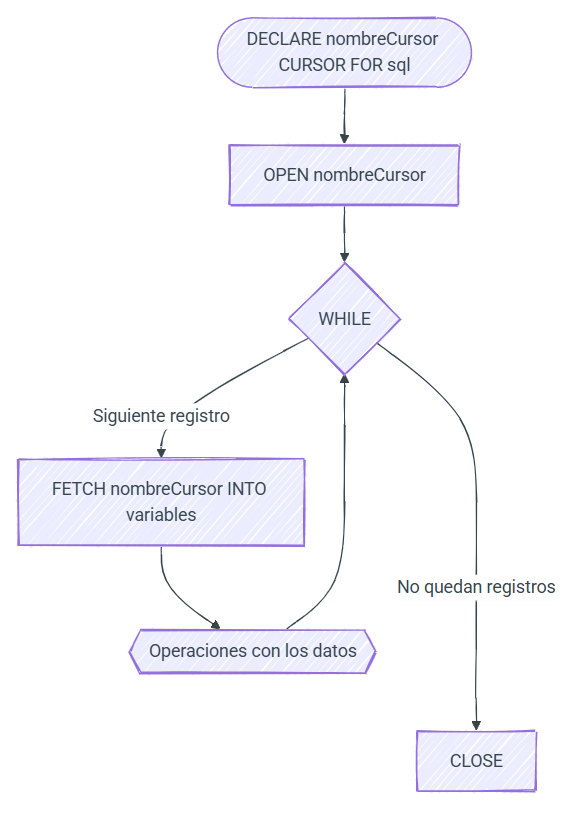

# 📥 **UT9. Programación de SQL: Disparadores y cursores**

!!! info "Información de la unidad"

    === "Contenidos"

        Programación avanzada de bases de datos:

          - Eventos: Automatización temporal.
          - Disparadores (Triggers): Automatización por acción.
          - Gestión de errores: `SIGNAL` y `HANDLER`.
          - Cursores: Procesamiento iterativo fila a fila.

    === "Propuesta didáctica"

        En esta unidad completamos el RA5 centrándonos en la automatización reactiva y los procesos complejos de gestión de datos.
          
          Criterios de evaluación:
        - **CE5h**: Definición de eventos y disparadores.
        - **CE5i**: Uso de cursores para recorridos secuenciales.
        - **CE5j**: Implementación de gestión de excepciones y errores.

!!! info "Base de datos recurso"
    Utilizaremos nuevamente la base de datos [**TechStore**](../06/bd/bd_tech_store.sql). ¡Asegúrate de tenerla importada para probar los ejemplos!

---

## **9.1 Eventos**

Un **evento** es una tarea que MariaDB ejecuta automáticamente en un momento determinado o de forma periódica. Imaginalo como una **alarma** o un **cron job** que vive dentro de tu base de datos.

Son ideales para tareas de mantenimiento: limpiar logs antiguos, recalcular estadísticas nocturnas o desactivar productos sin stock.

### <u>Activación del Planificador</u>

Por defecto, MariaDB suele tener apagado el programador de eventos para ahorrar recursos. Primero debemos activarlo:

```sql
-- Comprobar si está activo
SHOW VARIABLES LIKE 'event_scheduler';

-- Activarlo (Globalmente)
SET GLOBAL event_scheduler = ON;
```

### <u>Creación de eventos</u>

Usamos la sentencia `CREATE EVENT`. Podemos definir eventos que se ejecutan **una sola vez** o de forma **periódica** (`EVERY`).

!!! example "Ejemplo A: Evento único (Limpieza rápida)"
    Borra remanentes de pedidos cancelados dentro de 1 hora.
    ```sql
    CREATE EVENT borrar_temporales_hoy
    ON SCHEDULE AT CURRENT_TIMESTAMP + INTERVAL 1 HOUR
    DO
      DELETE FROM pedidos WHERE estado = 'CANCELADO' AND total = 0;
    ```

!!! example "Ejemplo B: Evento periódico (Mantenimiento de inactivas)"
    Cada semana, desactivamos proveedores de una ciudad específica que ya no operan.
    ```sql
    DELIMITER //
    CREATE EVENT desactivar_proveedores_lejanos
    ON SCHEDULE EVERY 1 WEEK
    STARTS CURRENT_TIMESTAMP
    DO
    BEGIN
      UPDATE proveedores 
      SET activo = FALSE 
      WHERE ciudad = 'Remota' AND activo = TRUE;
    END //
    DELIMITER ;
    ```

---

## **9.2 Disparadores (Triggers)**

Un **disparador** o *trigger* es una "evento o disparo" que salta automáticamente cuando ocurre un cambio en una tabla (`INSERT`, `UPDATE` o `DELETE`).

A diferencia de los procedimientos (que llamas tú) o los eventos (que dependen del reloj), los triggers dependen del **cambio de datos**.

### <u>Momentos y Eventos</u>

- **Cuándo**: `BEFORE` (antes del cambio) o `AFTER` (después del cambio).
- **Qué**: `INSERT`, `UPDATE` o `DELETE`.

### <u>Las tablas NEW y OLD</u>

Dentro de un trigger, MariaDB nos deja mirar qué había antes y qué habrá después:
- `OLD`: Acceso a los valores **antes** del cambio (no disponible en `INSERT`).
- `NEW`: Acceso a los valores **después** del cambio (no disponible en `DELETE`).

!!! example "Ejemplo A: Validación (BEFORE INSERT)"
    Asegurar que ningún producto se inserte con precio negativo.
    ```sql
    DELIMITER //
    CREATE TRIGGER tr_validar_precio_positivo
    BEFORE INSERT ON productos
    FOR EACH ROW
    BEGIN
        IF NEW.precio < 0 THEN
            SET NEW.precio = 0; -- Corregimos antes de guardar
        END IF;
    END //
    DELIMITER ;
    ```

!!! example "Ejemplo B: Auditoría (AFTER UPDATE)"
    Si el saldo de un cliente cambia, registramos el cambio en una tabla de mensajes (para este ejemplo simulamos un log sencillo).
    ```sql
    DELIMITER //
    CREATE TRIGGER tr_log_saldo_cliente
    AFTER UPDATE ON clientes
    FOR EACH ROW
    BEGIN
        IF OLD.saldo <> NEW.saldo THEN
            -- Aquí podríamos insertar en una tabla de log_auditoria
            -- Por simplicidad, solo mostramos el concepto de OLD y NEW
            SET @mensaje = CONCAT('Cliente ID ', NEW.id, ' cambió de ', OLD.saldo, ' a ', NEW.saldo);
        END IF;
    END //
    DELIMITER ;
    ```

---

## **9.3 Gestión de Errores**

En programación de bases de datos, no basta con escribir código que funcione en condiciones ideales. Es fundamental que nuestro programa sepa qué hacer cuando algo sale mal: un valor duplicado, una clave ajena que no existe o una restricción de negocio que se incumple.

### <u>Lanzar errores personalizados: `SIGNAL`</u>

La sentencia `SIGNAL` se utiliza para "lanzar" una excepción de forma manual. Es muy útil cuando queremos impedir que se realice una operación que, aunque sea válida para SQL, es incorrecta para nuestra lógica de negocio.

**Sintaxis Básica:**
```sql
SIGNAL SQLSTATE 'valor_estado'
SET MESSAGE_TEXT = 'Mensaje explicativo para el usuario';
```

!!! info "SQLSTATE '45000'"
    El `SQLSTATE` es un código de 5 caracteres que indica el tipo de error. El código **'45000'** es un estándar reservado específicamente para **errores definidos por el usuario**. Siempre que lances un error manual en tus procedimientos o triggers, utiliza este código.

!!! example "Ejemplo: Impedir pedidos sin saldo"
    Supongamos que en **TechStore** queremos asegurar que un cliente tenga saldo suficiente antes de insertar un nuevo pedido.
    ```sql
    DELIMITER //
    CREATE OR REPLACE PROCEDURE realizar_pedido(id_cli INT, v_total DECIMAL(10,2))
    BEGIN
        DECLARE v_saldo DECIMAL(10,2);
        
        -- Obtenemos el saldo actual
        SELECT saldo INTO v_saldo FROM clientes WHERE id = id_cli;

        IF v_saldo < v_total THEN
            -- Lanzamos el error y detenemos el procedimiento
            SIGNAL SQLSTATE '45000'
            SET MESSAGE_TEXT = 'Error en Pedido: Saldo insuficiente para completar la compra';
        ELSE
            INSERT INTO pedidos (cliente_id, total, estado) 
            VALUES (id_cli, v_total, 'PENDIENTE');
            
            UPDATE clientes SET saldo = saldo - v_total WHERE id = id_cli;
        END IF;
    END //
    DELIMITER ;
    ```

### <u>Capturar y reaccionar: `DECLARE HANDLER`</u>

Mientras que `SIGNAL` crea un error, un **Handler** (manejador) es el código que "atrapa" ese error para que el procedimiento no se detenga bruscamente o para realizar una limpieza (como un `ROLLBACK`).

**Tipos de manejadores:**

- `CONTINUE`: Ejecuta la acción del manejador y **sigue** con la siguiente instrucción.
- `EXIT`: Ejecuta la acción y **finaliza** el bloque `BEGIN...END` actual.

**Condiciones comunes:**

- `NOT FOUND`: Se lanza cuando un `SELECT INTO` o un `FETCH` de cursor no devuelve resultados.
- `SQLEXCEPTION`: Captura cualquier error de SQL (excepto avisos).
- `Código numérico`: Puedes capturar errores específicos por su número identificador en MariaDB.

!!! example "Ejemplo: Inserción segura con log de errores"
    Imagina que queremos insertar productos masivamente, pero si uno falla (p.ej. por nombre duplicado), queremos que el proceso continúe con el siguiente en lugar de pararse.
    ```sql
    DELIMITER //
    CREATE OR REPLACE PROCEDURE insertar_producto_seguro(nom VARCHAR(100), prec DECIMAL(10,2), prov_id INT)
    BEGIN
        -- Si hay un error (cualquiera), mostramos un aviso y continuamos
        DECLARE CONTINUE HANDLER FOR SQLEXCEPTION
            SELECT CONCAT('No se pudo insertar el producto: ', nom) AS Registros_Error;

        INSERT INTO productos (nombre, precio, proveedor_id) VALUES (nom, prec, prov_id);
    END //
    DELIMITER ;
    ```

### <u>Errores más comunes en MariaDB</u>

En esta sección se detallan los errores que más frecuentemente se encuentran en la programación de bases de datos MariaDB. Conocer estos códigos ayuda a depurar procedimientos y crear manejadores de errores muy precisos:

| Código | SQLSTATE | Nombre Error | Descripción |
| :--- | :--- | :--- | :--- |
| **1062** | `23000` | `ER_DUP_ENTRY` | Intento de insertar un valor duplicado en una columna `UNIQUE` o `PRIMARY KEY`. |
| **1451** | `23000` | `ER_ROW_IS_REFERENCED_2` | No se puede borrar/actualizar una fila porque tiene registros hijos en otra tabla (Clave Ajena). |
| **1452** | `23000` | `ER_NO_REFERENCED_ROW_2` | Intento de insertar una fila con un ID de padre que no existe en la tabla de referencia. |
| **1048** | `23000` | `ER_BAD_NULL_ERROR` | Se ha intentado insertar un valor `NULL` en una columna definida como `NOT NULL`. |
| **1146** | `42S02` | `ER_NO_SUCH_TABLE` | Referencia a una tabla que no existe en la base de datos. |
| **1054** | `42S22` | `ER_BAD_FIELD_ERROR` | Referencia a una columna que no existe en la tabla. |
| **1329** | `02000` | `ER_SP_FETCH_NO_DATA` | Un cursor o un `SELECT INTO` no ha devuelto ninguna fila (equivale a `NOT FOUND`). |

!!! tip "Consejo para la resolución de errores"
    Cuando MariaDB muestra un error, siempre incluye un código numérico. Usa ese código en tus bloques `DECLARE EXIT HANDLER FOR XXXX` si necesitas gestionar de manera específica un fallo determinado.

---

## **9.4 Cursores**

Los [cursores](https://mariadb.com/kb/en/cursor-overview/) nos permiten evaluar un conjunto de datos fila a fila. Dicho con otras palabras, un curso almacena un conjunto de filas de una tabla en una estructura de datos que podemos ir recorriendo de forma secuencial.

Al utilizarse sobre un conjunto de datos, sólo se pueden utilizar con sentencias `SELECT`.

**Propiedades:**
- **Sólo lectura**: No permiten actualizar los datos.
- **Nonscrollable**: sólo pueden ser recorridos en una dirección y no podemos saltarnos filas.

!!! note "Cursores en otros lenguajes"
    En el módulo de *Programación* accederás a una base de datos desde Java, en principio, utilizando JDBC. Al realizar una consulta, recuperarás un `ResultSet` que no es más que un cursor al resultado de la sentencia SQL ejecutada. De ahí que el concepto que vamos a trabajar en este apartado sea extrapolable a otros módulos profesionales.

### <u>Declaración</u>

El primer paso es declarar el cursor mediante `DECLARE CURSOR`. Del mismo modo que antes declarábamos una variable, crearemos nuestro cursor mediante una consulta `SELECT` con la siguiente sintaxis:

```sql
DECLARE nombreCursor [(parámetros)] CURSOR FOR consultaSQL;
-- parámetros: nombreParametro tipo
```

Por ejemplo:

```sql
DECLARE curClientes CURSOR FOR 
  SELECT nombre, email FROM clientes;
```

Una vez declarado, el cursor se abre y se recorre fila a fila hasta llegar al final. Para ello, realizaremos los siguientes pasos:

1.  **Apertura (`OPEN`)**: Abriremos el cursor mediante `OPEN nombreCursor`, momento en el que reserva memoria y ejecuta la consulta, colocando el puntero en la primera fila. La consulta realmente se realiza en este paso, al abrirlo. Una vez realizada, obtendrá los resultados y los mantendrá en memoria del SGBD mientras utilizamos el cursor.
2.  **Recorrido (`FETCH`)**: A continuación, se recorre con `FETCH nombreCursor INTO listaVariables`, almacenando el contenido de la fila a la que apunta el puntero. De esta manera, `FETCH` recupera las filas una x una. Esta es la parte principal del cursor, donde rellenamos variables, modificamos datos y hacemos cualquier otra cosa que queramos hacer con ellos. Trabajamos con esa única fila hasta que volvamos a hacer `FETCH` de otra fila.
3.  **Manejo del Final**: Para comprobar el final del conjunto de datos utilizaremos `DECLARE HANDLER FOR NOT FOUND`, donde cerraremos el cursor mediante `CLOSE nombreCursor`, liberando el contenido de la memoria del servidor. Este manejador saltará cuando `FETCH` no encuentre más filas.

<figure align="center">
    
    <figcaption>Flujo de trabajo con cursores</figcaption>
</figure>

### <u>Probando los cursores</u>

Comencemos con un ejemplo sencillo: copiar el código y nombre de los clientes a una tabla auxiliar. Primero creamos la tabla `clientes_copia`:

```sql
CREATE TABLE clientes_copia (
    id INT PRIMARY KEY,
    nombre VARCHAR(50)
);
```

Implementación del cursor:

```sql
DELIMITER //
CREATE OR REPLACE PROCEDURE ejemploCursorCliente()
BEGIN
   DECLARE fin INT DEFAULT FALSE;
   DECLARE v_id INT;
   DECLARE v_nombre VARCHAR(50);
   
   -- 1. Declarar cursor
   DECLARE cur CURSOR FOR SELECT id, nombre FROM clientes;
   
   -- 2. Manejador para el final de los datos
   DECLARE CONTINUE HANDLER FOR NOT FOUND SET fin = TRUE;
   
   -- 3. Apertura
   OPEN cur;
   
   -- 4. Recorrido
   WHILE fin = FALSE DO
        FETCH cur INTO v_id, v_nombre;
        IF fin = FALSE THEN
            INSERT INTO clientes_copia VALUES (v_id, v_nombre);
        END IF;
   END WHILE;
   
   -- 5. Cierre
   CLOSE cur;
END //
DELIMITER ;
```

!!! important "Importante: Control de flujo"
    Es necesario comprobar el valor de la variable `fin` dentro del bucle justo después del `FETCH`, ya que el manejador se ejecutará tras el intento de leer una fila inexistente.

Sigamos con un caso de dos tablas auxiliares para ilustrar el uso de múltiples cursores:

```sql
DROP DATABASE IF EXISTS pruebas;
CREATE DATABASE pruebas;
USE pruebas;

CREATE TABLE t1 ( id INT UNSIGNED PRIMARY KEY, datos VARCHAR(16) );
CREATE TABLE t2 ( id INT UNSIGNED );
CREATE TABLE t3 ( datos VARCHAR(16), id INT UNSIGNED );

INSERT INTO t1 VALUES (1, 'A'), (2, 'B'), (30, 'C');
INSERT INTO t2 VALUES (10), (20), (3);

DELIMITER //
CREATE OR REPLACE PROCEDURE ejemploDosCursores()
BEGIN
  DECLARE fin INT DEFAULT FALSE;
  DECLARE a VARCHAR(16);
  DECLARE b, c INT;
  
  -- Definimos dos cursores
  DECLARE cur1 CURSOR FOR SELECT id, datos FROM pruebas.t1;
  DECLARE cur2 CURSOR FOR SELECT id FROM pruebas.t2;
  
  DECLARE CONTINUE HANDLER FOR NOT FOUND SET fin = TRUE;
  
  OPEN cur1;
  OPEN cur2;
  
  WHILE fin = FALSE DO
        FETCH cur1 INTO b, a;
        FETCH cur2 INTO c;
        IF fin = FALSE THEN
            IF b < c THEN
                INSERT INTO pruebas.t3 VALUES (a, b);
            ELSE
                INSERT INTO pruebas.t3 VALUES (a, c);
            END IF;
        END IF;
  END WHILE;
  
  CLOSE cur1;
  CLOSE cur2;
END //
DELIMITER ;
```

!!! info "Pensando en conjuntos"
    SQL está optimizado para trabajar con **conjuntos** de datos (declarativo). Los cursores usan un enfoque **imperativo** (fila a fila) que suele ser menos eficiente. Úsalos solo cuando la lógica sea demasiado compleja para un `UPDATE` o `INSERT` directo.

#### <u>Lógica compleja: Proveedores VIP</u>

Supongamos que queremos identificar a aquellos proveedores que suministran una gran variedad de productos (más de 3 productos diferentes) para tratarlos como proveedores preferentes.

!!! note "ROW TYPE OF"
    Podemos declarar una variable que contenga una fila completa de una tabla.
    ```sql
    DECLARE filaProv ROW TYPE OF proveedores;
    -- Acceso: filaProv.id, filaProv.nombre, etc.
    ```

```sql
USE techstore;
CREATE OR REPLACE TABLE proveedores_vip LIKE proveedores;

DELIMITER //
CREATE OR REPLACE PROCEDURE generarProveedoresVIP()
BEGIN
  DECLARE filaProv ROW TYPE OF proveedores;
  DECLARE fin INT DEFAULT FALSE;
  
  -- Seleccionamos proveedores con más de 2 productos
  DECLARE cur CURSOR FOR 
    SELECT p.* FROM proveedores p
    JOIN productos pr ON p.id = pr.proveedor_id
    GROUP BY p.id
    HAVING COUNT(pr.id) > 2;
    
  DECLARE CONTINUE HANDLER FOR NOT FOUND SET fin = TRUE;
  
  OPEN cur;
  WHILE fin = FALSE DO
    FETCH cur INTO filaProv;
    IF fin = FALSE THEN
        -- Copiamos el proveedor a la tabla VIP
        INSERT INTO proveedores_vip VALUES (filaProv.id, filaProv.nombre, filaProv.ciudad, filaProv.activo);
    END IF;
  END WHILE;
  CLOSE cur;
END //
DELIMITER ;
```

### <u>Uso de parámetros</u>

Los cursores pueden aceptar parámetros en su declaración. Por ejemplo, para filtrar rangos de precios de productos:

```sql
DELIMITER //
CREATE OR REPLACE PROCEDURE ajustarStockPorRango(min_p DECIMAL, max_p DECIMAL)
BEGIN
    DECLARE fin INT DEFAULT FALSE;
    DECLARE v_id INT;
    
    -- Declaración con parámetros p_min y p_max
    DECLARE cur CURSOR(p_min DECIMAL, p_max DECIMAL) FOR
       SELECT id FROM productos WHERE precio BETWEEN p_min AND p_max;
       
    DECLARE CONTINUE HANDLER FOR NOT FOUND SET fin = TRUE;
    
    OPEN cur(min_p, max_p); -- Pasamos argumentos
    
    WHILE NOT fin DO
        FETCH cur INTO v_id;
        IF NOT fin THEN
            -- Simulación de ajuste de stock para productos en ese rango
            UPDATE productos SET stock = stock + 1 WHERE id = v_id;
        END IF;
    END WHILE;
    CLOSE cur;
END //
DELIMITER ;
```

---

## **9.5 Recorrido Moderno: Cursores con `FOR`**

A partir de la versión 10.3, MariaDB introdujo el bucle `FOR`, una alternativa revolucionaria a la forma tradicional de trabajar con cursores. Mientras que la forma clásica es farragosa y propensa a errores, `FOR` automatiza casi todo el proceso.

### <u>¿Qué automatiza el bucle `FOR`?</u>

Al usar un bucle `FOR`, MariaDB gestiona por nosotros:

1.  **Declaración de variables**: No hace falta declarar variables individuales (`v_id`, `v_nom`) para cada columna de la consulta. Se crea automáticamente un objeto "registro" que contiene todos los campos.
2.  **Manejo del Final (`HANDLER`)**: No necesitamos el manejador `NOT FOUND` ni una variable `fin` para controlar el bucle.
3.  **Ciclo de vida**: MariaDB realiza automáticamente el `OPEN` al inicio del bucle, el `FETCH` en cada iteración y el `CLOSE` al terminar.

### <u>Comparativa: Clásico vs Moderno</u>

Imagina que queremos copiar el nombre de los productos con poco stock a una tabla auxiliar.

| Característica | Forma Tradicional (`WHILE`) | Forma Moderna (`FOR`) |
| :--- | :--- | :--- |
| **Variables** | Hay que declarar una por columna. | Se usa una variable implícita (objeto). |
| **Control** | Requiere `HANDLER` y variable de control. | Automático (gestionado por el SGBD). |
| **Sintaxis** | Larga (OPEN, WHILE, FETCH, IF, CLOSE). | Muy corta (FOR ... DO ... END FOR). |
| **Código** | ~15 líneas. | ~5 líneas. |

### <u>Uso con consulta en línea</u>

Esta es la forma más rápida y común. No hace falta declarar nada fuera del bucle:

```sql
DELIMITER //
CREATE OR REPLACE PROCEDURE productos_escasos()
BEGIN
    -- 'prod' es la variable que contendrá la fila actual en cada vuelta
    FOR prod IN (SELECT nombre, stock FROM productos WHERE stock < 5)
    DO
        -- Accedemos a las columnas con la notación punto
        SELECT CONCAT('Aviso: El producto ', prod.nombre, ' tiene solo ', prod.stock, ' unidades.');
    END FOR;
END //
DELIMITER ;
```

### <u>Uso con cursor declarado</u>

Si prefieres separar la consulta de la lógica del bucle, o si necesitas reutilizar la consulta, puedes declarar el cursor primero:

```sql
DELIMITER //
CREATE OR REPLACE PROCEDURE backup_clientes()
BEGIN
    -- Declaramos el cursor como siempre
    DECLARE cur_cli CURSOR FOR SELECT * FROM clientes;

    -- Pero el bucle es mucho más sencillo
    FOR fila IN cur_cli DO
        INSERT INTO clientes_copia VALUES (fila.id, fila.nombre);
    END FOR;
END //
DELIMITER ;
```

!!! note "Limitación del bucle FOR"
    Aunque `FOR` es más potente y limpio, recuerda que solo está disponible en versiones modernas de MariaDB. Si vas a trabajar con sistemas antiguos (como MySQL 5.7 o versiones viejas de MariaDB), tendrás que recurrir a la forma tradicional con `WHILE` y `HANDLER`.

!!! tip "Recomendación pedagógica"
    Siempre que la arquitectura de tu empresa lo permita, **utiliza el bucle `FOR`**. Código más corto significa menos bugs y mayor facilidad para que tus compañeros (o tú mismo en el futuro) entiendan qué hace el procedimiento.